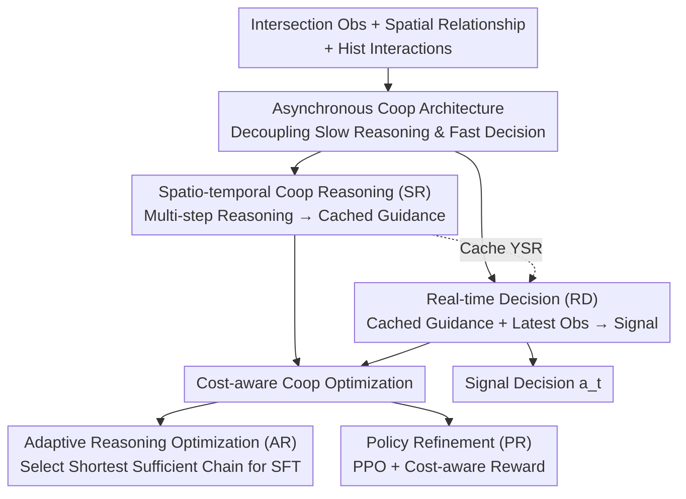

# CoLLMLight: Cooperative Large Language Model Agents for Network-Wide Traffic Signal Control

**Conference**: ICLR2026  
**OpenReview**: [https://openreview.net/forum?id=KeJqoEVOeY](https://openreview.net/forum?id=KeJqoEVOeY)  
**Code**: To be confirmed  
**Area**: Multi-Agent / LLM Agent / Traffic Signal Control / Reinforcement Learning  
**Keywords**: Cooperative LLM Agents, Traffic Signal Control (TSC), Spatio-temporal Reasoning, Asynchronous Decision-making, Cost-aware Optimization

## TL;DR
CoLLMLight assigns an LLM agent to each intersection in a road network, enabling cooperation through a dual-module "Asynchronous Spatio-temporal Reasoning + Real-time Decision-making" architecture (rather than controlling intersections in isolation). By employing "Cost-aware Optimization" (Adaptive Reasoning-chain SFT + PPO), reasoning depth automatically scales with traffic complexity. In zero-shot evaluations across four real-world networks, it surpasses all traditional, RL, and single-agent LLM baselines while keeping decision latency within the duration of a yellow light.

## Background & Motivation
**Background**: Traffic Signal Control (TSC) has evolved from traffic engineering methods (FixedTime, MaxPressure) to Reinforcement Learning (RL) methods (CoLight, Advanced-CoLight), and recently to LLM agents (LLMLight). The appeal of LLM-based methods lies in language-driven reasoning for signal decisions, high interpretability, and the ability to generalize across different road networks—a major pain point for RL methods (which implicitly encode cooperation into network weights, often failing in unseen environments).

**Limitations of Prior Work**: Existing LLM-based TSC agents suffer from a fundamental flaw: **they treat each intersection as an independent agent, operating in isolation without communication**. The paper uses a vivid example (Figure 1): an independent agent sees the longest queue on the East lane and clears it by greening the East-West traffic, which is locally optimal. However, it fails to realize this causes upstream spillback, dragging down overall network efficiency. In contrast, a cooperative agent utilizes neighbor information to anticipate that "a large flow from the North is heading to my North lane," leading it to preemptively clear North-South traffic to prevent congestion.

**Key Challenge**: Enabling cooperative LLM agents faces three major tensions. ① Cooperation is far more complex than single-intersection control—agents must reason about dynamic interactions and anticipate how local actions affect upstream and downstream flows, making cooperative signals difficult to extract. ② The multi-step reasoning of LLMs introduces significant computational overhead and latency, **directly conflicting with the hard real-time requirement of TSC ("decisions must be made in seconds")**. ③ There is a trade-off between cooperation quality and reasoning efficiency; traffic scenarios vary greatly (low-flow intersections vs. high-density hubs), and fixed reasoning strategies either waste computation in simple scenarios or provide insufficient analysis in complex ones.

**Goal**: To create the first network-wide cooperative LLM signal control framework that simultaneously solves the trilemma of "cooperation effectiveness ↔ real-time capability ↔ reasoning cost."

**Key Insight**: The authors' key observation is that **deep cooperative reasoning does not need to be coupled to the real-time decision-making critical path**. Since cooperative reasoning takes time, it can be run "asynchronously" in the background, with results cached as context for a lightweight real-time decision module. This preserves deep spatio-temporal reasoning without blocking second-level signal output.

**Core Idea**: Decouple slow reasoning from fast decision-making using an "Asynchronous Dual-module Architecture," and use "Cost-aware Optimization" to let reasoning depth adaptively scale with traffic complexity, enabling cooperative LLM agents to be both collaborative and real-time capable.

## Method

### Overall Architecture
CoLLMLight models the road network as a directed graph: a set of intersections $I$ and lanes $L$ (Straight $L_{go}$, Left $L_{left}$, Right $L_{right}$). Each intersection $i$ is controlled by an LLM agent sharing policy $\pi$. At each signal change $t$, agent $i$ receives three types of inputs: traffic observations $O^i_t$ of the intersection and its neighbors, spatial relationships $G^i$ with adjacent intersections, and historical traffic interactions $T^i_t$. It then selects a signal action $a^i_t = \pi([O^i_t, G^i, T^i_t], A^i)$ to optimize network-wide efficiency (Average Queue Length, Travel Time, Wait Time).

Broadly, CoLLMLight consists of two components: the **Asynchronous Cooperative Decision Architecture** (runtime mechanism) and **Cost-aware Cooperative Optimization** (training strategy to balance cooperation and efficiency). The former runs two modules asynchronously at each step $t$: the slow Spatio-temporal Cooperative Reasoning (SR) caches results as $Y^{SR}_t$, while the fast Real-time Decision (RD) takes current observations $O_t$ plus the latest cached cooperative guidance $Y^{SR}$ to output signals in seconds. The latter uses Adaptive Reasoning-chain optimization (AR) for SFT, followed by PPO Reinforcement Learning (PR) to refine strategies based on cost-aware rewards.

### Key Designs

**1. Asynchronous Cooperative Decision Architecture: Preventing Slow Reasoning from Blocking Fast Decisions**

This design directly addresses the conflict between "LLM multi-step reasoning" and "second-level real-time constraints." The agent is split into two asynchronous modules: **Spatio-temporal Cooperative Reasoning (SR)** handles meticulous multi-step reasoning, and **Real-time Decision (RD)** handles rapid signaling. Critically, the two are decoupled—SR runs asynchronously in the background and caches the generated cooperative control guidance $Y^{SR,i}$. RD does not wait for SR; it directly reads the latest cached $Y^{SR,i}$ and combines it with the newest observations $O^i_t$ for rapid decision-making: $a^i_t = f^{RD}_{LLM}(\text{Prompt}(O^i_t, Y^{SR,i}))$.

RD does not blindly follow the cached advice—it uses $Y^{SR,i}$ as context, but **the final judgment relies on the latest observations $O^i_t$**. When sudden traffic changes render historical reasoning invalid, RD adaptively prioritizes real-time data. This makes the framework robust to "stale SR" and "communication failures" (ATT increased only slightly in robustness tests) because SR reasons about historical states and is insensitive to intermittent latency, while RD is anchored to real-time observations.

**2. Spatio-temporal Cooperative Reasoning (SR): Decomposing Network Cooperation into Interpretable Steps**

To address the difficult extraction of cooperative signals, the SR module converts spatio-temporal context $(O^i_t, G^i, T^i_t)$ into human-readable prompts: $Y^{SR,i}_t = f^{SR}_{LLM}(\text{Prompt}(O^i_t, G^i, T^i_t))$. Observations are aggregated from lane-level features $o^l_t = (n^{queue}_l, n^{move}_l, \tau_l, \rho_l)$, representing queue length, moving cars, average wait time, and occupancy $\rho_l \in [0,1]$. Spatial relations $G^i$ are represented by a directed subgraph of $i$ and its neighbors, while temporal dynamics $T^i_t$ are history sequence in a fixed window $\Delta t$.

SR does not reason in a single pass but activates four interpretable steps as needed: **Key Lane Identification** (identifying flows contributing most to current or upcoming congestion), **Spatial Interaction Analysis** (checking lane-dependencies between the target and neighbors), **Temporal Pattern Analysis** (identifying short-term trends to predict near-future congestion), and **Reflection** (evaluating recent decisions to avoid repeating ineffective actions). These converge into "conditional signal suggestions based on predicted short-term traffic patterns," cached for RD. The ability to adaptively select reasoning steps is further refined in the optimization phase.

**3. Cost-aware Cooperative Optimization: Adaptive Scaling of Reasoning Depth**

This is the core for balancing "Cooperation Quality ↔ Reasoning Efficiency," consisting of two stages. **Stage 1—Adaptive Reasoning-chain Optimization (AR)**: Diverse traffic scenarios are sampled from the simulator. For each, GPT-4o generates multiple SR reasoning chains of varying lengths. The SR–RD pair is selected where "the shortest SR chain that supports RD to achieve optimal long-term network performance (minimum average queue length)" is found. This is added to the SFT set $D_{SFT}$, minimizing the negative log-likelihood: $L_{SFT}(\theta) = -\sum_{(X,Y^*)} \sum_w \log P_{\pi_\theta}(y^*_w | X, Y^*_{<w})$. This stage teaches the model to "do more with less reasoning."

**Stage 2—Policy Refinement (PR)**: PPO is used to jointly refine SR and RD. The RD reward is direct—comparing selected signal $a$ with the long-term optimal signal $a^*$ (found by enumerating phases in simulation to minimize long-term queue length), with $+1$ for matches and $-1$ otherwise. The SR reward $R_{SR}$ combines the downstream RD reward, reasoning length $L$, and a binary utility score $U \in \{0,1\}$ (assessed by the RD process on whether the SR provided useful guidance):

$$R_{SR} = R_{RD} \cdot \left[\beta\left(1 - \frac{L}{L_{max}}\right) + (1-\beta)U\right]$$

Where $L_{max}$ is the maximum reasoning length and $\beta \in [0,1]$ balances conciseness and quality. The ingenuity of this reward is that $R_{SR}$ is positive only when RD makes the correct decision ($R_{RD}=+1$), forcing SR to serve the decision effectively. Simultaneously, the length term encourages brevity, and the $U$ term encourages utility—leading the model to produce short chains in simple traffic and automatically increase reasoning length in complex traffic (confirmed by experiments where SR token length scales with vehicle count, unlike fixed-length L3-8B/R1-8B). Finally, the PPO clipped surrogate objective $J_{PPO}(\theta) = \hat{E}_k[\min(r_k(\theta)\hat{A}_k, \text{clip}(r_k(\theta), 1-\epsilon, 1+\epsilon)\hat{A}_k)]$ is used for optimization.

### A Complete Example
Imagine an agent at a high-density intersection in the New York grid at time $t$. The background SR module (asynchronous, non-blocking) receives lane features from its own intersection and four neighbors, the spatial subgraph, and the historical sequence. It performs Key Lane Identification—detecting high occupancy $\rho$ on the North inlet and that the North neighbor just released a large Southern flow. Spatial Interaction Analysis confirms these cars will reach the current intersection in 1-2 steps. Temporal Pattern Analysis predicts the North queue will grow rapidly. Reflection notes that previous East-West phases failed to mitigate pressure. SR synthesizes conditional advice: "If Northern inflow persists, prioritize North-South Straight (NTST)," then caches this as $Y^{SR}$. At the moment of signal change, the RD module reads the cached $Y^{SR}$ and latest observations $O_t$. Seeing real-time data confirms Northern pressure, RD instantly selects the NTST phase. The RD latency remains at 1-2 seconds (below the 3-5s yellow light), while the time-consuming SR reasoning was pre-calculated in the background.

### Loss & Training
All learning-based methods (including CoLLMLight) are trained only on the synthetic dataset Syn-Train and then zero-shot transferred to four real road networks. Training follows two steps: SFT using $D_{SFT}$ (Eq. 7, teaching compliance + adaptive depth) followed by PPO (Eq. 10) refinement using cost-aware rewards $R_{RD}$ (Eq. 8) and $R_{SR}$ (Eq. 9). The main model CoLLMLight-8B is fine-tuned from Llama3.1-8B.

## Key Experimental Results

### Main Results
Evaluated on the CityFlow simulator across four real road networks (New York 1/2, Jinan, Hangzhou) in a zero-shot manner. Metrics include Average Travel Time (ATT), Average Wait Time (AWT), and Average Queue Length (AQL). CoLLMLight-8B achieved SOTA across all datasets and metrics:

| Dataset | Metric | CoLLMLight-8B | LLMLight-8B (Prev. SOTA) | Gain |
|--------|------|------|----------|------|
| New York 1 | ATT | **1000.4** | 1187.4 | ↓15.7% |
| New York 1 | AWT | **90.5** | 143.1 | ↓36.8% |
| New York 1 | AQL | **1816.8** | 2297.9 | ↓20.9% |
| New York 2 | ATT | **1345.1** | 1599.4 | ↓15.9% |
| Jinan | ATT | **267.9** | 268.6 | ↓0.3% |
| Hangzhou | ATT | **308.5** | 312.0 | ↓1.1% |

Key Findings: ① **Greatest gains in complex networks**—the improvement is most significant in the dense New York grid (ATT ↓~16%, AWT ↓~37%), while gaps narrow in sparse Jinan/Hangzhou where local decisions suffice, proving that density necessitates cooperation. ② **Optimization beats scaling**—larger general LLMs (Qwen3-32B, Llama3.1-70B integrated into CoLLMLight) were consistently outperformed by the optimized CoLLMLight-8B, showing cost-aware optimization is more effective than scaling. ③ **RL baselines suffer in zero-shot**—Advanced-CoLight performed well in NY while AttendLight was better in Jinan/Hangzhou, exposing their lack of robustness when traffic patterns deviate from training; CoLLMLight's explicit semantic reasoning provides stable generalization.

### Ablation Study
**SR Module Ablation** (ATT, seconds):

| Configuration | New York 1 | New York 2 | Description |
|------|---------|---------|------|
| Async SR | 1000.4 | 1345.1 | Full model (Asynchronous) |
| Sync SR | 1005.7 | 1351.0 | Synchronous reasoning |
| w/o SR | 1155.1 | 1477.3 | Removing SR, relying only on observations |

Without SR, ATT in NY rises significantly (1000→1155), proving the value of cooperative reasoning. The negligible difference between Async and Sync proves the asynchronous design eliminates latency without sacrificing effectiveness.

**Optimization Phase Ablation** (New York 1, ATT / SR token count):

| Configuration | ATT↓ | Token↓ | Description |
|------|---------|--------|------|
| Ours | 1000.4 | 484.2 | Full (AR + PR) |
| w/o AR | 1066.3 | 738.5 | w/o Adaptive Reasoning Chain Optimization |
| w/o PR | 1034.2 | 543.9 | w/o Policy Refinement |
| w/o Both | 1196.5 | 809.2 | w/o both |

### Key Findings
- **AR is the main driver**: Without AR, SR reasoning token counts explode (~+52% in NY1, ~+55% in Jinan), and ATT increases, proving AR is crucial for "as-needed reasoning." PR further refines performance and efficiency.
- **Reasoning depth is indeed adaptive** (Figure 4): CoLLMLight's SR token length increases with vehicle count (complexity), producing short chains in light traffic. Conversely, L3-8B and R1-8B use fixed, significantly longer lengths regardless of complexity.
- **Real-time capability achieved**: RD latency for CoLLMLight at batch=1/5/10 is ~1.02/1.80/2.46s, all under the 3-5s yellow light. While SR is slower, it runs asynchronously and has the lowest latency among models of comparable scale.
- **Robustness**: Under "Stale SR (50% probability of 1-step lag)" and "Communication Failure (50% probability of missing a neighbor's state)," ATT for New York 1 only increased from 1000.4 to 1017.7 and 1028.1 respectively, showing minimal degradation.

## Highlights & Insights
- **Asynchronous decoupling is a masterstroke for the "LLM reasoning vs. real-time control" conflict**: Separating "slow cooperative thinking" from "fast signal execution" via a cache bridge is a paradigm applicable to any agent scenario with hard real-time constraints (high-frequency trading, robot obstacle avoidance, real-time scheduling).
- **Cost-aware Reward $R_{SR}$ is elegantly designed**: Using $R_{RD} \cdot [\beta(1-L/L_{max}) + (1-\beta)U]$ to couple decision utility with reasoning brevity forces the model to learn when to think deeply and when to stay concise—a cleaner paradigm than R1-style consistent over-reasoning.
- **Decomposing LLM reasoning into four explainable steps** (Key Lane / Spatial / Temporal / Reflection) provides a structured handle for cooperation while maintaining the interpretability that RL's implicit cooperation lacks.
- **"Explicit Semantic Reasoning" enables impressive zero-shot generalization**: Training on synthetic data and migrating to four real cities addresses the perennial generalization pain point of RL-TSC.

## Limitations & Future Work
- **Reliance on GPT-4o for training data**: The quality of short reasoning chains in the AR stage depends on GPT-4o's performance in simulator sampling; the distillation quality is capped by the teacher model.
- **Reliance on simulator "Oracle" signal $a^*$**: The RD reward requires enumerating all phases in simulation to find the long-term optimal signal. This oracle is unavailable in real-world deployment, and sim-to-real gap remains underexplored.
- **Cooperation limited to 1-hop neighbors**: Observations and spatial relationships are built on immediate neighbor subgraphs. Its scalability to multi-hop coordination (e.g., green waves, area-level tidal flows) for large-scale networks is unverified.
- **Restricted evaluation scope**: Evaluation is limited to the CityFlow simulator with 1-hour intervals. Stability under long-term durations or extreme events (accidents, construction, weather) needs validation.
- **Future Directions**: Replacing the simulator-based $a^*$ with a learned value estimator; introducing hierarchical/regional cooperation for multi-hop dependencies; exploring smaller local models + shared SR caches for further cost reduction.

## Related Work & Insights
- **vs. LLMLight (Prev. SOTA Single-agent LLM-TSC)**: LLMLight treats intersections as independent agents and crams all reasoning into RD. It works in sparse networks (Jinan/Hangzhou) but suffers in-grid (New York) due to lack of cooperation. CoLLMLight introduces asynchronous spatio-temporal reasoning, leading consistently in complex networks with lower decision latency.
- **vs. RL Cooperative Methods (CoLight / CosLight / Advanced-CoLight)**: These methods encode cooperation implicitly into GATs or matrices. Cooperation is "invisible," and policies are overfitted to training traffic patterns. CoLLMLight uses explicit semantic reasoning, making it interpretable and robust in zero-shot transfer.
- **vs. General Large Models (Qwen3-32B / Llama3.1-70B)**: Direct application of larger LLMs in the CoLLMLight framework yields decent results but consistently loses to the cost-aware 8B model—proving "adaptive reasoning" is more important than "parameter count."

## Rating
- Novelty: ⭐⭐⭐⭐⭐ First network-wide cooperative LLM signal control framework; asynchronous decoupling and cost-aware rewards are high-impact designs.
- Experimental Thoroughness: ⭐⭐⭐⭐⭐ Zero-shot on 4 real networks, 12+ baselines, plus latency/robustness/reasoning behavior analysis and solid ablations.
- Writing Quality: ⭐⭐⭐⭐ Visual motivation in Figure 1 is clear, math is complete; however, some hyperparameter/prompt details are relegated to the appendix.
- Value: ⭐⭐⭐⭐⭐ Simultaneously tackles the trilemma of cooperation, real-time demand, and cost in LLM-TSC; provides a valuable blueprint for "LLM agents under real-time constraints."

<!-- RELATED:START -->

## Related Papers

- [\[ICLR 2026\] DreamPhase: Offline Imagination and Uncertainty-Guided Planning for Large-Language-Model Agents](dreamphase_offline_imagination_and_uncertainty-guided_planning_for_large-languag.md)
- [\[ICLR 2026\] GTool: Graph Enhanced Tool Planning with Large Language Model](gtool_graph_enhanced_tool_planning_with_large_language_model.md)
- [\[AAAI 2026\] AutoTool: Efficient Tool Selection for Large Language Model Agents](../../AAAI2026/llm_agent/autotool_efficient_tool_selection_for_large_language_model_agents.md)
- [\[ACL 2026\] Context-Value-Action Architecture for Value-Driven Large Language Model Agents](../../ACL2026/llm_agent/context-value-action_architecture_for_value-driven_large_language_model_agents.md)
- [\[ICLR 2026\] NetArena: Dynamic Benchmarks for AI Agents in Network Automation](netarena_dynamic_benchmarks_for_ai_agents_in_network_automation.md)

<!-- RELATED:END -->
