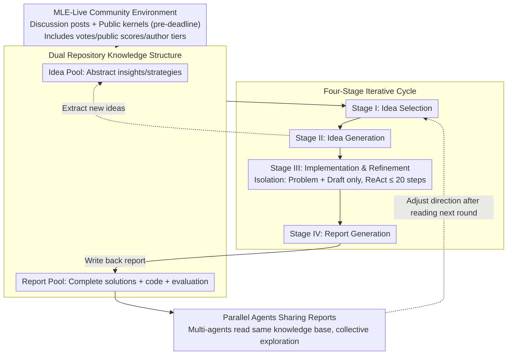

# CoMind: Towards Community-Driven Agents for Machine Learning Engineering

**Conference**: ICLR 2026  
**arXiv**: [2506.20640](https://arxiv.org/abs/2506.20640)  
**Code**: [https://github.com/comind-ml/CoMind](https://github.com/comind-ml/CoMind)  
**Area**: LLM Agent  
**Keywords**: LLM Agent, Machine Learning Engineering, Kaggle Competitions, Community Knowledge, Multi-agent Collaboration

## TL;DR
The authors propose MLE-Live—the first real-time evaluation framework simulating the Kaggle research community—and CoMind—a multi-agent ML engineering system capable of systematically leveraging collective community knowledge. CoMind achieved a 36% medal rate across 75 historical Kaggle competitions and surpassed an average of 79.2% of human participants (reaching 92.6% in updated versions) in 4 active competitions.

## Background & Motivation
LLM-based ML Agents have demonstrated significant potential in automating ML engineering. MLAB adopts a ReAct-style structured decision-making approach, AIDE utilizes tree search for exploration, and AutoKaggle introduces multi-agent specialization. These systems have made progress in Kaggle-style competitions.

**Key Challenge**: Existing agents operate in **isolated environments**—relying solely on internal memory and trial-and-error exploration while completely ignoring a crucial component of real-world ML workflows: **community knowledge sharing**. In real data science competitions and research, participants frequently learn from public discussions, shared notebooks, and community insights. Current agents, failing to utilize this dynamic external context, often converge to repetitive strategies and encounter performance bottlenecks.

**Two Core Questions**:
1. How to evaluate an agent's ability to utilize collective knowledge? (→ MLE-Live benchmark)
2. How to design an agent that can effectively leverage community knowledge? (→ CoMind system)

## Method

### Overall Architecture
This work addresses both evaluation and system design. On the evaluation side, MLE-Live builds upon MLE-Bench by attaching a simulated Kaggle community to each competition, allowing agents to read discussion posts and public kernels before the deadline. This quantifies the ability to use collective knowledge. On the system side, CoMind is a multi-agent system that utilizes two shared repositories, the Idea Pool and the Report Pool, to decompose the researcher's workflow ("browse community → synthesize ideas → code implementation → write back reports") into a four-stage iterative cycle. Multiple agents run the same task in parallel and read from the same knowledge base, making collective intelligence, rather than simple trial-and-error, the source of performance.

### Key Designs

**1. MLE-Live Community Environment: Turning "Collective Knowledge" into Evaluable External Context**

Existing agents in isolated sandboxes rely only on internal memory and trial-and-error, making it impossible to test if they can use community knowledge. MLE-Live collected 2,687 discussion posts and 4,270 public kernels for 22 low-complexity competitions, attaching quality signals—vote counts (community preference), public scores (performance), and author tiers (Novice to Grandmaster)—to help agents decide whom to trust. To avoid post-hoc leakage, all content is strictly limited to what was published before the competition deadline, with non-text content (images, screenshots) and redundant Jupyter output (progress bars, logs) filtered out. The evaluation follows four metrics: Valid Submission, Above Median, Win Rate, and Medals, allowing the utility of collective knowledge to be directly reflected in rankings.

**2. Dual Repository Knowledge Structure: Storing Abstract Insights and Complete Solutions Separately**

Mixing strategies and code in a single memory leads to cluttered retrieval and reuse. CoMind explicitly maintains two repositories: the Idea Pool stores abstract insights (conceptual/strategic level) refined from community content and historical iterations, and the Report Pool stores complete solution reports including code, evaluation, and analysis. The former handles the divergence of the "idea layer," while the latter handles the consolidation and relevance evaluation of the "implementation layer." Both grow across iterations, forming an increasingly rich knowledge base that serves as the medium for sharing between parallel agents.

**3. Four-Stage Iterative Cycle: Replicating the Researcher’s Rhythm of "Observe, Think, Act, Record"**

Each iteration proceeds through four stages. Stage I (Idea Selection): Accesses entries refined from public kernels, forum discussions, and historical solutions in the Idea Pool, using the performance and relevance in the Report Pool as ranking criteria to simulate a human browsing collective wisdom before forming hypotheses. Stage II (Idea Generation): Produces a high-level solution draft based on selected ideas and Report Pool context, synthesizing new strategies by recombining or extending existing ones while deliberately avoiding simple copying to ensure conceptual diversity. Stage III (Implementation & Refinement): Launches a ReAct-style cycle based on the draft to iteratively write code, execute, observe metrics/logs, and update implementation, with a maximum of 20 steps.

A critical trade-off here is that Stage III is designed with **Context Isolation**: if the implementation stage could view the entire Idea Pool and Report Pool, the context window would expand rapidly, and attention would be diluted by irrelevant information. Thus, CoMind only grants access to the problem description and the current draft, shielding the two knowledge pools. This ensures the independence and modularity of each solution draft while focusing expansion into depth; the system maintains multiple drafts in parallel but focuses on deepening one at a time. Finally, Stage IV (Report Generation): Compiles the methodological description, component analysis, quantitative results, and limitation assessment into a report written back to the Report Pool, making it visible to subsequent iterations—this step transforms an individual agent's findings into a shared asset readable by all.

**4. Parallel Agent Shared Reports: Driving Improvement via Collective Exploration rather than Trial-and-Error**

Multiple agents run in parallel on the same task and share the same community knowledge base. When an agent writes a new report in Stage IV, other agents can read it in subsequent iterations and adjust their direction accordingly. Agents do not rely on complex messaging protocols but inspire each other through the shared Report Pool layer. This leads to collective exploration and continuous improvement, which is why CoMind continues to climb in performance over long runs after other methods plateau.

### A Complete Example
Consider an image classification competition iteration: Stage I reads about "EfficientNet + Test Time Augmentation" from a highly-voted community kernel in the Idea Pool and finds high-scoring related solutions in the Report Pool, thus selecting this direction. Stage II combines this with "Label Smoothing" from a historical report to write a high-level draft, avoiding a direct copy of a public solution. Stage III enters an isolated environment with only the draft and the problem description, using a ReAct cycle to write code and run validation. Upon seeing an OOM error log, it reduces the batch size, resubmits, and obtains a validation score within 20 steps. Stage IV documents the method, ablations, and shortcomings into a report written back to the Report Pool. Meanwhile, another parallel agent reads this report and decides to try model ensembling in the next round, pushing the overall exploration into a new area.

## Key Experimental Results

### Main Results (20 Historical Kaggle Competitions, using o4-mini)

| Method | Valid Sub. | Win Rate | Any Medal | Above Median | Medal Details |
|------|-----------|----------|-----------|-------------|----------|
| **Ours (CoMind)** | **1.00** | **66.8%** | **45%** | **65%** | 5 Gold, 4 Silver |
| Prev. SOTA (AIDE) | 0.90 | 46.9% | 20% | 50% | - |
| AIDE+Code | 0.90 | 51.0% | 25% | 50% | - |
| AIDE+RAG | 0.95 | 51.2% | 25% | 55% | - |

CoMind obtained 9 medals (5 gold), a 125% Gain over the Prev. SOTA (AIDE).

### Results in Online Competitions (4 Ongoing Kaggle Competitions)

| Competition | CoMind WR | AIDE WR | CoMind Rank |
|------|-----------|---------|-----------|
| playground-series-s5e5 | **94.9%** | 66.2% | #120 / 2338 |
| forams-classification-2025 | **91.7%** | 69.4% | #4 / 48 |
| el-hackathon-2025 | **61.6%** | 8.5% | #128 / 333 |
| fathomnet-2025 (CVPR FGVC12) | **69.4%** | 28.6% | #15 / 47 |

### Win Rate by Task Category

| Category | Ours (CoMind) | Prev. SOTA (AIDE) | AIDE+Code | AIDE+RAG |
|------|--------|------|-----------|----------|
| Image Classification (8) | **59.7%** | 45.9% | 43.4% | 52.5% |
| Text Classification (3) | **74.0%** | 15.7% | 33.8% | 61.0% |
| Audio Classification (1) | **90.1%** | 27.2% | 25.9% | 27.1% |
| Tabular (4) | 66.4% | 67.3% | **68.8%** | 48.3% |
| Image Regression (1) | 99.2% | 34.2% | **99.2%** | 99.2% |

### Ablation Study

| Configuration | Valid Sub. | Win Rate | Any Medal |
|------|-----------|----------|-----------|
| **Ours (CoMind) w/ Public Resources** | **1.00** | **66.8%** | **45%** |
| Ours (CoMind) w/o Public Resources | 0.90 | 54.5% | 35% |

### Key Findings
- **Community Knowledge is Essential**: Without public resources, Win Rate drops by 12.3% and Valid Submission by 10%, indicating that community knowledge not only improves quality but also safeguards baseline reliability.
- **Continuous Improvement**: While AIDE plateaus after a rapid climb in the first 2 hours, CoMind continues to improve and eventually overtakes it.
- **Higher Code Complexity**: CoMind generates code that is on average 55.4% longer than AIDE's, suggesting deeper reasoning and more sophisticated optimization techniques.
- **Novelty Assessment**: After excluding external ideas, CoMind's average novelty rank was 1.20 (vs. AIDE's 3.05), proving it does not simply copy community solutions.
- CoMind performs weaker on Seq2Seq tasks because it tends to explore LLM fine-tuning strategies, which often fail to complete within the 1-hour runtime constraint.

## Highlights & Insights
- **Innovative Concept of "Community Awareness"**: Introduces community collaboration dynamics from data science competitions into LLM Agent evaluation for the first time, filling the gap between "isolated agents" and "real-world research practices."
- **Four-Stage Iterative Cycle Design**: The flow of Selection → Generation → Implementation → Report closely mirrors the work patterns of real researchers.
- **Deliberate Context Restriction in Stage III**: A design insight that prevents performance degradation caused by information overload while ensuring the independence of solution drafts.
- **Real-world Validation in Active Competitions**: Submitting real scores in ongoing Kaggle competitions significantly strengthens the credibility of the results.
- **Value of the MLE-Live Benchmark**: Provides a standardized evaluation platform for research on community-driven agents.

## Limitations & Future Work
- Currently only supports report-level interaction, lacking more granular community participation like commenting, questioning, or direct data/model sharing.
- Constrained by runtime limits on tasks requiring LLM fine-tuning (e.g., Seq2Seq).
- Validated only on Kaggle-style ML competitions and not yet extended to broader scientific discovery, open programming, or robotics.
- Agent "innovation" may still be limited by the knowledge scope of the LLM backbone.
- Parallel agent coordination is relatively simple (via Report Pool); more sophisticated message-passing protocols have not been explored.
- Restricted code execution environment (single A6000 GPU, 5-hour total limit) may underestimate the potential of compute-intensive solutions.

## Related Work & Insights
- **AIDE** (Jiang et al., 2025): A tree-search-based ML Agent and previously the strongest method on MLE-Bench.
- **MLAB** (Huang et al., 2024): A ReAct-style ML agent benchmark.
- **MLE-Bench** (Chan et al., 2025): An evaluation benchmark for ML agents based on 75 Kaggle competitions.
- **AutoKaggle** (Li et al., 2024): An MLE solution using a multi-agent system.
- **MetaGPT** (Hong et al., 2023): A general framework for multi-agent collaboration.
- Insight: Agents should not rely solely on internal reasoning and trial-and-error—leveraging external "collective wisdom" is a key dimension for enhancing agent capability. This approach could generalize to other fields requiring community collaboration, such as scientific discovery and software engineering.

## Rating
- Novelty: ⭐⭐⭐⭐⭐ (Community-driven Agent + MLE-Live Benchmark = Entirely new research direction)
- Experimental Thoroughness: ⭐⭐⭐⭐⭐ (20 historical + 4 active competitions + novelty analysis + ablations + code complexity)
- Writing Quality: ⭐⭐⭐⭐ (Clear structure, though some data presentation could be more compact)
- Value: ⭐⭐⭐⭐⭐ (Pioneers community-aware agent research; significant for Data Science automation)

<!-- RELATED:START -->

## Related Papers

- [\[ICLR 2026\] Language Agents for Hypothesis-driven Clinical Decision Making with Reinforcement Learning](language_agents_for_hypothesis-driven_clinical_decision_making_with_reinforcemen.md)
- [\[ICLR 2026\] Huxley-Gödel Machine: Human-Level Coding Agent Development by an Approximation of the Optimal Self-Improving Machine](huxley-godel_machine_human-level_coding_agent_development_by_an_approximation_of.md)
- [\[ICLR 2026\] Darwin Gödel Machine: Open-Ended Evolution of Self-Improving Agents](darwin_gödel_machine_open-ended_evolution_of_self-improving_agents.md)
- [\[ICLR 2026\] Programming with Pixels: Can Computer-Use Agents do Software Engineering?](programming_with_pixels_can_computer-use_agents_do_software_engineering.md)
- [\[ICLR 2026\] Agentic Context Engineering: Evolving Contexts for Self-Improving Language Models](agentic_context_engineering_evolving_contexts_for_self-improving_language_models.md)

<!-- RELATED:END -->
