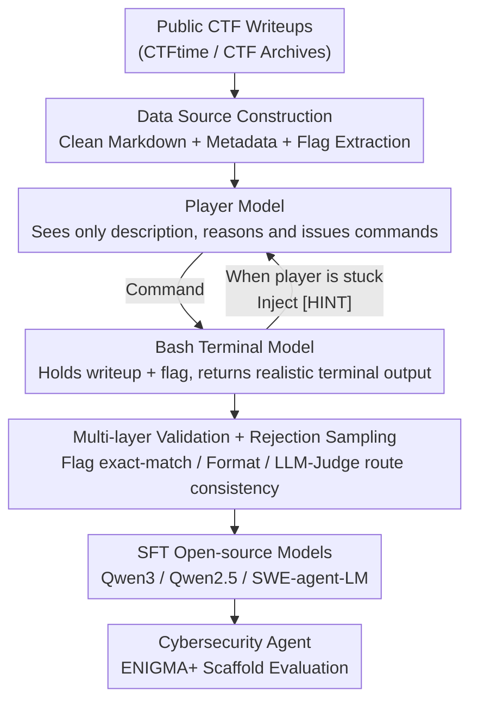

# Cyber-Zero: Training Cybersecurity Agents without Runtime

**Conference**: ICLR2026  
**OpenReview**: [https://openreview.net/forum?id=1gRTeAik4G](https://openreview.net/forum?id=1gRTeAik4G)  
**Code**: https://github.com/amazon-science/Cyber-Zero (Available)  
**Area**: LLM Agent / Cybersecurity / Data Synthesis  
**Keywords**: Cybersecurity Agent, CTF, Trajectory Synthesis, Runtime-free, Persona Simulation  

## TL;DR
Addressing the limitation of lacking executable runtime environments and the difficulty of collecting real agent trajectories in cybersecurity (CTF) tasks, this paper proposes Cyber-Zero—the first **runtime-free** trajectory synthesis framework. It leverages public CTF writeups and persona-driven dual-LLM simulation (one playing a contestant, the other a Bash terminal) to reverse-engineer and "replay" multi-turn interaction trajectories. Using these synthetic trajectories for SFT, open-source models achieve an absolute improvement of up to +13.1% across three CTF benchmarks, with the 32B model approaching Claude-3.5-Sonnet at a significantly lower cost.

## Background & Motivation

**Background**: Applying LLM agents to software engineering tasks (e.g., fixing GitHub issues) is mature, with the key secret being the **executable runtime environment**. Agents can execute commands, observe real feedback, and iterate through trial and error, thereby collecting large volumes of real multi-turn trajectories for training. Capture The Flag (CTF) competitions have become the de facto standard for measuring the cybersecurity reasoning capabilities of models. Frameworks like ENIGMA, when paired with frontier closed-source models such as o3 or Claude-3.5-Sonnet, can already solve many challenges.

**Limitations of Prior Work**: These strong performances are **exclusive to closed-source models**. Open-source models lag significantly, creating a huge capability gap. Two reasons exist: first, most open-source models lack agentic abilities like autonomous reasoning, long-term planning, and strategic tool use; second, and more critically—**training data is extremely scarce**. CTF tasks differ from software engineering: competition environments are often temporary and shut down after the event, causing challenge configurations and execution contexts to vanish. Even if the community open-sources the challenges, executable environments are often missing, making it **impossible to collect real agent trajectories with trial and error**.

**Key Challenge**: Training strong agents requires real multi-turn trajectories, while the collection of real trajectories depends on executable runtimes—but the cybersecurity field specifically lacks reproducible runtimes. "Data requires environments, but environments are unavailable" has become a deadlock.

**Goal**: Synthesize high-quality, long-term CTF agent trajectories with authentic trial-and-error traces under the premise of **complete absence of executable environments**, to train open-source models and bridge the gap between open and closed-source.

**Key Insight**: The authors noticed that **writeups** written by contestants after competitions actually contain complete "runtime behaviors"—reconnaissance steps, attempted commands, debugging strategies, and final exploits are all recorded. Since real environments are unavailable, LLMs can be used to **reverse-engineer and "replay"** these runtimes: one LLM plays the Bash terminal executing commands, and another plays the contestant, creating a structured multi-turn trajectory from the writeup.

**Core Idea**: Replace the real runtime with **persona-driven dual-LLM simulation**, reverse-engineering natural language writeups into trainable agent interaction sequences—achieving runtime-free trajectory synthesis.

## Method

### Overall Architecture

Cyber-Zero transforms "a CTF writeup" into "several trainable multi-turn agent trajectories." The pipeline consists of three main stages: **Source Data Collection → Persona-driven Trajectory Generation → Training Data Construction**, followed by SFT training and evaluation on the self-developed ENIGMA+ scaffold.

The input consists of a large volume of public writeups (originally noisy HTML) scraped from CTFtime / CTF Archives. These are cleaned into clean Markdown, missing metadata (descriptions, files, flags) is completed, and 6,188 high-quality writeups are filtered. Then comes the core step: using two LLM personas shaped by prompts—the **Player Model** (playing a security engineer who only sees the problem and does not know the answer, responsible for reasoning and issuing commands) and the **Bash Terminal Model** (playing the terminal, possessing the original writeup and the correct flag, responsible for returning realistic system output). These two "act out" turns of interaction without any real environment; when the player gets stuck, the terminal model acts as a weak oracle to inject minimal hints and pull it back on track. The generated trajectories undergo **multi-layer validation + rejection sampling** (must match flag via exact-match, follow formatting, and be judged by an LLM-as-Judge to be consistent with the original writeup's route). Qualified trajectories are stripped of hint markers and finally used to SFT open-source models like Qwen3.

### Key Designs

**1. Reverse Reconstructing Runtime from Writeups: Runtime-free Data Sourcing**

This step directly addresses the deadlock where "lack of executable environments prevents trajectory collection." Since the environment is gone, the writeup left by the contestant is used as a proxy for runtime behavior. However, raw writeups are noisy. The authors performed systematic cleaning: using markdownify to convert noisy HTML/XML into clean Markdown; deleting low-information writeups containing only external links or being too short (<1000 characters); and then using DeepSeek-V3-0324 to fill in missing metadata such as task descriptions and available files, as well as extracting the flag from the text, **keeping only samples with verifiable flags** to ensure logical consistency. Finally, 47 challenges overlapping with evaluation sets were manually removed to prevent contamination, resulting in 6,188 high-quality writeups covering 2017–2025, 543 events, 4,610 challenges, and 6 categories. Crucially, the writeup itself records the **complete process** of reconnaissance, trial and error, debugging, and final exploitation, which is exactly the "script" needed for synthesizing long trajectories.

**2. Persona-driven Dual LLM Simulation: Player × Bash Terminal**

This is the core innovation of the framework, solving two problems: "lack of runtime" and "single-pass trajectories being too linear and prone to hallucination." The authors built a complete "problem-solving ecosystem" with two specialized persona LLMs:

- **Player Model**: Set as an experienced, cross-category security engineer, required to **reason step-by-step in natural language before issuing actions**. It issues only one command per turn, using a format compatible with agent scaffolds. Crucially, it **only sees the task description** (description, files, environment assumptions) and **cannot see the original writeup or correct flag**. This forces it to solve the problem from first principles like a real competition, avoiding contamination by ground-truth trajectories.
- **Bash Terminal Model**: Simulates a terminal environment, returning **format-realistic** system responses to the player's commands (error messages, output fidelity, and state transitions must appear real). In contrast to the player, it **holds the original writeup and reference flag**, allowing it to serve as a **weak oracle** to guide the trajectory in the correct direction.

The two interact iteratively, "replaying" the problem-solving process described in the writeup into structured multi-turn trajectories, naturally incorporating real workflow characteristics such as trial and error, debugging, and strategic shifts. For generation, both player and terminal use DeepSeek-V3-0324 with temperature $0.6$ and top-p $0.95$. A single trajectory is limited to 40 agent-environment pairs, and 3 trajectories are generated per writeup to increase diversity.

**3. Selective Hint Intervention: Terminal as a Weak Oracle**

The authors found that if the player is left entirely to its own devices, it **hardly ever captures the flag**, resulting in very few successful trajectories. Therefore, the terminal model implements a **selective intervention mechanism**: when the player makes repeated mistakes or hits a dead end, the terminal injects a minimal hint wrapped in special tags `[HINT]...[/HINT]`—for example, prompting to "check a certain file again" or "rethink the previous step." These are **minimal hints that do not reveal the full solution**, pulling the player back on track. This step is the lifeblood of data volume: without it, successful trajectories would decrease significantly. However, since hints are a "scaffold during collection" rather than "content to be learned," **all `[HINT]` tags and content are removed** from the final training data, ensuring the model learns autonomous exploration rather than relying on external shortcuts. The terminal simultaneously maintains strong reality constraints to avoid over-assisting.

**4. Multi-layer Validation + Rejection Sampling: Ensuring Synthetic Trajectory Credibility**

The biggest risk of runtime-free synthesis is hallucination and unrealistic command output. Borrowing from SWE-Gym, the authors designed a **multi-layer validation** for rejection sampling: ① Each trajectory must successfully recover the correct flag via **exact-match**; ② Format validation—Markdown consistency, alignment with agent scaffold structure, and a single command per player turn; ③ Terminal output must follow format specifications (accurate metadata headers, realistic system behavior); ④ **LLM-as-a-Judge** (DeepSeek-V3-0324 with greedy decoding) performs binary discrimination to evaluate whether the synthetic trajectory followed a **similar overall problem-solving route** as the original writeup. Only trajectories passing all four stages enter the training set, approximating the quality floor of "credible trajectories" without real-world environment verification.

### Loss & Training

Training follows standard **Supervised Fine-Tuning (SFT) + Rejection Sampling**, using synthetic trajectories that passed validation as demonstration data. The authors used the NVIDIA NeMo framework to fine-tune three model families: Qwen3, Qwen2.5-Instruct, and SWE-agent-LM. Due to compute limits, only samples with token counts ≤ 32,768 were kept, totaling 9,464 trajectories. Hyperparameters were set to a global batch size of $16$, learning rate of $5\times10^{-6}$, and $2$ epochs.

On the evaluation side, the authors made an engineering contribution with **ENIGMA+** (an enhancement of the ENIGMA scaffold): ① All evaluation tasks are **executed in parallel** (each Docker container has an independent network interface and isolated environment), reducing the 300+ challenge evaluation time from ENIGMA's 1–3 days to under 5 hours; ② A **unified maximum interaction limit (40 turns)** replaces ENIGMA's cost-based ($3/题) budget, allowing fair comparison between models with different pricing; ③ A Simple Summarizer replaces the LLM Summarizer because binary decompilation output can be excessively long, exceeding context limits. Additionally, the authors manually fixed approximately 6% of existing CTF benchmark challenges containing errors.

## Key Experimental Results

### Main Results

Evaluated using Pass@1 (greedy decoding) on three benchmarks: InterCode-CTF (High School/Intro), NYU CTF Bench (College), and Cybench (Professional), totaling 300+ challenges. CYBER-ZERO fine-tuning brought consistent gains across all model families:

| Model | InterCode-CTF (ZS→FT) | NYU CTF (ZS→FT) | Cybench (ZS→FT) | Average Gain |
|------|------|------|------|------|
| Qwen3-8B | 46.5 → 64.8 | 0.8 → 6.3 | 5.0 → 10.0 | +9.0 |
| Qwen3-14B | 55.0 → 73.6 | 2.6 → 9.9 | 12.5 → 20.0 | +10.5 |
| **Qwen3-32B** (Cyber-Zero-32B) | 60.0 → 82.4 | 4.7 → 13.5 | 5.0 → 17.5 | **+13.1** |
| Qwen2.5-Instruct-14B | 44.0 → 68.1 | 3.1 → 7.3 | 5.0 → 17.5 | +10.8 |
| SWE-agent-LM-7B | 0 → 46.2 | 0 → 4.7 | 0 → 7.5 | +16.7 |

The best model, **Cyber-Zero-32B**, reached an average Pass@1 of 33.4%, comparable to Claude-3.5-Sonnet (37.2%) and DeepSeek-V3-0324, but at a significantly lower cost. While Claude-3.7/3.5-Sonnet costs an average of \$44.4 / \$22.2 to complete a successful task, Cyber-Zero-32B cost is a mere fraction, showing a clear cost-performance advantage.

### Ablation Study

| Dimension | Key Findings | Description |
|------|---------|------|
| Hint Intervention | Successful trajectories drop significantly without it | Players rarely capture flags without guidance; it is the lifeblood of data volume |
| SWE Agent Transfer | SWE-agent-LM-7B is 0% zero-shot | Code/SWE training **does not transfer** to security tasks; domain-specific training is required |
| Inference Compute (Pass@k) | Consistent improvement as k increases | Fine-tuned models have more diverse candidates, though effective paths are in the first few |
| Task Diversity | Monotonic improvement from 10% to 100% | Cyber-Zero-14B improved from 58.2% to 73.6% on InterCode-CTF |

### Key Findings
- **Hinting is the lifeblood of data collection**: Letting players solve tasks entirely on their own results in almost no successful trajectories due to failure to capture flags. The weak oracle's minimal hints achieve a critical balance between "guidance" and "not leaking the answer," and are removed before training to prevent shortcutting.
- **Capabilities do not transfer for free**: SWE-agent-LM, specifically trained for software engineering, scored nearly 0 zero-shot in CTF, and the 32B version performed worse than its base Qwen2.5-32B-Instruct. Debugging/completion skills do not transfer to security tasks requiring vulnerability probing and interaction with security toolchains.
- **Professional-grade tasks are harder to cover via synthesis**: Gains from task diversity are obvious on educational levels (InterCode-CTF) but weaker on professional levels (Cybench). Complex real-world tasks require more refined reasoning that is harder to capture solely through unverified synthetic trajectories.

## Highlights & Insights
- **"Reverse-replaying runtimes via writeups" is a clever transformation**: It turns the hard problem of "collecting real trajectories" into "using existing writeups + dual-LLM simulation," bypassing the hard constraint of runtime scarcity in cybersecurity. This is transferable to any domain with human solution records but non-reproducible environments.
- **Information-asymmetric dual-persona design is key**: The player "seeing only the problem" forces first-principles solving and prevents ground-truth contamination; the terminal "holding the answer" allows it to act as a weak oracle. This deliberate asymmetry keeps synthetic trajectories both realistic and controllable.
- **Hints as a "collection scaffold" rather than "learned content"**: Using `[HINT]` tags for guidance during generation and stripping them before training maintains the yield of successful trajectories without teaching the model to rely on external hints.
- **Engineering improvements in ENIGMA+ are practical**: Compressing 300+ challenge evaluations to under 5 hours and using unified turn budgets instead of cost budgets for fair comparison are essential contributions for making large-scale agent evaluation feasible.

## Limitations & Future Work
- **Lack of real-world environment validation**: Despite multi-layer validation, terminal output is still "acted out" by an LLM and may deviate from real system behavior; the paper admits gains are weaker on professional Cybench, indicating synthetic fidelity remains a bottleneck for complex tasks.
- **Strong dependency on writeup availability and quality**: The method is inherently a reverse-engineering of human reports and is powerless against new challenge types or 0-day scenarios without public writeups.
- **Validation still relies on LLM-as-Judge**: The judgment of route consistency relies on DeepSeek-V3-0324; bias or hallucinations in the judge could lead to false positives or negatives in the training set.
- **Obvious dual-use risk**: The authors admit in the Ethics section that runtime-free methods significantly lower the barrier for training strong cybersecurity agents. This requires collaboration between researchers, model developers, and security agencies for responsible release.
- **Future Directions**: Exploring a hybrid strategy of "small-scale real environment validation + large-scale synthesis" to calibrate bias; or introducing stronger trajectory consistency metrics to replace single LLM judges.

## Related Work & Insights
- **vs ENIGMA (Abramovich et al., 2025)**: ENIGMA is an agent scaffold that improves success through specialized tools and interfaces but **depends on frontier closed-source models**. Ours does not change the scaffold but changes the **training paradigm**—directly improving the base capability of open-source models through synthetic trajectories.
- **vs SWE-Gym / SWE-Fixer / SWE-RL**: These all depend on **executable environments** (codebase, issue context) for trajectory collection. Ours proves this cannot be copied to cybersecurity due to environment scarcity, and SWE training **does not transfer** to security.
- **vs CTF Benchmarks (InterCode-CTF, NYU CTF Bench, Cybench)**: These are **evaluation** sets and rarely provide training data. Cyber-Zero is the first **completely runtime-free** framework capable of producing 6,188 trainable samples, filling the gap of "evaluation without training data."

## Rating
- Novelty: ⭐⭐⭐⭐⭐ First runtime-free cybersecurity trajectory synthesis framework; the "writeup reverse-engineering + dual LLM persona" approach is novel and transferable.
- Experimental Thoroughness: ⭐⭐⭐⭐ Covers 3 benchmarks, 3 model families, and scaling across inference compute and task diversity; however, lacks a direct comparison with trajectories from real environments.
- Writing Quality: ⭐⭐⭐⭐ Clear motivation, well-explained pipeline; Figure 2's trajectory example is very helpful.
- Value: ⭐⭐⭐⭐⭐ Approaches closed-source frontier performance with low-cost open-source models; high practical value as the paradigm can be extended to other "non-reproducible environment" domains (dual-use risk must be addressed).

<!-- RELATED:START -->

## Related Papers

- [\[ICML 2026\] ExCyTIn-Bench: Evaluating LLM Agents on Cyber Threat Investigation](../../ICML2026/llm_agent/excytin-bench_evaluating_llm_agents_on_cyber_threat_investigation.md)
- [\[NeurIPS 2025\] DefenderBench: A Toolkit for Evaluating Language Agents in Cybersecurity Environments](../../NeurIPS2025/llm_agent/defenderbench_a_toolkit_for_evaluating_language_agents_in_cybersecurity_environm.md)
- [\[ECCV 2024\] Agent3D-Zero: An Agent for Zero-shot 3D Understanding](../../ECCV2024/llm_agent/agent3d-zero_an_agent_for_zero-shot_3d_understanding.md)
- [\[ICLR 2026\] Go-Browse: Training Web Agents with Structured Exploration](go-browse_training_web_agents_with_structured_exploration.md)
- [\[ICLR 2026\] Efficient Agent Training for Computer Use](efficient_agent_training_for_computer_use.md)

<!-- RELATED:END -->
