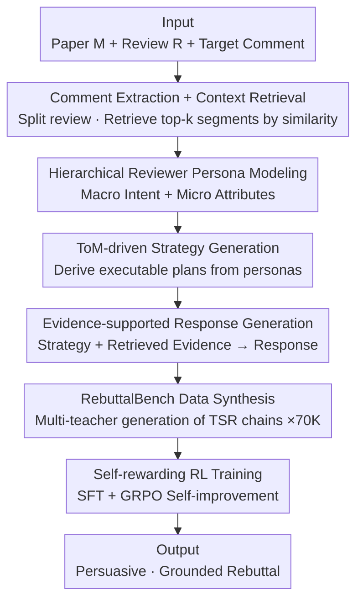

# Dancing in Chains: Strategic Persuasion in Academic Rebuttal via Theory of Mind

**Conference**: ICLR2026  
**OpenReview**: [https://openreview.net/forum?id=zkCZDdeS9s](https://openreview.net/forum?id=zkCZDdeS9s)  
**Code**: https://github.com/Zhitao-He/RebuttalAgent  
**Area**: LLM Agent / Persuasion & Theory of Mind / RLHF  
**Keywords**: Academic rebuttal, Theory of Mind (ToM), Strategic persuasion, Self-rewarding RL, Reward model

## TL;DR
This paper proposes RebuttalAgent, which treats academic rebuttal as "strategic gaming under asymmetric information" rather than simple technical debate. By modeling reviewers' psychological states using Theory of Mind (ToM), it generates evidence-based responses through a three-stage "ToM→Strategy→Response" (TSR) framework. Trained with SFT + self-rewarding RL, it achieves an average improvement of 18.3% over base models, outperforming closed-source models such as GPT-4.1 and o3.

## Background & Motivation
**Background**: LLMs have been deeply embedded in the entire scientific research process—literature review, data visualization, hypothesis generation, experimental design, and even writing complete papers that pass peer review. However, a crucial link in research—**rebuttals to reviewer comments**—has rarely been systematically studied.

**Limitations of Prior Work**: Existing methods mainly focus on supervised fine-tuning (SFT) on review datasets, which is essentially "direct imitation." Such models excel at replicating surface linguistic styles but produce responses that are superficially polite yet formulaic, lacking strategic depth. They learn to "speak politely" but fail to "strike the point."

**Key Challenge**: The essence of a rebuttal is a **dynamic game of incomplete information**. Authors must persuade reviewers under severe information asymmetry: one does not know the reviewer's background, inherent biases, or how a specific response might trigger a chain reaction. A successful rebuttal is not about surface politeness but a series of trade-offs—when to concede, when to persist, when to supplement evidence, and when to restructure the narrative. To make these trade-offs correctly, one must **anticipate the other party's thoughts**, known in cognitive science as Theory of Mind (ToM): modeling others' beliefs, intentions, perspectives, and predicting their behavior. Surface imitation methods lack this crucial link.

**Goal**: To transform agents from mere linguistic imitators into entities truly capable of "perspective-taking + strategic reasoning," converting the rebuttal task from linguistic imitation to strategic reasoning. This is further decomposed into three sub-problems: how to model reviewer psychology, how to derive executable strategies from psychological profiles, and how to ensure generated responses are supported by evidence.

**Key Insight**: The authors borrow the cognitive science concept of ToM and extend it to Machine ToM: allowing the LLM to first infer the reviewer's stance, attitude, core concerns, and expertise level. Based on this, it allocates limited response space—identifying core criticisms that deserve a direct rebuttal versus secondary points that can be cleverly reframed.

**Core Idea**: An explicit "ToM-Strategy-Response (TSR)" three-stage framework is used to "first think about how to respond, then decide what to respond," coupled with self-rewarding reinforcement learning for scalable self-improvement.

## Method

### Overall Architecture
The objective of RebuttalAgent: given the original paper $M$, a specific review $R_i$, and the target comment $c_{\text{target}}$ within it, generate a persuasive response $r_{\text{target}} = G(M, R_i, c_{\text{target}})$. The authors require this response to satisfy three properties: **persuasiveness** (addressing concerns beyond mere politeness), **context-awareness** (understanding implicit assumptions or misunderstandings behind explicit criticism), and **evidence-support** (ensuring every argument finds a basis in $M$).

The pipeline consists of four steps. **Data Preparation**: Discretize messy raw reviews into actionable target comments (comment extraction), then retrieve relevant passages from the paper for each comment (context retrieval). **TSR Reasoning**: This is the core, using ToM to construct a hierarchical reviewer persona, deriving targeted strategies, and grounding these strategies into evidence-based responses. **Data Synthesis**: Using this process, multiple strong teacher models generate complete "Analysis-Strategy-Response" chains for 70,000 comments, forming RebuttalBench. **Agent Training**: First, SFT injects TSR reasoning capabilities, followed by self-rewarding RL (GRPO) for scalable self-improvement. Additionally, Rebuttal-RM is trained separately as an automatic evaluation judge.

### Key Designs

**1. Hierarchical Reviewer Persona Modeling: Using ToM to split "Understanding Reviewers" into Macro and Micro Layers**

Responding literally to comments is the root of surface imitation failure—it fails to grasp the intent behind the words. This paper uses a hierarchical structure for "mind-reading." The **Macro Layer** models an overall psychological profile across four dimensions: Overall Stance (e.g., incline toward accept/reject), Overall Attitude (e.g., constructive/hostile), Dominant Concern (e.g., presentation vs. methodology), and Expertise (expert/layman). This persona determines the global strategy and tone. The **Micro Layer** targets specific comments, categorizing them into four concern dimensions: Significance, Methodology, Experimental Rigor, and Presentation, while labeling type and severity (e.g., "Missing/Weak Baseline - Severe," "Typo - Minor"). Macro decides the "tone," micro decides the "remedy," and their combination ensures the response is both precise and globally consistent.

**2. ToM-driven Strategy Generation: Inserting an Explicit Strategic Intermediate Step Between "Understanding" and "Responding"**

If the model writes a response immediately after reading the persona, it easily reverts to "reacting to literal questions." This paper explicitly inserts a strategy generation step: conditioned on the full reviewer persona + target comment, the LLM outputs a concise, high-level strategy (e.g., "1. Concede and acknowledge; 2. Analyze current status and bottlenecks; 3. Propose specific solutions"). The key value of this step is **forcing the model to decide "how to respond" before deciding "what to respond"**—translating a static diagnostic persona into a dynamic, executable plan, ensuring the final text is not a passive reaction to surface queries but a strategic response aligned with deeper intentions.

**3. Evidence-supported Response Generation: Grounding Strategies in Real Paper Evidence**

Persuasiveness requires more than strategy; it needs evidence. The response generation stage synthesizes two types of inputs: **Strategic Input**—the ToM reviewer persona $P$ and customized strategy $S$, which dictate the alignment with the reviewer's perspective, tone, and argumentative flow; **Contextual Input**—retrieved relevant paragraphs $\bigoplus_{p_j \in C_E} p_j$ and the original response $r_{\text{orig}}$. This is formalized as $r_{\text{target}} = G(R_i, c_{\text{target}}, P, S, \bigoplus_{p_j \in C_E} p_j, r_{\text{orig}})$. Here, $r_{\text{orig}}$ serves two purposes: a high-fidelity context source and a high-quality blueprint for phrasing and structure (note: $r_{\text{orig}}$ is only used during data synthesis; final inference does not rely on it). This ensures the final text is strategically aligned, factually grounded, and structurally coherent.

**4. Self-rewarding RL: Using the SFT Agent to Score Itself via GRPO**

The RL stage further optimizes responses for strategic advantage and persuasiveness. However, training an external reward model is expensive and difficult to scale. This paper introduces a self-rewarding mechanism: reusing the SFT model $G_{\text{SFT}}$ to evaluate its own output across four dimensions. Total reward is $R(o) = w_1 R_{\text{format}}(o) + w_2 R_{\text{think}}(o) + w_3 R_{\text{resp}}(o) + w_4 R_{\text{div}}(o)$. $R_{\text{format}}$ programmatically checks if the output contains the `<Analysis>/<Strategy>/<Response>` structure (binary reward); $R_{\text{think}}$ evaluates the quality of analysis and strategy blocks (persona accuracy, strategy rationality); $R_{\text{resp}}$ evaluates the persuasiveness, clarity, and evidence usage of the final response; $R_{\text{div}}$ compares the generated response against a set of predefined templated negative samples—scoring higher for semantic divergence to combat "reward hacking" and generic outputs. Subsequently, GRPO optimizes the policy: sampling $G$ candidates for each input $q$, calculating advantage $A_i$ based on relative rewards within the group, and maximizing the clipped surrogate objective $J_{\text{GRPO}}(\theta)$ with $\beta D_{\text{KL}}(\pi_\theta \| \pi_{\text{ref}})$ regularization. This mechanism allows the agent to continuously improve without human-annotated reward models.

### Loss & Training
A two-stage training process is used with Qwen3-8B as the base. **SFT Stage**: Supervised fine-tuning on RebuttalBench (70k samples, each with a full TSR chain), teaching the model structured TSR reasoning and basic rebuttal capabilities. Data is synthesized using diverse reviews and multiple strong LLMs to enhance robustness and cross-style generalization. **RL Stage**: Further strategy optimization using the self-reward signals + GRPO. RebuttalBench is derived from the Re2-rebuttal dataset, with GPT-4.1 parsing over 200k+ comment-response pairs and labeling macro/micro personas. **Comments requiring new experiments are explicitly filtered out** (e.g., "compare with baseline X"), focusing capabilities on linguistic persuasion and strategic argumentation to prevent data hallucination. The final selection consists of 70k samples (60k filtered by category + 10k random).

## Key Experimental Results

### Main Results
The primary metric is an overall quality score (0-10), subdivided into Clarity (C, logical organization), Persuasiveness (P, strength of argument and evidence), Constructiveness (Co, commitment to improvement and actionable revisions), and Attitude. On the in-domain test set R2-test (6000 comments from 24 conferences + 21 workshops):

| Model | Avg Score | Gain vs. Qwen3-8B Base |
|--------|------|------|
| Qwen3-8B (Base) | 7.96 | — |
| GPT-4.1 | 8.50 | — |
| DeepSeek-R1 | 8.64 | — |
| o3 | 9.21 | — |
| **RebuttalAgent** | **9.42** | **+18.3%** |

RebuttalAgent achieved the highest overall score of 9.42, surpassing all baselines including GPT-4.1 and o3. Clarity reached 9.43 and Persuasiveness 9.20, with Persuasiveness and Constructiveness seeing the largest gains (up to 34.6%).

Rebuttal-RM, serving as the judge, also showed significantly higher consistency with human scoring (average of six statistical metrics):

| Judge Model | Human Consistency Avg |
|--------|------|
| GPT-4.1 | 0.745 |
| DeepSeek-r1 | 0.705 |
| **Rebuttal-RM (Ours)** | **0.812** |

Rebuttal-RM (Qwen3-8B base, trained on 102K multi-source data) averaged 0.812, outperforming GPT-4.1 and DeepSeek-r1 by approximately 9.0% and 15.2%, respectively.

### Ablation Study

| Configuration | Avg Score | Description |
|------|---------|------|
| RebuttalAgent (Full) | 9.42 | Complete model |
| w/o ToM | 9.04 | Removed ToM analysis, dropped 0.38 |
| w/o Strategy | 9.31 | Removed explicit strategy step |
| w/o Thinking | 9.37 | Removed thinking block |
| SFT-only | 8.27 | Only SFT without RL, dropped 1.15 |
| RL-only | 8.79 | Only RL without SFT |
| w/o $R_{\text{resp}}$ | 8.63 | Removed response quality reward, largest drop (−0.79) |

### Key Findings
- **Response Quality Reward $R_{\text{resp}}$ contributes the most**: Removing it dropped the average score from 9.42 to 8.63, making it the most critical reward signal.
- **Both training stages are indispensable**: SFT-only (8.27) or RL-only (8.79) performed significantly worse than the full process (9.42), indicating success stems from the synergy of specialized data, complete training, and reward mechanisms.
- **Framework is backbone-agnostic**: Applying TSR + self-rewarding to Llama-3.1-8B and Qwen3-4B resulted in improvements from 7.44→9.20 and 7.69→8.98, respectively.
- **Generalization to out-of-domain**: The framework remained effective on the self-built Rebuttal-test (1000+ real post-2023 ICLR/NeurIPS reviews), verifying generalization to new distributions.

## Highlights & Insights
- **Problem Redefinition is Key**: Redefining rebuttal from "linguistic imitation" to "strategic persuasion under incomplete information games" and introducing ToM as the solution explains why previous SFT methods yielded only "polite clichés."
- **Explicit Decoupling of "How to Respond" and "What to Respond"**: Inserting an independent strategy generation step between the persona and response forces the model to separate decision-making from phrasing—a trick applicable to any "high-stakes, trade-off" generation task (negotiation, customer complaint handling, diplomatic rhetoric).
- **Self-rewarding + Diversity Reward against Reward Hacking**: $R_{\text{div}}$ uses predefined templated negative samples as a control; the more it resembles a cliché, the more points are deducted. This elegantly transforms "avoiding generic talk" into an optimizable signal, which is more efficient than manual rule-writing.
- **Building a More Accurate Domain Judge than GPT-4.1**: Rebuttal-RM solves the evaluation challenge of "how to reliably and automatically assess rebuttals," providing reusable infrastructure for follow-up research.

## Limitations & Future Work
- **Self-imposed Boundaries**: The explicit removal of comments requiring new experiments means the agent cannot handle "empirical demands," which often constitute a significant and critical portion of real rebuttals.
- **Risk of "Judge and Jury" in Self-rewarding**: Since $R_{\text{think}}$ and $R_{\text{resp}}$ are self-evaluated by $G_{\text{SFT}}$, there is a risk of amplifying self-preference; although $R_{\text{div}}$ mitigates homogeneity, the model might still learn to "pander to its own scoring tendencies."
- **Evaluation Relies on Model Scores**: The main results depend on Rebuttal-RM's automated scoring. Despite good alignment with humans, the causal link to whether a real "reviewer increases their score" remains distant. Online validation of "response leads to score increase" is still missing.
- **Subtle Ethical Boundaries**: Automating "strategic persuasion" is one step away from "manipulating reviewers." The authors added a disclaimer, but the potential arms race in review gaming once tools become widespread warrants caution.

## Related Work & Insights
- **vs SFT-only Imitation (e.g., RebuttalFT)**: These models fine-tune Qwen3-8B on human rebuttals but achieve an average score of only 6.35, lower than the base model—proving that blind imitation of real responses propagates noise and clichés. Ours avoids this by explicitly modeling strategies via TSR and RL.
- **vs Strategy-Prompt (Prompt engineering mimicking this approach)**: Using GPT-4.1 for "strategy then response" via prompting without training achieved 8.37, significantly lower than Ours (9.42)—proving that **training ToM/strategic capabilities into model weights** is more stable than temporary prompting.
- **vs Self-Refined (Iterative self-revision)**: Relying on GPT-4.1 for repeated self-revision yielded 8.72, still lagging behind this work—indicating that "directionless self-reflection" is inferior to "strategic generation navigated by ToM personas."
- **Insight**: The TSR three-step ("read mind → set strategy → ground evidence") essentially adds an interpretable reasoning scaffold to generation tasks, transferable to any high-stakes communication scenario requiring perspective-taking.

## Rating
- Novelty: ⭐⭐⭐⭐⭐ First to introduce ToM into academic rebuttals; unique problem redefinition and TSR framework.
- Experimental Thoroughness: ⭐⭐⭐⭐ In/out-of-domain + cross-backbone + full ablation, though automated evaluation dominates and lacks online causal validation.
- Writing Quality: ⭐⭐⭐⭐ Clear motivation, complete diagrams and formulas, excellent "Dancing in Chains" title.
- Value: ⭐⭐⭐⭐ Practical tool + reusable judge model, though ethical boundaries and the "language-only" limitation must be addressed.

<!-- RELATED:START -->

## Related Papers

- [\[ICLR 2026\] STARK: Strategic Team of Agents for Refining Kernels](stark_strategic_team_of_agents_for_refining_kernels.md)
- [\[ICLR 2026\] Dyna-Mind: Learning to Simulate from Experience for Better AI Agents](dyna-mind_learning_to_simulate_from_experience_for_better_ai_agents.md)
- [\[ICLR 2026\] MC-Search: Evaluating and Enhancing Multimodal Agentic Search with Structured Long Reasoning Chains](mc-search_evaluating_and_enhancing_multimodal_agentic_search_with_structured_lon.md)
- [\[ICLR 2026\] Presenting a Paper is an Art: Self-Improvement Aesthetic Agents for Academic Presentations](presenting_a_paper_is_an_art_self-improvement_aesthetic_agents_for_academic_pres.md)
- [\[ICML 2026\] It's a TRAP! Task-Redirecting Agent Persuasion Benchmark for Web Agents](../../ICML2026/llm_agent/its_a_trap_task-redirecting_agent_persuasion_benchmark_for_web_agents.md)

<!-- RELATED:END -->
