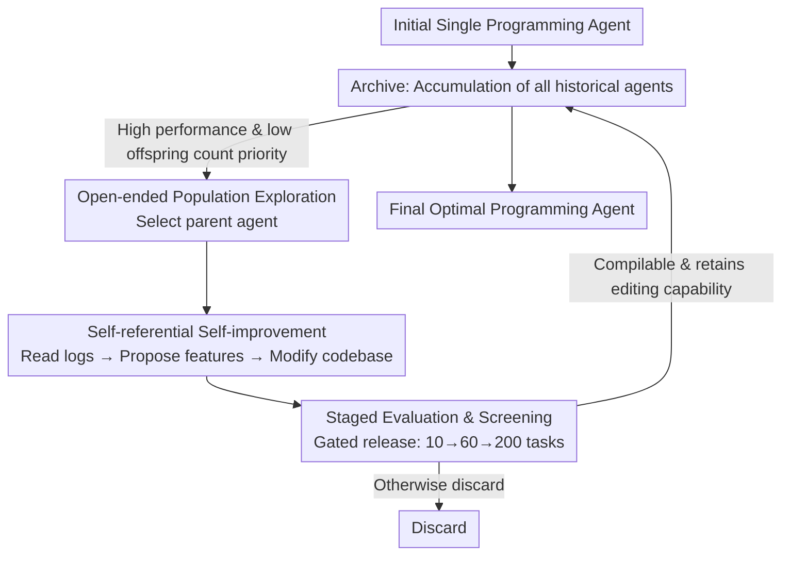

# Darwin Gödel Machine: Open-Ended Evolution of Self-Improving Agents

**Conference**: ICLR 2026  
**OpenReview**: [https://openreview.net/forum?id=pUpzQZTvGY](https://openreview.net/forum?id=pUpzQZTvGY)  
**Code**: Yes (The paper promises to open-source code / prompts / evaluation artifacts; the release version will remove privilege escalation components and default to a sandbox)  
**Area**: Agent / Self-improvement / Open-ended evolution  
**Keywords**: Self-improvement, programming agents, open-ended exploration, Darwin Gödel Machine, SWE-bench

## TL;DR
DGM enables a programming agent to continuously rewrite its own codebase to improve its code-modification capabilities. It replaces the theoretically infeasible "formal proof" of the Gödel Machine with the empirical evidence of "benchmark performance." By maintaining an ever-growing archive of agents for open-ended exploration, it pushes SWE-bench from 20.0% to 50.0% and Polyglot from 14.2% to 30.7%.

## Background & Motivation
**Background**: Current AI systems are largely confined within fixed, human-designed architectures and learn within predefined boundaries, lacking the ability to rewrite their own source code for self-improvement. Progress remains highly dependent on manual human adjustments. While meta-learning can automatically discover new algorithms, it is limited by "first-order improvements" and "human-designed search spaces."

**Limitations of Prior Work**: Schmidhuber's Gödel Machine proposed a theoretically elegant solution—an AI that iteratively rewrites itself in a "provably beneficial" manner. However, in real-world systems without strong restrictive assumptions, **it is impossible to formally prove that a modification is a net benefit to the system**. For instance, adding more tools (code search, test runners) to an LLM programming agent might seem beneficial, but its actual effectiveness depends heavily on model training and task context: a tool optimized for one environment might confuse the agent in another.

**Key Challenge**: Self-improvement requires a criterion for determining "whether a change is good." Formal proof is impractical; meanwhile, relying solely on "greedily improving upon the current best solution" often traps the system in local optima—a single poor self-modification can hinder future improvements or even cause the agent to lose the ability to edit its own codebase.

**Goal**: Construct a system capable of continuous self-improvement that becomes increasingly adept at improving itself, while bypassing the infeasibility of formal proofs and the premature convergence of greedy approaches.

**Key Insight**: The authors shift inspiration from "proof" to "Darwinian evolution"—mutations and adaptations do not require prior verification but are generated, tested, and retained through natural selection. They also draw from research on open-endedness: maintaining an archive of historical agents to treat "interesting but currently sub-optimal" solutions as stepping stones for future breakthroughs.

**Core Idea**: "Self-improvement" is defined as a programming task (modifying its own codebase). Benchmark scores serve as empirical evidence to validate modifications. An archive accumulating all variants enables population-based open-ended exploration, allowing progress to accumulate like science, standing on the shoulders of past iterations.

## Method

### Overall Architecture
DGM is a self-referential, self-improving system: it writes and modifies its own code to become a superior programming agent. Starting from a **single** initial programming agent (a lightweight agent based on a frozen pretrained FM with Bash and file-editing tools), the system maintains a growing archive of agents. The process alternates between "self-modification" and "evaluation" for 80 cycles, producing one new agent per cycle: a parent agent is selected from the archive via a strategy, reads its evaluation logs, proposes a new feature, implements it into its codebase to generate a child agent, and finally evaluates the child on a coding benchmark. Only "compilable child agents that retain code-editing capabilities" are added back to the archive. The key assumption is: score improvement on coding benchmarks = improved programming ability = improved self-improvement ability (since self-improvement is inherently a coding task).

### Key Designs

**1. Defining self-improvement as a "code modification" task, replacing formal proof with empirical evidence**

This design directly addresses the practical impossibility of formal proof. DGM relaxes the Gödel Machine’s requirement that "modifications must be proven beneficial before execution," opting instead for **post-hoc experimental verification**: modifications are accepted if benchmark scores increase. This loop closes because the authors equate self-improvement to a programming task—the agent uses Turing-complete Python to edit its own repository (tools, prompts, and workflows). Consequently, "performing better on programming tasks" and "being better at modifying self-code" are two sides of the same coin. Improvements observed on SWE-bench prove both better downstream performance and enhanced self-improvement capability. This differs from ADAS or Zelikman's approach (fixed meta-agent + meta-utility), where these capabilities are not always aligned.

**2. Open-ended population exploration: Maintaining an archive and sampling parents via "High Score × Low Offspring"**

Relying solely on empirical evidence risks getting stuck in local optima. DGM breaks this via open-ended exploration—it evolves a population rather than a single solution. An archive of **all** historical agents is maintained, from which parents are sampled for branching. The sampling probability $p_i$ is proportional to the performance score $s_i$ and inversely proportional to the number of "offspring with code-editing capabilities" $n_i$, roughly denoted as $p_i \propto s_i \cdot \frac{1}{1+n_i}$ (refer to Appendix C.2 for the exact form). This balances exploitation (high scores) and exploration (under-explored lineages). Crucially, **all agents retain non-zero sampling probability**, ensuring no path to improvement is permanently blocked given enough compute. This allows archive solutions to act as stepping stones; a seemingly minor agent might trigger major improvements much later (e.g., node 24 in the paper). This allows DGM to escape "performance valleys" and explore multiple implementations for the same goal.

**3. Staged evaluation: Screening via cost-effective noise control to ensure "self-modifiability"**

Due to LLM variance and the high cost of full evaluations, DGM uses a staged strategy to save compute: first, 10 tasks verify if "basic codebase editing functions" are intact—only agents capable of editing code can solve tasks or continue self-improving; **otherwise, they are discarded**. Those passing move to 60 tasks. Only when the SWE-bench score exceeds 40% and ranks in the top two of the archive is a 200-task evaluation performed for accurate estimation. This funnel allocates compute to the most promising candidates while enforcing a hard threshold: each agent in the archive must remain capable of self-improvement, preventing "self-destructive" modifications from breaking the evolutionary chain.

## Key Experimental Results

### Main Results
Testing on two coding benchmarks: SWE-bench (Python-only, multi-file editing, Verified subset) and Polyglot (multi-language, single-file implementation; pass@1). After 80 cycles of self-improvement:

| Benchmark | Base Agent | DGM (Ours) | Note |
|------|------|------|------|
| SWE-bench | 20.0% | **50.0%** | Comparable to reproducible open-source SOTA |
| Polyglot (Full) | 14.2% | **30.7%** | Significantly outperforms Aider agent |

Automatically discovered improvements focused on tools and workflows: upgrading editing tools from "whole-file view/replace" to fine-grained "line-by-line view + string replacement," and learning workflows like multi-attempt trials followed by LLM-based selection.

### Ablation Study
Compared against two baselines removing core components (Figure 2, scores on subsets):

| Configuration | Behavior | Result |
|------|------|------|
| DGM (Full) | Self-improvement + Open-ended exploration | Continuous rise, best on both benchmarks |
| w/o self-improve | Meta-agent fixed as base agent (equivalent to ADAS) | Early gain, plateaus quickly |
| w/o open-ended | Keeps only the latest version, no archive | One bad modification halts progress |

### Key Findings
- **Both components are essential**: Removing self-improvement leads to diminishing returns; removing open-ended exploration allows a single bad modification to halt progress.
- **Cross-model transfer**: Agents evolved using Claude 3.5 Sonnet remain effective when switching FMs—base 23.0% → DGM 33.0% for o3-mini, and 19.0% → 59.5% (200 tasks) for Claude 3.7 Sonnet.
- **Cross-benchmark/language transfer**: SWE-bench evolved agents achieved 28.9% on Polyglot zero-shot (baseline 14.2%). Agents evolved on Python generalized well to other languages, outperforming the base agent and Aider.
- **Visual evidence of exploration**: The archive tree shows many innovation paths passing through low-score nodes. Key nodes (e.g., node 24) trigger clusters of subsequent innovations.

## Highlights & Insights
- **Converging "self-improvement" into the single task of "modifying own code"** is the most critical move. It naturally aligns downstream performance with self-improvement capability, legitimizing benchmark scores as verification evidence.
- **Replacing greedy hill-climbing with a Darwinian archive** operationalizes principles from open-ended evolution (stepping stones, non-zero sampling). This approach is transferable to any automated design problem with noisy evaluation and premature convergence.
- **The staged evaluation funnel combined with a "self-modifiability" gate** provides a practical recipe for population-based search under expensive, stochastic evaluations.
- **Safety is addressed** by sandboxing the loop, imposing resource limits, and maintaining an auditable archive. The paper suggests self-improvement can be directed toward enhancing safety and interpretability itself.

## Limitations & Future Work
- **High compute and cost**: Running DGM on SWE-bench takes roughly two weeks with significant API costs. Whether it can maintain progress over much longer runs remains open.
- **FM capacity constraints**: Current versions only modify prompts/tools/workflows while the FM is frozen. Updating the training scripts and the FM itself is reserved for future work.
- **Gap vs. Closed-source SOTA**: While matching reproducible open-source solutions, it does not yet reach top-tier closed-source solutions meticulously tuned by human experts.
- **Validity of the core assumption**: If benchmarks do not cover safety or robustness, the self-improvement loop could amplify misalignments. The authors view benchmark gains as "necessary but not sufficient."
- **Meta-evolution**: The open-ended exploration rules (archive maintenance, parent selection) are currently fixed and not yet subject to self-modification.

## Related Work & Insights
- **vs. Gödel Machine (Schmidhuber, 2007)**: DGM trades theoretical rigor for practical viability by replacing formal proofs with empirical evidence.
- **vs. ADAS / Fixed meta-agents (Hu et al., 2025; Zelikman et al., 2024b)**: These use a fixed meta-agent to modify downstream agents. DGM is a single system that improves itself, removing the manual meta-agent bottleneck.
- **vs. Robeyns et al. (2025)**: A concurrent work that also lets an agent recursively modify its codebase but relies on greedy hill-climbing. DGM adds an open-ended exploration loop to avoid sub-optimal plateaus.
- **vs. Open-ended/Quality-Diversity Evolution**: DGM adopts the "stepping stones" philosophy but connects it with a self-referential improvement loop.

## Rating
- Novelty: ⭐⭐⭐⭐⭐ Successfully closes the loop on self-referential improvement and open-ended exploration.
- Experimental Thoroughness: ⭐⭐⭐⭐ Significant gains across benchmarks and strong transfer results, though compute costs limit repetitions.
- Writing Quality: ⭐⭐⭐⭐⭐ Clear logical flow from scientific accumulation to Darwinian evolution.
- Value: ⭐⭐⭐⭐⭐ A reproducible step towards self-accelerating AI with a practical safety framework.

<!-- RELATED:START -->

## Related Papers

- [\[ICLR 2026\] Huxley-Gödel Machine: Human-Level Coding Agent Development by an Approximation of the Optimal Self-Improving Machine](huxley-godel_machine_human-level_coding_agent_development_by_an_approximation_of.md)
- [\[ICLR 2026\] ChinaTravel: An Open-Ended Travel Planning Benchmark with Compositional Constraint Validation for Language Agents](chinatravel_an_open-ended_travel_planning_benchmark_with_compositional_constrain.md)
- [\[ICLR 2026\] WebWeaver: Structuring Web-Scale Evidence with Dynamic Outlines for Open-Ended Deep Research](webweaver_structuring_web-scale_evidence_with_dynamic_outlines_for_open-ended_de.md)
- [\[ICLR 2026\] Agentic Context Engineering: Evolving Contexts for Self-Improving Language Models](agentic_context_engineering_evolving_contexts_for_self-improving_language_models.md)
- [\[ICLR 2026\] EvoTest: Evolutionary Test-Time Learning for Self-Improving Agentic Systems](evotest_evolutionary_test-time_learning_for_self-improving_agentic_systems.md)

<!-- RELATED:END -->
