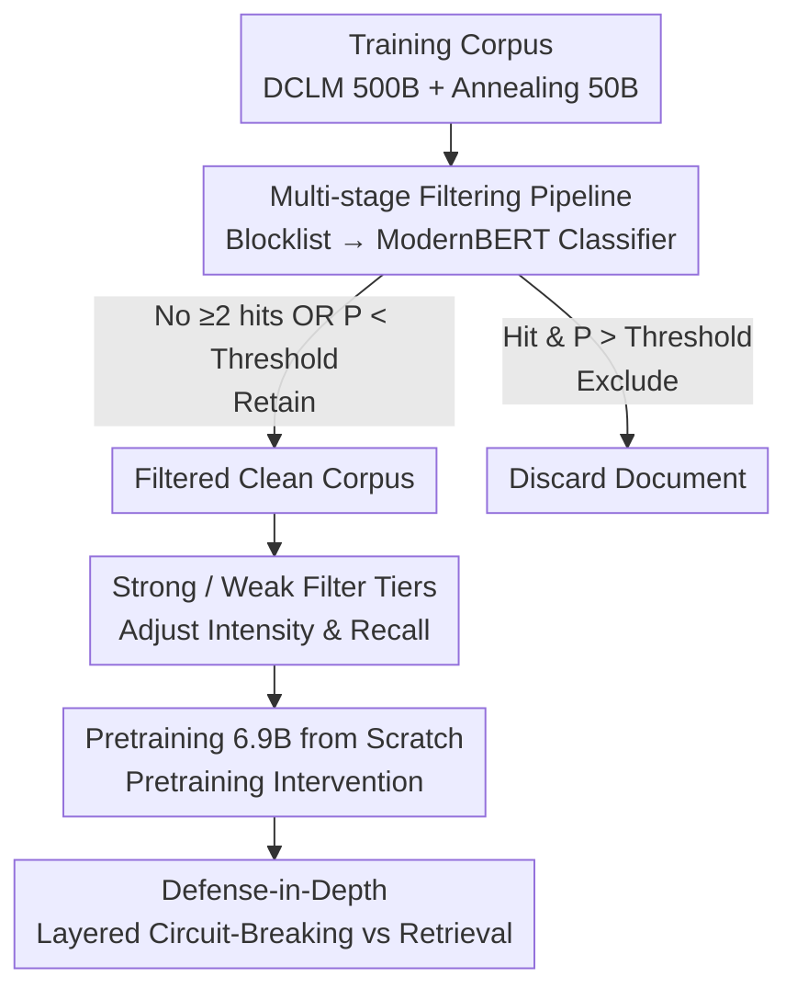

# Deep Ignorance: Filtering Pretraining Data Builds Tamper-Resistant Safeguards into Open-Weight LLMs

**Conference**: ICLR2026  
**OpenReview**: [https://openreview.net/forum?id=xcf0QcTcGS](https://openreview.net/forum?id=xcf0QcTcGS)  
**Code**: To be confirmed  
**Area**: AI Safety / LLM Safety  
**Keywords**: Pretraining data filtering, Tamper-resistance, Open-weight security, Biothreat knowledge, Defense-in-depth

## TL;DR
The authors propose a multi-stage pretraining data filtering pipeline utilizing a "blocklist + ModernBERT classifier" to remove dual-use biothreat-related text from the corpus. By training a 6.9B model from scratch, they achieve "harmlessness" that persists even under adversarial fine-tuning of up to 10,000 steps and 300 million tokens—outperforming existing post-training defenses by over an order of magnitude without compromising general capabilities.

## Background & Motivation
**Background**: Open-weight large language models (LLMs) provide benefits such as transparency, researchability, and decentralization. However, any downstream user can access and modify the weights. To prevent models from generating dangerous chemical, biological, radiological, or nuclear (CBRN) knowledge, the prevailing approach is to apply "patches" during the **post-training stage** via safety fine-tuning, machine unlearning, Circuit-Breaking, or Latent Adversarial Training (LAT).

**Limitations of Prior Work**: These post-training defenses are extremely fragile. Extensive research has demonstrated that attackers can "unfreeze" safety guardrails and recover erased dangerous knowledge with only a few hundred or even dozens of steps of adversarial fine-tuning. In essence, post-training merely "suppresses" rather than "removes" dangerous knowledge; the neural circuits remain and can be reactivated under pressure.

**Key Challenge**: Dangerous knowledge is internalized into the weights during the **pretraining stage**. Post-training fixes are superficial attempts to modify already established "dangerous circuits." To make a model truly "ignorant," it must be prevented from learning such knowledge from the outset.

**Goal**: To enable models to maintain "robust ignorance" regarding biothreat proxy knowledge while preserving general capabilities, ensuring this ignorance can withstand large-scale adversarial fine-tuning.

**Key Insight**: The authors hypothesize that if specific dangerous knowledge is derived strictly from a small subset of documents in the training corpus, filtering these documents will prevent the model from learning the knowledge, leaving nothing for an attacker to "awaken." This hypothesis holds for "knowledge" (precise facts) but may not apply to "tendencies" (attributes like toxicity that do not require precise facts)—a crucial boundary clarification made in this paper.

**Core Idea**: Shift the safety defense frontward from "post-training" to "pretraining data filtering." By using a low-cost pipeline to remove dangerous corpora before training, "absence at the data level" is exchanged for "tamper-resistance at the weight level."

## Method

### Overall Architecture
The core of this work is a **scalable multi-stage data filtering pipeline**, complemented by a complete loop of "filtering → pretraining from scratch → tamper-resistance evaluation → layered defense-in-depth." The input is a massive pretraining corpus (500B tokens of DCLM plus 50B tokens for the annealing/midtraining phase), and the output is a 6.9B model with "innate ignorance" of biothreat knowledge.

The pipeline comprises two levels that escalate from cheap to expensive. Most documents (approx. 91%) do not trigger the blocklist and are retained without entering the classifier. Only the minority that hit the blocklist are escalated to the ModernBERT classifier for semantic judgment. Consequently, the computational overhead of filtering is less than 1% of the total training FLOPS. After training from scratch, the model's tamper-resistance is systematically tested via adversarial fine-tuning and latent/input-space attacks. Finding that data filtering alone cannot block "retrieval-augmented generation with answers," the authors layer Circuit-Breaking to form a defense-in-depth.

### Key Designs

**1. Multi-stage Filtering Pipeline: Two-level Processing for Millions of Documents**

Running LLM-based classification on every document is computationally prohibitive at scale. The authors split filtering into two stages. **Stage 1: Keyword Blocklist**: Utilizing Llama 3.3 70B, they extracted key terms (e.g., "pathogen") from 24,453 documents in the WMDP-Bio Forget set. Every training document is scanned; if it hits **two or more** blocklist words, it is "escalated." This stage is a pure text search requiring only CPU and is highly parallelizable. Approximately 91.58% of pretraining documents and 90.64% of annealing documents skip the second stage. **Stage 2: ModernBERT Classifier**: To address the high false-positive rate of the blocklist, escalated documents undergo semantic judgment by a fine-tuned ModernBERT-Large. Trained on 198,184 expert and LLM-labeled samples, it assigns an "unsafe probability" $P$. Documents are discarded if $P$ exceeds a threshold. Since this level only processes a small subset and uses a small model, it consumes only ~0.83% of training FLOPS.

**2. Strong / Weak Filtering Settings: Adjusting Aggression via Classifier Review**

To balance "over-filtering" (high recall) against "preserving scientific data" (high precision), the authors propose two tiers. **Strong Filter** uses only the single-stage blocklist for both pretraining and annealing; any document hitting the blocklist is deleted without classifier review. This aggressive approach removes 8.42% of pretraining and 9.36% of annealing documents. **Weak Filter** uses the same strong filter during pretraining but adds the ModernBERT review stage during annealing. This removes only 4.96% of annealing documents and **re-inserts** documents flagged by the blocklist but deemed safe by the classifier, thereby minimizing damage to legitimate scientific content.

**3. Shifting Safety Forward to Pretraining for True Tamper-Resistance**

Post-training defenses fail because dangerous circuits remain in the weights. The authors argue that if a model never learns this knowledge during pretraining, it is significantly harder for an attacker to "fine-tune it back in." They train multiple 6.9B decoder models (aligned with Pythia 6.9B architecture) using unfiltered, strong-filtered, and weak-filtered corpora, all aligned to 550B tokens. Tamper-resistance is tested via adversarial fine-tuning on the WMDP-Bio Forget set ($LR = 2\times10^{-5}$, batch 16) for 2 epochs, including full-parameter and LoRA tuning up to 10,000 steps (~300M tokens). They also perform latent-space attacks (perturbations at layers 0/8/16/24/30) and input-space attacks (few-shot, GCG-U). The filtered model remained stable across almost all attacks, with biothreat capabilities showing negligible increases after 10,000 steps—over a **magnitude stronger** than post-training baselines like Circuit-Breaking.

**4. Defense-in-Depth: Blocking Retrieval with Circuit-Breaking**

A fundamental blind spot of data filtering is that a model can "relay" dangerous information without "knowing" it. The authors created a 1,000-question open/closed-book MCQA benchmark. Results showed that the filtered model performs well in **open-book** settings (where the answer is provided in the context). In other words, an "AI Agent" with retrieval tools can bypass data filtering. Circuit-Breaking fills this gap by scrambling activations when target knowledge representations are detected, preventing the model from "reading" the answer even if it is in the context. Thus, "Data Filtering (anti-internalization) + Circuit-Breaking (anti-retrieval)" forms a complementary defense-in-depth.

### Loss & Training
Models are 6.9B decoder Transformers (Pythia 6.9B architecture). Training is staged: 500B tokens on deduplicated DCLM, followed by 50B tokens of annealing (learning rate reset and upsampling of high-quality/domain data). No instruction tuning is performed to focus evaluation on single-turn Q&A. The models reach ~50% WMDP-Bio accuracy before filtering intervention to ensure comparability rather than SOTA competition.

## Key Experimental Results

### Main Results

| Evaluation Dimension | Metric Dir. | Baseline (Unfiltered) | Data Filtering (Strong/Weak) | Circuit-Breaking | Conclusion |
|----------|----------|--------------------|--------------------|------------------|------|
| General Capabilities (MMLU-NoBio/PIQA/etc. Avg) | Higher better | High | Equivalent to baseline | Equivalent to baseline | Filtering maintains general performance |
| Biothreat Knowledge WMDP-Bio (Cloze) | Lower better | High | **Lowest (Near Random)** | Slightly higher than Filtering | Filtering strongest in cloze tasks |
| Biothreat Knowledge WMDP-Bio (Robust MCQA) | Lower better | High | Better than baseline | **Slightly better than Filter** | CB slightly better in MCQA |
| Adv. Fine-tuning 10,000 steps / 300M tokens | Lower better | Rapid recovery | **Negligible increase** | Unlocked within hundreds of steps | Filtering >1 order of magnitude stronger |
| Benign Fine-tuning (WikiText) | Lower better | — | **Completely immune** | Fails rapidly | Filtering resists benign fine-tuning |

### Ablation Study

| Configuration / Attack | Phenomenon | Description |
|------------|----------|------|
| Strong Filter (Blocklist only) | Removed 8.42% Pretraining / 9.36% Annealing | Highest recall, most aggressive |
| Weak Filter (ModernBERT added) | Removed only 4.96% Annealing docs | Better preservation of scientific data |
| Blocklist Hit Rate | 91.58% Pretraining / 90.64% Annealing skipped | Most docs do not require classification |
| Filter Compute Cost | ModernBERT ≈0.83%, Total <1% FLOPS | Pipeline is highly economical |
| Latent-Space Attack | Effective in MCQA, ineffective in Cloze | Suspected MCQA test-taking heuristics |
| Open-book Retrieval Attack | Filtered model answers correctly, CB blocks | Filtering prevents internalization, not retrieval |
| Combined (FT + Retrieval) | All defenses compromised | Upper limit of defense-in-depth |

### Key Findings
- **Pretraining intervention is the primary driver**: Moving the defense frontward shifts tamper-resistance from "unlocked in hundreds of steps" to "resisting 10,000 steps," because the knowledge was never internalized.
- **Filtering and CB are complementary**: Filtering prevents "internalized knowledge" while CB prevents "contextual retrieval." Their strengths align with different task formats (cloze vs. MCQA) and settings (closed vs. open book).
- **Knowledge vs. Tendency**: Data filtering is effective for "precise facts" but may reduce robustness for "tendencies" like toxicity or harmful request compliance (consistent with findings that "bad data can make good models").

## Highlights & Insights
- **The concept of "Deep Ignorance" is ingenious**: Rather than laboriously erasing knowledge after training, the model is designed never to learn it—ignorance becomes a curated safety attribute.
- **Escalation engineering**: The "cheap high-recall screening + expensive high-precision review" paradigm is directly transferable to large-scale content moderation, keeping classification costs below 1%.
- **Honest boundary setting**: The authors avoid treating data filtering as a silver bullet, explicitly identifying vulnerabilities to RAG and integrated attacks, which strengthens the credibility of the defense-in-depth proposal.
- **Public 6.9B model suite**: Providing paired models (same architecture/tokens, different data) serves as a valuable testbed for interpretability and unlearning research.

## Limitations & Future Work
- **Limitations**: Verified only at 6.9B scale, single-modality, no instruction tuning; focus on biothreat proxy knowledge using MCQA; vulnerability to RAG and "tendency-based" harmful behaviors.
- **Absolute tamper-resistance**: While 10,000 steps is significant, an attacker with resources might push further. The defense relies on the difficulty of acquiring high-quality adversarial biothreat data.
- **Self-identified weaknesses**: Blocklist seeds from WMDP-Bio may lead to overestimating coverage of out-of-distribution dangerous knowledge; hyperparameter sensitivity (thresholds, keyword counts) lacks exhaustive ablation.
- **Future Directions**: Testing at larger scales and multi-modal settings; investigating the mechanistic differences between "deep ignorance" and "surface-level ignorance."

## Related Work & Insights
- **Vs. Post-training Defenses (Circuit-Breaking, LAT, Unlearning)**: These are bypassed by minimal fine-tuning. This paper's pretraining intervention provides an order of magnitude more tamper-resistance.
- **Vs. Maini et al. 2025 / Li et al. 2025a (Toxicity filtering)**: Prior work found filtering harmful text can make models more fragile. This paper clarifies that such findings apply to **tendencies** (toxicity), whereas filtering is effective for **precise knowledge** (scientific facts).

## Rating
- Novelty: ⭐⭐⭐⭐⭐ Shifting safety to pretraining data filtering and proving tamper-resistance advantages is a paradigm shift for open-weight security.
- Experimental Thoroughness: ⭐⭐⭐⭐⭐ Training multiple 6.9B models from scratch and testing across various attack vectors up to 10,000 steps.
- Writing Quality: ⭐⭐⭐⭐⭐ Clear arguments, honest boundary setting, and convincing reconciliation of contradictory literature.
- Value: ⭐⭐⭐⭐⭐ Provides a practical, low-compute (<1% FLOPS) defense layer for open-weight risk management.

<!-- RELATED:START -->

## Related Papers

- [\[ICLR 2026\] Open Data Synthesis for Deep Research](open_data_synthesis_for_deep_research.md)
- [\[ICLR 2026\] WebWeaver: Structuring Web-Scale Evidence with Dynamic Outlines for Open-Ended Deep Research](webweaver_structuring_web-scale_evidence_with_dynamic_outlines_for_open-ended_de.md)
- [\[ICLR 2026\] ScaleCUA: Scaling Open-Source Computer Use Agents with Cross-Platform Data](scalecua_scaling_open-source_computer_use_agents_with_cross-platform_data.md)
- [\[ICLR 2026\] VideoAgentTrek: Computer Use Pretraining from Unlabeled Videos](videoagenttrek_computer-use_pretraining_from_unlabeled_videos.md)
- [\[ICLR 2026\] A Benchmark for Deep Information Synthesis (DeepSynth)](a_benchmark_for_deep_information_synthesis.md)

<!-- RELATED:END -->
