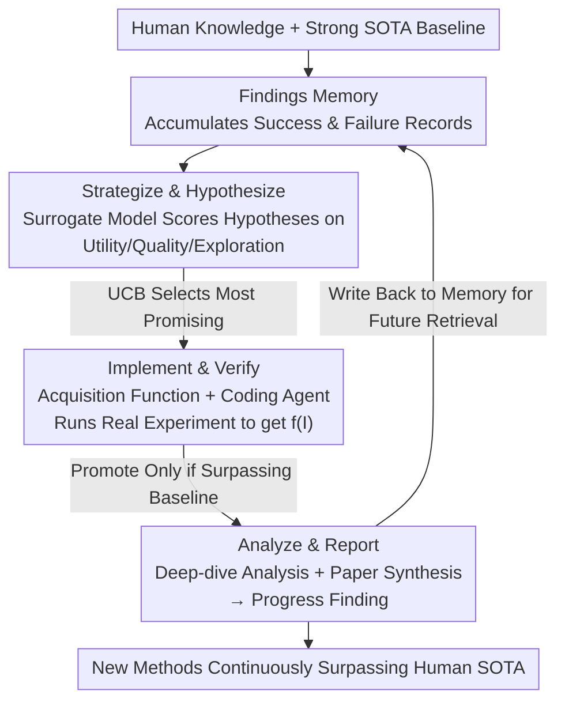

# DeepScientist: Advancing Frontier-Pushing Scientific Findings Progressively

**Conference**: ICLR2026  
**OpenReview**: [https://openreview.net/forum?id=cZFgsLq8Gs](https://openreview.net/forum?id=cZFgsLq8Gs)  
**Code**: https://github.com/ResearAI/DeepScientist  
**Area**: LLM Agent / Automated Scientific Discovery / Bayesian Optimization  
**Keywords**: Automated Research, Goal-Oriented Discovery, Bayesian Optimization, Findings Memory, AI Scientist

## TL;DR
DeepScientist models "automated scientific discovery" as a goal-oriented Bayesian optimization problem. Using a continuously accumulating Findings Memory, it iteratively "hypothesizes—implements/verifies—analyzes/generalizes" over a month-level timescale. After consuming over 20,000 GPU hours, generating approximately 5,000 ideas, and verifying about 1,100 of them, it surpassed human 2025 SOTA on three frontier AI tasks by 183.7%, 1.9%, and 7.9% respectively, achieved through the autonomous redesign of core methodologies rather than simple combinations of existing techniques.

## Background & Motivation
**Background**: As the long-context generation and understanding capabilities of LLMs enhance, "AI Scientist" systems (such as AI Scientist-v2) have been able to execute the entire research loop end-to-end—proposing ideas, writing code, running experiments, and producing papers—even getting accepted into top conference workshops.

**Limitations of Prior Work**: When lacking "explicit scientific goals," these systems often degenerate into blindly recombining existing knowledge and methods, resulting in outputs that appear naive or lack true scientific value to human reviewers. Most are only evaluated on small-scale symbolic or synthetic tasks without anchoring to strong human baselines, leading to results that are "novel but useless."

**Key Challenge**: The essence of scientific discovery is a long-term, goal-oriented, trial-and-error-driven progression (e.g., semiconductor processes shrinking feature sizes from microns to nanometers over decades). Current AI Scientist frameworks are either one-shot "idea → experiment → paper" pipelines or near-infinite trial-and-error around a single idea. Neither paradigm can continuously approach and surpass human SOTA under a fixed compute budget for a strong baseline.

**Goal**: Enable an AI system to reliably push an evaluation metric past a recognized strong human SOTA on modern, high-compute-cost AI research problems within a month-long timeframe, with the process being completely autonomous.

**Key Insight**: The authors formalize "continuous improvement of a metric relative to a strong baseline under fixed compute" as a **goal-oriented Bayesian optimization** problem. The objective is to find the optimal research program $I^*$ that maximizes an unknown and extremely expensive "real-world scientific value function" $f(\cdot)$. Since each experiment is costly (a single implementation for a frontier LLM problem requires $\sim 1\times10^{16}$ FLOPs), brute-force search is impossible. A surrogate model and acquisition function must be used to intelligently balance "exploiting promising directions" and "exploring unknown regions."

**Core Idea**: Drive research from a Bayesian optimization perspective. By treating a continuously accumulating Findings Memory (recording both successes and failures) as the surrogate model's context, the system intelligently chooses the next hypothesis to verify between "exploitation vs exploration," thereby truly advancing the scientific frontier rather than merely reorganizing old knowledge.

## Method

### Overall Architecture
DeepScientist is an LLM-based multi-agent system centered around a continuously accumulating, automatically maintained **Findings Memory**. This memory contains frontier human knowledge (papers, code) as well as the system's own historical discoveries; each record stores hypotheses, implementation details, evaluation metrics, and logs of both successful and failed experiments. The core task is to find the optimal program $I^*$ that maximizes the expensive real value function $f(\cdot)$ from the space of all candidate programs $I$.

The discovery process is structured as a **Bayesian optimization closed loop**, with each round (research cycle) consisting of three phases: **Strategize & Hypothesize (proposing hypotheses and scoring via a surrogate model) → Implement & Verify (selecting the most promising via an acquisition function and running real experiments) → Analyze & Report (deeply analyzing and writing papers for successful verifications only)**. Every discovery in the Findings Memory undergoes three states of "promotion": unverified hypotheses are **Idea Findings**, those selected for implementation are **Implement Findings**, and only those that surpass the baseline are promoted to **Progress Findings**. All records—regardless of success or failure—are retrieved and reused in subsequent rounds, allowing the system to learn continuously from its history.

### Key Designs

**1. Findings Memory: Modeling Research as the "Data Foundation" of Bayesian Optimization**

A major issue with existing AI Scientists is the lack of long-term memory across experiments—they either forget after one run or fixate on a single idea. DeepScientist solves this with an automatically maintained database: each record is a structured scientific finding. It serves as the "observed dataset" for Bayesian optimization—the surrogate model uses it for estimation, the acquisition function for selection, and the analysis phase for reuse. Since a single round might involve thousands of records exceeding LLM context limits, an independent retrieval model selects Top-K records. The retrieved subset typically fits within a $\sim 2\times 10^{5}$ token window, providing sufficient context without losing critical information. Crucially, **failures are intentionally preserved**, as "learning from and reusing failures" is identified by the authors as a new bottleneck in automated science.

**2. Stage I Surrogate Model: LLM as a Cheap Surrogate for Scoring Hypotheses**

To choose the next step in a massive hypothesis space where real experiments are expensive, a low-cost **surrogate model $g_t$** (itself an LLM) approximates the true value function $f$. The system analyzes the Findings Memory $M_t$ to identify knowledge gaps and generate new hypotheses $P_{new}$. The surrogate model, contextualized by retrieved Top-K records and candidate hypotheses, outputs a structured valuation vector $V=\langle v_u, v_q, v_e\rangle$ for each candidate $I\in P_{new}$, quantifying expected **utility, quality, and exploration value** as integers (0–100). This step uses LLM "research intuition" to cheaply pre-estimate value before spending real compute, reserving expensive experiments for the most promising candidates.

**3. Stage II Acquisition Function: Using UCB to Pick the Best Hypothesis for Verification**

How is the most worthwhile Idea Finding chosen for real compute? The system uses a classic **Upper Confidence Bound (UCB)** acquisition function to map $V$ to a comparable score:

$$I_{t+1} = \arg\max_{I\in P_{new}} \underbrace{\big(w_u v_u + w_q v_q\big)}_{\text{Exploit term }\mu(I)} + \kappa \cdot \underbrace{v_e}_{\text{Explore term }\sigma(I)}$$

where $w_u, w_q$ are weights and $\kappa$ controls exploration intensity. The authors use a simple, task-agnostic configuration $w_u=w_q=\kappa=1$ across all tasks, assuming equal importance. The selected discovery $I_{t+1}$ becomes an Implement Finding, assigned to a **coding agent** in a sandboxed environment. This agent can read codebases, search literature, plan tasks, and modify code to generate experiment logs and results $f(I_{t+1})$, feeding back into the memory.

**4. Stage III Multi-Agent Analysis and Paper Synthesis: "Deep-Dive + Paper" Only for Successes**

This is the strictest gate. **Only successful verifications (exceeding baseline) trigger this stage**. When an Implement Finding surpasses the baseline, it is promoted to a Progress Finding and handled by agents using the MCP toolset. They autonomously design and execute deeper analysis (ablations, evaluation on new datasets, etc.). Finally, a synthesis agent uses these results to organize a coherent, reproducible research paper. This pipeline ensures that real progress is solidified as high-confidence knowledge for peer review or future retrieval.

### Mechanism Example: AI Text Detection Progressing Through Three Years of Human Work in Two Weeks
In AI Text Detection, starting from ICLR 2024 baselines (Fast-Detect GPT / Binoculars based on **global statistics**), DeepScientist attempted many routes (Boundary-Aware Extensions, Volatility-Aware, etc.), most failed but were recorded. Within two weeks, it produced three progressively stronger methods: **T-Detect** using robust t-distributions; then **TDT** and **PA-TDT**, treating text as a signal and using wavelet/phase congruency to locate anomalies. This shifted the perspective from "global distribution differences" to "non-stationary time-frequency structures of AI text," revealing that local energy and phase changes carry key evidence, pushing AUROC up by 7.9% and doubling inference speed.

## Key Experimental Results

### Main Results
On three frontier tasks, starting from recognized strong human SOTAs, the system surpassed them after month-long runs on 16 H800 GPUs:

| Task | Metric | Prev. SOTA (Human) | Ours (DeepScientist) | Gain |
|------|------|-----------|---------------|------|
| Agent Failure Attribution | Handcraft Acc. | 12.07 (All at Once) | 29.31 (A2P) | +142.8% |
| Agent Failure Attribution | Algorithm-Gen Acc. | 16.67 (All at Once) | 47.46 (A2P) | +183.7% |
| LLM Inference Accel. | Tokens/sec | 190.25 (Token Recycling) | 193.90 (ACRA) | +1.9% |
| AI Text Detection | AUROC | 0.800 (Binoculars) | 0.863 (PA-TDT) | +7.9% |
| AI Text Detection | Latency | 117ms (Binoculars) | 60ms (PA-TDT) | -57ms (~2× Speed) |

The discovered methods include: **A2P** (Abduction-Action-Prediction) for counterfactual causal reasoning in failure attribution; **ACRA** for LLM inference acceleration via stable suffix indexing; and **TDT/PA-TDT** for time-frequency/phase analysis in detection.

### Key Findings
- **High Attrition in the Idea Funnel**: Over 5,000 ideas were generated, only ~1,100 selected for implementation, and only 21 became scientific innovations. This confirms that **AI exploration capability is vast, but true success is extremely scarce**.
- **Linear Scaling of Compute-to-Output**: Scaling experiments show a near-linear relationship between compute investment and valuable scientific discoveries.
- **New Bottlenecks in Verification and Failure Reuse**: Since success is rare, effective verification, filtering, and strategic reuse of failed attempts have become the new bottlenecks for automated science.

## Highlights & Insights
- **Formalizing "Research" as Bayesian Optimization is a Paradigm Contribution**: Integrating a surrogate model, acquisition function, and Findings Memory makes the decision of "which experiment to run" an optimizable choice rather than guesswork.
- **Intentional Reuse of Failure**: Unlike most AI Scientists focusing only on success, this system structures failures as negative samples to contextualize the surrogate model, addressing a core human research practice often ignored in automation.
- **Scalability**: The three-stage, three-state promotion framework with UCB selection can be applied to any scenario involving continuous improvement against a strong baseline under fixed budget.
- **Large-scale Empirical Evidence**: With 20,000 GPU hours and month-long runs, this is the most substantial evidence to date that AI can consistently push past human SOTA in complex tasks.

## Limitations & Future Work
- **Extremely Low Success Rate & High Cost**: 5,000 ideas for 21 innovations at the cost of 20,000 GPU hours makes ROI a significant drawback.
- **Dependence on Human Oversight**: Experts monitored the run to filter hallucinations, meaning the system is not yet fully "autonomous."
- **Domain Selectivity**: The tasks chosen were "frontier + community-focused + monitorable." Applicability to fields with noisy signals remains unproven.
- **Heterogeneous Gain Scopes**: Gains like +183.7% and +1.9% are not directly comparable; established fields like inference acceleration naturally have less room for improvement.

## Related Work & Insights
- **vs AI Scientist / AI Scientist-v2**: These proved the end-to-end loop but often produced "novel but useless" results on synthetic tasks. DeepScientist anchors exploration to strong human baselines via goal-oriented BO.
- **vs AlphaEvolve / AlphaTensor**: These perform large-scale optimization within fixed scientific paradigms. DeepScientist aims to challenge fundamental assumptions and establish new methodological directions.
- **vs CycleResearcher / co-scientists**: These handle isolated segments (writing, hypothesis) but leave the critical "learning from failure" loop to humans. DeepScientist is an end-to-end autonomous agent.

## Rating
- Novelty: ⭐⭐⭐⭐⭐ Formalizing research as goal-oriented BO with Findings Memory is a clear and original paradigm contribution.
- Experimental Thoroughness: ⭐⭐⭐⭐⭐ Surpassing human SOTA on three tasks + double paper reviews + scaling analysis provided rare depth.
- Writing Quality: ⭐⭐⭐⭐ Framework description is clear, though some surrogate training details were deferred to the appendix.
- Value: ⭐⭐⭐⭐⭐ First large-scale proof of AI pushing frontier SOTA in complex tasks; open-sourced logs and code are highly impactful.

<!-- RELATED:START -->

## Related Papers

- [\[ICLR 2026\] Expanding the Capability Frontier of LLM Agents with ZPD-Guided Data Synthesis](expanding_the_capability_frontier_of_llm_agents_with_zpd-guided_data_synthesis.md)
- [\[ICLR 2026\] Pushing Test-Time Scaling Limits of Deep Search with Asymmetric Verification](pushing_test-time_scaling_limits_of_deep_search_with_asymmetric_verification.md)
- [\[ICLR 2026\] TusoAI: Agentic Optimization for Scientific Methods](tusoai_agentic_optimization_for_scientific_methods.md)
- [\[ICLR 2026\] AutoFigure: Generating and Refining Publication-Ready Scientific Illustrations](autofigure_generating_and_refining_publication-ready_scientific_illustrations.md)
- [\[ICLR 2026\] SR-Scientist: Scientific Equation Discovery With Agentic AI](sr-scientist_scientific_equation_discovery_with_agentic_ai.md)

<!-- RELATED:END -->
