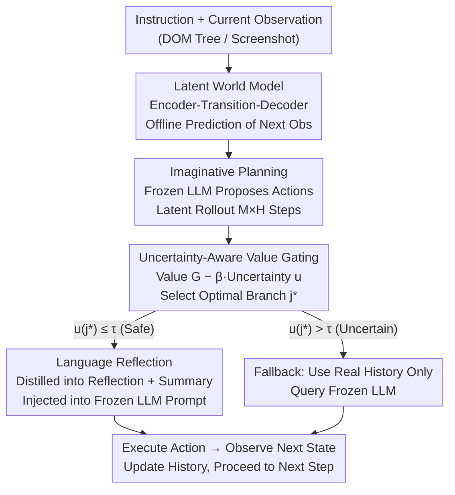

# DreamPhase: Offline Imagination and Uncertainty-Guided Planning for Large-Language-Model Agents

**Conference**: ICLR2026  
**OpenReview**: [https://openreview.net/forum?id=81PJ2KPnmK](https://openreview.net/forum?id=81PJ2KPnmK)  
**Code**: https://anonymous.4open.science/r/DreamPhase-A8AD/README.md (Anonymous Repository)  
**Area**: LLM Agent / World Models / Offline Planning  
**Keywords**: LLM Agents, Latent World Models, Imaginative Planning, Uncertainty Gating, Language Reflection

## TL;DR
DreamPhase enables a **frozen policy LLM** to move beyond trial-and-error in real environments. Instead, it utilizes a learned latent world model to "dream" internally—simulating $M$ multi-step future trajectories. Each trajectory is scored based on "Value minus Uncertainty" and passed through a safety gate. The selected branch is distilled into a natural language reflection and injected back into the prompt. This reduces real API calls per turn on WebShop from ~40 (ARMAP-M) to under 10 (a 4× reduction) and decreases irreversible actions by approximately 5×, all without fine-tuning the LLM.

## Background & Motivation

**Background**: Utilizing LLMs as interactive agents (web navigation, tool-use, embodied tasks) has become a mainstream approach. However, LLMs naturally struggle with closed-loop decision-making: they are pre-trained on static internet data and lack "temporal grounding" in trajectory experience, making it difficult to reason about the long-term consequences of actions. Furthermore, powerful models like GPT-4V and Gemini only offer restricted APIs, preventing fine-tuning on task-specific data. Consequently, they must rely on prompts, which makes them brittle in tasks requiring long-range planning, feedback, or handling uncertainty.

**Limitations of Prior Work**: Existing routes to bridge the closed-loop gap fall into two categories, each with significant drawbacks. **(i) Online rollout planners** (e.g., ReAct + beam search, MCTS) perform hundreds of real DOM interactions at every step to evaluate future branches. While they provide foresight and error correction, they are slow, expensive (in API-limited scenarios), and carry real-world risks in **irreversible** environments like "Submit Payment." **(ii) Pure imitation/reward model agents** act greedily from the current state without explicit search. They save on interaction costs but are extremely brittle; a single mistake can irreversibly derail the entire trajectory as they lack foresight or plan-correction capabilities.

**Key Challenge**: Both approaches are hindered by a "safety vs. efficiency" trade-off stemming from their dependence on real-time environmental interaction. Foresight requires high interaction (unsafe/expensive), while reducing interaction leads to greedy behavior (brittle).

**Goal**: To provide the agent with foresight capabilities while enhancing sample efficiency, safety, and cost, **without fine-tuning the LLM or increasing real-world interaction**.

**Key Insight**: The authors advocate for "internal imagination"—moving exploration from the real environment into a **learned latent space simulator** to be conducted offline. As long as the world model is sufficiently accurate and can identify when it is "uncertain" (thereby falling back to real interaction), both safety and efficiency can be achieved.

**Core Idea**: Train a compact **latent world model** for offline multi-step simulation. Score these branches using **uncertainty-aware value estimation** and a safety gate. Finally, distill the optimal branch into a **natural language reflection** injected into the frozen LLM's prompt—replacing real-world trial-and-error and parameter updates with imagination and linguistic feedback.

## Method

### Overall Architecture

DreamPhase models decision-making as a Partially Observable MDP $\mathcal{M}=(I,S,A,X,T,E,r)$. The agent receives an instruction $\iota$ and observation $x_t$ (DOM tree or screenshot) and must select an action $a_t$ while minimizing real environment interaction. At each timestep, it follows a four-step process **without querying the environment**: (i) It uses a learned latent world model to compress the observation into a latent state, forming a predictive "belief"; (ii) It performs $M$ parallel rollouts in latent space for $H$ steps each; (iii) It calculates a value estimate and an uncertainty measure for each rollout; (iv) It distills the highest-quality imagination branch into a short natural language reflection to condition the next action. Crucially, the **policy LLM remains frozen**, and its behavior evolves only through "internal simulation + linguistic feedback" without parameter updates.

The workflow corresponds to four components: World Model (learning to dream) → Imaginative Planning (generating $M$ branches) → Uncertainty-Aware Value Gating (evaluation and decision) → Language Reflection (communicating the branch to the LLM). The imagined action is used only if the optimal branch is sufficiently confident (passes the safety gate); otherwise, it **falls back** to the strategy based only on real history, ensuring robustness against distribution shift.

### Key Designs

**1. Latent World Model: Allowing the agent to "click buttons in its mind"**

To address the bottleneck of online planning requiring hundreds of real clicks, DreamPhase trains a latent world model to simulate environment dynamics offline, answering "what happens if I click this button?" The model consists of three parts: an encoder $z_t=f_\theta(x_t)$ that compresses observations, a stochastic transition model $z_{t+1}\sim q_\theta(z_{t+1}\mid z_t,\bar a_t,\iota)$ that predicts the next latent state given a latent state and action embedding $\bar a_t=\mathrm{emb}_A(a_t)$, and a decoder $\hat x_{t+1}=g_\theta(\cdot\mid z_{t+1},\iota)$ that reconstructs the observation. Observations (DOM trees) are tokenized into compact, language-aligned sequences via depth-first traversal with text content and spatial layout (bounding boxes, element types). The training objective is token reconstruction (cross-entropy) plus latent space KL regularization:

$$\mathcal{L}_{\mathrm{LWM}}=\mathbb{E}\Big[\mathrm{CE}(\hat x_{t+1},x_{t+1})+\lambda_{\mathrm{KL}}\,\mathrm{KL}\big(q_\theta(z_{t+1}\mid h_t,a_t)\,\|\,\mathcal{N}(0,I)\big)\Big]$$

Training data is collected only from the **training sets** of the benchmarks by recording $(\iota,x_t,a_t,x_{t+1})$ trajectories from a frozen LLaMA-2-7B (using ReAct style + light randomization). No test data or extra corpora are used. Remarkably, it shares the same backbone and environment partitions as baseline methods; the difference lies in data utilization. The authors highlight (Remark 1) why an LLM shouldn't "dream" directly: LLMs are poor at simulating low-level DOM structures, often generating syntactically invalid or causally inconsistent states. Furthermore, token-level rollouts are memory-intensive and entangle policy reasoning with environment modeling. A specialized latent world model is more modular, efficient, and constrained by environmental logic.

**2. Latent Imaginative Rollout: Proposing actions with a frozen LLM and expanding M future paths**

With the world model, the current observation is encoded into $z_t$ at each timestep, and $M$ latent rollouts are generated in parallel for $H$ steps (Algorithm 1). In each step: the frozen policy $\tilde a_{t+k}^{(j)}\sim\pi_{\mathrm{LLM}}(\cdot\mid h_{t+k}^{(j)})$ proposes an action from the current **imagined history**, the world model transitions to the next latent state $z_{t+k+1}^{(j)}$, the imagined observation $\tilde x_{t+k+1}^{(j)}$ is decoded, and the pair is appended to the imagined history. This yields $M$ imagined branches $\tilde\tau^{(j)}=(\{\tilde a_{t:t+H-1}^{(j)}\},\{z_{t+1:t+H}^{(j)}\})$. This process **requires no environment requests**, decoupling "environment dynamics" from "policy reasoning."

**3. Uncertainty-Aware Value Gating: High value plus high certainty**

To determine which branch is "reliable enough to follow," a lightweight value head $V_\phi$ (operating on latent states) first estimates the discounted return $G^{(j)}=\sum_{k=1}^{H}\gamma^{k-1}V_\phi(z_{t+k}^{(j)}\mid\iota)$. Epistemic uncertainty is then estimated via **Monte-Carlo dropout on the frozen policy**, acting as a proxy for mutual information: using $N$ random dropout masks to obtain the action distribution $p^{(j)}(\xi_n)$,

$$u^{(j)}=H\!\big[\bar p^{(j)}\big]-\frac{1}{N}\sum_{n=1}^N H\!\big[p^{(j)}(\xi_n)\big],\qquad \bar p^{(j)}=\frac1N\sum_{n=1}^N p^{(j)}(\xi_n)$$

where $H[\cdot]$ is categorical entropy. A higher $u^{(j)}$ indicates that different stochastic samples are "at odds," signifying high uncertainty. A risk-sensitive score $\tilde G^{(j)}=G^{(j)}-\beta u^{(j)}$ is used to select the optimal branch $j^\star=\arg\max_j\tilde G^{(j)}$, followed by a **safety gate**: if $u^{(j^\star)}\le\tau$, the imagined action $\tilde a_t^{(j^\star)}$ is executed; otherwise, the agent **falls back** to the real environment. This gate manages the "safety vs. efficiency" trade-off—saving interactions when confident and reverting to real interactions when uncertain. Theoretically (Remark 2), given a one-step prediction KL bound $\varepsilon$ and gate failure rate $\rho$, the $T$-step cumulative regret satisfies $\mathrm{Regret}_T\le C\sqrt{T\varepsilon}+B\rho T$.

**4. Language Reflection and Summary: Communicating results to the frozen LLM**

The selected branch is **distilled into natural language** and injected into the prompt, bypassing the need for fine-tuning. A lightweight reflection head $R_\phi$ explains "why $\tilde\tau^{(j^\star)}$ is promising and what potential risks exist" (e.g., "Search then filter by size before adding to cart; avoid pages without a visible Checkout button"). A summarizer $S_\eta$ compresses the core actions into a script (e.g., "Search 'Nike shoes'; open 1st result; click Add to cart"). Both are within a ~30 token budget. The reflection $c_t$ and summary $s_t$ are injected into the prompt, and the frozen policy selects the action $a_t\sim\pi_{\mathrm{LLM}}(\cdot\mid\iota,x_t,c_t,s_t)$. This allows imagined experience to manipulate behavior in an **interpretable and extrinsically controllable** way.

## Key Experimental Results

### Main Results

Comparison across eight agent tasks (Policy backbone: LLaMA-2-7B):

| Method (Open Source) | SciWorld | BabyAI | Wordle | TextCraft | Tool-Weather | TODOList | Avg (8 tasks) |
|------|------|------|------|------|------|------|------|
| AgentLM (ACL'24) | 1.6 | 0.5 | 4.0 | 4.0 | 0.0 | 15.0 | 5.3 |
| AgentGym (ACL'25) | 38.0 | 82.7 | 12.0 | 64.0 | 25.0 | 70.0 | 39.1 |
| ARMAP-M (ICLR'25) | 51.2 | 81.5 | 17.0 | 59.0 | 35.0 | 72.0 | 42.3 |
| **DreamPhase** | **72.4** | **82.3** | **34.0** | 62.0 | **45.0** | **77.0** | **50.1** |

DreamPhase achieves the best average (50.1 vs. ARMAP-M's 42.3). The gains are most significant in tool/operation-intensive tasks where the uncertainty gate blocks high-risk actions under low confidence.

### Interaction Budget and Latency (WebShop, Llama-8B, N=1000)

| Method | Mean API Calls/Turn ↓ | vs ARMAP-M | Latency/Step (ms) ↓ | Success Rate (%) ↑ |
|------|------|------|------|------|
| ARMAP-M (Token-level search) | 39.8 ± 1.1 | — | ≈255 | 60.2 ± 0.6 |
| **DreamPhase (Latent Imagination)** | **9.3 ± 0.4** | **4.3×** | **≈84** | **61.8 ± 0.6** |

Real interaction is cut to 1/4 and latency to 1/3, while the success rate actually improves slightly; imagination overhead is only ~12 ms. Irreversible actions were reduced by ~5× on WebShop.

### Key Findings
- **Uncertainty Gating is a dual engine**: It selects high-value branches to boost scores and triggers fallbacks when the LLM is "uncertain," preventing the agent from acting on faulty imaginations.
- **Saving interaction does not equal losing performance**: Reducing calls from ~40 to under 10 proves that "offline imagination + occasional fallback" can effectively replace heavy online trial-and-error.
- **World Models dream better than LLMs**: Specialized latent models generate futures that adhere to DOM constraints, avoiding the causal inconsistencies of direct LLM rollouts.

## Highlights & Insights
- **Moving "Exploration" to a Latent Simulator**: By conducting foresight in the mind and only executing high-confidence actions, DreamPhase bypasses the "safety vs. efficiency" trade-off. This is applicable to any scenario where interaction is expensive or irreversible.
- **Uncertainty as a Switch**: Using MC-dropout to estimate "whether to trust one's own imagination" allows for an elegant fallback mechanism that is more robust than pure search or pure greedy methods.
- **Reflection over Fine-tuning**: Distilling imagination into 30-token readable text makes the system compatible with frozen, API-only closed-source models while remaining interpretable.

## Limitations & Future Work
- **Dependency on World Model Quality**: If environment dynamics are hard to model (e.g., high stochasticity, extreme visual complexity), imagination will distort, leading to frequent fallbacks and reduced advantages.
- **Training Data Distribution**: The world model only sees the state distribution covered by the initial 7B policy; performance might degrade in completely novel state spaces.
- **Uncertainty Proxy**: Whether MC-dropout mutual information reliably captures true epistemic uncertainty across all domains requires further validation, and parameters like $\beta$ and $\tau$ are currently task-dependent.

## Related Work & Insights
- **vs. ARMAP (ICLR'25)**: ARMAP relies on online expansion (MCTS/Best-of-N), which leads to high latency and interaction. DreamPhase replaces this with latent space imagination.
- **vs. AgentLM (ACL'24)**: AgentLM uses fine-tuning on tool trajectories. DreamPhase **does not fine-tune** and uses language reflection to guide a frozen backbone.
- **vs. World Models (e.g., Dreamer)**: It inherits the lineage of planning in a learned latent space but combines it for the first time with **frozen LLM policies and language reflection**.

## Rating
- Novelty: ⭐⭐⭐⭐⭐ 
- Experimental Thoroughness: ⭐⭐⭐⭐ 
- Writing Quality: ⭐⭐⭐⭐⭐ 
- Value: ⭐⭐⭐⭐⭐  

<!-- RELATED:START -->

## Related Papers

- [\[ICLR 2026\] GTool: Graph Enhanced Tool Planning with Large Language Model](gtool_graph_enhanced_tool_planning_with_large_language_model.md)
- [\[ICLR 2026\] CoLLMLight: Cooperative Large Language Model Agents for Network-Wide Traffic Signal Control](collmlight_cooperative_large_language_model_agents_for_network-wide_traffic_sign.md)
- [\[ICLR 2026\] WebArbiter: A Principle-Guided Reasoning Process Reward Model for Web Agents](webarbiter_a_principle-guided_reasoning_process_reward_model_for_web_agents.md)
- [\[ICLR 2026\] GPS: Graph-guided Proactive Information Seeking in Large Language Models](gps_graph-guided_proactive_information_seeking_in_large_language_models.md)
- [\[NeurIPS 2025\] Zero-Shot Large Language Model Agents for Fully Automated Radiotherapy Treatment Planning](../../NeurIPS2025/llm_agent/zero-shot_large_language_model_agents_for_fully_automated_radiotherapy_treatment.md)

<!-- RELATED:END -->
