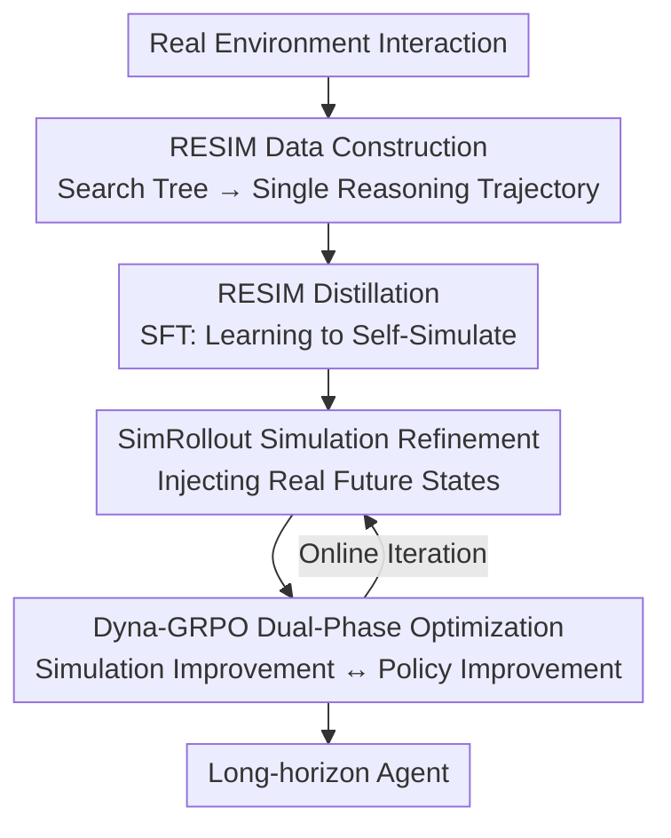

# Dyna-Mind: Learning to Simulate from Experience for Better AI Agents

**Conference**: ICLR2026  
**OpenReview**: [https://openreview.net/forum?id=F848aPzCJy](https://openreview.net/forum?id=F848aPzCJy)  
**Code**: https://github.com/jasonyux/Dyna-Mind  
**Area**: LLM Agent / Reinforcement Learning / World Models  
**Keywords**: Agents, Mental Simulation, Long-horizon Tasks, GRPO, World Models

## TL;DR
Dyna-Mind teaches (V)LM agents to perform mental simulations of future states before acting by "compressing real environment search trees into reasoning trajectories" (RESIM). It then employs Dyna-GRPO, which feeds "ground-truth future states" back into online RL to reinforce simulation capabilities, significantly outperforming GRPO/RLOO and Dyna-Think on Sokoban, ALFWorld, and AndroidWorld.

## Background & Motivation
**Background**: Reasoning models (e.g., DeepSeek-R1) have achieved expert-level performance on "one-shot" problems like mathematics and programming by expanding long-chain reasoning before acting. Naturally, researchers seek to apply this to agent tasks requiring multi-step interaction, such as web navigation and mobile/PC operations.

**Limitations of Prior Work**: The performance of reasoning models drops sharply on long-horizon tasks. Empirical tests show that while DeepSeek-R1 is nearly perfect on the structured Sokoban (96.6% success rate), it falls to 62.5% on the complex ALFWorld. Notably, the "simulation score" (the accuracy of the model's predicted next state) is highly correlated with the success rate ($r\approx0.7\text{-}0.96$). In other words, models fail not due to a lack of reasoning capacity, but because their **internal world models are inaccurate**, leading to divergent simulations.

**Key Challenge**: Success in long-horizon tasks depends on the agent's ability to construct an accurate "world model"—mentally simulating "what the environment will become if I take this action" without execution, known in neuroscience as "vicarious trial and error." Existing solutions have flaws: Dyna-Think distills synthetic data from DeepSeek-R1 which contains inherent errors, while classical Dyna approaches train independent world models, resulting in modular systems where reasoning and simulation are decoupled.

**Goal**: Internalize simulation capabilities **within the agent's own reasoning process** without relying on stronger teacher models or independent world models, enabling continuous online reinforcement of these skills.

**Key Insight**: Instead of letting strong models "hallucinate" synthetic simulation data, it is more effective to extract reliable future states from **real environment interactions**. Paths taken during actual rollouts provide ground-truth world dynamics, serving as supervision signals free from fabrication.

**Core Idea**: A two-stage training process: Stage 1 involves SFT (RESIM) to compress real search trees into "reasoning trajectories with simulation," teaching the model to generate mental rollouts. Stage 2 utilizes Dyna-GRPO to feed actual future states back into RL, refining simulation and decision-making online.

## Method

### Overall Architecture
Dyna-Mind aims to enable a (V)LM agent to simulate multiple future steps during reasoning and select optimal actions in long-horizon tasks. The process is split into two sequential training stages: **Stage 1: RESIM** initializes simulation capabilities by building search trees from real interactions and aggregating them into coherent reasoning responses $a^{\text{ReSim}}$ using a general LLM for SFT. **Stage 2: Dyna-GRPO** performs online reinforcement by feeding real future states into the RL rollout to refine simulations, optimizing both decision-making and simulation via a modified GRPO.

The task is modeled as a Markov Decision Process $(\mathcal{S},\mathcal{A},\mathcal{T},\mathcal{R})$: an agent $\pi_\theta$ at state $s_t$ generates an action $a_t\sim\pi_\theta(\cdot|s_t)$, the environment transitions to $s_{t+1}\sim\mathcal{T}(s_t,a_t)$, and a reward $r_T$ is provided upon termination. The key convention is that **any text regarding "simulating the future" is part of the action $a_t$** (simulation is embedded in reasoning), while $s$ denotes ground-truth states from the environment.

### Key Designs

**1. RESIM Data Construction: Compressing Search Trees into "Simulated" Reasoning Trajectories**

Addressing the weakness of Dyna-Think—where synthetic data contains errors—RESIM derives supervision signals from real interactions. Given a state $s$, a rollout model $\pi_\theta$ performs a Depth-First Search (DFS) to generate $b$ partial rollouts of depth $d$. A value function $V_\nu$ scores each rollout. Finally, a general (V)LM aggregates the tree into a single response $a^{\text{ReSim}}$ by summarizing each rollout (containing **real future states**) and chaining them into coherent reasoning to select the best plan. This ensures simulations are faithful to world dynamics.

**2. RESIM Distillation: Internalizing Simulation Capabilities**

Each $a^{\text{ReSim}}$ encodes an entire search tree. RESIM uses $a^{\text{ReSim}}$ as the target for SFT. Given a trajectory $\tau=\{s_0,a^{\text{ReSim}}_0,s_1,a^{\text{ReSim}}_1,\cdots\}$, the model is trained to **directly output $a^{\text{ReSim}}_t$** when observing state $s_t$ and history $h$, eliminating the need for search algorithms during inference. This internalizes expensive multi-module simulation into a single forward pass. This method produces tokens at $1/11$ the volume of DISTILL(R1) while outperforming it in ALFWorld.

**3. SimRollout: Refining Simulation with Ground-Truth Future States**

Online reinforcement is challenging because standard RL (like GRPO) provides only a scalar reward $R_T$, lacking direct signals for simulation accuracy. SimRollout generates this signal: at each state $s_t$, the agent samples $a\sim\pi_\theta(\cdot|s_t)$, extracts the action plan $\{\hat a_1,\cdots,\hat a_d\}$, and executes them in the environment to obtain **real next states** $\{s'_{t+1},\cdots,s'_{t+d}\}$. These are appended back to the prompt $s_t^{\text{refine}}\equiv\{s_t\oplus a\oplus s'_{t+1}\oplus\hat a_2\oplus\cdots\}$ to let the model generate a refined response $a^{\text{refine}}$.

**4. Dyna-GRPO: Alternating Optimization between "Simulation" and "Policy"**

Following Dyna principles, Dyna-GRPO alternates between two iterations. In the **Simulation Improvement phase**, SimRollout is used to obtain refined trajectories $\tau'_{\text{refine}}$. A special advantage is used to reinforce the refinement: a reward of 1.0 is given only if the refined trajectory is **both correct and yields a higher reward** than the mean of the standard and refined rollouts:

$$A_{\text{refine}}(\tau^{(i)}_{\text{refine}})=\begin{cases}1.0,&\text{if }\tau^{(i)}_{\text{refine}}\text{ is correct and }R(\tau^{(i)}_{\text{refine}})>\max(\bar R,\bar R_{\text{refine}})\\0.0,&\text{otherwise}\end{cases}$$

In the **Policy Improvement phase**, standard rollouts without future states are performed, and the model is optimized via standard GRPO to integrate learned simulation capabilities into decision-making.

### Loss & Training
The RL backbone is the GRPO objective $J_{\text{GRPO}}$, using the importance sampling ratio $\rho_\theta(a)=\frac{\pi_\theta(a|s)}{\pi_{\theta_{\text{ref}}}(a|s)}$ and KL regularization $\beta D_{KL}(\pi_\theta\|\pi_{\theta_{\text{ref}}})$. Episode-level advantages are normalized within the group:

$$A_{\text{GRPO}}(\tau^{(i)})=\frac{R(\tau^{(i)})-\text{mean}(\{R(\tau^{(j)})\}_{j=1}^G)}{\text{std}(\{R(\tau^{(j)})\}_{j=1}^G)}$$

Reward design: $-0.1$ for non-terminal steps, $10.0$ for success at termination, and $0.0$ for failure. Models used include Qwen2.5-7B-Instruct (text) and Qwen2.5-VL-7B/32B-Instruct (AndroidWorld).

## Key Experimental Results

### Main Results
Text-based games (Sokoban / ALFWorld, based on Qwen2.5-7B-Instruct, average of 3 runs):

| Method | Gen.Token | Sokoban AVG | ALFWorld AVG |
|------|-----------|-------------|--------------|
| REACT(DeepSeek-R1) | 14.5x | 96.6 (ID only) | 62.5 (ID only) |
| RESIM (at inference) | 2.0x | 96.4 (ID only) | 87.7 (ID only) |
| Dyna-Think | 24.2x | 65.8 | 58.9 |
| DISTILL(RESIM) (Stage 1) | 2.0x | 63.7 | 74.1 |
| DISTILL(RESIM)+GRPO | 2.1x | 73.1 | 87.0 |
| **DISTILL(RESIM)+DYNA-GRPO** | 1.9x | **77.1** | **90.8** |

AndroidWorld (Qwen2.5-VL, average of 3 runs):

| Method | ID | OOD | AVG |
|------|----|----|-----|
| REACT(Qwen2.5-VL-72B) | 19.5 | - | - |
| RESIM (at inference) | 34.4 | - | - |
| DISTILL-32B(RESIM) | 32.8 | 15.6 | 24.2 |
| DISTILL-32B(RESIM)+GRPO | 35.3 | 20.3 | 27.8 |
| **DISTILL-32B(RESIM)+DYNA-GRPO** | 40.7 | 22.9 | **31.8** |

### Ablation Study / Simulation Capability Analysis
Simulation Score (Sim Score $\in[0,1]$, judged by Qwen3-235B by comparing "hallucinated" vs ground-truth future states):

| Method | Sokoban Succ / Sim | ALFWorld Succ / Sim |
|------|--------------------|---------------------|
| REACT(DeepSeek-R1) | 96.6 / 0.93 | 62.5 / 0.36 |
| RESIM | 96.4 / 1.00 | 87.7 / 1.00 |
| DISTILL(RESIM) | 71.9 / 0.62 | 78.9 / 0.37 |
| DISTILL(RESIM)+GRPO | 79.1 / 0.62 | 87.0 / 0.38 |
| **DISTILL(RESIM)+DYNA-GRPO** | 82.5 / **0.67** | 92.5 / **0.43** |

### Key Findings
- **Simulation accuracy is the bottleneck for long-horizon tasks**: DeepSeek-R1's Sim Score in ALFWorld is only 0.36, which limits success. RESIM achieves high performance in both environments due to high Sim Scores.
- **Dyna-GRPO improves both success and simulation accuracy**: Unlike GRPO, it raises the Sim Score (e.g., ALFWorld 0.38→0.43), indicating that performance gains stem from better simulation rather than reward hacking.
- **Efficiency**: DISTILL(RESIM) outputs 1/11 the tokens of R1. Dyna-GRPO maintains generation length at approximately 2x the base model, avoiding performance gains at the cost of excessive reasoning length.
- **AndroidWorld bounded by base model**: Performance reached 34.4% in real mobile environments; errors were attributed to Qwen2.5-VL-72B's inability to fully understand some GUI elements.

## Highlights & Insights
- The **"Real Search Tree → Single Reasoning" distillation** is elegant, compressing expensive multi-module search into a single forward pass while using real data to bypass synthetic biases.
- **SimRollout uses future states as trainable supervision signals**, addressing the lack of feedback for simulation quality in standard scalar-reward RL.
- **Causal Analysis**: The authors analyze "Sim Score" to prove that performance improvements are rooted in simulation accuracy, providing a rigorous chain of reasoning.

## Limitations & Future Work
- **Base model dependency**: Success in AndroidWorld is limited by the GUI comprehension of the rollout model.
- **Cost of RESIM data construction**: Building search trees is time-intensive (15-20 min per AndroidWorld episode), leading the authors to use prompting instead of training value functions for some tasks.
- **Search constraints**: Current implementation is restricted to DFS and agent-environment interaction.
- **Simulation depth**: The depth $d$ is capped at 5 for training stability, which might be insufficient for very long-range dependencies.

## Related Work & Insights
- **vs Dyna-Think**: Dyna-Think distills synthetic simulations from DeepSeek-R1 (with R1's biases) and uses separate predictors. Dyna-Mind derives supervision from real trees, skips independent world models, and consumes an order of magnitude fewer tokens.
- **vs Classical Dyna**: Classical Dyna separates the world model and policy. Dyna-Mind internalizes simulation into the agent's reasoning, sharing parameters for simulation and decision-making.
- **vs Search/Multi-agent**: These methods incur high overhead during inference. Dyna-Mind distills the benefits of search into a single (V)LM, requiring no search algorithms at test time.

## Rating
- Novelty: ⭐⭐⭐⭐⭐ Distilling real search trees and feeding future states into RL are both novel and complementary.
- Experimental Thoroughness: ⭐⭐⭐⭐ Extensive analysis in text and real environments; AndroidWorld scale limited by compute.
- Writing Quality: ⭐⭐⭐⭐⭐ Logical flow from neuroscience motivation to dual-stage methodology.
- Value: ⭐⭐⭐⭐⭐ Provides a reusable paradigm for internalizing and reinforcing simulation in long-horizon agents.

<!-- RELATED:START -->

## Related Papers

- [\[ICLR 2026\] Scaling Agent Learning via Experience Synthesis](scaling_agent_learning_via_experience_synthesis.md)
- [\[CVPR 2026\] Learning to Select Visual Tools from Experience](../../CVPR2026/llm_agent/learning_to_select_visual_tools_from_experience.md)
- [\[ICLR 2026\] Dancing in Chains: Strategic Persuasion in Academic Rebuttal via Theory of Mind](dancing_in_chains_strategic_persuasion_in_academic_rebuttal_via_theory_of_mind.md)
- [\[ICML 2026\] Skill-Pro: Learning Reusable Skills from Experience via Non-Parametric PPO for LLM Agents](../../ICML2026/llm_agent/skill-pro_learning_reusable_skills_from_experience_via_non-parametric_ppo_for_ll.md)
- [\[ICML 2026\] Closing the Feedback Loop: From Experience Extraction to Insight Governance in Verbal Reinforcement Learning](../../ICML2026/llm_agent/closing_the_feedback_loop_from_experience_extraction_to_insight_governance_in_ve.md)

<!-- RELATED:END -->
