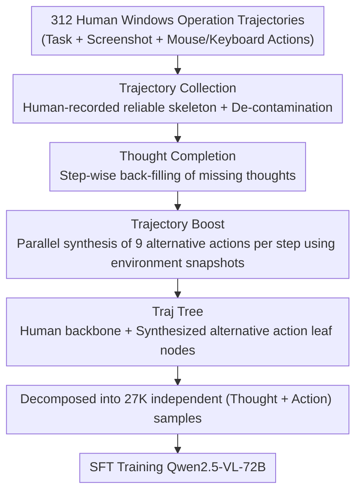

# Efficient Agent Training for Computer Use

**Conference**: ICLR 2026  
**arXiv**: [2505.13909](https://arxiv.org/abs/2505.13909)  
**Code**: [https://github.com/GAIR-NLP/PC-Agent-E](https://github.com/GAIR-NLP/PC-Agent-E)  
**Area**: Agent  
**Keywords**: computer use agent, trajectory augmentation, data efficiency, GUI agent, SFT

## TL;DR
PC Agent-E utilizes only 312 human-annotated Windows operation trajectories. Through the Trajectory Boost method, it prompts Claude 3.7 Sonnet to synthesize diverse alternative action decisions at each time step. The trained Qwen2.5-VL-72B achieves a 141% relative improvement on WindowsAgentArena-V2, even surpassing the teacher model Claude 3.7 Sonnet by 10%.

## Background & Motivation

**Background**: Computer use agents represent a critical direction in current AI, aiming to enable models to operate computers through GUIs (clicking, typing, navigation) like humans. Current mainstream solutions are divided into modular multi-agent workflows and native agent models; the latter (e.g., Claude Computer Use, OpenAI Operator) has become the dominant paradigm due to its flexibility and optimizability.

**Limitations of Prior Work**: Open-source models significantly lag behind closed-source systems (Claude 3.7 Sonnet) in computer use tasks. The core bottleneck lies in the **extreme scarcity of high-quality trajectory data**. Existing data synthesis methods either rely on large-scale human annotation or sample full trajectories via end-to-end distillation from strong models, the latter suffering from error accumulation and slow speeds (requiring online interaction with VM environments).

**Key Challenge**: How to maximize computer use capability with minimal human-annotated data? Direct training on human trajectories yields limited results (single paths), while direct distillation is inefficient and unstable in quality (900 hours vs. 3 hours).

**Goal**: (a) How to efficiently utilize a tiny amount of human data? (b) How to avoid error accumulation in end-to-end distillation? (c) How to bring open-source models to closed-source performance levels?

**Key Insight**: Inspired by data synthesis in reasoning models like DeepSeek-R1, the authors observe that computer use tasks naturally possess multiple valid paths—multiple reasonable action choices can exist at the same time step. Thus, human trajectories can serve as environment snapshots, allowing strong models to synthesize alternative actions at each step offline without requiring online environment interaction.

**Core Idea**: Utilize environment snapshots from human trajectories as anchors, allowing frontier models to synthesize diverse action decisions offline at each step to augment trajectory data, achieving data-efficient training.

## Method

### Overall Architecture
This paper addresses the gap where open-source computer use agents lag far behind closed-source systems like Claude. The most direct way to close this gap—stacking high-quality trajectory data—is hindered by annotation costs and distillation inefficiency. The Mechanism of PC Agent-E is "minimal human trajectories + single-step offline augmentation": first, two annotators record 312 authentic Windows operation trajectories as reliable skeletons. Then, the missing cognitive processes (thoughts) are back-filled for each step. Subsequently, a frontier model synthesizes multiple alternative actions offline at each time step to "grow" a single trajectory into a Trajectory Tree (Traj Tree). Finally, all nodes in the tree are decomposed into independent samples to train Qwen2.5-VL-72B. During inference, the model operates in a ReAct paradigm: inputs are the current screenshot, task description, and history, while outputs are "thought + action" pairs.

### Key Designs

**1. Trajectory Collection: Exchanging natural correctness of human task completion for high-quality skeletons without verification**

Data scarcity is the core bottleneck. The authors respond not with large-scale annotation, but by recording a small batch ensured to be correct. Two annotators used the PC Tracker tool on Windows to complete 312 tasks. Recordings include task descriptions, screenshot sequences, and human keyboard/mouse actions. The action space $\mathcal{A}$ covers 11 operations: click, right click, double click, drag, scroll, press key, hotkey, type text, wait, finish, and fail. Annotators could discard unsatisfactory trajectories or modify task descriptions at any time. Since tasks were completed by humans, the correctness is naturally guaranteed without extra verification, costing only one day for two people. To prevent evaluation leakage, de-contamination was performed using 13-gram overlap and semantic similarity (threshold 0.85) to filter samples too close to the test set.

**2. Thought Completion: Back-filling reasoning for action-only human trajectories for ReAct training**

Human-recorded trajectories contain actions but lack reasoning. To train an agent in the ReAct paradigm, "thought + action" pair supervision is necessary. This step restores the missing thoughts. For each action in a trajectory, the authors provide the task description, historical actions with reconstructed thoughts, the current action, and the corresponding screenshot to Claude 3.7 Sonnet to back-derive the reasoning process. Completion is performed iteratively—the context of later steps includes the reconstructed thoughts of previous steps to maintain reasoning coherence across the trajectory. Once completed, the trajectories can be used for training and provide necessary historical context for the subsequent Trajectory Boost.

**3. Trajectory Boost: Anchoring environment states with human trajectories to expand single paths into trees via offline synthesis**

This is the central innovation, targeting the pain points of "slow online interaction and multi-step error accumulation" in end-to-end distillation. Observing that computer use tasks possess multiple valid paths at each step, the authors treat each step of a human trajectory as an environment snapshot $\langle T, o_k, h_k \rangle$ (task description, current observation screenshot, historical context). These snapshots are fed into Claude 3.7 Sonnet to sample 9 single-step action decisions $(t'_k, a'_k)$ in parallel. Thus, each human trajectory grows into a **Traj Tree**: the human trajectory serves as the backbone, while synthesized alternative actions become leaf nodes. Compared to end-to-end distillation, this design achieves three things: first, each environment state is anchored by human trajectories, ensuring the model only decides the current step without deviating due to its own errors, fundamentally avoiding error accumulation. Second, synthesis is offline and does not interact with a real VM environment, allowing for natural parallelization roughly 300x faster than online distillation (3h vs. 900h). Third, it captures both the **authenticity** of human trajectories and the **diversity** of frontier models, providing more information than a single human path or pure distillation samples.

### Loss & Training
- Training is based on Qwen2.5-VL-72B using standard SFT loss.
- Each action node on the Traj Tree (both human and synthesized) is converted into an independent training sample.
- Training sample format directly corresponds to the inference scaffold: Input consists of screenshot + task description + history; Output consists of thought + action.
- Historical context for all synthesized nodes contains only the preceding steps of the backbone (human trajectory) to maintain consistency.
- 312 trajectories ultimately generate 27K training samples with an image resolution of 1280×720 and a context length of 8192.

## Key Experimental Results

### Main Results

| Model | LibreOffice | Chrome | Edge | System | VS Code | VLC | Utils | Total |
|------|-------------|--------|------|--------|---------|-----|-------|-------|
| GPT-4o | 0.0 | 5.9 | 0.0 | 8.3 | 0.0 | 0.0 | 0.0 | 2.1 |
| Qwen2.5-VL-72B | 0.0 | 34.7 | 15.4 | 20.8 | 26.3 | 7.6 | 16.7 | 14.9 |
| UI-TARS-72B-DPO | 0.0 | 40.6 | 38.5 | 58.3 | 36.8 | 7.6 | 25.0 | 26.2 |
| Claude 3.7 Sonnet | 2.4 | 46.5 | 61.5 | 54.2 | 52.6 | 29.0 | 16.7 | 32.6 |
| Claude 3.7 (thinking) | 2.4 | 64.1 | 46.2 | 66.7 | 52.6 | 21.9 | 25.0 | 35.4 |
| **PC Agent-E** | **4.8** | **64.1** | 46.2 | 50.0 | **57.9** | **35.7** | **33.3** | **36.0** |

PC Agent-E shows a 141% relative improvement over Qwen2.5-VL-72B, surpassing Claude 3.7 Sonnet by 10%.

### Ablation Study

| Method | Data Size | WindowsAgentArena-V2 (%) | Note |
|------|--------|--------------------------|------|
| Base (Qwen2.5-VL-72B) | 0 | 14.9 | Baseline |
| Human only (s=1) | 2.7K | 17.2 | Human trajectories only |
| Direct Distillation (s=10) | 3120 traj | ~28 | End-to-end distillation |
| Trajectory Boost (s=10) | 27K | **36.0** | Ours |

### Key Findings
- **Trajectory Boost significantly outperforms human data alone**: As the scaling factor $s$ increases from 1 to 10, performance jumps from 17.2 to 36.0, whereas using human trajectories alone only reaches 17.2.
- **Superior to direct distillation**: At equivalent data scales, Trajectory Boost outperforms Direct Distillation by approximately 8 percentage points and is 300x more time-efficient (3h vs. 900h).
- **Cross-platform generalization**: PC Agent-E achieves a 34% relative improvement (4.4% → 10.9%) on the Linux-based OSWorld, despite all training data originating from Windows.
- **Gains primarily from planning ability**: Qualitative analysis shows the trained model produces longer thinking processes, with significantly enhanced self-correction and verification capabilities, though knowledge and grounding abilities showed no significant improvement.
- **Infeasible Hacking phenomenon**: Weaker models scored higher on infeasible tasks (Qwen 86.7% vs. PC Agent-E 63.3%), suggesting vulnerabilities in current evaluation frameworks.

## Highlights & Insights
- **Single-step offline synthesis vs. End-to-end online distillation**: This is a clever insight—computer use tasks naturally have multiple valid paths. Using human trajectories to anchor environment states for single-step synthesis avoids error accumulation and achieves 300x acceleration.
- **Extreme data efficiency**: 312 trajectories → 27K samples → surpassing the teacher model. This demonstrates that high-quality, diverse supervision is more important than large-scale low-quality data.
- **Evaluation improvements for WindowsAgentArena-V2**: Fixes for evaluation dependencies, infeasible hacking, and VM state instability provide independent value to the community.
- **Transferable Traj Tree structure**: This approach is applicable to any snapshot-based sequential decision-making task (e.g., web navigation, mobile GUI, robotics) where multiple valid paths exist at each step.

## Limitations & Future Work
- **Limited coverage with only 312 trajectories**: Data is concentrated in Chrome and system settings; performance in complex scenarios like LibreOffice remains weak (4.8%).
- **Underutilization of image history**: Inference only uses the current screenshot. Authors acknowledge that incorporating visual history could be beneficial.
- **Unresolved knowledge and grounding bottlenecks**: Improvements mostly come from planning; the model still struggles with tasks requiring specific software knowledge (e.g., VLC functions) or precise grounding.
- **Unverified synthesized actions**: Actions in Trajectory Boost are "plausible" but not actually executed in a real environment, potentially containing non-executable steps.
- **SFT only, no RL**: Combining with RL (e.g., GRPO + environment rewards) might yield further improvements.

## Related Work & Insights
- **vs. UI-TARS**: UI-TARS uses large-scale multi-step trajectories. PC Agent-E proves that minimal data combined with intelligent augmentation can surpass large-scale data solutions.
- **vs. Direct Distillation**: End-to-end distillation requires online interaction, suffers from error accumulation, and is 300x slower. Trajectory Boost is offline, parallelizable, and of higher quality.
- **vs. Self-Play/Self-Improvement**: Self-improvement requires strong base capabilities. PC Agent-E leverages human trajectories as a foundation, avoiding cold-start issues.

## Rating
- Novelty: ⭐⭐⭐⭐ The Trajectory Boost idea is elegant, though essentially utilizes human anchors and strong models for synthesis.
- Experimental Thoroughness: ⭐⭐⭐⭐⭐ Comprehensive comparisons with baselines, full ablations, cross-platform generalization, test-time scaling, and qualitative analysis.
- Writing Quality: ⭐⭐⭐⭐⭐ Clear structure, excellent figures, and logical motivation.
- Value: ⭐⭐⭐⭐ Provides significant reference for data-efficient training of GUI agents; the 300x speedup and outperforming the teacher model are impressive.

<!-- RELATED:START -->

## Related Papers

- [\[ICLR 2026\] SCUBA: Salesforce Computer Use Benchmark](scuba_salesforce_computer_use_benchmark.md)
- [\[ICLR 2026\] VideoAgentTrek: Computer Use Pretraining from Unlabeled Videos](videoagenttrek_computer-use_pretraining_from_unlabeled_videos.md)
- [\[ICLR 2026\] ScaleCUA: Scaling Open-Source Computer Use Agents with Cross-Platform Data](scalecua_scaling_open-source_computer_use_agents_with_cross-platform_data.md)
- [\[ICLR 2026\] Grounding Computer Use Agents on Human Demonstrations](grounding_computer_use_agents_on_human_demonstrations.md)
- [\[ICLR 2026\] R-WoM: Retrieval-augmented World Model for Computer-use Agents](r-wom_retrieval-augmented_world_model_for_computer-use_agents.md)

<!-- RELATED:END -->
