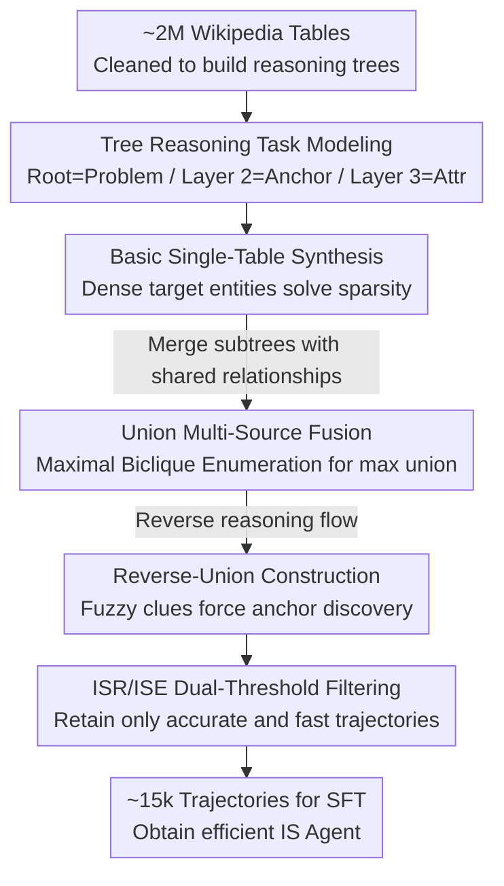

# Empowering Efficiency and Efficacy in WebAgent via Enabling Info-Rich Seeking

**Conference**: ICLR2026  
**OpenReview**: [https://openreview.net/forum?id=MVFGY1nS6b](https://openreview.net/forum?id=MVFGY1nS6b)  
**Code**: To be confirmed  
**Area**: LLM Agent / Information Seeking Agent  
**Keywords**: Information Seeking, Web Agent, Data Synthesis, Search Efficiency, Trajectory Filtering

## TL;DR
WebLeaper reformulates Information Seeking (IS) tasks as "tree-based reasoning," utilizes Wikipedia tables to synthesize "target-entity-dense" training tasks in bulk (with Basic, Union, and Reverse-Union variants), and employs ISR/ISE metrics to filter out low-coverage and inefficient trajectories. This enables 30B-scale open-source Web Agents to achieve open-source SOTA performance in both completeness and efficiency across five deep-search benchmarks.

## Background & Motivation
**Background**: LLM-based agents treat Information Seeking (IS) as a core capability. Given a complex natural language question, an agent iteratively performs "thought → tool call (search/visit) → observation" within a ReAct framework to collect the entities required for an answer. Commercial systems like OpenAI Deep Research, Gemini, Perplexity, and Kimi-Researcher are built upon this capability.

**Limitations of Prior Work**: Previous work has largely focused on "search depth" (more complex QA pipelines, stronger fine-tuning strategies) while neglecting "search efficiency." The authors' preliminary experiments reveal a striking figure: for a competitive IS agent, the distribution of effective actions (actions that actually retrieve target entities needed for the answer) peaks near only $0.04$. This implies that in most cases, the vast majority of actions are wasted, manifesting as redundant query reformulations, repeated crawling of irrelevant information, and excessively long search chains. Inefficiency not only consumes computational resources and time but also directly degrades the final success rate.

**Key Challenge**: The root of inefficiency lies in the design of training tasks. In typical IS tasks, "target entities" are too sparse—a single question may only have one or two final answers. This sparsity leads to two cascading problems: first, agents lack opportunities to practice "quickly locating useful information within a limited context," learning only loose search strategies; second, it biases efficiency measurements (fewer target entities result in higher variance in efficiency estimation), making training signals unreliable for systematically learning "efficient search."

**Goal**: The problem is decomposed into two sub-problems: (1) how to construct "target-entity-dense" IS tasks; and (2) how to generate "accurate and fast" trajectories for training supervision.

**Key Insight**: The authors observe that structured tables in Wikipedia naturally represent "a set of entities connected by specific relationships," which can be organized into a reasoning tree to pack a large number of target entities into a limited context. The tree structure is both compact and hierarchical, directly addressing the "entity sparsity" issue.

**Core Idea**: Reformulating IS tasks through "tree reasoning," synthesizing high-density tasks in bulk using Wikipedia tables, and filtering trajectories via dual ISR/ISE metrics—forcing the model to learn efficient search within an "entity-dense" environment.

## Method

### Overall Architecture
WebLeaper is a **data synthesis framework** that does not modify the agent architecture itself but produces superior training data to SFT a base model (specifically, Qwen3-30B-A3B-Thinking). Its input consists of approximately 2 million crawled Wikipedia tables, and its output is roughly 15k "accurate and efficient" trajectories for SFT.

The pipeline consists of two main stages: **Entity-Dense Task Synthesis** (QA synthesis), which transforms tables into tasks with dense target entities across three progressive difficulty variants—Basic (single-table reasoning tree), Union (merging subtrees with shared relationships), and Reverse-Union (reversing the reasoning flow to force anchor entity discovery from fuzzy clues); and **Information-Guided Trajectory Construction**, which uses an open-source model to generate ReAct trajectories and filters out low-quality ones using ISR (coverage) and ISE (efficiency) thresholds.

The task modeling utilizes a three-layer tree structure: the root is the **problem entity** (the topic extracted from the table title, e.g., "Nobel Prize in Literature"), the second layer contains **anchor entities / primary keys** (e.g., a winner like "Czesław Miłosz"), and the third layer contains **attributes** of those entities (e.g., country: Poland, year: 1980). The question provides the root, and the answer requires finding all second- and third-layer entities—naturally creating dozens of target entities per task.

### Key Designs

**1. Tree Reasoning Task Modeling: Transforming "Sparse" to "Dense"**
The pain point is that traditional tasks have only one or two target entities, preventing models from learning efficient search and making efficiency metrics noisy. The authors formalize the IS process as a reasoning tree $T_i$: nodes are entities and edges are relationships. An agent starts from known entities and follows edges to targets. The compact structure allows for many target nodes. Formally, a task is $T=\langle q, R\rangle$, where $q$ is the query and $R\subset E$ is the set of all target entities—crucially, $R$ includes all essential intermediate entities. This step is the foundation: only when $|R|=n$ is sufficiently large does the efficiency signal become stable (see variance analysis in Design 4).

**2. Basic Single-Table Synthesis: Creating Dense Trees from One Table**
To solve sparsity directly, constructing dense tasks using traditional "one entity at a time" methods is prohibitively expensive. The authors instead leverage Wikipedia tables, which are inherently groups of related entities. After multi-stage cleaning of ~2M tables to retain large, regular, and homogeneous ones, trees are built: the table title serves as the root (problem entity); LLMs select a representative, non-redundant column (usually the primary key) as the second-layer entities; and other column values serve as third-layer attributes. Each second-layer entity and its attributes form a subtree $S_{i,j}$, and the complete tree is $T_i=\{S_{i,j}\}$. One table can thus generate a dense task with dozens of target entities.

**3. Union Multi-Source Fusion: Forcing Cross-Source Integration**
Since Basic trees come from a single source, their structures are simple. Union creates complex cross-source structures by merging multiple trees with **similar themes and structures**. To avoid semantically nonsensical merges, finding mergeable tree groups is formalized as **Maximal Biclique Enumeration**, discovering "maximal unions" to avoid the exponential explosion of all combinations. Intuitively, a "Nobel Prize" tree and a "Booker Prize" tree both contain "Author → (nationality / name)" relationships. The algorithm identifies this shared structure, discards non-shared relationships (e.g., gender), and uses an LLM to generate queries like "Which authors won both the Nobel and Booker prizes?"—requiring the agent to find two sets of intermediate entities before intersecting them.

**4. Reverse-Union Construction + ISR/ISE Metrics: Blocking Shortcuts and Providing Reliable Signals**
Union still allows "keyword shortcuts" where an agent might search for lists directly and intersect them without true reasoning. Reverse-Union blocks this via two steps: **Deductive Fuzz**, where the problem entity is defined by layer-3 attributes rather than a name (e.g., "The 1980s winner who wrote about boys on a desert island" instead of William Golding), forcing the agent to infer the anchor entity; and **Union-based Search Construction**, where a layer-3 attribute is chosen as a pivot (e.g., nationality) to launch new searches. Target entities are those sharing the pivot and meeting the original intersection criteria. This makes the anchor entity a bridge, rendering keyword shortcuts ineffective.

Filtering uses two custom metrics. **ISR (Information-Seeking Rate)** measures completeness: $\text{ISR}=\frac{|R\cap O|}{|R|}=\frac{|R\cap O|}{n}$, where $O$ is the set of retrieved entities. **ISE (Information-Seeking Efficiency)** measures entities found per step: $\text{ISE}=\frac{n}{T}$, where $T$ is the total step count. The authors prove (**Proposition 1**) that if $X_i$ (steps per new entity) are i.i.d. with finite mean and variance, then $\mathrm{Var}(\text{ISE})=O\!\left(\frac{1}{n}\right)$—meaning more target entities lead to more stable ISE measurements. This creates a closed loop where dense tasks make ISE a reliable signal, which then filters for high-density trajectories. Filtering thresholds are set at $\text{ISR}>\alpha$ (0.3) and $\text{ISE}>\beta$ (0.1). Note that ISE only counts entities from **Visit** actions, as **Search** results are often updated by subsequent visits.

### Loss & Training
Standard SFT is used without RL. To maintain basic deep-search capabilities, WebLeaper data is mixed with 5,000 WebSailor-V2 samples. The base model is Qwen3-30B-A3B-Thinking-2507, trained using the Megatron framework. Approximately 15k samples were trained on 64 H20 GPUs for 6–8 hours. The toolset includes **Search** (queries, year filter) and **Visit** (URL, goal).

## Key Experimental Results

### Main Results
Evaluation on five benchmarks (BrowseComp, GAIA, xbench-DeepSearch, Seal-0, WideSearch). Pass@1 is reported except for WideSearch (SR, Row F1, Item F1). Bold indicates highest open-source score.

| Model / Framework | BrowseComp | GAIA | xbench-DS | Seal-0 | WideSearch SR |
|--------|------|------|------|------|------|
| Claude-4-Sonnet (Closed) | 12.2 | 68.3 | 64.6 | – | 2.3 |
| OpenAI-o3 (Closed) | 49.7 | 70.5 | 66.7 | 18.9 | 4.5 |
| Kimi-K2-Instruct-1T | 14.1 | 57.7 | 50.0 | – | 1.1 |
| WebSailor-32B | 10.5 | 53.2 | 53.3 | 21.3 | 0.0 |
| WebShaper-QwQ-32B | – | 53.3 | 35.0 | – | 0.0 |
| **WebLeaper-Union** | 22.1 | **69.9** | 62.3 | 35.1 | **4.0** |
| **WebLeaper-Reverse-Union** | **23.0** | 67.0 | **66.0** | **37.2** | **4.0** |

WebLeaper consistently outperforms open-source rivals across all five benchmarks. On BrowseComp, the 30B model (23.0) significantly beats the 1T Kimi-K2 (14.1). On GAIA, xbench-DS, and Seal-0, it rivals or exceeds systems based on Claude-4-Sonnet / OpenAI-o3. Despite using Wikipedia-only training data, it improves on live web benchmarks, suggesting it learns generalizable search skills rather than Wikipedia over-fitting.

### Ablation Study
Data source ablation (values in parentheses show gain/loss relative to "WebSailor-V2-5k only"; † denotes mixture with WebSailor-V2-5k):

| Data Source | BrowseComp | WideSearch | GAIA | Seal-0 | xbench-DS | Avg. |
|------|------|------|------|------|------|------|
| WebSailor-V2-5k | 25.17 | 33.15 | 67.69 | 34.23 | 60.00 | 44.05 |
| Basic-5k† | 20.67 (-4.50) | 32.26 (-0.89) | 40.78 (-26.91) | 30.03 (-4.20) | 58.33 (-1.67) | 36.41 (-7.64) |
| Union-5k† | 27.50 (+2.33) | 41.70 (+8.55) | 69.90 (+2.21) | 35.14 (+0.82) | 62.33 (+2.33) | 47.31 (+3.26) |
| Reverse-Union-10k† | 27.67 (+2.50) | 44.07 (+10.92) | 66.99 (-0.70) | 37.24 (+3.01) | 66.00 (+6.00) | 48.39 (+4.34) |

### Key Findings
- **Basic data alone leads to performance drops** (Avg -7.64, GAIA -26.91): Single-table tasks are too simple; models learn superficial shortcuts, harming generalization. This reinforces the necessity of Union/Reverse-Union for cross-source complexity.
- **Union provides broad improvements** (Avg +3.26): Merging heterogeneous sources forces reasoning across complementary evidence.
- **Reverse-Union yields the highest gain** (Avg +4.34, WideSearch +10.92, xbench-DS +6.00): Reversing the flow adds reasoning complexity, preventing the model from identifying the starting point easily and strengthening planning.
- **Joint ISR+ISE filtering is optimal**: Using either metric alone is less effective than both; the combined constraint generates trajectories that are both targeted and concise.

## Highlights & Insights
- **Decomposition of efficacy and efficiency**: Separating "completeness" and "speed" into measurable, provable metrics (ISR and ISE). The variance analysis $\mathrm{Var}(\text{ISE})=O(1/n)$ transforms the rationale for "dense tasks" from intuition into mathematical necessity.
- **Bulk synthesis via Wikipedia + Tree Modeling**: Avoids the high cost of manual dense task construction. This approach is transferable to any agent training requiring intermediate supervision.
- **Maximal Biclique Enumeration as a Merger**: Formalizing the discovery of mergeable multi-source tasks through graph theory is key to creating *better* rather than just *more* data.
- **Adversarial data construction**: Reverse-Union is specifically designed to block "keyword shortcuts," reflecting a sophisticated strategy of anticipating and preventing agent "laziness."

## Limitations & Future Work
- **SFT Only**: While data quality is high, IS is a sequential decision problem. Incorporating RL (using ISR/ISE as rewards) could further amplify efficiency gains.
- **Dependency on semi-structured Wikipedia tables**: The construction relies on "entity-relationship" structures. It remains unclear how to build such trees in domains without clean tables (e.g., raw scientific literature or corporate intranets).
- **Absolute scores on BrowseComp / WideSearch remain low**: There is still a gap compared to o3 on the hardest benchmarks, suggesting "efficiency" cannot fully compensate for base model scale.
- **ISE excluding Search entities**: This engineering trade-off might underestimate efficient trajectories where "search-only" results are sufficient; threshold sensitivity ($\alpha, \beta$) is not fully explored.

## Related Work & Insights
- **Comparison with WebSailor / WebShaper / WebDancer**: While those works focus on depth and complex synthesis, this work adds the "efficiency" dimension orthogonally and uses WebSailor-V2 as a base, building upon rather than replacing them.
- **Shortcut avoidance**: Similar to WebSailor's motivation but formalizes it through "reversal + deductive fuzzing."
- **Comparison with commercial Deep Research**: WebLeaper proves that "data quality > parameter size" for IS tasks, as a 30B open-source model with refined data can rival or beat larger closed-source systems.

## Rating
- Novelty: ⭐⭐⭐⭐ Innovative measurement of "search efficiency" and systematic synthesis using biclique enumeration and logic reversal.
- Experimental Thoroughness: ⭐⭐⭐⭐ Strong benchmark results and ablations; however, lacks RL comparisons and threshold sensitivity analysis.
- Writing Quality: ⭐⭐⭐⭐ Clear progression from definition to experiment; includes formal variance proofs.
- Value: ⭐⭐⭐⭐ Provides a reusable "dense synthesis + efficiency filtering" recipe for IS agents; 30B performance against closed-source models is compelling.

<!-- RELATED:START -->

## Related Papers

- [\[ICLR 2026\] Collaborative Gym: A Framework for Enabling and Evaluating Human-Agent Collaboration](collaborative_gym_a_framework_for_enabling_and_evaluating_human-agent_collaborat.md)
- [\[AAAI 2026\] DEPO: Dual-Efficiency Preference Optimization for LLM Agents](../../AAAI2026/llm_agent/depo_dual-efficiency_preference_optimization_for_llm_agents.md)
- [\[ACL 2026\] ExpSeek: Self-Triggered Experience Seeking for Web Agents](../../ACL2026/llm_agent/expseek_self-triggered_experience_seeking_for_web_agents.md)
- [\[ICLR 2026\] Sculptor: Empowering LLMs with Cognitive Agency via Active Context Management](sculptor_empowering_llms_with_cognitive_agency_via_active_context_management.md)
- [\[ICLR 2026\] Empowering LLM Tool Invocation with Tool-call Reward Model](empowering_llm_tool_invocation_with_tool-call_reward_model.md)

<!-- RELATED:END -->
