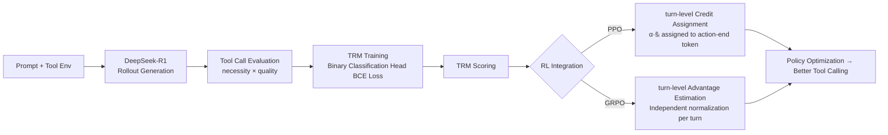

# Empowering LLM Tool Invocation with Tool-call Reward Model

**Conference**: ICLR 2026  
**Code**: [OpenDFM/TRM](https://github.com/OpenDFM/TRM)  
**Area**: LLM Agents / Reinforcement Learning for Tool Use  
**Keywords**: Tool-call Reward Model, Process Reward Model, Reinforcement Learning, PPO/GRPO, Gradient Conflict

## TL;DR

Addressing the issues of coarse-grained reward signals and subsequent gradient conflicts in LLM tool invocation, this paper proposes the Tool-call Reward Model (TRM). TRM is a process reward model that independently scores each tool call. The authors further design turn-level credit assignment and advantage estimation strategies integrated with PPO/GRPO, achieving consistent performance improvements across search-based QA and code-centric mathematical tasks.

## Background & Motivation

**Background**: The use of external tools (search engines, code executors) by LLMs to compensate for outdated knowledge and computational errors has become a mainstream agentic paradigm. Reinforcement learning (PPO, GRPO) is widely utilized to enhance these tool-calling capabilities.

**Limitations of Prior Work**: Almost all agentic RL methods rely solely on **outcome rewards**, where rewards are assigned based only on the final answer's correctness. This presents two issues: (1) coarse credit assignment that fails to distinguish which tool calls contributed value; (2) gradient conflicts, where correct tool calls are penalized if the final answer is wrong, and vice versa.

**Key Challenge**: Existing Process Reward Model (PRM) research primarily focuses on step-by-step mathematical reasoning. Tool-calling scenarios present two unique challenges: how to construct effective TRM training data and how to integrate TRM into algorithms like GRPO without triggering reward hacking (where the model avoids calling tools to minimize penalties).

**Goal**: This paper aims to propose a TRM specifically designed for tool invocation, systematically investigate its construction process, and design training algorithms that integrate stably with PPO/GRPO.

**Core Idea**: Assign a binary utility score (necessity × quality) to each tool call within a trajectory. This replaces or supplements the outcome reward during RL training to achieve fine-grained, turn-level credit assignment.

## Method

### Overall Architecture

The TRM system consists of two stages: "Creation" and "Application." First, annotated trajectory data is distilled from frontier LLMs to train the TRM. Then, the trained TRM is embedded into the PPO/GRPO reward signals, guiding policy optimization through turn-level credit assignment and advantage estimation.

### Key Designs

**1. Data Distillation: necessity × quality Dual-dimension Annotation**  
TRM training data is derived from multi-turn trajectories automatically generated by DeepSeek-R1 in tool environments. For each tool call $a_i$, the LLM evaluates two binary scores: **necessity** $s_i^{ne}$ (whether the call substantially advances the task) and **quality** $s_i^q$ (whether tool parameters are reasonable and used correctly). The final score is $s_i = s_i^{ne} \cdot s_i^q$, which is 1 only if both criteria are met. Ablation studies show that using only the quality score leads to noisy tool calls, while using only necessity harms per-call precision; combining both yields optimal results.

**2. TRM Training: Lightweight Classification Head**  
The TRM uses the Qwen2.5 series as a backbone, replacing the original language modeling head with a single-layer linear binary classification head. For each tool call $a_i$, the TRM takes the hidden state of the last token from the observation output $o_i$ and outputs a predicted utility probability $\tilde{s}_i \in [0,1]$. It is trained using BCE loss:

$$\mathcal{L}_{BCE} = \mathbb{E}_\tau \left[ -\frac{1}{n_\tau} \sum_{i=1}^{n_\tau} \left( s_i \log \tilde{s}_i + (1-s_i)\log(1-\tilde{s}_i) \right) \right]$$

Experiments indicate that a 3B scale TRM achieves stable performance with 10K samples, while a larger 7B model tends to overfit due to insufficient data.

**3. Turn-level Credit Assignment (PPO): Anchoring Rewards to Action-End Tokens**  
Since PPO operates at the token level while TRM rewards are defined at the turn level, cross-granularity mapping is required. The TRM score $\tilde{s}_i$ for the $i$-th tool call is assigned to the last token of that tool action, while the outcome reward is assigned to the last token of the trajectory:

$$r_j = \begin{cases} \alpha \cdot \tilde{r}_{I(j)}, & j \in E \quad (\text{Tool-end token}) \\ \tilde{r}_{I(j)}, & j = L \quad (\text{Answer-end token}) \\ 0, & \text{otherwise} \end{cases}$$

The hyperparameter $\alpha \in (0,1]$ controls the TRM signal weight and is set to 0.05 in experiments.

**4. Turn-level Advantage Estimation (GRPO): Avoiding Reward Hacking**  
Using standard group-level normalization in GRPO (calculating mean and variance across all tool call rewards in a trajectory group) leads to reward hacking: the model learns to reduce tool calls to avoid low scores. The solution proposed is **turn-level normalization**: for each turn $i$, normalization is performed independently across the rewards of the corresponding turn within the same group, and outcome rewards are normalized separately. Experiments show the turn-level scheme improves performance by approximately 1.3 percentage points over group-level normalization.

## Key Experimental Results

### Main Results (Search QA)

| Model Size | Method | NQ | HotpotQA | 2Wiki | Avg. |
|----------|------|----|-----------|----|------|
| 3B | Search-R1-PPO | 36.93 | 32.65 | 32.47 | 32.75 |
| 3B | Search-R1-PPO-**TRM** | **39.58** | **34.80** | **33.22** | **34.93** |
| 3B | Search-R1-GRPO | 47.01 | 43.34 | 42.68 | 42.33 |
| 3B | Search-R1-GRPO-**TRM** | **47.89** | **44.47** | **43.48** | **43.49** |
| 7B | Search-R1-GRPO | 49.97 | 49.06 | 47.80 | 46.90 |
| 7B | Search-R1-GRPO-**TRM** | **52.11** | **51.32** | **47.67** | **48.62** |

### Main Results (Code Math)

| Model Size | Method | AIME24 | AIME25 | MATH500 | Avg. |
|----------|------|--------|--------|---------|------|
| 1.5B | ToRL-GRPO | 25.56 | 19.33 | 75.80 | 43.18 |
| 1.5B | ToRL-GRPO-**TRM** | **26.00** | **27.00** | 75.80 | **45.42** |
| 7B | ToRL-GRPO | 35.00 | 21.89 | 83.80 | 52.19 |
| 7B | ToRL-GRPO-**TRM** | **36.56** | **23.67** | 83.20 | **53.70** |

### Ablation Study

| Configuration | Avg. | Note |
|------|------|------|
| Group-level Advantage Estimation | 41.18 | Default GRPO, prone to reward hacking |
| Turn-level Advantage Estimation (TRM) | **42.47** | Independent per-turn normalization, +1.29 |
| Quality Score Only | Lowest | Excessive tool calls introduce noise |
| Necessity Score Only | Medium | Reduced calls but lower quality |
| Necessity × Quality | **Highest** | Balanced invocation count and quality |
| ORM (Trajectory-level scoring) | < Answer-only | Excessive trajectory-level noise |
| TRM as Verifier | Suboptimal | Aggregated score better than ORM but worse than full TRM |

### Key Findings

- TRM provides consistent gains across PPO/GRPO, 1.5B to 7B models, and both search and code tasks, demonstrating high versatility.
- A 3B TRM trained on 10K samples is sufficient; 7B TRM performance declines due to overfitting.
- TRM significantly enhances cross-task generalization: models trained in search scenarios show significantly higher transfer performance on code-math tasks when TRM is integrated.

## Highlights & Insights

- **Resolving Gradient Conflicts**: The root cause of gradient conflicts in outcome rewards is the coupling of rewards across steps. TRM decouples the utility of each call, addressing the source of the problem.
- **Precision in Reward Hacking Mitigation**: Group-level normalization causes the average tool reward to rise as invocations decrease. This paper severs this incentive path through independent turn-level normalization.
- **Efficiency of 10K + 3B**: Compared to massive LLMs, a 3B TRM reaches stable performance on tens of thousands of samples, making deployment highly cost-effective.
- **Dual-dimension Annotation Superiority**: Necessity prevents redundant calls, while quality ensures correct execution. Both are essential, as confirmed by ablation results.

## Limitations & Future Work

- TRM training data currently depends on DeepSeek-R1 for trajectory generation and annotation; strong teacher models may not always be available.
- Validation is limited to search QA and code math; generalization to more complex multi-tool chains (e.g., API calls, database queries) remains to be explored.
- TRM is currently an offline pre-trained static model. Whether TRM requires synchronous updates (online TRM) as the policy evolves during RL training is unstudied.
- The optimal value of hyperparameter $\alpha$ varies between PPO (0.05) and GRPO (0.01); adaptive adjustment remains an open problem.

## Related Work & Insights

- **vs Search-R1 / ToRL**: This paper inserts TRM as a process reward supplement into outcome-only RL baselines without changing the overall framework, providing a modular integration approach.
- **vs StepSearch / AgentPRM**: StepSearch uses rules for query relevance, and AgentPRM infers intermediate labels from final success. Neither is specifically designed for tool invocation. TRM models at tool-call granularity and outperforms both.
- **vs Mathematics PRM (Lightman 2024, etc.)**: Math PRMs have distinct step boundaries (one line per step). Tool calling has different boundaries (one search returns large blocks of text), requiring TRM to handle observation boundary identification and noise filtering.

## Rating

- Novelty: ⭐⭐⭐⭐ Extending PRM to tool invocation is clear, and turn-level advantage estimation to solve reward hacking is innovative, though the framework is a natural combination of PRM + RL.
- Experimental Thoroughness: ⭐⭐⭐⭐ Comprehensive validation across tasks, scales, and RL algorithms with detailed ablations and generalization analysis.
- Writing Quality: ⭐⭐⭐⭐ Problems are clearly described, illustrations are intuitive, and methodology formulas are complete.
- Value: ⭐⭐⭐⭐ Tool invocation is a core capability for agentic LLMs; TRM serves as a practical, plug-and-play module for practitioners.

<!-- RELATED:START -->

## Related Papers

- [\[ICLR 2026\] OSWorld-MCP: Benchmarking MCP Tool Invocation in Computer-Use Agents](osworld-mcp_benchmarking_mcp_tool_invocation_in_computer-use_agents.md)
- [\[ICLR 2026\] A$^2$FM: An Adaptive Agent Foundation Model for Tool-Aware Hybrid Reasoning](a2fm_an_adaptive_agent_foundation_model_for_tool-aware_hybrid_reasoning.md)
- [\[ICLR 2026\] GTool: Graph Enhanced Tool Planning with Large Language Model](gtool_graph_enhanced_tool_planning_with_large_language_model.md)
- [\[ICLR 2026\] WebArbiter: A Principle-Guided Reasoning Process Reward Model for Web Agents](webarbiter_a_principle-guided_reasoning_process_reward_model_for_web_agents.md)
- [\[ICLR 2026\] Benchmarking LLM Tool-Use in the Wild](benchmarking_llm_tool-use_in_the_wild.md)

<!-- RELATED:END -->
