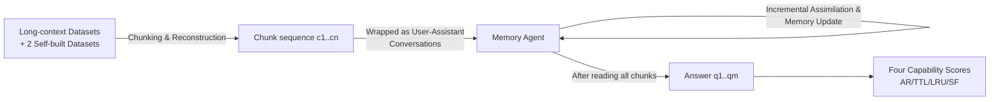

# Evaluating Memory in LLM Agents via Incremental Multi-Turn Interactions

**Conference**: ICLR 2026  
**Code**: Open-sourced (Datasets + Source Code, see link on paper homepage)  
**Area**: LLM Agent / Memory / Benchmark  
**Keywords**: Memory Agent, Multi-turn Interaction, Incremental Memory Evaluation, RAG, MemoryAgentBench  

## TL;DR
Based on memory and cognitive sciences, the authors decompose the capabilities required by memory agents into four core dimensions: "Accurate Retrieval, Test-Time Learning, Long-Range Understanding, and Selective Forgetting." They construct **MemoryAgentBench**, the first unified benchmark that simulates multi-turn interaction by chunking long texts and feeding them incrementally to agents. The study finds that no existing long-context models, RAG systems, or commercial memory agents can master all four capabilities simultaneously.

## Background & Motivation
**Background**: LLM agents are capable of writing code, controlling browsers, and solving complex tool-based tasks. Benchmarks like GAIA and SWE-Bench are emerging frequently, but these evaluations focus almost exclusively on "reasoning" (planning, tool invocation, code synthesis) while leaving "memory" (how to abstract, store, update, and retrieve long-term information) largely unexplored.

**Limitations of Prior Work**: Existing benchmarks for evaluating memory have significant flaws. LOCOMO (~9k), LooGLE (~24k), and LongBench (~20k) have contexts too short to challenge modern models. While NovelQA, NOCHA, and ∞-Bench extend context to 100k+, they are designed for "static long-context reading comprehension," where the entire text is fed at once. This does not reflect the interactive nature of memory agents that "absorb piece-by-piece and compress as they go." The most similar work, LongMemEval, uses synthetic long dialogues but lacks diverse topics and realistic interaction. Crucially, **no existing benchmark covers all four memory capabilities**.

**Key Challenge**: Memory $\neq$ Long context. Long context involves stuffing history verbatim into a window; memory involves the **compression and distillation** of past information—selectively retaining key points, discarding irrelevant content, and deriving new inferences from past experiences. Therefore, memory agents naturally need to **process context incrementally** (absorbing piece-by-piece, consolidating over time, generating new inferences, and learning new rules from accumulated history). Datasets that provide the entire text at once are fundamentally unsuitable.

**Goal**: To establish a unified, reproducible evaluation framework and dataset that covers four core capabilities and simulates real-world memory agents through "multi-turn incremental feeding," systematically measuring memory quality.

**Core Idea**: **[Capability Taxonomy]** Distill four complementary capabilities (AR / TTL / LRU / SF) from cognitive science as the evaluation skeleton. **[Incremental Transformation]** Chunk existing long-context datasets and feed them sequentially, supplemented by two self-built datasets (EventQA, FactConsolidation) to fill the gaps in AR and SF, ultimately forming MemoryAgentBench.

## Method

### Overall Architecture
MemoryAgentBench consists of three parts: (1) A four-capability taxonomy that breaks down evaluation goals into measurable dimensions; (2) A dataset layer that standardizes 12 datasets (including 2 self-built) into a multi-turn format of "chunk sequence + questions + answers"; (3) An evaluation protocol that wraps all chunks as simulated User-Assistant dialogues fed incrementally, allowing the agent to update its memory before answering questions. The evaluated subjects cover three categories: long-context, RAG, and commercial agentic memory agents.

### Key Designs

**1. Four Core Memory Capabilities: From cognitive science to measurable dimensions.** Referencing classic memory/cognitive theories such as James (1890) and McClelland (1995), the authors decompose "capabilities a memory agent should possess" into four complementary dimensions. **Accurate Retrieval (AR)** requires extracting correct segments based on a query (single-hop or multi-hop), provided the relevant information can be retrieved in one query. **Test-Time Learning (TTL)** requires absorbing new behaviors and learning new skills during deployment without further training (e.g., learning classification from labeled examples in the context). **Long-Range Understanding (LRU)** requires integrating information scattered across $\ge 100k$ tokens to answer questions requiring global understanding. **Selective Forgetting (SF)** requires revising, overwriting, or deleting old information when faced with contradictory evidence, aligning with goals of model editing and knowledge unlearning. This taxonomy serves as the design skeleton for the entire benchmark.

**2. Incremental Multi-turn Transformation: Turning static long text into an interactive stream.** This is the core distinction from long-context benchmarks. The authors unify datasets into the format of $c_1, c_2, \cdots, c_n$ (chunks), $q_1, \cdots, q_m$ (questions), and $a_1, \cdots, a_m$ (answers). Each chunk $c_i$ is wrapped as a user message with a memory instruction ("Please remember this, I will ask questions later"), fed sequentially to form a continuous dialogue. The agent must absorb and update memory incrementaly, only answering after all chunks are processed. To mitigate resource waste (e.g., injecting 1M tokens for a single question), the authors design "one context for multiple questions" (e.g., LME(S*) uses 5 context segments for 300 questions), repeatedly probing memory from the same injection to improve evaluation efficiency.

**3. Two Self-built Datasets: EventQA and FactConsolidation.** To fill gaps in existing datasets, the authors added two new ones. **EventQA** (for AR) is a reasoning-based NIAH (Needle In A Haystack) task: agents read a novel and, given up to 5 preceding events, must select the correct subsequent event from candidates, testing recall and reasoning of temporal order in long narratives. It is built using a **fully automated pipeline** without manual annotation. **FactConsolidation** (for SF) uses counterfactual editing pairs from MQUAKE: each pair contains a true fact and a modified contradictory version. The modified version is placed after the original to simulate a "fact update," forming contexts of 6K/32K/64K/262K. Questions include single-hop (direct recall) and multi-hop (inference across facts), with explicit guardrails in the prompt telling the agent "facts are indexed by number; larger numbers are newer; use the latest in case of conflict," directly measuring the strength and consistency of selective forgetting.

**4. Unified Formalization and Fair Comparison of Three Memory Agent Types.** Evaluated subjects cover three paradigms: **Long-context Agents** maintain a buffer of recent tokens, discarding the earliest chunks via FIFO once the 128K/1M window is full, relying purely on positional recency. **RAG Agents** store history in an external memory pool for retrieval as needed, further divided into Simple RAG (BM25), Embedding RAG (dense vectors + cosine similarity), and Structure-Augmented RAG (Knowledge Graphs/Timelines like GraphRAG, HippoRAG-v2). **Agentic Memory Agents** (MemGPT, MIRIX, etc.) use iterative reasoning loops to dynamically reformulate queries, search memory, and update working memory. To ensure fairness, all agents use standardized prompt templates and follow the "incremental absorption → update → unified answer" protocol.

## Key Experimental Results

### Main Results (Overall Summary; scores are Avg per capability and total)

| Agent | AR | TTL | LRU | SF | Overall |
|---|---|---|---|---|---|
| GPT-5-mini (400K, Long Context) | 74.4 | 48.6 | **66.2** | **53.0** | **60.6** |
| Claude-3.7-Sonnet (200K) | 59.7 | **53.9** | 62.2 | 22.5 | 49.6 |
| GPT-4o (128K) | 58.1 | 50.0 | 54.9 | 32.5 | 48.8 |
| BM25 (Simple RAG) | 45.3 | 44.5 | 35.6 | 25.5 | 41.5 |
| HippoRAG-v2 (Struct RAG) | 65.1 | 35.8 | 36.2 | 29.5 | 41.6 |
| MIRIX (Agentic, 4.1-mini) | 63.0 | 35.7 | 40.5 | 11.5 | 37.7 |
| Mem0 / Cognee / Zep | 32.6/28.3/37.5 | 21.2/22.8/37.5 | 20.7/16.0/16.2 | 10.0/15.5/5.0 | 21.1/20.6/24.0 |

RAG generally outperforms the backbone-equivalent GPT-4o-mini in AR (segment extraction). Long-context models are strongest in TTL and LRU (global understanding and cross-context learning), while RAG/commercial memory agents lack global understanding as they only retrieve top-k. **Performance on SF collapsed across all methods**, with none exceeding 28% in multi-hop scenarios.

### Ablation Study

| Ablation Dimension | Key Findings |
|---|---|
| Chunk size (512 vs 4096) | AR tasks benefit from **smaller chunks + more retrieval** (fine-grained splitting improves relevance); LRU tasks are conversely harmed by chunking. |
| Retrieval top-k (2/5/10) | Higher retrieval counts generally improve performance, but for chunk=4096, 10 chunks already total ~40k tokens (20 chunks were not tested). |
| Backbone (4o-mini/4.1-mini/Gemini) | RAG Agents: Backbones are no longer the bottleneck once they reach a certain strength; upgrades yield marginal gains. Agentic Memory (MIRIX): Upgrading the backbone resulted in a 9.7 gain (25.6 vs 15.9), showing high potential. |
| FactConsolidation Var. (o4-mini) | The reasoning model achieved 100% on Single-Hop (6K) but remained at 14% for Multi-Hop (32K), proving SF difficulty is real rather than a dataset flaw. |

### Key Findings
- **No Silver Bullet**: No single agent type masters all four capabilities—RAG excels at retrieval, long-context at understanding and learning, while commercial Agentic Memory (Mem0/Cognee/Zep) lags in most dimensions.
- **Selective Forgetting is a Major Hurdle**: Even with explicit "use newest fact" guardrails, multi-hop forgetting fails almost entirely. Reasoning models (o4-mini) improve single-hop retrieval but still fail on multi-hop reasoning.
- **Agentic Memory is highly dependent on backbones**, showing the largest gains with stronger models, suggesting their upper limit is determined by core reasoning capabilities.

## Highlights & Insights
- **Decoupling "Memory" from "Long Context"**: Memory is a compressed, distilled representation that must be measured incrementally. This framing corrects the misuse of long-context benchmarks for evaluating memory agents.
- **The Four-Capability Taxonomy** is backed by cognitive science rather than arbitrary assembly; AR/TTL/LRU/SF are complementary and map to specific datasets, serving as a checklist for future memory system design.
- **The Automated EventQA Pipeline** is transferable to any novel text, bypassing the reliance on manual annotation for long narrative datasets and ensuring scalability.
- **"One Context, Multiple Questions" Design** addresses the resource waste in long-context evaluation, making 1M-token-level evaluations practical.

## Limitations & Future Work
- The focus is primarily on memory in the form of text history and external databases. Parametric memory (MemoryLLM, M+, etc.) was excluded due to the gap between academic research and commercial APIs.
- Commercial memory agents (MIRIX/MemGPT/Mem0) were restricted by API costs to use larger chunks (4096) and weaker backbones (4o-mini), which might not reflect their full potential; comparison "fairness" is at the protocol level rather than the compute level.
- Selective forgetting failure was diagnosed across all systems, but no solution was proposed; achieving consistent forgetting over long sequences remains an open challenge.

## Related Work & Insights
- **Long-context Benchmarks** (LongBench/∞-Bench/RULER/NOCHA): Evaluate single-pass processing of massive info but do not reflect incremental multi-turn interactions. This work is a response to their inadequacy for memory agents.
- **RAG Benchmarks** (KILT/BEIR/RAGBench/RAGTruth): Assume static or slow-changing knowledge bases and short interactions, emphasizing retrieval precision and grounding while lacking continuous updates and selective forgetting.
- **Memory Agents** (MemGPT/Mem0/MIRIX/Zep/Cognee) and **Model Editing/Knowledge Unlearning** (MQUAKE/model editing): This work aligns SF with model editing goals and provides the first unified evaluation for these systems in multi-turn agent scenarios.
- **Insight**: When building memory systems, do not just optimize retrieval accuracy; use the AR/TTL/LRU/SF checklist. Specifically, "Selective Forgetting" is an almost entirely unexplored "blue ocean" direction.

## Rating
- Novelty: ⭐⭐⭐⭐ Stripping memory from long context and using a cognitive-science-based four-capability taxonomy with incremental multi-turn transformation creates a comprehensive new benchmark.
- Experimental Thoroughness: ⭐⭐⭐⭐⭐ Covers 3 major categories, 20+ agents, 12 datasets, 4 dimensions, plus 4 sets of ablations (chunk/top-k/backbone/dataset validation).
- Writing Quality: ⭐⭐⭐⭐ Progressive motivation (clearly explaining Memory $\neq$ Long Context), high information density in tables, and clear taxonomy.
- Value: ⭐⭐⭐⭐⭐ Provides a much-needed unified testbed for memory agents, yielding two critical diagnoses: "No Silver Bullet" and "Collective Failure in Selective Forgetting."

<!-- RELATED:START -->

## Related Papers

- [\[AAAI 2026\] Towards Trustworthy Multi-Turn LLM Agents via Behavioral Guidance](../../AAAI2026/llm_agent/towards_trustworthy_multi-turn_llm_agents_via_behavioral_guidance.md)
- [\[ICLR 2026\] ToolACE-MT: Non-Autoregressive Generation for Agentic Multi-Turn Interaction](toolace-mt_non-autoregressive_generation_for_agentic_multi-turn_interaction.md)
- [\[ICLR 2026\] InfoMosaic-Bench: Evaluating Multi-Source Information Seeking in Tool-Augmented Agents](infomosaic-bench_evaluating_multi-source_information_seeking_in_tool-augmented_a.md)
- [\[ICLR 2026\] Look Back to Reason Forward: Revisitable Memory for Long-Context LLM Agents](look_back_to_reason_forward_revisitable_memory_for_long-context_llm_agents.md)
- [\[ICLR 2026\] FaSTA*: Fast-Slow Toolpath Agent with Subroutine Mining for Efficient Multi-turn Image Editing](fasta_fast-slow_toolpath_agent_with_subroutine_mining_for_efficient_multi-turn_i.md)

<!-- RELATED:END -->
