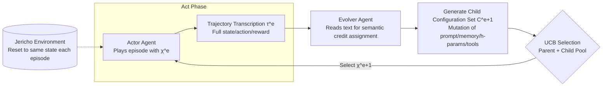

# EvoTest: Evolutionary Test-Time Learning for Self-Improving Agentic Systems

**Conference**: ICLR 2026  
**OpenReview**: [https://openreview.net/forum?id=JFnnajbkvP](https://openreview.net/forum?id=JFnnajbkvP)  
**Code**: [https://github.com/yf-he/EvoTest](https://github.com/yf-he/EvoTest)  
**Area**: LLM Agent / Self-Improving Agent / Test-Time Learning  
**Keywords**: test-time learning, self-improving agent, evolutionary optimization, gradient-free, Jericho, UCB selection  

## TL;DR
This paper proposes the J-TTL benchmark to measure an agent's ability to "learn while playing" on the same task, and introduces EvoTest—a fine-tuning-free, gradient-free framework. After each episode, an Evolver Agent reads the full trajectory text to evolutionarily optimize the agent's prompts, memories, hyperparameters, and tool usage, enabling continuous performance gains through repeated attempts.

## Background & Motivation
**Background**: Most current AI agents have fixed configurations after deployment, acting like "brilliant but oblivious interns"—capable of following instructions but unable to refine their decision-making processes from experience. A core human capability when facing new tasks is "learning by doing": attempting, reflecting, adjusting strategies, and trying again.

**Limitations of Prior Work**: The field lacks standardized testbeds specifically for measuring "rapid within-session self-improvement," and existing adaptation paradigms have inherent flaws in this setting:

- **Reflection (e.g., Reflexion)**: Appends failure summaries to the prompt but does not modify core decision logic or tool usage patterns.
- **Memory (e.g., MemGPT/MemoryBank)**: Improves information recall but does not teach the agent to "change its approach."
- **Online Fine-tuning (SFT/RL)**: In settings with sparse rewards and minimal per-episode data, credit assignment fails and data efficiency is too low. Furthermore, updating requires 5–10 minutes and multiple H100 GPUs, making it unsuitable for real-time test-time learning.

**Key Challenge**: Test-time learning requires "fast and holistic improvement from a single complex experience." However, existing methods either modify only a single channel (only prompt or only memory) or rely on expensive and data-inefficient gradient updates. No method can perform multi-dimensional adjustments to an entire agent system within one or two episodes.

**Goal**: (1) Provide a benchmark to systematically measure "on-the-fly learning" capabilities; (2) Propose a gradient-free, fast, and holistic evolutionary algorithm for test-time learning.

**Key Insight**: **Treat the "narrative of a game episode" as a learning signal.** Instead of relying on scalar rewards for backpropagation, an Evolver LLM reads the full trajectory text to perform **gene-like evolution on the entire agent configuration (prompt + memory + hyperparameters + tool usage)**, using UCB to manage the exploration-exploitation trade-off between old and new configurations.

## Method

### Overall Architecture
J-TTL models Jericho text adventure games as a POMDP, requiring the agent to **play the same game for K consecutive episodes** (resetting to the same initial state after each). Performance is measured by AUC (Cumulative Score / Maximum Possible Score). EvoTest implements an **Act–Evolve loop**: the Actor Agent plays a full episode using the current configuration $\chi^{(e)}$, producing a trajectory $\tau^{(e)}$. The Evolver Agent then reads the trajectory and the parent configuration to generate a set of evolved child configurations. UCB selects a single configuration from the "parent + children" pool for the next episode. Both roles share a fixed, non-trainable backbone LLM—learning occurs entirely at the "high-level configuration" level rather than the "model weights."

### Key Designs

**1. Holistic Agent Configuration $\chi=(p,M,h,u)$: Replacing weights with a quadruple of learnable components.** EvoTest instantiates the abstract learnable parameters $\theta$ in J-TTL as a quadruple configuration $\chi=(p, M, h, u)$: the policy prompt $p$ providing high-level strategy and guardrails; the deployment-time memory $M$ as a structured queryable database (split into "Success Memory" recording state-action pairs leading to score increases, e.g., `(state_hash, action) -> score_delta`, and "Failure Memory" recording negative patterns like loops); hyperparameters $h$ controlling temperature and exploration; and tool usage $u$ containing two evolutionary logic units—**Memory Interaction Logic** (querying $M$ before decisions and injecting verified actions as strong hints) and **State Abstraction Logic** (an evolvable Python `state extractor` that parses long game histories into milestone sentences like `Milestone: Found the map` for efficient context awareness). "Learning" thus becomes the collaborative adjustment of these four knobs.

**2. Dual Agent Decoupling "Action" and "Adaptation".** The Actor and Evolver have distinct responsibilities: the Actor uses a fixed configuration $\chi^{(e)}$ to query the backbone LLM, outputting actions based on observations $o_t$ and memory retrieval to produce $\tau^{(e)}$ and reward $R^{(e)}$. The Evolver executes the update rule $\chi^{(e+1)}=U(\chi^{(e)}, \tau^{(e)})$ between episodes, where a strong reasoning LLM (e3 in experiments) reads the full transcript to propose improvements. This decoupling keeps "playing" stable while concentrating "learning" between episodes, avoiding instability caused by mid-play modifications.

**3. Four Evolutionary Operators for "System-wide Mutation".** The Evolver applies genetic-like operators to all four components to generate child configurations $\tilde\chi$: **Prompt Mutation**—incorporating effective strategies ("check objects before taking them") or adding rules to prevent observed failures; **Memory Update**—programmatically parsing the transcript to record successful $(o_t,a_t)$ pairs and failed sequences into respective tables, where $M^{(e+1)}$ is inherited by all children; **Hyperparameter Adjustment**—e.g., increasing temperature if the agent is stuck in a loop; **Tool Usage Refinement**—upgrading memory queries from "suggestions" to hard instructions. A child configuration is a new combination of these mutated components, representing a hypothesis for a "more effective agent." This provides a fundamental advantage over prompt-only methods by addressing cross-channel bottlenecks like "perfect prompt but insufficient exploration."

**4. UCB Selection: Exploration-Exploitation in Evolution with a Safety Net.** After child configuration generation, the system faces the classic dilemma: reuse historically high-performing ones or test unverified new ones. EvoTest applies the Upper Confidence Bound (UCB) rule from multi-armed bandits to the "parent + children" pool:

$$\chi^{(e+1)} = \arg\max_{\tilde\chi \in \{\chi^{(e)}\}\cup C^{(e+1)}} \left( \hat\mu(\tilde\chi) + \beta\sqrt{\frac{\log N}{1+n(\tilde\chi)}} \right)$$

where $\hat\mu(\tilde\chi)$ is the historical average score of the configuration (encouraging exploitation), $n(\tilde\chi)$ is the number of times it has been tested, $N$ is the total episodes completed, and $\beta$ controls exploration intensity. New mutations are more attractive due to the exploration bonus. Crucially, **the parent configuration always remains in the candidate pool**: if a child configuration gets a lucky high score but is actually unstable, its performance in the next episode will lower its $\hat\mu$, causing UCB to naturally "fallback" to the time-tested parent. This acts as a safety net for the evolutionary path, preventing the system from being derailed by a single lucky outlier.

## Key Experimental Results

### Main Results
Average AUC (higher is better) across 6 Jericho games using two backbones (G = Gemini-1.5-Flash / C = Claude-3.5-Sonnet):

| Method | Type | Avg. AUC (G) | Avg. AUC (C) |
|---|---|---|---|
| Static | No learning | 0.11 | 0.12 |
| Memory | Memory | 0.13 | 0.14 |
| RAG | Memory | 0.18 | 0.19 |
| Summary | Reflection | 0.25 | 0.27 |
| Reflexion | Reflection | 0.32 | 0.34 |
| TextGrad | Prompt Opt | 0.31 | 0.33 |
| Promptbreeder | Prompt Evo | 0.34 | 0.36 |
| EvoPrompt | Prompt Evo | 0.34 | 0.36 |
| SFT (online) | Weight Update | 0.23 | — |
| GRPO (online) | Weight Update | 0.30 | — |
| **EvoTest (Ours)** | **System-wide Evo** | **0.47** | **0.50** |

EvoTest achieved the highest AUC across all 6 games and both backbones, outperforming the strongest prompt-evolution baseline (EvoPrompt) by ~**38%** and online RL (GRPO) by ~**57%**. The paper highlights that it is the **only method capable of completing two games (Detective, Library)**, where all baselines failed to win a single episode.

### Ablation Study
Component ablation (AUC on Detective / Zork1 / Balances):

| Configuration | Detective | Zork1 | Balances |
|---|---|---|---|
| EvoTest (Full) | 0.94 | 0.14 | 0.32 |
| w/o Prompt Evolution | 0.52 | 0.05 | 0.16 |
| w/o UCB Selection | 0.68 | 0.08 | 0.22 |
| w/o Memory Evolution | 0.82 | 0.11 | 0.28 |
| w/o Hyperparameter Adj | 0.89 | 0.12 | 0.30 |
| w/o Tool Usage Refinement | 0.91 | 0.13 | 0.30 |

Evolver LLM quality ablation (Detective): o3 (0.94) > DeepSeek-V3 (0.90) > Qwen2.5-32B (0.82) > Qwen2.5-7B (0.68) > Static (0.21)—performance scales monotonically with Evolver capability. Prompt structure ablation shows that full structured evolution (0.94) drops significantly to 0.65 (comparable to EvoPrompt) when replaced with simple mutation instructions, proving the structure of the master prompt is key.

### Key Findings
- **Prompt evolution is the primary driver**: Removing it caused the largest drop (0.94 → 0.52), proving that evolving high-level policy is central to adaptation.
- **UCB ensures stability**: Greedy selection leads to over-betting on risky mutations after a single lucky score, resulting in catastrophic performance drops. UCB maintains a stable upward trajectory by allowing falls back to parent configurations.
- **Efficiency over weight updates**: EvoTest's inter-episode update takes only 20–30 seconds and one LLM call, whereas SFT/GRPO takes 5–10 minutes on 4×H100, which is impractical for real-time test-time learning.
- **Narrative-based credit assignment**: In sparse reward settings, scalar signals are noisy. EvoTest uses semantic analysis of the entire story to identify causal chains of success/failure, performing targeted structural edits—essentially replacing "backprop credit assignment" with "narrative analysis credit assignment."

## Highlights & Insights
- **"Narrative as Gradient" Paradigm Shift**: Replacing scalar rewards with full-episode text transcripts as learning signals bypasses the credit assignment problem in sparse rewards, a key insight for efficient learning from single experiences.
- **Dimension Jump from Prompt to System Evolution**: The paper identifies the ceiling of prompt-only optimization—no prompt can fix bottlenecks like "insufficient exploration" or "inefficient tool usage"—and shows that collaborative tuning of all components is necessary.
- **UCB as a Safety Net**: This design elegantly solves the common problem in evolutionary algorithms where the system is misled by local "lucky" solutions through the use of an "ever-present parent pool + average score fallback."
- **Dual Contribution of Benchmark and Algorithm**: J-TTL shifts evaluation from "cross-game generalization" to the neglected but critical axis of "within-session improvement through repeated attempts."

## Limitations & Future Work
- **Narrow Task Domain**: Experiments are limited to Jericho text adventures. Transferability to real-world web/GUI/embodied environments with real side effects (where restarts are not possible) remains to be verified.
- **High Dependency on Evolver LLM**: Performance drops significantly with weaker models, meaning the system's upper bound is capped by the cost and capability of the strongest available reasoning models.
- **Hand-crafted Configuration Space**: The quadruple $(p, M, h, u)$ and evolutionary operators are manually defined; true open-ended self-evolution is still distant.
- **Diminishing Returns on Hard Games**: In extremely difficult games like Zork1, AUC remains low (0.14), suggesting that narrative evolution alone might not suffice for ultra-long-range sparse reward tasks.

## Related Work & Insights
- **Reflection/Memory**: While Reflexion and MemGPT provide single-channel adaptation, EvoTest views adaptation as a multi-component collaborative optimization problem.
- **Auto-Prompting/Evolution**: EvoTest generalizes "prompt evolution" (APE, OPRO, TextGrad, EvoPrompt) to "holistic agent configuration evolution."
- **Self-Improving Agents**: The vision aligns with EvoAgent and AlphaEvolve. For researchers, the "UCB for evolutionary exploration-exploitation + parent fallback" represents a reusable stabilization technique.
- **Test-Time Learning Perspective**: Treating "rapid within-session adaptation" as an independent evaluation axis provides methodological inspiration for evaluating continuous learning in deployed agentic systems.

## Rating
- **Novelty**: ⭐⭐⭐⭐ The combination of "narrative as gradient," system-wide evolution, and UCB safety nets is highly original in the test-time learning context.
- **Experimental Thoroughness**: ⭐⭐⭐⭐ Covers 6 games, 2 backbones, and comparisons against 4 classes of baselines (Memory, Reflection, Prompt Evo, Online Tuning), with comprehensive ablations.
- **Writing Quality**: ⭐⭐⭐⭐ Lucid motivation (the "oblivious intern"), clear hierarchical methodology, and well-mapped designs.
- **Value**: ⭐⭐⭐⭐ Provides a practical, non-GPU-intensive solution for test-time learning (20–30s per update), offering strong reference values for resource-constrained agent improvement.

<!-- RELATED:START -->

## Related Papers

- [\[ICLR 2026\] Agentic Context Engineering: Evolving Contexts for Self-Improving Language Models](agentic_context_engineering_evolving_contexts_for_self-improving_language_models.md)
- [\[ICML 2026\] From Player to Master: Enhancing Test-Time Learning of LLM Agents via Reinforcement Learning over Memory](../../ICML2026/llm_agent/from_player_to_master_enhancing_test-time_learning_of_llm_agents_via_reinforceme.md)
- [\[ICLR 2026\] GTA1: GUI Test-time Scaling Agent](gta1_gui_test-time_scaling_agent.md)
- [\[ICLR 2026\] Test-Time Adaptation for LLM Agents via Environment Interaction](test-time_adaptation_for_llm_agents_via_environment_interaction.md)
- [\[ICLR 2026\] Pushing Test-Time Scaling Limits of Deep Search with Asymmetric Verification](pushing_test-time_scaling_limits_of_deep_search_with_asymmetric_verification.md)

<!-- RELATED:END -->
