# EXP-Bench: Can AI Conduct AI Research Experiments?

**Conference**: ICLR 2026  
**Code**: [Just-Curieous/Curie/benchmark/exp_bench](https://github.com/Just-Curieous/Curie/tree/main/benchmark/exp_bench)  
**Area**: LLM Agent / AI Research Automation / Benchmark  
**Keywords**: End-to-end experiments, Research Agent, Semi-automatic data construction, Conjunctive evaluation, Executability verification  

## TL;DR
EXP-Bench semi-automatically extracts 461 "complete AI research experiment" tasks from 51 NeurIPS/ICLR 2024 papers and their open-source code. It forces Agents to complete the full pipeline of "hypothesize $\rightarrow$ design experiment $\rightarrow$ write code $\rightarrow$ execute $\rightarrow$ draw conclusions." Results show that the current strongest Agent achieves a success rate of only **0.5%** in completing fully executable experiments.

## Background & Motivation
**Background**: AI research is inherently digital, making it particularly suitable for automation by LLM Agents. Existing Agents can already handle discrete tasks such as literature reviews, hypothesis generation, and code generation. however, true empirical research requires rigorous, end-to-end, reproducible experiments, which extend far beyond these isolated capabilities.

**Limitations of Prior Work**: Existing benchmarks mostly cover only specific segments of the research process—either testing abstract reasoning/experimental design (BoxingGym, Lab-Bench), code snippet generation, or post-experiment data analysis (SciCode, ScienceAgentBench, DiscoveryBench), or measuring ML hyperparameter tuning in restricted environments like Kaggle (MLE-Bench, DSBench). RE-Bench contains only 7 manual tasks, which is too small in scale. Although PaperBench and CORE-Bench are derived from papers, they focus on well-defined sub-tasks like "running existing scripts/standard analysis." **None truly capture the complete, iterative AI research experimental chain, nor do they provide a scalable method for constructing such tasks.**

**Key Challenge**: Creating high-fidelity tasks requires manually extracting experimental details from papers and code. However, papers only present polished final conclusions and omit intermediate steps; critical conditions and data preprocessing are scattered across the main text, appendices, supplementary materials, and massive codebases. Pure manual curation is labor-intensive and cannot be scaled.

**Goal**: To build a benchmark capable of evaluating and guiding Agents through the entire experimental pipeline step-by-step, while providing a pipeline for the scalable production of such tasks. **Core Idea**: Utilize a **semi-automatic data construction pipeline** (multimodal extraction + lightweight human verification) to reverse-engineer "paper narratives + open-source code"—naturally coupled research products—into structured, executable, and finely-gradable experimental tasks.

## Method

### Overall Architecture
EXP-Bench consists of two parts: a **dataset specification** (each task = problem statement + ground-truth solution from original research products) and a **three-stage semi-automatic construction pipeline**. The construction side filters source materials from top-tier papers, extracts research tasks and corresponding implementation scripts, and verifies execution in clean Docker containers. The evaluation side uses an "LLM-as-judge + code execution verifier" to score the Agent's design, implementation, execution, and conclusion phases separately, aggregating them with conjunctive metrics.

```mermaid
flowchart LR
    A[Papers + Open Source Code] --> B[Stage 1 Source Selection<br/>Citations/Stars/Forks]
    B --> C[Stage 2.1 Extract Research Tasks<br/>OCR+Multimodal+Multi-round retrieval]
    C --> D[Stage 2.2 Extract Implementation Scripts<br/>Tool-augmented Agent locates code chains]
    D --> E[Stage 3 Docker Execution Verification<br/>Monitor checks cheating + compare conclusions]
    E -->|Failure Rollback| D
    E --> F[461 tasks/12737 sub-tasks]
    F --> G[Agent: Design→Implementation→Execution→Conclusion]
    G --> H[Judge: D/I/E/C + Conjunctive Metrics]
```

### Key Designs

**1. Task Triple Specification: Compressing "Paper + Code" into evaluable experimental units.** The input (Problem Statement) provides the Agent with three components: a **research question** refined from paper experiments, a **high-level method description** to guide the experimental path, and a **code repository** with specific scripts masked. The corresponding ground-truth solution includes three parts: an **experiment design** specifying key variables/constants/processes, **code changes** verified in `git diff` format, and a **final conclusion** directly answering the research question. This "Triple Input + Triple Answer" setup preserves the full workflow of real research while allowing each link to be scored independently.

**2. Two-stage Extraction: Mining tasks followed by implementations.** In Stage 2.1, research tasks are extracted by first indexing PDFs with OCR, using multimodal LLMs to interpret tables, figures, and cross-page elements into structured text. This is followed by multi-round extraction: the first RAG round finds high-level research takeaways, the second round performs semantic extraction at the subsection level and classifies segments as "implementation context" or "candidate research questions," and a final check of the full text (including appendices) recovers missing setup constraints. Stage 2.2 assigns the task to a tool-augmented Agent (capable of reading PDFs, using terminals, and searching the web) to perform **target-conditional searches** within the full codebase. It locates the script chain implementing the specified method and expected product, outputs a "required script list + running instructions," and uses AST tracking to parse the script chain into natural language step-by-step implementation requirements as ground truth.

**3. Execution-driven Verification and Masking: Eliminating shortcuts and falsification.** Stage 3 employs an LLM Monitor to review Agent logs, detecting three types of violations: directly reading paper PDFs, performing shortcuts like `git checkout` to target branches, or using placeholder results/hard-coding instead of running actual experiments. After passing, the scripts are reproduced from scratch in clean Docker containers, and outputs are compared with original paper conclusions using an LLM; failures trigger a rollback for refinement. Final tasks are stored with masked READMEs and relevant scripts (recursively processed via scripted git operations) to force the Agent to use reasoning rather than copying answers.

**4. Conjunctive Evaluation Metrics: Exposing the fragility of "seemingly correct" attempts.** Evaluation uses LLM-judge (o3-mini) to provide scores for **D** (Design Accuracy), **I** (Implementation Accuracy), and **C** (Conclusion Accuracy), while a code execution verifier provides **E** (Executability). Viewed individually, C and E show high variance—Agents can fabricate conclusions that "sound reasonable but lack experimental support," and faulty implementations might pass execution by chance. Consequently, conjunctive metrics are introduced: $I \cdot E$ (correct and executable implementation), $C \cdot D$ (conclusion based on reasonable design), $\text{All}\checkmark$ (all D/I/C correct), and $\text{All} \cdot E\checkmark$ (D/I/C correct plus executable). On the execution-verified subset, the Monitor-only (M) check yields an average score of 20.6%, which drops sharply to 3.7% when adding D+C, to 0.4% when adding I, and finally to just **0.2%** with E. Conjunctive evaluation exposes the extreme fragility of end-to-end correctness.

## Key Experimental Results

### Main Results Table
Evaluation of two Agent frameworks, OpenHands (OH) and IterativeAgent (IA), across multiple LLMs on all 461 tasks (D/I/E/C in %, **All·E✓** represents full end-to-end executable success rate):

| Agent | Model | D | I | E | I·E | C | All✓ | **All·E✓** |
|---|---|---|---|---|---|---|---|---|
| OpenHands | o3-mini | 18.4 | 20.3 | 15.0 | 2.9 | 21.0 | 1.4 | **0.5** |
| OpenHands | Claude-3.7 Sonnet | 16.0 | 35.0 | 33.2 | 14.9 | 13.4 | 0.7 | **0.4** |
| OpenHands | Amazon Nova Pro | 18.2 | 19.5 | 26.8 | 0.0 | 15.7 | 0.0 | **0.0** |
| OpenHands | Claude-3.5 Haiku | 20.6 | 26.2 | 9.3 | 1.3 | 13.8 | 0.0 | **0.0** |
| OpenHands | DeepSeek R1 | 6.8 | 10.0 | 0.7 | 0.0 | 2.4 | 0.0 | **0.0** |
| IterativeAgent | Claude-3.5 Haiku | 6.4 | 20.6 | 25.2 | 5.4 | 2.2 | 0.0 | **0.0** |
| IterativeAgent | Amazon Nova Pro | 0.1 | 10.0 | 18.1 | 0.0 | 0.3 | 0.0 | **0.0** |

The strongest configuration, OH+o3-mini, achieves a full executable success rate of only 0.5%, with All✓ at only 1.4%.

### Ablation Study Table
The collapse trajectory of average scores as conjunctive metrics are tightened (on the execution subset):

| Evaluation Condition | Average Score |
|---|---|
| Monitor Check (M) only | 20.6% |
| + Design & Conclusion (M·D·C) | 3.7% |
| + Implementation Accuracy (·I) | 0.4% |
| + Execution Verification (·E) | **0.2%** |

### Key Findings
- **Data Scale and Coverage**: 461 tasks / 12,737 independently gradable sub-tasks, derived from 51 papers (53% from NeurIPS 2024, 47% from ICLR 2024), spanning CV, NLP, RL, and generative models.
- **Three Types of Systematic Failures**: 16.1% of design variables were misclassified; 39.7% lacked critical implementation components; and in the execution phase, 29.4% involved environment/dependency errors while 23.8% involved script-level errors.
- **Behavioral Differences**: The OH series often "stopped early"—producing plausible-sounding answers without actually running experiments, leading to inflated design/implementation scores. The IA series almost always exhausted the 40-minute time limit but remained inefficient. Runtime/cost showed almost no correlation with final performance.
- **RL as a Relative Highlight**: Multiple OH models achieved an implementation accuracy (I) of approximately 41% on RL tasks (mean of 36 tasks), significantly higher than other categories.

## Highlights & Insights
- **Using "Paper + Code" as Natural Ground Truth**: Peer-reviewed research with open-source implementations provides ready-made examples of full experimental workflows. Reverse-engineering is far more credible than creating tasks from scratch and reduces human verification to "lightweight consistency checks."
- **Conjunctive Evaluation as a Methodological Contribution**: Single-point metrics can be deceived by "plausible-sounding" or "coincidentally executable" results. Conjunctive forms like $I \cdot E$ and $C \cdot D$ significantly reduce variance, filter out over-scoring, and provide more robust, discriminative signals—a concept applicable to any end-to-end Agent evaluation.
- **The Figure of 0.5% as a Major Impact**: It clearly quantifies the chasm between "completing isolated tasks" and "performing complete research," providing a clear target for subsequent Agent improvements in planning, implementation completeness, and environment robustness.

## Limitations & Future Work
- **Semi-automation Still Requires Humans**: While the pipeline reduces human effort to lightweight verification, it still depends on human review of task content, and the pipeline itself was tuned through manual trial and error; migration costs to new venues/fields may not be negligible.
- **High Execution Cost**: Due to the time required for execution, only a subset of tasks underwent executability verification (varying from 56 to 420 across models in the #E column), meaning E-related statistics are not perfectly aligned across the full set.
- **Dependency on Original Implementation as Sole Truth**: When original code is ambiguous or has multiple valid implementations, using a single script chain as ground truth may underestimate an Agent’s reasonable but different solution.
- **High Variance in Executability (E)**: False implementations or mocks might still pass, introducing overestimation bias—a problem mitigated by conjunctive metrics, though isolated E remains unreliable.
- **Future Work**: The authors explicitly position EXP-Bench as a large-scale data source for training Agents capable of automating core research stages, with the semi-automatic pipeline paving the way for future scaling.

## Related Work & Insights
- **Scientific Reasoning** (BoxingGym, AAAR, Lab-Bench): Tests abstract reasoning/static design without actual experiments.
- **Scientific Coding** (SciCode, BLADE, DiscoveryBench, ScienceAgentBench): Focuses on code snippets or post-hoc analysis, isolating coding from the iterative experimental context.
- **ML Benchmarks** (DSBench, MLE-Bench, RE-Bench, ML-Gym, Curie, CORE-Bench, PaperBench): Either limited by Kaggle environments/small scales/simplified metrics or only testing well-defined sub-tasks like "running existing scripts."
- **Insights**: EXP-Bench distinguishes itself by combining "end-to-end + incremental + scalable construction." Its combination of conjunctive evaluation and execution verification serves as a model for anyone seeking to evaluate Agents that are "truly functional" rather than "seemingly functional."

## Rating
- **Novelty**: ⭐⭐⭐⭐⭐ The first benchmark to truly cover end-to-end AI research experiments and provide a scalable semi-automatic construction method. Conjunctive evaluation is a solid methodological contribution.
- **Experimental Thoroughness**: ⭐⭐⭐⭐ 461 tasks / 12,737 sub-tasks, multi-Agent × multi-LLM, including cost-time and metric stability analysis; limited coverage of execution evaluation is a minor setback.
- **Writing Quality**: ⭐⭐⭐⭐ Clear logic from motivation to pipeline to evaluation; high information density in figures (Fig. 1 process, Fig. 3 distribution, Table 1 main results) and specific failure attribution.
- **Value**: ⭐⭐⭐⭐⭐ The 0.5% success rate decisively benchmarks the true gap in "AI-automated research," providing a high-fidelity testbed and training data source for next-generation research Agents.

<!-- RELATED:START -->

## Related Papers

- [\[ICLR 2026\] InnovatorBench: Evaluating Agents' Ability to Conduct Innovative AI Research](innovatorbench_evaluating_agents_ability_to_conduct_innovative_ai_research.md)
- [\[ICLR 2026\] A Framework for Studying AI Agent Behavior: Evidence from Consumer Choice Experiments](a_framework_for_studying_ai_agent_behavior_evidence_from_consumer_choice_experim.md)
- [\[ACL 2025\] REPRO-Bench: Can Agentic AI Systems Assess the Reproducibility of Social Science Research?](../../ACL2025/llm_agent/repro-bench_can_agentic_ai_systems_assess_the_reproducibility_of_research_claims.md)
- [\[NeurIPS 2025\] MLRC-Bench: Can Language Agents Solve Machine Learning Research Challenges?](../../NeurIPS2025/llm_agent/mlrc-bench_can_language_agents_solve_machine_learning_research_challenges.md)
- [\[ICLR 2026\] SR-Scientist: Scientific Equation Discovery With Agentic AI](sr-scientist_scientific_equation_discovery_with_agentic_ai.md)

<!-- RELATED:END -->
