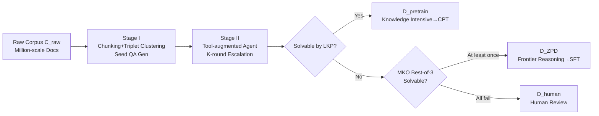

# Expanding the Capability Frontier of LLM Agents with ZPD-Guided Data Synthesis

**Conference**: ICLR 2026  
**OpenReview**: [https://openreview.net/forum?id=c5bf47nDx1](https://openreview.net/forum?id=c5bf47nDx1)  
**Code**: To be confirmed  
**Area**: LLM Agent / Data Synthesis  
**Keywords**: Agent training data, Zone of Proximal Development (ZPD), Knowledge fusion, Self-evolving benchmark, Continued pre-training  

## TL;DR
By adopting the "Zone of Proximal Development (ZPD)" theory from educational psychology, this work develops a data synthesis engine that precisely calibrates task difficulty to the model's capability boundary. It generates high-value agent data for continued pre-training and post-training, pushing a small 30B-A3B model to 28.6% on HLE, surpassing several closed-source deep-research agents.

## Background & Motivation
**Background**: Current LLMs are powerful in routine reasoning but struggle with "deep research" tasks requiring cross-domain, multi-document, and deep integration. To transition models from "invoking static internal knowledge" to "tool use + self-reflection + multi-step planning" agent capabilities, the most scarce resource is training data—corpora capable of systematically fostering these abilities are virtually non-existent.

**Limitations of Prior Work**: Mainstream data synthesis follows two paradigms: query-centric (variations on existing QAs) and document-centric (extracting QAs from single documents). Both focus on "local understanding," testing students on specific chapters rather than their ability to synthesize an entire curriculum. Furthermore, expert-curated high-difficulty benchmarks (e.g., Humanity's Last Exam) are costly, non-scalable, and quickly saturated.

**Key Challenge**: The difficulty in effective data synthesis lies not in "generating hard problems," but in **precisely anchoring the difficulty at the model's capability boundary**. Tasks must be challenging enough to exceed internal capabilities while remaining solvable with appropriate support. Existing methods rely on coarse-grained difficulty labels or stacked constraints, lacking a mechanism to target this boundary; meanwhile, self-generated data is often trapped within the model's own capability ceiling.

**Goal**: Construct an automated pipeline to continuously synthesize high-value data within the LLM's "Zone of Proximal Development" and simultaneously produce a self-evolving, saturation-resistant evaluation benchmark.

**Core Idea**: **Operationalize Vygotsky's ZPD theory** by defining two roles: a Less Knowledgeable Peer (LKP, the base LLM) and a More Knowledgeable Other (MKO, a tool-enhanced strong agent). **Any problem that the LKP fails but the MKO solves falls exactly within the model's ZPD**. Using this as a filter identifies the "most informative" training resources and adaptively updates the curriculum as the model's boundary expands.

## Method

### Overall Architecture
The AgentFrontier data engine is a three-stage agent synthesis pipeline that transforms a raw document corpus $\mathcal{C}_{raw}$ into a calibrated high-value dataset $\mathcal{D}_{ZPD}$. Stage I generates seed QAs requiring knowledge fusion from multi-source documents; Stage II upgrades QA complexity iteratively using tool-augmented agents; Stage III utilizes LKP-MKO adversarial calibration to branch data into "knowledge-intensive data for continued pre-training" and "frontier reasoning data for post-training."

### Key Designs

**1. Compound Unit Driven Seed Generation: From Single-Doc Understanding to Cross-Doc Fusion** To ensure problems inherently require knowledge fusion, the engine generates QAs from **topic-related document chunk triplets** rather than single documents. First, Qwen3-235B acts as a chunking function $\Phi_{chunk}$ to clean and compress long texts into information-dense chunks $\mathcal{C}_{chunk}$. A vector index is built to retrieve $k$-nearest neighbors for each chunk $c_i$, searching the neighborhood for high topic-consistency triplets $(c_i, c_j, c_k)$ satisfying $\mathrm{Sim}(c_x,c_y) > \tau_{theme}$. This retrieval-based clustering avoids combinatorial explosion while ensuring the generator $\mathcal{M}_{gen}$ (DeepSeek-R1) produces seed QAs spanning multiple sources rather than local factual retrieval.

**2. Four-dimensional Adversarial Escalation: Escalating Problems Along the Capability Boundary** The core of the engine is an iterative refinement loop: a refining agent $\mathcal{A}_{refine}$ (DeepSeek-R1 + Search/Scholar/Browser/Code tools) applies escalation operators to the $k$-th round QA, $(q_{k+1}, a_{k+1}) = \Psi_{escalate}(q_k, a_k, \mathcal{A}_{refine})$, across four dimensions: **Knowledge Expansion** (incorporating background from external sources), **Conceptual Abstraction** (extracting high-level principles), **Fact Fortification** (multi-source cross-verification), and **Computational Modeling** (introducing quantitative calculation via Python execution). The output of one round is the input for the next, bootstrapping reasoning chains. After $K$ rounds, a high-complexity $\mathcal{D}_{refined}$ is obtained.

**3. LKP-MKO Dual-criterion ZPD Calibration: Precise Branching into Pre-training and Post-training Streams** Not all synthesized QAs are equally valuable. The engine instantiates the LKP (Base DeepSeek-R1-0528, no tools) and MKO (Tool-augmented DeepSeek-V3.1), using GPT-4o as an automated judge to provide binary $\mathrm{IsSolvableBy}(A, q, a)$. If LKP succeeds (=1), the sample is deemed too simple and categorized into the knowledge-intensive pre-training set $\mathcal{D}_{pretrain}$. If LKP fails (=0), it is passed to the MKO for Best-of-N ($N=3$) verification: if the MKO succeeds at least once ($\sum_i \mathrm{IsCorrect}(s_i, a) \ge 1$), the sample is within the ZPD—challenging but learnable—and added to the post-training set $\mathcal{D}_{ZPD}$. If the MKO fails all three times, the sample may be flawed or too difficult, leading to human review $\mathcal{D}_{human}$. Finally, a reranker removes redundant samples satisfying $\max_{(q,a) \in \mathcal{D}_{ZPD}} \mathrm{Sim}(q', q) \ge \epsilon$ ($\epsilon=0.7$) to ensure diversity.

**4. ZPD Exam: A Self-evaluating Benchmark Co-evolving with Models** By adjusting configurations, the same engine produces a saturation-resistant live benchmark. It sources content from 30,000 frontier science papers (2023–2025) across Math/CS/Physics to ensure answers cannot be retrieved from parametric knowledge alone. Strict adversarial dual-constraints are applied: the baseline model (DeepSeek-R1) must fail three times without tools but succeed three times with tools, defining the empirical ZPD boundary. ZPD Exam-v1 consists of 1,024 sampled open short-answer questions. Since the construction is automated, the benchmark can be regenerated as models improve. Evaluation categorizes agents into: **Inherent Ability Zone** (<20, parametric knowledge ceiling), **Reasoning Bottleneck Zone** (20–60, possesses tools but lacks meta-cognitive orchestration), and **Emergent Mastery Zone** (>60, capable of integrating tool exploration into coherent reasoning like the MKO).

## Key Experimental Results

### Main Results

Comparing four agent-tuning datasets across four multi-disciplinary benchmarks (all using 12,000 trajectories, rejection sampling, 3 epochs). AgentFrontier demonstrates comprehensive leadership.

| Backbone | RFT Dataset | HLE | ZPD Exam-v1 | RBench-T | xBench-SciQA |
|---|---|---|---|---|---|
| Qwen3-8B | TaskCraft | 14.6 | **87.5** | 64.3 | 30.0 |
| Qwen3-8B | MegaScience | 14.2 | 84.7 | 62.3 | 36.0 |
| Qwen3-8B | MiroVerse | 15.0 | 84.5 | 62.8 | 32.0 |
| Qwen3-8B | **AgentFrontier** | **18.8** | 86.8 | **67.2** | **40.0** |
| Qwen3-32B | MiroVerse | 19.9 | 87.7 | 67.4 | 43.0 |
| Qwen3-32B | **AgentFrontier** | **23.8** | **90.9** | **70.3** | **51.0** |
| Qwen3-30B-A3B | MegaScience | 20.2 | 90.0 | 73.1 | 48.0 |
| Qwen3-30B-A3B | **AgentFrontier** | **25.7** | **91.4** | **74.4** | **54.0** |

Subject-level analysis on HLE show that on 8B/32B backbones, AgentFrontier achieves SOTA in 6 and 7 out of 8 subjects, respectively; on 30B-A3B, it **leads in every subject**, with an overall average of 25.67%, representing Gains of 178% and 152% over the base model in no-tool/tool settings.

Final comparison between **AgentFrontier-30B-A3B** (with continued pre-training) and SOTA agents:

| Agent | HLE | ZPD Exam | RBench-T | xBench-SciQA |
|---|---|---|---|---|
| GPT-4o (with tools) | 4.8 | 51.3 | 48.5 | 15.0 |
| Claude 4 Sonnet | 14.3 | 86.6 | 71.1 | 47.0 |
| WebSailor-72B | 9.2 | 62.1 | 44.9 | 27.0 |
| **AgentFrontier-30B-A3B (RFT only)** | 25.7 | 91.4 | 74.4 | 54.0 |
| **AgentFrontier-30B-A3B (CPT+RFT)** | **28.6** | **93.4** | **77.1** | **61.0** |

The CPT step contributes an independent Gain of +2.9 (HLE), +2.0 (ZPD), +2.7 (RBench), and +7.0 (xBench-SciQA).

### Ablation Study

Ablation of LKP/MKO configurations reveals the trade-off between "Data Yield vs. Data Complexity" (1,000 sample subset).

| Configuration (LKP / MKO) | ZPD Data Yield | Avg Turns | Avg Tool Calls |
|---|---|---|---|
| **1. DS-R1 / DS-V3.1+T (Original)** | **33.1%** | **3.32** | **2.32** |
| 2. Qwen3-30B / DS-V3.1+T (Wider Gap) | 47.7% (↑44.1%) | 1.85 (↓44.3%) | 0.85 (↓63.4%) |
| 3. DS-R1 / DS-R1+T (Narrower Gap) | 24.0% (↓27.5%) | 2.99 | 1.99 |

A weaker LKP increases yield by 44.1% but causes data complexity to plummet (tool calls ↓63.4%). A narrower gap maintains complexity but reduces yield by 27.5%, limiting scaling efficiency. The original balanced configuration optimizes both scale and depth.

### Key Findings
- **Best-of-N Reveals Targeted Difficulty**: On a 300-sample set, pass@1 21.7% $\rightarrow$ pass@8 40.7%; a +19.0 point jump proves the data is not a binary mix of "trivial vs. impossible" but resides at the true frontier—offering rich signals for SFT and room for RL exploration.
- **From High Frequency to Efficient Orchestration**: AgentFrontier agents reach 26.3% macro-average conditional tool accuracy on HLE, significantly exceeding the 21% plateau of competitors with similar interaction counts—capability stems from "efficiency" rather than "quantity."
- **Balanced Tool Distribution Cultivates Synergy**: Unlike code-centric MiroVerse or search-centric TaskCraft, AgentFrontier distributes tasks across search/scholar/browser/code, forcing agents to understand cross-tool synergy.

## Highlights & Insights
- **Turning Abstract Educational Theory into Engineering Criteria**: ZPD is qualitatively defined in psychology; this work utilizes the "LKP failure $\wedge$ MKO success" binary criteria to create an automated data filter that adaptively shifts as the model evolves.
- **Unified Synthesis and Evaluation**: The same engine produces training data and the ZPD Exam. Strict disjointness between training and evaluation corpora ensures no contamination while allowing the benchmark to co-evolve with the model.
- **Small Models Surpassing Large Models**: 30B-A3B (3B active) achieves 28.6% on HLE, matching OpenAI/Gemini DeepResearch (26.6/26.9), proving that "calibrating data quality to ZPD" is more effective than stacking parameters for unlocking expert reasoning.
- **Tri-zone Diagnostics over Single Leaderboards**: ZPD Exam categorizes agents into three zones, precisely identifying whether a model lacks "meta-cognitive tool orchestration" or the "tools themselves."

## Limitations & Future Work
- **Reliance on Multiple Strong Teachers**: The pipeline utilizes Qwen3-235B, DeepSeek-R1, DeepSeek-V3.1, and GPT-4o as generators, refiners, and judges, resulting in high synthesis costs and a quality ceiling bounded by these teachers.
- **MKO Ceiling is ZPD Ceiling**: Problems failed by the MKO thrice are relegated to human review, meaning "beyond SOTA tool-agent" frontier problems cannot be automatically utilized.
- **Judge Reliability**: Difficulty and correctness verification rely on LLM-as-a-judge (GPT-4o / o3-mini); judge bias directly impacts data partitioning and final scoring.
- **RL Integration Pending**: While BoN analysis demonstrates RL potential (large pass@1 vs. pass@8 gap), this work focuses on SFT/RFT, leaving RL implementation for future work.

## Related Work & Insights
- **vs. Query/Document-centric Synthesis**: Traditional synthesis focuses on "local understanding"; this work uses compound triplets to force cross-document fusion for "deep research" capabilities.
- **vs. Static Expert Benchmarks (HLE)**: HLE is costly and prone to saturation; ZPD Exam is automated, self-evolving, and serves as a scalable complement.
- **vs. Coarse Difficulty Synthesis**: Unlike methods relying on difficulty labels, LKP-MKO calibration provides a principled mechanism to target capability boundaries.
- **Inspiration**: The "dual-role adversarial filtering" paradigm is transferable to other domains (Code, Math, Embodied AI). Any task that can define a "weak agent vs. strong agent" can use this approach to mine the most informative training samples and construct evolving benchmarks.

## Rating
- Novelty: ⭐⭐⭐⭐⭐ Successfully turned ZPD theory into an executable LKP-MKO filter, with a co-evolving framework for synthesis and benchmarking.
- Experimental Thoroughness: ⭐⭐⭐⭐ Solid results across three backbones, four benchmarks, and four datasets. Includes HLE subject-level, LKP/MKO ablation, BoN, tool efficiency, and CPT analysis. Lacks RL empirical results.
- Writing Quality: ⭐⭐⭐⭐ High clarity in motivation, pipeline, evaluation, and analysis. Comprehensive charts and formulas.
- Value: ⭐⭐⭐⭐⭐ Provides a scalable paradigm for generating frontier agent data. The result of small models surpassing closed-source deep-research agents is highly persuasive.

<!-- RELATED:START -->

## Related Papers

- [\[ICLR 2026\] Open Data Synthesis for Deep Research](open_data_synthesis_for_deep_research.md)
- [\[ICML 2026\] Rule2DRC: Benchmarking LLM Agents for DRC Script Synthesis with Execution-Guided Test Generation](../../ICML2026/llm_agent/rule2drc_benchmarking_llm_agents_for_drc_script_synthesis_with_execution-guided_.md)
- [\[ICLR 2026\] Helmsman: Autonomous Synthesis of Federated Learning Systems via Collaborative LLM Agents](helmsman_autonomous_synthesis_of_federated_learning_systems_via_collaborative_ll.md)
- [\[ICLR 2026\] Towards Multimodal Data-Driven Scientific Discovery Powered by LLM Agents](towards_multimodal_data-driven_scientific_discovery_powered_by_llm_agents.md)
- [\[ICLR 2026\] DeepScientist: Advancing Frontier-Pushing Scientific Findings Progressively](deepscientist_advancing_frontier-pushing_scientific_findings_progressively.md)

<!-- RELATED:END -->
