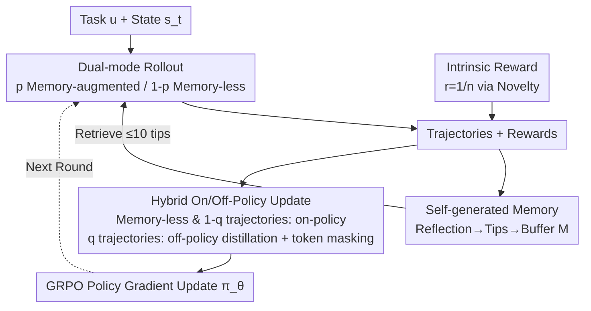

# Exploratory Memory-Augmented LLM Agent via Hybrid On- and Off-Policy Optimization

**Conference**: ICLR 2026  
**arXiv**: [2602.23008](https://arxiv.org/abs/2602.23008)  
**Code**: [https://github.com/agent-lightning/empo2](https://github.com/agent-lightning/empo2)  
**Area**: Agent  
**Keywords**: LLM Agent, Reinforcement Learning, Exploration, External Memory, Hybrid Policy Optimization

## TL;DR
Ours proposes EMPO2, an RL framework combining an external memory module with hybrid on-policy/off-policy updates. By internalizing exploration gains into model parameters through memory-guided exploration and knowledge distillation, it achieves performance improvements of 128.6% and 11.3% over GRPO on ScienceWorld and WebShop, respectively.

## Background & Motivation

**Background**: LLM Agents learn decision-making in interactive environments through reinforcement learning (e.g., GRPO). However, the core bottleneck remains **insufficient exploration**—Agents rely excessively on pre-trained knowledge and struggle to discover new states that require active searching.

**Limitations of Prior Work**: (a) Pure parameter-update RL (e.g., GRPO) converges prematurely to sub-optimal solutions in tasks requiring long-term exploration; (b) Non-parametric methods (e.g., Reflexion) improve decision-making via reflective memory, but performance saturates quickly under fixed parameters, preventing continuous improvement; (c) Offline RL and SFT methods depend on large amounts of expert trajectories or external resources like GPT-4.

**Key Challenge**: Parameter updates internalize knowledge but lack the drive for exploration; external memory promotes exploration but cannot extend intrinsic capabilities. These paradigms have respective limitations and lack a unified framework.

**Goal**: How to enable LLM Agents to autonomously explore new environments during online RL while internalizing the experience gained through exploration into model parameters?

**Key Insight**: Non-parametric memory updates can bootstrap parameter updates—Agents first acquire high-quality trajectories through memory-guided exploration, and then distill this knowledge into the memory-less policy through off-policy updates.

**Core Idea**: Use self-generated memory "tips" as exploration scaffolding, progressively internalizing memory-augmented exploration capabilities into model weights through hybrid on/off-policy updates.

## Method

### Overall Architecture
EMPO2 aims to resolve the exploration deadlock of LLM Agents in online RL: pure parameter updates (GRPO) converge too early, while pure memory methods (Reflexion) saturate quickly due to frozen weights. The solution is to merge these paths—allowing the Agent to explore high-quality trajectories using external memory, and then distilling these exploration gains back into model parameters so that the model can replicate the discovered behaviors during testing without relying on memory.

The entire process is a GRPO-style policy gradient loop: given a task description $u$ and environment state $s_t$, the Agent samples multi-step interaction trajectories during the **rollout phase** between "memory-augmented" and "memory-less" modes according to a probability. After each episode, the current policy reflects on the trajectory to generate experience tips to update the memory buffer for the next round of retrieval (forming an exploration feedback loop), while intrinsic rewards are issued based on state novelty. In the **update phase**, memory-less trajectories and a portion of memory-augmented trajectories undergo on-policy updates for stability, while another portion of memory-augmented trajectories undergoes off-policy updates to distill "excellent behaviors with tips" into the tip-less policy. Finally, the policy $\pi_\theta$ is updated via GRPO.

### Key Designs

**1. Self-generated Memory Module: Memory as Scaffolding, Not the End Goal**

To address the bottleneck of agents over-relying on pre-trained knowledge, EMPO2 mandates the current policy $\pi_\theta$ to reflect on the completed trajectory after each episode. It generates experience tips according to $\text{tip}_i \sim \pi_\theta(s_t, u, \text{tip-generation prompt})$ and stores them in buffer $\mathcal{M}$. During subsequent decision-making, up to 10 relevant tips are retrieved based on embedding similarity. The key difference from Reflexion is that tips here are intermediate scaffolding to guide parameter updates—they help the policy reach good states but are intended to be internalized, removing dependency during testing.

**2. Dual-mode Rollout: Balancing High-quality Trajectories and Independent Reasoning**

To enjoy exploration gains from memory without making the policy dependent on tips, the rollout phase switches between modes with probability $p$. The memory-augmented mode $a_{t+1} \sim \pi_\theta(\cdot \mid s_t, u, \text{tips}_t)$ produces high-quality trajectories using retrieved tips, while the memory-less mode $a_{t+1} \sim \pi_\theta(\cdot \mid s_t, u)$ preserves the policy's independent reasoning under zero-shot conditions. Both types of trajectories enter the update phase.

**3. Hybrid On/Off-Policy Update: Internalizing Memory Capabilities**

This is the core of "auxiliary-first, internalization-later." Memory-less trajectories directly undergo on-policy updates. For memory-augmented trajectories, a choice is made with probability $q$: on-policy updates (preserving tips in conditional probability for stability) or off-policy updates. In the off-policy case, the stored conditional log-probability $\log\pi_\theta(a_t \mid s_t, u, \text{tips}_t)$ is replaced by the memory-less probability $\log\pi_\theta(a_t \mid s_t, u)$. This is essentially **reward-guided knowledge distillation**: the trajectory with tips acts as a teacher, while the tip-less policy acts as the student. High-reward trajectories ($\hat{A}_t > 0$) are reinforced in the student, effectively "writing" the memory-discovered capabilities into the weights.

To prevent training collapse when $\pi_\theta(a_t \mid s_t, u)$ is extremely low (causing importance sampling ratios to explode), EMPO2 applies **token masking**. It uses an indicator function $\mathbf{1}_{\pi_\theta(a_t \mid s_t, u) \geq \delta}$ in the loss function to mask unreliable tokens below threshold $\delta$, stabilizing off-policy training.

**4. Intrinsic Reward: Driving Exploration Without Environment Rewards**

When external rewards are sparse, agents often converge prematurely. EMPO2 maintains a state memory list and calculates cosine similarity for each new state. Intrinsic reward is defined as $r_{\text{intrinsic}} = 1/n$, where $n$ is the count of similar historical states. States that are "unseen" receive higher rewards, motivating the policy to maintain entropy and touch new states even in the absence of external feedback.

### Loss & Training
The loss combines the GRPO clipped surrogate loss with token masking and KL regularization ($\rho_\theta^{(i,t)}$ is the importance sampling ratio, $\hat{A}_t^{(i)}$ is the group relative advantage, and $\delta$ is the masking threshold):
$$\mathcal{L} = \mathbb{E}\left[\frac{1}{NT}\sum_{i,t}\min\big(\rho_\theta^{(i,t)} A_t^{(i)},\ \text{clip}(\rho, 1-\epsilon, 1+\epsilon) A_t^{(i)}\big) \cdot \mathbf{1}_{\pi_\theta(a_t \mid s_t, u) \geq \delta}\right] - \beta\, D_{\text{KL}}(\pi_\theta \| \pi_{\text{ref}})$$

## Key Experimental Results

### Main Results

**ScienceWorld** (19 Tasks, Qwen2.5-7B-Instruct):

| Method | Avg. Score | vs GRPO |
|------|---------|---------|
| Naive (Zero-shot) | -61.3 | - |
| Reflexion (Non-parametric) | 17.1 | - |
| Retrospex (Offline RL) | 33.8 | - |
| GRPO (Online RL) | 33.2 | baseline |
| **Ours (EMPO2)** | **75.9** | **+128.6%** |

**WebShop**:

| Method | Score | Success Rate |
|------|-------|-------------|
| GRPO | 79.3 | 66.1% |
| GiGPO w/o std | 86.2 | 75.2% |
| **Ours (EMPO2)** | **88.3** | **76.9%** |

### Ablation Study

| Configuration | Key Performance | Description |
|------|---------|------|
| Full EMPO2 | Highest | All three modes integrated |
| w/o off-policy | Significant Decrease | Exploration cannot be internalized without distillation |
| w/o on-policy w/ memory | Decrease | Reduced stability without memory-augmented on-policy samples |

### Key Findings
- EMPO2 achieved a perfect score of 100 on 7/19 ScienceWorld tasks, while GRPO's maximum was 78.2.
- Improvements were most significant in Electricity tasks (e.g., power-component: 15.1→94.3), which require the most exploration.
- In OOD experiments, EMPO2 adapted to new tasks with only a few memory trials (avg. 136% improvement), while GRPO was unstable.
- Off-policy and memory-augmented on-policy modes are complementary: the former handles distillation, while the latter ensures stable learning.

## Highlights & Insights
- **Memory as Exploration Scaffolding**: Rather than relying on memory for inference, high-quality trajectories generated via memory are distilled into parameters through off-policy updates. This "auxiliary-then-internalize" approach is highly elegant.
- **Token Masking for Stable Off-policy Training**: A simple but effective solution to the importance sampling ratio explosion in LLM off-policy training, which is transferable to other scenarios.
- **Few-shot Task Transfer**: The trained model acquires the meta-ability to "explore with memory," adapting to new tasks in just a few steps, suggesting that EMPO2 learns general exploration strategies rather than task-specific patterns.

## Limitations & Future Work
- Validated only on Qwen2.5-7B; larger models or different architectures have not been tested.
- Memory retrieval uses simple cosine similarity; advanced RAG mechanisms might further improve results.
- Evaluation was limited to text-based interaction environments (ScienceWorld, WebShop) and did not cover mathematical reasoning or code generation.
- Off-policy updates rely on importance sampling; other techniques (e.g., V-trace) could be explored.

## Related Work & Insights
- **vs Reflexion**: Reflexion only performs non-parametric updates (fixed weights + memory), whereas EMPO2 unifies memory exploration with parameter learning, breaking the performance ceiling of Reflexion.
- **vs GRPO/GiGPO**: These methods lack memory-assisted exploration, resulting in insufficient exploration in tasks requiring the discovery of new states.
- **vs Knowledge Distillation**: Traditional distillation is offline teacher→student; EMPO2 is online self-distillation where the teacher (memory-augmented policy) and student (memory-less policy) share parameters.

## Rating
- Novelty: ⭐⭐⭐⭐ The combination of memory and hybrid policy optimization is novel, even if individual components are known.
- Experimental Thoroughness: ⭐⭐⭐⭐ Two environments plus ablation and OOD tests, though more benchmarks could be added.
- Writing Quality: ⭐⭐⭐⭐ Clear motivation, rich diagrams, and standardized mathematical notation.
- Value: ⭐⭐⭐⭐ Provides a practical exploration enhancement for the RL training of LLM Agents.

<!-- RELATED:START -->

## Related Papers

- [\[ICLR 2026\] A$^2$FM: An Adaptive Agent Foundation Model for Tool-Aware Hybrid Reasoning](a2fm_an_adaptive_agent_foundation_model_for_tool-aware_hybrid_reasoning.md)
- [\[ACL 2026\] Shopping Companion: A Memory-Augmented LLM Agent for Real-World E-Commerce Tasks](../../ACL2026/llm_agent/shopping_companion_a_memory-augmented_llm_agent_for_real-world_e-commerce_tasks.md)
- [\[NeurIPS 2025\] Group-in-Group Policy Optimization for LLM Agent Training](../../NeurIPS2025/llm_agent/groupingroup_policy_optimization_for_llm_agent_training.md)
- [\[ACL 2026\] SEARL: Joint Optimization of Policy and Tool Graph Memory for Self-Evolving Agents](../../ACL2026/llm_agent/searl_joint_optimization_of_policy_and_tool_graph_memory_for_self-evolving_agent.md)
- [\[ICLR 2026\] PhyScensis: Physics-Augmented LLM Agents for Complex Physical Scene Arrangement](physcensis_physics-augmented_llm_agents_for_complex_physical_scene_arrangement.md)

<!-- RELATED:END -->
