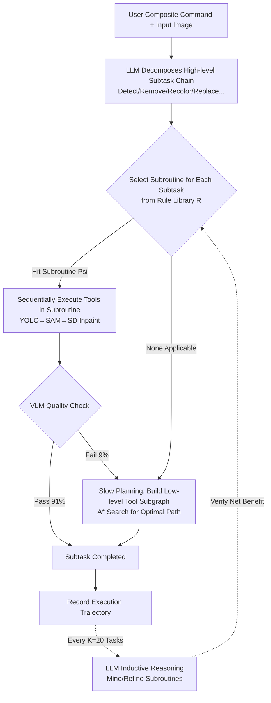

# FaSTA*: Fast-Slow Toolpath Agent with Subroutine Mining for Efficient Multi-turn Image Editing

**Conference**: ICLR 2026  
**OpenReview**: [https://openreview.net/forum?id=yhhbL9T1QB](https://openreview.net/forum?id=yhhbL9T1QB)  
**Code**: The paper claims to be open-source (Our code and data can be accessed here)  
**Area**: LLM Agent / Neuro-symbolic Tool Use / Multi-turn Image Editing  
**Keywords**: Toolpath Planning, Neuro-symbolic Agent, A* Search, Subroutine Mining, Fast-and-Slow Thinking, In-Context RL  

## TL;DR
FaSTA* integrates LLM "fast planning" with A* search "slow planning" into a learning neuro-symbolic agent: it utilizes inductive reasoning to mine reusable symbolic subroutines—acting as "high-level tools"—from historical successful toolpaths. Most subtasks are solved instantly by applying these subroutines, with expensive A* search triggered only upon failure. Compared to CoSTA*, it reduces costs by 49.3% in multi-turn image editing with only a 3.2% decrease in quality.

## Background & Motivation
**Background**: Multi-turn image editing (e.g., "detect the bench and paint it pink, while removing the cat and painting the wall yellow") requires decomposing a composite instruction into a sequence of heterogeneous subtasks like detection, segmentation, inpainting, and recoloring, each handled by specialized AI tools. Direct long-range editing with text-to-image models is difficult, making tool-calling agents the mainstream: tasks are decomposed into subtasks, and a "toolpath" (a sequence of tool calls) is planned for each.

**Limitations of Prior Work**: Tool quality and costs vary significantly across different tasks and even samples, making planning highly dependent on accurate estimates of per-step tool quality/cost. Existing approaches have shortcomings: LLM agents excel at "fast planning" (rapidly decomposing subtasks based on priors) but often misestimate tool costs/quality or hallucinate (selecting expensive diffusion models when a simple filter suffices). Classical A* search can calculate verifiable optimal paths on a tool dependency graph, but the exploration is expensive and forms a computational bottleneck. The predecessor CoSTA* uses LLMs to prune subgraphs before running A*, which yields good results but maintains high A* search costs.

**Key Challenge**: CoSTA* is a pure test-time method that **searches from scratch every time**, failing to accumulate experience from explored tasks to accelerate future ones. The authors observed that tool subsequences frequently repeat across tasks (e.g., "YOLO → SAM → SD Inpaint" was used for object removal 57 times across 100 tasks). Humans record high-frequency operations as macros for reuse; why can't machines?

**Goal**: To allow the agent to learn reusable actions from historical experience like a human, significantly depressing toolpath search costs without sacrificing quality.

**Core Idea**:
- **[Symbolic Subroutine Memory]** Use LLMs for inductive reasoning on historical successful paths to extract high-frequency tool subsequences as symbolic rules with trigger conditions, treated as new "high-level tools."
- **[Adaptive Fast-Slow Planning]** Construct "fast plans" using subroutines first, with **lazy triggering** of A* slow search for a subtask only when subroutines fail or are inapplicable.

## Method

### Overall Architecture
FaSTA* is built upon CoSTA*: it first uses an LLM to decompose instructions into a chain of subtasks and then finds toolpaths for each. It introduces two key upgrades—**online subroutine mining** (inducing a symbolic rule library $R$ from historical trajectories) and **adaptive fast-slow execution** (defaulting to subroutine fast plans and falling back to A* slow search only upon failure). This is essentially a novel form of In-Context RL: instead of storing all raw trajectories, it condenses them into a small set of reusable, interpretable subroutine principles to guide future tasks.

### Key Designs

**1. Online Inductive Mining of Reusable Subroutines: Compressing trajectories into symbolic rules.** A subroutine $P_s=(t_1,t_2,\dots,t_k)$ is an ordered sequence of tool calls that effectively completes a subtask under specific conditions $C_s$. The entire memory is a rule table $R=\{(P_j,C_j,s_j)\}_{j=1}^M$ mapping "subtask + context features → cost-effective subroutine." Unlike standard ICRL that feeds raw logs, FaSTA* employs **explicit inductive reasoning**: after analyzing trajectories, it synthesizes compact "(subroutine, activation rule, subtask)" triplets. The cycle involves four steps: ① **Data Recording**: Continuously logging conditions, paths, and results (e.g., object size via YOLO, mask details via SAM, background complexity inferred by LLM, cost/quality/failure); ② **Periodic Refinement**: Triggered every $K=20$ tasks using the latest batch of trajectories to balance continuous learning and system stability; ③ **LLM Induction**: Prompting the LLM with recent trajectories and the current rule set to identify high-frequency successful subroutines and infer activation conditions—critically using **semantic bucketing** for conditions (e.g., "small object area," "high mask ratio" rather than `area ≤ θ`) for better robustness and generalization; ④ **Verification and Adoption**: Treating LLM-proposed rules as hypotheses and using a dedicated test set to calculate a "Net Benefit" score (balancing cost/quality) against a baseline to decide on integration into $R$. Refinement can be retried upon failure. To ensure fairness, induction is performed on a held-out task set (random internet images + new complex instructions) outside the benchmark.

**2. Adaptive Fast-Slow Planning: Lazy fallback with fast-by-default.** After obtaining the subtask chain, FaSTA* initially **skips search** to generate a "fast plan." An LLM (GPT-4o) takes the input image, instruction, subtask sequence $s_{1:N}$, and rule set $R$ to select a subroutine $P_{s_i}$ or "None" for each subtask $s_i$. If multiple subroutines satisfy activation conditions for the same subtask, the one with the lowest cost-quality trade-off score is selected:

$$C_{avg}(P_j)^{\alpha}\times(2-Q_{avg}(P_j))^{2-\alpha}$$

where $C_{avg},Q_{avg}$ are the average cost and quality of the subroutine in historical paths, and $\alpha$ is a user-defined trade-off coefficient (following CoSTA*). After obtaining the fast plan $M_{subseq}=(P_{s_1},\dots,P_{s_N})$, execution proceeds sequentially, calling tools within each subroutine and checking quality via a VLM at each step. The **Slow Planning Trigger** is central—only when no subroutine is selected ($s_i$=None) or when a VLM quality check fails does the agent construct a low-level tool subgraph $G_{low}(s_i)$ and run A* search locally for that specific subtask. Statistics show that 91% of subtasks are solved via subroutines, with only 9% falling back to A*.

**3. Subroutine Verification: Preventing memory contamination by bad rules.** Rules proposed by LLMs are merely hypotheses. Adopting them without verification could lead to frequent execution failures or mislead the agent when A* is truly needed. FaSTA* evaluates each change $\Delta$ using a Net Benefit score on a validation set against the baseline (CoSTA* or current FaSTA*). Ablations show that the low-level fallback rate is 28% without verification, dropping to 9% with it—verification ensures only reliable subroutines enter the library.

## Key Experimental Results

### Main Results
On the CoSTA* benchmark (121 image-instruction pairs, 1–8 subtasks, 550 total operations), with $\alpha=1$ (balanced setting):

| Task Type | FaSTA* | CoSTA* | GenArtist | CLOVA | InstructPix2Pix | MagicBrush |
|---|---|---|---|---|---|---|
| Image Tasks | 0.91 | 0.94 | 0.78 | 0.70 | 0.64 | 0.67 |
| Text+Image Tasks | 0.91 | 0.93 | 0.61 | 0.50 | 0.40 | 0.43 |
| **All Tasks** | **0.91** | **0.94** | 0.73 | 0.63 | 0.56 | 0.59 |

Quality drops by only 3.2% compared to CoSTA* but significantly outperforms all other baselines (especially on long-range tasks with 7-8 subtasks where CoSTA*/FaSTA* maintain 0.91+, while others drop to 0.4–0.6). **Cost**: FaSTA* averages 29.5s vs CoSTA* 58.2s ($\alpha=1$), a reduction of 49.3%.

Cross-dataset generalization (Complex-Edit benchmark subset):

| Task Complexity | Metric | CoSTA* | FaSTA* |
|---|---|---|---|
| 1-3 Subtasks | Cost(s)/Accuracy | 46.75 / 0.88 | 35.87 / 0.86 |
| 4-5 Subtasks | Cost(s)/Accuracy | 77.25 / 0.90 | 54.17 / 0.89 |
| 6-8 Subtasks | Cost(s)/Accuracy | 105.60 / 0.90 | 73.20 / 0.88 |
| **Total** | Avg Cost/Accuracy | 78.27 / 0.89 | **55.12 / 0.87** |

A cost reduction of approximately 30% with comparable quality on an independent benchmark proves the gains are generalizable.

### Ablation Study

| Experiment | Setting | Result |
|---|---|---|
| Subroutine Verification | w/o Verification | Low-level fallback rate **28%** |
| | w/ Verification | Low-level fallback rate **9%** |
| Fast-Slow Components | Fast Planning Only | Quality 0.84 / Cost 27.5s (Fragile) |
| | Slow Planning Only | Quality 0.93 / Cost 46.8s (Expensive) |
| | **FaSTA*** | **Quality 0.91 / Cost 29.5s** (Balanced) |

### Key Findings
- **Fallback Statistics**: 91% of subtasks are resolved by fast subroutines, while only 9% require slow A* search—effectively avoiding expensive searches.
- **Faster with Experience**: On held-out sets, the success rate of pure fast planning rises **exponentially** as more subroutines are mined; FaSTA* improves with use.
- **Fast and Slow are Interdependent**: Fast planning alone drops quality to 0.84 (failing if subroutines fail), whereas slow planning alone is expensive at 46.8s; FaSTA* achieves the best of both via lazy fallback.
- **Pareto Dominance**: Across different $\alpha$ values, FaSTA*’s cost-quality frontier consistently outperforms CoSTA* and other baselines.

## Highlights & Insights
- **"Macro Mining" is a valuable observation**: The authors' discovery of highly repetitive tool subsequences in CoSTA* paths (high reuse of Top-5 subroutines) is a data-driven insight that directly motivated the method.
- **Symbolic + Semantic Bucketing for Interpretability**: Storing symbolic rules like "if object is small and mask ratio is high then YOLO→SAM→SD Inpaint" rather than raw logs or numerical thresholds makes the system more robust, readable, and auditable.
- **Lazy Fallback as an Elegant Engineering Solution**: Defaulting to fast and falling back only on failure moves the "when to think deeply" decision to dynamic VLM quality checks rather than a predefined threshold. The 91%/9% split proves this gate is effective.
- **Indispensable Verification Mechanism**: The ablation showing fallback rates jumping to 28% without verification quantifies the cost of "bad rules," emphasizing that "LLM proposals as hypotheses requiring empirical verification" is a critical guardrail for self-learning agents.

## Limitations & Future Work
- **Heavy Dependency on CoSTA***: KB structures (TDG / MDT / BT), A* cost functions, and VLM check standards are all inherited from CoSTA*. It is an incremental enhancement, and its validity outside this predefined scaffold remains untested.
- **3.2% Real Quality Loss**: Trading speed for subroutines is not a free lunch, with occasional performance drops in long-range tasks; quality-sensitive scenarios might not accept this trade-off.
- **Cold Start and Domain Transfer**: Induction requires accumulating enough historical trajectories (refining every 20 tasks). Success rates for fast planning are low during cold starts in new domains or with new toolsets.
- **Evaluation Relies Heavily on Humans**: Since automatic metrics like CLIP fail to capture subtle errors in multi-step multimodal editing, quality scores rely on human labeling, limiting scalability and reproducibility.
- **Trigger Condition Reliability**: The reliability of the fast-slow split depends on the accuracy of VLM quality checks; VLM misjudgments can let bad paths pass or trigger unnecessary fallbacks.

## Related Work & Insights
- **vs CoSTA*** (Gupta et al. 2025): The direct predecessor and main baseline, providing the benchmark and underlying search framework. FaSTA*’s core increment is adding "experience reuse + fast-slow splitting," turning a test-time search into a learning agent.
- **vs Tool-calling Agents** (GenArtist, CLOVA, Visual ChatGPT, MM-REACT): These either use greedy tool calling regardless of budget or lack mechanisms to learn from historical patterns, leading to redundant computation. FaSTA*’s subroutine memory addresses this gap.
- **vs ICRL** (In-Context RL): Standard ICRL stuffs raw logs into context, which is inefficient for generalization. FaSTA* improves this by explicitly inducing logs into compact symbolic rules.
- **Insight**: This paradigm of "High-frequency substructure mining → Symbolization → Lazy fallback" is not limited to image editing. Any tool agent involving "LLM planning + expensive search/execution" (Code Agents, Web Agents, Robotics) can benefit—precipitating successful recurring sub-processes into reusable skills and using quality gates to decide when to engage "slow thinking."

## Rating
- **Novelty**: ⭐⭐⭐⭐ — The combination of "symbolic subroutine memory + adaptive fast-slow planning" is novel, operationalizing the human intuition of "macro reuse" into a learnable neuro-symbolic agent; however, it remains an incremental build on CoSTA*.
- **Experimental Thoroughness**: ⭐⭐⭐⭐ — Comprehensive benchmarks, Pareto frontiers, fallback statistics, and component ablations are provided. The only drawback is the reliance on small-scale human evaluation (121+ subset).
- **Writing Quality**: ⭐⭐⭐⭐ — The motivational chain (repeating patterns → macros → fast-slow split) is well-reasoned, and diagrams are effective; some technical details are moved to the appendix.
- **Value**: ⭐⭐⭐⭐ — Halving costs with negligible quality loss is highly practical for cost-sensitive tool agent deployment, and the paradigm is transferable to other planning-and-search agents.

<!-- RELATED:START -->

## Related Papers

- [\[ICLR 2026\] M²-Miner: Multi-Agent Enhanced MCTS for Mobile GUI Agent Data Mining](m2-miner_multi-agent_enhanced_mcts_for_mobile_gui_agent_data_mining.md)
- [\[CVPR 2026\] iSHIFT: Lightweight Slow-Fast GUI Agent with Adaptive Perception](../../CVPR2026/llm_agent/ishift_lightweight_slow-fast_gui_agent_with_adaptive_perception.md)
- [\[ICLR 2026\] Evaluating Memory in LLM Agents via Incremental Multi-Turn Interactions](evaluating_memory_in_llm_agents_via_incremental_multi-turn_interactions.md)
- [\[ICLR 2026\] ToolACE-MT: Non-Autoregressive Generation for Agentic Multi-Turn Interaction](toolace-mt_non-autoregressive_generation_for_agentic_multi-turn_interaction.md)
- [\[ICLR 2026\] Efficient Agent Training for Computer Use](efficient_agent_training_for_computer_use.md)

<!-- RELATED:END -->
