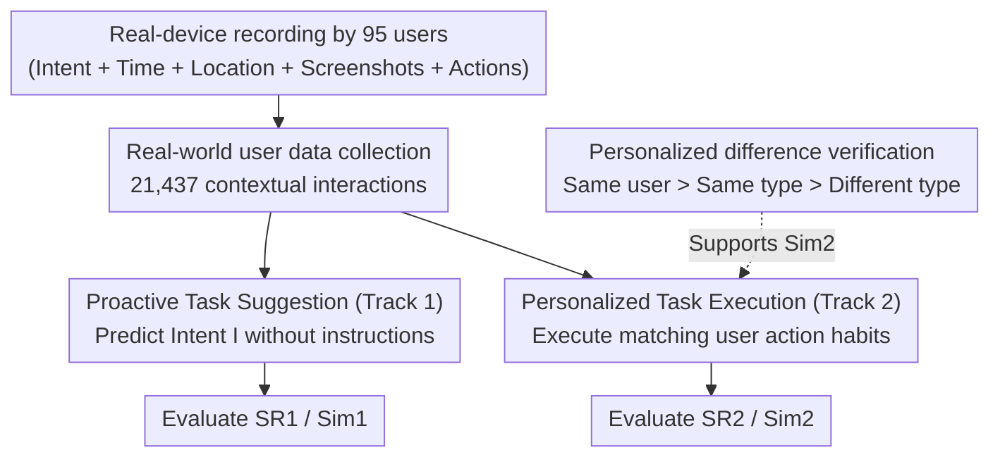

# FingerTip 20K: A Benchmark for Proactive and Personalized Mobile LLM Agents

**Conference**: ICLR 2026  
**arXiv**: [2507.21071](https://arxiv.org/abs/2507.21071)  
**Code**: [https://github.com/tsinghua-fib-lab/FingerTip-20K](https://github.com/tsinghua-fib-lab/FingerTip-20K)  
**Area**: Agent  
**Keywords**: mobile agent, proactive suggestion, personalized execution, GUI agent, benchmark

## TL;DR
FingerTip 20K collects 21,437 interaction records (including user personas, time, location, and historical intents) from 95 users in real-world daily mobile usage. It proposes two new tracks: Proactive Task Suggestion (predicting user intent) and Personalized Task Execution (adapting to action preferences). The strongest model, Qwen-QVQ-Max, achieves a proactive suggestion success rate of only 12.8% (vs. 30.3% for humans), while UI-TARS reaches an execution success rate of only 38.5%.

## Background & Motivation

**Background**: Mobile GUI Agents automate smartphone operations by understanding screenshots and UI trees through MLLMs. Existing agents follow a passive paradigm—they must receive explicit instructions to act and do not consider user preferences during execution.

**Limitations of Prior Work**: (a) Users must formulate detailed instructions for every intent, increasing cognitive burden; (b) Users sometimes cannot clearly express latent needs (e.g., wanting to read news during a commute without explicitly stating it); (c) Action sequences for the same task can vary significantly between users (e.g., searching for an app vs. swiping pages), which current agents ignore; (d) Tasks in existing datasets are preset by authors or generated by LLMs, failing to reflect real-world daily usage patterns.

**Key Challenge**: Achieving proactivity and personalization requires long-term interaction data containing user context (time, location, persona) and history. However, current datasets consist of isolated samples lacking temporal correlation and contextual information.

**Goal**: (a) Construct a real-world mobile interaction dataset with rich user context; (b) Define two new evaluation tracks: Proactive Task Suggestion and Personalized Task Execution.

**Key Insight**: Capture daily operations by having 95 users use a dedicated app on their own smartphones for one month. For every real intent, the intent text, action sequence, screenshots, location, and time are recorded, forming temporally correlated long-term usage data.

**Core Idea**: Continuously collect contextual interaction data from users' daily mobile usage and evaluate agents' proactive suggestion and personalized execution capabilities based on this data.

## Method

### Overall Architecture
This work does not propose a new model but extends the evaluation of mobile GUI agents from "passive instruction execution" to two tracks closer to real-world usage. To achieve this, contextual long-term interaction data was first required. The authors recruited 95 users to record their daily operations for a month using a dedicated app. Each intent was recorded along with time, location, screenshots, and action sequences, totaling 21,437 timestamped records. Based on this data, two evaluation tracks were established: **Proactive Task Suggestion (Track 1)** requires models to predict the user's current intent without instructions, and **Personalized Task Execution (Track 2)** requires models to complete tasks while matching the user's specific operational habits. Track 2 is supported by a statistical validation showing that "action preferences" are real and measurable.

### Key Designs

**1. Real-world Data Collection: Contextual and Temporal Data**

Unlike existing datasets with isolated, preset tasks, this approach involved 95 users installing a dedicated FingerTip app on their Android phones for a month. Whenever a real intent arose, users recorded the intent in text, selected the location type, and demonstrated the operation. The app automatically uploaded the intent (with timestamps and location), screenshot sequences, accessibility trees (UI trees), and action sequences. This captures daily patterns (e.g., ordering food at lunchtime) and provides the basis for long-term contextual inference.

**2. Proactive Task Suggestion (Track 1): Intent Prediction Without Instructions**

This track addresses the burden of explicit instruction. Intent prediction is formalized as $I = f(U, T, S, I_{history}, O)$, where the model is given a user persona $U$ (age, gender, occupation, etc.), timestamp $T$, scene $S$ (location category), up to 20 historical intents $I_{history}$, and initial screenshots $O$. The goal is to output a clear intent $I$ specifying the app and desired outcome. Evaluation uses two metrics: semantic similarity between predicted and ground-truth intent $Sim_1$, and a success rate $SR_1$ determined by DeepSeek-V3.

**3. Personalized Task Execution (Track 2): Subjective Action Matching**

Different users take different paths to complete the same task. In this track, the model is provided with persona $U$, ground-truth intent $I_{true}$, historical action sequences $A_{history}$ (for in-context imitation), current actions $A_{agent}$, and UI state. Beyond the success rate $SR_2$ (manually verified), personalization is measured by the ratio $Sim_2 = S_I / S_{II}$, where $S_I$ is the similarity of agent actions to the target user's history and $S_{II}$ is the similarity to different user types. A higher ratio indicates stronger personalization.

**4. Personalized Difference Verification: Proving Action Preferences**

To validate $Sim_2$, the authors confirmed that action preferences exceed noise. Users were categorized by age, and Levenshtein similarity (normalized $[0,100]$) was calculated for similar intents. Results showed a clear hierarchy: Same User > Same Type > Different Type, proving that action preferences exist and are quantifiable via sequence similarity.

### Loss & Training
Benchmark evaluations were conducted in a zero-shot setting. Fine-tuning experiments employed Qwen-2.5-VL-7B with LoRA (rank=4/64), utilizing samples of 1,000 and 16,000 records from the training set.

## Key Experimental Results

### Main Results

**Proactive Task Suggestion (0 initial screenshots)**:

| Model | SR1 (%) | Sim1 | Time/Query |
|------|---------|------|----------|
| GPT-4.1 | 7.2 | 0.35 | 5.64s |
| Qwen-QVQ-Max (thinking) | **12.8** | **0.39** | 10.60s |
| Human | **30.3** | **0.57** | - |

**Personalized Task Execution**:

| Model | SR2 (%) | Sim2 | Step Ratio |
|------|---------|------|-----------|
| GPT-4.1 | 5.5 | 0.98 | 1.98 |
| Qwen-QVQ-Max | 9.5 | 1.04 | 1.94 |
| UI-TARS-1.5-7B | **38.5** | 1.06 | 1.22 |
| AppAgent | 11.0 | **1.12** | **1.13** |

### Ablation Study

| Configuration | Key Findings |
|------|---------|
| Screenshots 0→3 | SR1 significantly improves as screenshots narrow the intent space |
| Action length 1-5 vs 11+ | SR2 drops significantly as action length increases |
| FT on 1K data | SR1: 3.1→16.3%, SR2: 1.5→32.0% (vs base Qwen-2.5-VL-7B) |
| FT on 16K data | SR1: 3.1→19.8%, SR2: 1.5→43.5% |

### Key Findings
- **Significant Human-AI Gap**: The strongest model achieved 12.8% SR1 vs. 30.3% for humans, highlighting the challenge of contextual intent inference.
- **$Sim_2 \approx 1.0$ Across Models**: Agents tend to execute tasks in a generic manner, ignoring user preferences—personalized execution capability is near zero.
- **GUI-specific Models >> General Models**: UI-TARS (38.5%) outperformed GPT-4.1 (5.5%), primarily due to superior GUI grounding.
- **Significant Fine-tuning Gains**: Even 1K samples allowed a 7B model to improve drastically, proving users' information in the data is learnable.

## Highlights & Insights
- **Two New Evaluation Dimensions**: Proactive suggestion and personalized execution were systematically evaluated for the first time, quantitatively revealing a major research gap.
- **Value of Real-world Daily Data**: Data from 95 users over a month is qualitatively different from simulator data—it is temporally linked and context-rich.
- **Implications of $Sim_2 \approx 1.0$**: Current agents lack not just the ability but the "awareness" to prioritize personalization, suggesting a need for architectural user-modeling mechanisms.
- **Fine-tuning Potential**: The success of small-scale user-specific fine-tuning suggests that learning from user history via SFT or ICL is a viable path forward.

## Limitations & Future Work
- Geographic and ecosystem bias (95 Chinese users, primarily Chinese apps).
- Proactive suggestion evaluation relies on semantic similarity and LLM judgment, which may have biases.
- The $Sim_2$ metric (Levenshtein distance) is sensitive to order but does not account for semantic equivalence of different action sequences.
- Limited to Android; iOS scenarios are not covered.
- Data collection relies on active user recording, potentially missing unconscious usage patterns.

## Related Work & Insights
- **vs. AndroidWorld/AitW**: Unlike these benchmarks with preset, isolated tasks, FingerTip 20K provides real-world, temporally correlated data with user context.
- **vs. Proactive Agent (Lu et al.)**: While prior work focuses on text-based web/PC scenarios, FingerTip 20K addresses large-scale mobile GUI visual scenarios.
- **vs. SPHINX/SPA-Bench**: These focus solely on execution, whereas FingerTip 20K evaluates both proactivity and personalization.

## Rating
- Novelty: ⭐⭐⭐⭐⭐ Fills a critical gap with two entirely new evaluation dimensions.
- Experimental Thoroughness: ⭐⭐⭐⭐ Extensive model testing and fine-tuning, though real-device evaluation scale is naturally constrained.
- Writing Quality: ⭐⭐⭐⭐ Clear problem definitions and detailed data methodology.
- Value: ⭐⭐⭐⭐⭐ Defines the next steps for mobile agents beyond mere execution.

<!-- RELATED:START -->

## Related Papers

- [\[CVPR 2026\] ProactiveMobile: A Comprehensive Benchmark for Boosting Proactive Intelligence on Mobile Devices](../../CVPR2026/llm_agent/proactivemobile_a_comprehensive_benchmark_for_boosting_proactive_intelligence_on.md)
- [\[ICLR 2026\] ProRe: A Proactive Reward System for GUI Agents via Reasoner–Actor Collaboration](prore_a_proactive_reward_system_for_gui_agents_via_reasoneractor_collaboration.md)
- [\[ICLR 2026\] SMAN-Bench: A Cross-System Benchmark for Mobile Agents under Single- and Multi-path, Ambiguous, and Noisy Tasks](sman-bench_a_cross-system_benchmark_for_mobile_agents_under_single-_and_multi-pa.md)
- [\[CVPR 2026\] GUI-CEval: A Hierarchical and Comprehensive Chinese Benchmark for Mobile GUI Agents](../../CVPR2026/llm_agent/gui-ceval_a_hierarchical_and_comprehensive_chinese_benchmark_for_mobile_gui_agen.md)
- [\[ICLR 2026\] ST-WebAgentBench: A Benchmark for Evaluating Safety and Trustworthiness in Web Agents](st-webagentbench_a_benchmark_for_evaluating_safety_and_trustworthiness_in_web_ag.md)

<!-- RELATED:END -->
