# Flash-Searcher: Fast and Effective Web Agents via DAG-Based Parallel Execution

**Conference**: ICLR 2026  
**OpenReview**: [https://openreview.net/forum?id=QuaJ6kJaBm](https://openreview.net/forum?id=QuaJ6kJaBm)  
**Code**: [https://github.com/OPPO-PersonalAI/Flash-Searcher](https://github.com/OPPO-PersonalAI/Flash-Searcher)  
**Area**: LLM Agent / Web Agent / Deep Research  
**Keywords**: Parallel Inference, DAG, Tool-augmented Agent, Deep Research, Workflow Optimization, Distillation  

## TL;DR
This work rewrites the traditional "serial chain-of-thought" of web agents into a "DAG-based parallel execution graph." By allowing independent subtasks to perform retrieval and reasoning simultaneously, it achieves SOTA results on BrowseComp, xbench, GAIA, and HLE while reducing execution steps by 35% and end-to-end time by approximately 65%.

## Background & Motivation
**Background**: Current agents for complex deep research tasks follow two main paradigms: Multi-Agent Systems (MAS), where multiple specialized agents collaborate on planning and reasoning, and Tool-Integrated Reasoning (TIR), which embeds tool-use capabilities into a single model via training. Both have shown significant capabilities on internet-scale retrieval benchmarks like BrowseComp.

**Limitations of Prior Work**: Both MAS and TIR inherently rely on **serial processing**. MAS suffers from inefficient tool utilization, long reasoning chains, and excessive execution time due to sequential scheduling and redundant communication. TIR tends to extend reasoning chains until they exceed the context window. Furthermore, both paradigms often overlay reflection, self-criticism, and iterative verification to improve reliability, further increasing computational overhead—completing a single deep research task often requires 20+ or even 40+ interactions, taking hours.

**Key Challenge**: There is a sharp tension between solution quality and computational efficiency. Increased task complexity leads to longer serial chains and higher latency, degrading user experience and limiting the deployment of agents in responsive applications. The authors question whether users are willing to tolerate (or pay for) several hours of waiting for marginal performance gains.

**Goal**: Fundamentally compress execution steps and latency without sacrificing task quality, redefining the "efficiency-effectiveness" frontier for complex task solving.

**Core Idea**: **[Transform the execution paradigm from a serial chain to a Directed Acyclic Graph (DAG)]**—decompose complex tasks into subtasks with explicit dependencies, execute non-dependent reasoning paths concurrently, continuously rewrite the execution graph via dynamic workflow optimization based on intermediate results, and utilize proactive retrieval and knowledge sharing to reduce redundant interactions.

## Method

### Overall Architecture
Flash-Searcher converts traditional linear workflows into a **dynamic DAG plan**. The pipeline proceeds through a three-step cycle: first, decomposing task $T$ into a sub-goal graph $G_{\text{plan}}$ with dependencies; second, parallelly scheduling "ready" subtasks and invoking tools concurrently; third, adaptively rewriting the DAG and summarizing progress every $\Delta$ steps based on completed results until all subtasks are finished and a final answer is generated.

```mermaid
flowchart TD
    T[Complex Task T] --> D[DAG Plan Construction D&#40;T&#41;]
    D --> G["G_plan = &#40;V, E&#41;<br/>Subtasks + Dependency Edges"]
    G --> E{Readiness Predicate φ<br/>Select Executable Subtasks}
    E --> P[Parallel Execution & Tool Orchestration<br/>Concurrent Search/Crawl Branches]
    P --> S[Status Aggregation F<br/>Integrate Multi-path Observations]
    S --> R{Every Δ Steps:<br/>Adaptive DAG Rewriting R}
    R -->|Remove Completed / Add New Nodes| E
    R -->|P_t is Empty| A[Progress Summary → Final Answer]
```

### Key Designs

**1. DAG Plan Construction: Explicitly modeling task dependencies as a graph to unlock parallelism.** Given a composite task $T$, the decomposition function $\mathcal{D}$ identifies constituent subtasks and their interdependencies, producing a DAG plan $\mathcal{D}(T)=G_{\text{plan}}=(V,E)$, where $V=\{t_1,\dots,t_n\}$ are subtask nodes and $E\subseteq V\times V$ encodes sequential constraints—each directed edge $(t_i,t_j)$ indicates that $t_i$ must precede $t_j$. This structure identifies independent objectives early, providing a boundary for concurrent scheduling.

**2. Aggressive Parallel Scheduling + Tool Orchestration: Relaxing topological sorting to allow "partially ready" execution.** At execution step $t$, the framework selects candidate subtasks $\mathcal{E}(G_t,\mathcal{P}_t)=\{v_i\in\mathcal{P}_t\mid\varphi(v_i,G_t,s_t)=1\}$ from the pending set $\mathcal{P}_t\subseteq V$ using a readiness predicate $\varphi$. Notably, $\varphi$ is not a strict topological sort: a subtask $v_i$ can be scheduled if (i) all predecessors are finished, **or** (ii) partial execution can provide auxiliary signals for dependency verification. Multiple selected subtasks are executed via concurrent tool/agent calls, and results are aggregated into the reasoning state $s_{t+1}=\mathcal{F}\big(s_t,\{a_t^{(k)}\}_{k=1}^m,\{o_t^{(k)}\}_{k=1}^m\big)$, where $a_t^{(k)}$ and $o_t^{(k)}$ represent actions and observations from the $k$-th parallel branch.

**3. Adaptive Progress Tracking and DAG Rewriting: Dynamically optimizing the execution graph every $\Delta$ steps.** The framework refreshes the DAG plan periodically: $G_{\text{plan}}^{t+\Delta}=\mathcal{R}\big(G_{\text{plan}}^{t},\mathcal{C}_t,\mathcal{P}_t,s_t\big)$, where $\mathcal{C}_t$ is the set of completed subtasks. The rewriting rule $\mathcal{R}$ removes solved nodes, re-verifies unresolved dependencies based on cross-validation results, and dynamically inserts new decomposition nodes as needed. The parameter $\Delta$ controls the frequency of optimization.

**4. Parallel Trajectory Distillation: SFT framework-level parallel reasoning capabilities into a single model.** To verify portability, the authors constructed 3,354 high-quality DAG reasoning trajectories from sources like WebWalker and WebShaper. These include periodic DAG workflow reviews and are formatted as multi-turn dialogues. Qwen-2.5 models were trained using lightweight SFT (max context 131,072 tokens, learning rate $10^{-5}$, 4 epochs, **no RL, no tool-dependence**). This converts "parallel reasoning" into a learnable inductive bias.

## Key Experimental Results

### Main Results (Framework, Pass@1)
Flash-Searcher with GPT-5 leads or matches the strongest closed-source solutions across four benchmarks:

| Benchmark | Flash-Searcher (GPT-5) | Representative Competitors |
|------|------|------|
| BrowseComp | **67.7** | OpenAI ChatGPT agent 68.9 / BrowseMaster (Open Source) 30.0 |
| xbench-DeepSearch | **83.0** | BrowseMaster 66 / Metaso DR 64 |
| GAIA | 82.4 | Alita 75.2 / Manus 73.3 |
| HLE | **44.0** | OAgents 26.9, widespread lead |

Even using GPT-5-mini, BrowseComp reaches 35.3%, and GAIA reaches 80.6%, outperforming Alita and Manus, demonstrating that the parallel paradigm is backbone-agnostic.

### Distilled Agent Models (Table 1, Pass@1)
SFT transfers parallel capabilities to open-source models, setting new SOTA for their size:

| Backbone | Method | BrowseComp | xbench | GAIA | HLE |
|------|------|------|------|------|------|
| Qwen-2.5-32B | AFM-RL | 11.1 | 58.0 | 55.3 | 18.0 |
| Qwen-2.5-32B | **Flash-Searcher** | **14.4** | **63.0** | **57.3** | **19.4** |
| Qwen-2.5-72B | WebSailor | 12.0 | 55.0 | 55.4 | - |
| Qwen-2.5-72B | **Flash-Searcher** | **18.9** | **68.0** | **61.2** | **20.2** |

The 32B model shows a Gain of +3.3 on BrowseComp and +5.0 on xbench over previous best methods. The gains scale with model size, particularly on the most complex benchmarks.

### Efficiency Analysis (GPT-5-mini)
- On GAIA, execution steps decreased by **35%** (11.2 to 7.4 steps). End-to-end time on BrowseComp was reduced from 27.4 minutes to ~9.6 minutes (**−65%**).
- Average tool calls per step reached **3.00**, compared to 0.83 for OAgents and 0.85 for OWL-Roleplaying.
- Complexity correlates with greater improvements (BrowseComp > xbench > HLE > GAIA), simultaneously improving efficiency and performance.

### Key Findings
DAG parallel execution eliminates redundant tool call loops found in serial chains. By coordinating information needs across branches, it reduces steps while maintaining reasoning diversity, breaking the traditional speed-accuracy trade-off.

## Highlights & Insights
- **Paradigm-level Modification**: Instead of applying tricks to a serial chain, the system-level foundation is replaced with a graph, treating parallelism as a first-class citizen.
- **Controlled Aggressive Parallelism**: The readiness predicate $\varphi$ allows execution even before all predecessors are fully complete, using cross-validation as a safety net.
- **Tool Minimalism**: High performance is achieved using only Search and Crawl tools, proving that complex toolsets are not necessary if the execution orchestration is efficient.
- **Transferable Inductive Bias**: Parallelism is demonstrated to be a distilled capability, successfully transferred to open-source Qwen models via minimal SFT without RL.

## Limitations & Future Work
- **Lack of Module-level Ablation**: The paper focuses on overall performance/efficiency; detailed ablation on $\Delta$ values or the specific components of the readiness predicate is limited.
- **Dependency on External API Stability**: Execution time is sensitive to Serper/Jina API rate limits and inference non-determinism.
- **Task Decomposition Bottleneck**: The framework depends on correctly decomposing tasks into a valid DAG; errors in initial decomposition can propagate.
- **Cost Structure**: While total steps decrease, more detailed accounting is needed to determine if concurrent tool calls result in actual cost savings (addressed partially in Appendix D.3).

## Related Work & Insights
- **Comparison with MAS**: Prior works emphasize role division but rely on serial scheduling and redundant communication, underestimating latency issues.
- **Comparison with TIR**: TIR paradigms often result in long execution trajectories that exceed context windows; Flash-Searcher "widens" the workflow instead of "lengthening" it.
- **Vs. ParallelSearch**: While both aim for parallel retrieval, Flash-Searcher organizes the entire reasoning-execution process as a dynamic DAG with periodic optimization and knowledge sharing.
- **Insight**: When the bottleneck of an agent framework is chain length, one should first determine how many steps are independent. Explicitly modeling dependencies as a graph can simultaneously improve efficiency and effectiveness.

## Rating
- **Novelty**: ⭐⭐⭐⭐ — Systematic introduction of DAG parallel execution for web agents with dynamic rewriting and distillation.
- **Experimental Thoroughness**: ⭐⭐⭐⭐ — Broad coverage across four major benchmarks and multiple backbones.
- **Writing Quality**: ⭐⭐⭐⭐ — Sharp motivation and clear algorithmic descriptions.
- **Value**: ⭐⭐⭐⭐ — Breaks the efficiency-accuracy trade-off and provides open-source code/data for practical deep research implementation.

<!-- RELATED:START -->

## Related Papers

- [\[AAAI 2026\] Cook and Clean Together: Teaching Embodied Agents for Parallel Task Execution](../../AAAI2026/llm_agent/cook_and_clean_together_teaching_embodied_agents_for_paralle.md)
- [\[ICLR 2026\] In-the-Flow Agentic System Optimization for Effective Planning and Tool Use](in-the-flow_agentic_system_optimization_for_effective_planning_and_tool_use.md)
- [\[ICLR 2026\] Agent Data Protocol: Unifying Datasets for Diverse, Effective Fine-tuning of LLM Agents](agent_data_protocol_unifying_datasets_for_diverse_effective_fine-tuning_of_llm_a.md)
- [\[ICLR 2026\] Web-CogReasoner: Towards Multimodal Knowledge-Induced Cognitive Reasoning for Web Agents](web-cogreasoner_towards_multimodal_knowledge-induced_cognitive_reasoning_for_web.md)
- [\[ICLR 2026\] The Tool Decathlon: Benchmarking Language Agents for Diverse, Realistic, and Long-Horizon Task Execution](the_tool_decathlon_benchmarking_language_agents_for_diverse_realistic_and_long-h.md)

<!-- RELATED:END -->
