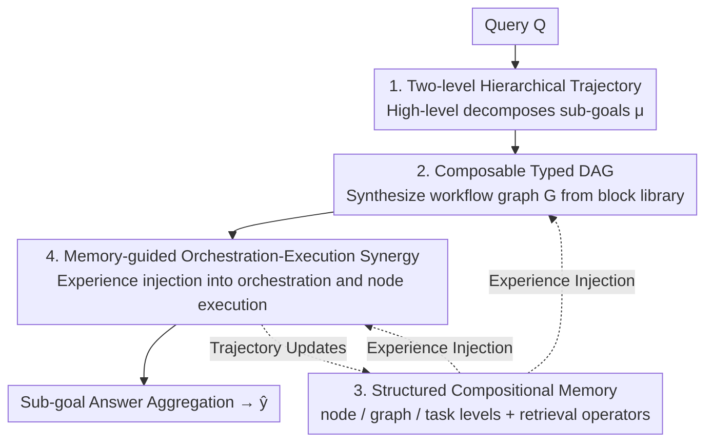

# FlowSearcher: Synthesizing Memory-Guided Agentic Workflows for Web Information Seeking

**Conference**: ICLR 2026  
**OpenReview**: [https://openreview.net/forum?id=34v7DVz2l0](https://openreview.net/forum?id=34v7DVz2l0)  
**Code**: https://github.com/XiangKeYiNTU/flowsearcher  
**Area**: LLM Agent / Deep Research / Agentic Workflow  
**Keywords**: Workflow Synthesis, Hierarchical Memory, Experience Reuse, Deep Research Agent, Web Information Seeking

## TL;DR
FlowSearcher reformulates web information seeking from "ReAct-style linear tool chains" to "memory-guided agentic workflow synthesis." By decomposing queries into sub-goals and synthesizing typed workflow DAGs for each, while injecting structured experience across node/graph/task levels into orchestration and execution, it matches or exceeds RL-trained agents on GAIA, BrowseComp, and GPQA without any supervised fine-tuning or RLHF.

## Background & Motivation
**Background**: Deep research agents have become a key path for transforming LLMs from "static knowledge bases" into "collaborators capable of web retrieval, evaluation, and synthesis," exemplified by OpenAI Deep Research and Gemini Advanced. Most open-source systems (WebThinker, WebDancer, Search-o1) follow the ReAct template, concatenating "Thought-Action-Observation" into linear trajectories or using plan-execute frameworks with fixed plans.

**Limitations of Prior Work**: The authors argue that the bottleneck is the "decision structure of how agents navigate the web" rather than model scale. ReAct-style single-threaded trajectories force inherently **branching** research queries into linear chains, suppressing parallel exploration, backtracking, and structural revisions. While plan-first frameworks offer higher-level organization, the plans remain static scaffolds that cannot adapt or re-rank when new evidence arrives.

**Key Challenge**: A deeper second pain point is "inability to learn across tasks." Most agents operate in episode isolation; tool calls occur in short reaction chains, and learned insights evaporate once the episode ends. Relying on ephemeral episodic memory, their chains-of-thought and tool trajectories are never consolidated into persistent structural knowledge, causing agents to "reinvent the wheel" without accumulation across similar tasks.

**Goal**: (1) Transform the workflow structure itself into a first-class object for reasoning, revision, and reuse; (2) Establish a cumulative structured memory to retain, organize, and reuse past workflows.

**Key Insight**: Rather than having the backbone LLM implicitly understand queries within a single trajectory, the "information seeking process" should be explicitly reasoned about. Expressing workflows as explicit graphs makes composition, ordering, and revision operable.

**Core Idea**: Replace "sequential tool call prediction" with "experience-driven workflow synthesis" and utilize hierarchical memory to inject structural knowledge of past trajectories into new workflow designs and executions, achieving learning-free generalization.

## Method

### Overall Architecture
FlowSearcher formalizes a research task and its solution trajectory as a triple $\{Q, \hat{y}, \Gamma\}$: $Q$ is the original query, $\hat{y}$ is the predicted answer, and $\Gamma = \{\mu_i, G_i\}$ is the trajectory composed of decomposed sub-problems $\{\mu_i\}$ and their corresponding workflow graphs $\{G_i\}$. The system maintains a structured execution memory $M$, updated incrementally to record trajectories and provide an empirical basis for subsequent synthesis and execution.

The solution is organized into **two-level trajectories**: high-level for "query decomposition + workflow synthesis" and low-level for "workflow execution." The high-level step-wise probability is:

$$P(\Gamma \mid Q, M_0) = \prod_{i=1}^{K} P(\mu_i \mid Q, \Gamma_{<i}, M_{i-1}, \theta_\mu)\, P(G_i \mid Q, \Gamma_{<i}, M_{i-1}, \theta_G, \mu_i),$$

where $\theta_\mu, \theta_G$ are prompts for the decomposition and synthesis modules. The low-level execution happens at the **node level** for each $G_i$. Nodes are executed based on dependency edges, interacting with the web environment to produce action sequences $\alpha$ and observations $o$ guided by memory. For a node with $K_v$ action steps: $P(\alpha, o \mid \mu_i, M_{i-1}) = \prod_{t=1}^{K_v} P(\alpha_t, o_t \mid \alpha_{<t}, o_{<t}, \mu_i, M_{i-1})$. A final aggregation produces $\hat{y}$.

### Key Designs

**1. Two-level Hierarchical Task Modeling: Decoupling "Process Design" and "Execution"**

ReAct tightly couples "query understanding" and "step-by-step action selection." FlowSearcher decouples this: the upper level handles "iterative decomposition and workflow structure determination," while the lower level focuses on "node-level execution of the graph." This separation allows orchestration to align with execution while grounding memory at different levels. This decoupling enables "nonlinear research behaviors"—branching, revisiting previous decisions, and reorganizing intermediate steps—at the graph level rather than forcing them into a linear chain.

**2. Workflows as Composable Typed DAGs: Structural Expressiveness via Building Blocks**

FlowSearcher represents workflows as **typed Directed Acyclic Graphs (DAGs)**, with nodes selected from a predefined library $\mathcal{B}$. Formally, the orchestrator constructs for sub-problem $\mu_i$:

$$\text{orchestrator}(Q, \mu_i, \Gamma_{<i}, B, \theta_G) \xRightarrow{M_{i-1}} G_i\big(V_{[\tau,\theta,l]}, E_{[\rho]}\big),\quad V \subseteq B,\ E \subseteq V \times V,$$

where $V_{[\tau,\theta,l]}$ are nodes parameterized by tool $\tau$, prompt mode $\theta$, and backbone model $l$. The library covers three categories: Searcher (General/First-Hit/Parallel), Browser (First-Hit/In-Depth/General), and Summarizer (General/Ensemble). $G_i$ is not a static assembly but an "evolutionary, experience-driven program" conditioned on context and memory.

**3. Structured Compositional Memory: Three Levels + Unified Retrieval**

To reuse experience across tasks, FlowSearcher implements a Structured Compositional Memory $M = \{M^{task}_j\}$:

- **Node-level** $M^{node}_v = (N_v, \alpha(v), o(v))$: Records node types, action sequences, and outputs for precise tool execution replay.
- **Graph-level** $M^{graph}_i = (\mathcal{G}_i, \mu_i, \gamma_i, n_i, \{M^{node}_v\})$: Stores the graph representation $\mathcal{G}_i$, success flag $\gamma_i$, and tool usage statistics $n_i$, enabling systematic reuse of effective strategies.
- **Task-level** $M^{task}_j = (Q_j, \xi_Q, \{M^{graph}_i\}_{i=1}^K)$: Encapsulates end-to-end question context and success status $\xi_Q$.

Retrieval is performed via operator $R(\cdot; \zeta)$:

$$R(Q^*, \mu^*; \zeta) = \mathop{\arg\text{top-}k}\limits_{M^{task},\, Q,\, M^\zeta,\, \mu}\left(\delta\,\frac{E(Q^*)\cdot E(Q)}{|E(Q^*)||E(Q)|} + (1-\delta)\,\frac{E(\mu^*)\cdot E(\mu)}{|E(Q^*)||E(Q)|}\right),$$

where $\delta$ balances query and sub-goal similarity.

**4. Memory-Guided Orchestration-Execution Synergy: Distilling Insights**

Experience injection follows a "Retrieve $\rightarrow$ Distill $\rightarrow$ Inject" pipeline at both ends. **Orchestration side**: Retrieves graph-level traces to distill structural insights $\xi_G$, used to ground the graph design. By comparing successful and failed workflows, the system uncovers structural patterns and resource efficiencies. **Execution side**: Retrieves node-level traces to distill execution insights $\xi_v$. This supports node-type specialization and cross-query transfer where new tasks inherit behaviors from structurally similar nodes. This framework is the first to implement "experience-driven agentic workflow planning."

## Key Experimental Results

### Main Results
Pass@1 results on GAIA (103 text tasks), BrowseComp, and GPQA-Diamond.

| Backbone | Framework | GAIA Avg. | GPQA Avg. | BrowseComp Avg. |
|----------|-----------|-----------|-----------|------------------|
| Qwen-2.5-32B | Vanilla ReAct | 31.0 | 53.0 | 0.0 |
| QwQ-32B | WebThinker-Base | 44.7 | 68.7 | 2.3 |
| QwQ-32B | WebThinker-RL | 48.5 | 70.7 | 2.7 |
| QwQ-32B | WebDancer | 51.5 | - | 3.8 |
| QwQ-32B | **FlowSearcher** | **56.3** | **71.2** | **8.0** |
| GPT-4o-mini | **FlowSearcher** | 55.3 | 65.7 | **11.8** |

On QwQ-32B, FlowSearcher outperforms WebDancer by +4.8 on GAIA and +4.2 on BrowseComp. On GPQA, it reaches 71.2, comparable to DeepSeek-R1-671B (74.2). Notably, WebThinker-RL (trained with heavy data/RL) only gained +3.8 on GAIA over its Base, while FlowSearcher (learning-free) achieved much higher gains, highlighting that fine-tuning cannot solve ReAct's structural bottlenecks.

### Ablation Study

| Config (Library Size) | Score | Description |
|------|---------|------|
| First-Hit only | 27.2 | Single search, stop at first hit |
| First-Hit + General | 35.0 | +7.8; multiple queries allowed, no depth navigation |
| No limitations (Full) | 55.3 | +20.3; full access to building blocks |

| Memory Composition | Success Count | Description |
|------|---------|------|
| Full Mem. | 57 | Long-term optimal; success+failure aid error correction |
| Succ.-Only | 53 | Fastest early rise (reinforcing correct patterns) |
| Unsucc.-Only | 48 | Slowest improvement |
| No Mem. | 42 | Baseline; underscores value of structural reuse |

### Key Findings
- **Expressiveness > Tool Count**: Expanding the building block library from First-Hit to Full yielded a +20.3% jump, far exceeding the gain from just adding tool variety. Structural strategy space is the primary performance driver.
- **Exploitation/Correction Trade-off**: Success-only memory helps early on, but full memory (including failures) is superior in the long run as failure traces reveal failure modes and guide structural revisions.
- **Adaptive Building Blocks**: Orchestrators allocate complex blocks (Parallel Searcher, In-Depth Browser) to higher-level GAIA tasks, proving the efficiency of automated design.

## Highlights & Insights
- **Workflow Structure as a First-Class Object**: Shifting from "implicit step-wise output" to "explicit, operable, and reusable DAGs" is the fundamental departure from ReAct.
- **Memory as a Driver, Not an Add-on**: Hierarchical memory retrieval shaped by both task query and current workflow structure allows experience to directly refine design and execution.
- **Learning-free vs. RLHF**: The finding that memory-driven design can unlock gains comparable to costly RL training is significant for scenarios without large-scale fine-tuning budgets.
- **Insight Distillation Paradigm**: Distilling raw traces into concise $\xi$ insights controls context length while providing actionable experience.

## Limitations & Future Work
- **Backbone Dependency**: Performance relies on the model's instruction-following and embedding quality; sensitivity to $\delta$ and $k$ requires more analysis.
- **Pre-defined Blocks**: While flexible, the library is currently human-designed; future work may involve automated discovery of tool-use patterns.
- **Memory Drift/Scale**: The management of memory overhead and misleading experiences as the memory grows remains a challenge.

## Related Work & Insights
- **vs. WebThinker/WebDancer**: These models use linear chains or end-to-end RL; FlowSearcher uses explicit DAG synthesis without training.
- **vs. AutoFlow/MermaidFlow**: These use fixed templates or offline evolution; FlowSearcher synthesizes workflows **dynamically at inference time**.
- **vs. A-MEM/Mem0**: They use fixed retrieval strategies; FlowSearcher's "workflow-conditional hierarchical memory" allows experience to directly feedback into workflow architecture.

## Rating
- Novelty: ⭐⭐⭐⭐⭐ Reframing web search as "experience-driven workflow synthesis" is a compelling paradigm shift.
- Experimental Thoroughness: ⭐⭐⭐⭐ Solid results on 3 benchmarks with multiple backbones, though could benefit from larger-scale longitudinal studies.
- Writing Quality: ⭐⭐⭐⭐ Clear formalization and diagrams.
- Value: ⭐⭐⭐⭐⭐ The learning-free performance gain is highly practical for deep research agent development.

<!-- RELATED:START -->

## Related Papers

- [\[ICLR 2026\] GPS: Graph-guided Proactive Information Seeking in Large Language Models](gps_graph-guided_proactive_information_seeking_in_large_language_models.md)
- [\[ICLR 2026\] InfoMosaic-Bench: Evaluating Multi-Source Information Seeking in Tool-Augmented Agents](infomosaic-bench_evaluating_multi-source_information_seeking_in_tool-augmented_a.md)
- [\[ICLR 2026\] An Information Theoretic Perspective on Agentic System Design](an_information_theoretic_perspective_on_agentic_system_design.md)
- [\[ICLR 2026\] ScienceBoard: Evaluating Multimodal Autonomous Agents in Realistic Scientific Workflows](scienceboard_evaluating_multimodal_autonomous_agents_in_realistic_scientific_wor.md)
- [\[ICLR 2026\] A Benchmark for Deep Information Synthesis (DeepSynth)](a_benchmark_for_deep_information_synthesis.md)

<!-- RELATED:END -->
