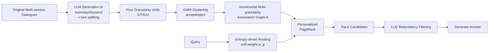

# From Single to Multi-Granularity: Toward Long-Term Memory Association and Selection of Conversational Agents

**Conference**: ICLR 2026  
**OpenReview**: [https://openreview.net/forum?id=i2yIvZARnG](https://openreview.net/forum?id=i2yIvZARnG)  
**Code**: [https://github.com/Applied-Machine-Learning-Lab/ICLR2026_MemGAS](https://github.com/Applied-Machine-Learning-Lab/ICLR2026_MemGAS)  
**Area**: LLM Agent / Long-term Memory / Retrieval-Augmented Generation  
**Keywords**: Conversational Memory, Multi-granularity Retrieval, Gaussian Mixture Model, Personalized PageRank, Entropy-driven Routing  

## TL;DR
MemGAS utilizes a pipeline consisting of "multi-granularity memory units + GMM association + entropy-driven granularity routing + PPR retrieval + LLM filtering" to upgrade the long-term memory of conversational agents from single-granularity segmentation to cross-granularity association and adaptive selection. It comprehensively outperforms SOTA in QA and retrieval across four long-term memory benchmarks.

## Background & Motivation
**Background**: When LLMs serve as personalized assistants, the interactions between the user and the agent accumulate over time. Given the limited context window, "retrieval-augmented external memory systems" are commonly utilized—historical dialogues are stored, and relevant snippets are retrieved and fed back to the model when needed. Existing methods employ various techniques for "how to segment memory" and "how to organize memory": some use session-level segments as retrieval units, while others use finer turn-level units, topic-aware segmentation, or generated summaries. Others, such as RAPTOR/MemTree, use trees, and HippoRAG/Mem0 use knowledge graphs for organization.

**Limitations of Prior Work**: The authors identify two common deficiencies. First, **insufficient multi-granularity memory association**—while existing methods build trees or graphs, they mostly operate at a single granularity (either entities or session summaries), failing to establish cross-granularity connections. For instance, a cross-session query like "How many online courses have I taken in total?" requires combining Conversation 1 (three on Coursera) and Conversation 2 (two on edX). Only by linking the two segments through shared keywords/summaries can full retrieval be achieved; otherwise, retrieving only one segment leads to an incorrect answer. Second, **lack of adaptive granularity selection**—most methods use a fixed granularity strategy. Incorrect granularity leads to either incomplete recall or the introduction of noise. Empirical analysis shows significant gains if the "most suitable granularity" (balancing noise reduction of summaries/keywords with information preservation of raw sessions) can be selected for each query.

**Key Challenge**: Memory retrieval involves an inherent trade-off between **information integrity** and **retrieval noise**, which a single fixed granularity cannot simultaneously satisfy for both "detail-oriented queries" and "overview-oriented queries."

**Goal**: Construct a training-free framework that can associate memories across granularities and adaptively select the granularity per query, thereby improving both QA and retrieval quality.

**Core Idea**: **Multi-granularity Association + Entropy-driven Selection**—each memory is decomposed into units across four granularities: session, turn, keyword, and summary. A GMM is used to establish association graphs between new and old memories. An entropy-driven soft routing mechanism weights each granularity based on matching certainty per query. Finally, PPR is used for propagation on the graph followed by LLM filtering of redundancies.

## Method

### Overall Architecture
MemGAS consists of two phases: The **offline construction** phase, where the LLM generates summaries and keywords for each session and segments it into turns, forming "session/turn/keyword/summary" multi-granularity memory units. When new memory is added, a GMM clusters historical memories into "accept" and "reject" categories, linking the accept set to the new memory to incrementally maintain a multi-granularity association graph. The **online retrieval** phase calculates the similarity distribution between a given query and each granularity, using Shannon entropy to measure matching certainty and assign soft weights. These weights serve as seed scores for Personalized PageRank (PPR) propagation on the association graph to obtain top-k candidates. Finally, the LLM filters redundancies and feeds the refined context to the generator.

### Key Designs

**1. Multi-granularity Memory Units and GMM Dynamic Association**. The $i$-th session $S_i$ is processed by the LLM to obtain summary $U_i$ and keywords $K_i$, and then segmented into a set of turns $T_i$, forming a memory block $M_i=\{S_i, T_i, U_i, K_i\}$. The key lies in how new memory $M_{new}$ associates with the history: all granularities are encoded into dense vectors. The pairwise similarities between $M_{new}$ and all elements in the current database $M_{cur}$ across all granularities are calculated to form a similarity vector set $s_{sim}$. A Gaussian Mixture Model (GMM) is then used to probabilistically cluster these into two groups—the **accept set** (highly similar to the new memory, establishing direct associations) and the **reject set** (irrelevant, excluding links). Each granularity is treated as an independent node in the graph, allowing a new memory to link with history across multiple levels (e.g., keywords, summaries). The association graph is updated incrementally $A_{cur} \leftarrow A_{cur} \cup A_{new}$, simulating the human consolidation process of "selectively strengthening relevant memories." Using GMM instead of a fixed threshold allows the boundary between high and low similarity to be determined adaptively by the data distribution.

**2. Entropy-driven Granularity Soft Routing**. For a query $q$, the similarity $s^g$ between $q$ and all memory blocks is first calculated for each granularity $g$. This is normalized via softmax into a distribution $p^g$, and the Shannon entropy is computed:

$$H_g = -\sum_{i=1}^{n} p_i^g \log p_i^g, \quad p_i^g = \frac{\exp(\text{sim}(q, M_i^g)/\lambda)}{\sum_{j=1}^{n}\exp(\text{sim}(q, M_j^g)/\lambda)}$$

The intuition is: **low entropy indicates a clear (high confidence) mapping between the query and a specific memory at that granularity**, whereas high entropy indicates ambiguous matching. Weights are then assigned to each granularity based on inverse entropy normalization:

$$w_g = \frac{1/H_g}{\sum_{g'=1}^{G} 1/H_{g'}}$$

Granularities with lower entropy receive higher weights, effectively allowing the system to automatically "trust" the granularity where the query matching is most certain. $\lambda$ controls the sharpness of the distribution. This step is the core of the "adaptive granularity selection" mechanism.

**3. PPR Graph Propagation + LLM Redundancy Filtering**. During retrieval, every $M_i^g$ is treated as a graph node. Initial relevance scores are calculated using routing weights: $\text{score}_i^g = w_g \cdot \text{sim}(q, M_i^g)$. These scores serve as personalized starting probabilities for Personalized PageRank. Top-$\alpha$ nodes are selected as seeds for PPR propagation, emphasizing memories that are both "directly relevant to the query" and "closely connected to other high-value nodes." After PPR converges, top-k candidates are selected. Finally, a specifically designed prompt allows the LLM to perform redundancy filtering on the top-k candidates, removing irrelevant or repetitive content to refine the final context. This step bridges structural graph recall with semantic denoising.

## Key Experimental Results

### Main Results
Four long-term memory datasets (LoCoMo / Long-MT-Bench+ / LongMemEval-s / LongMemEval-m) were used with gpt-4o-mini as the backbone and Contriever as the encoder. The framework is training-free. QA results (excerpt from LongMemEval-s, higher is better):

| Model | GPT4o-J | F1 | BLEU-4 | ROUGE-L | BERTScore | Avg.Tokens |
|------|---------|-----|--------|---------|-----------|------------|
| Full History (128k) | 50.60 | 11.48 | 1.40 | 10.85 | 83.07 | 103,137 |
| Contriever | 55.40 | 13.78 | 2.21 | 12.89 | 83.70 | 8,286 |
| SeCom | 56.00 | 12.95 | 2.25 | 11.93 | 83.51 | 2,741 |
| HippoRAG 2 | 57.60 | 14.73 | 2.15 | 13.83 | 83.86 | 8,530 |
| A-Mem | 55.60 | 13.73 | 2.11 | 12.98 | 83.88 | 9,018 |
| **MemGAS** | **60.20** | **20.38** | **4.22** | **19.47** | **85.21** | 8,829 |

The F1 score of MemGAS jumped from the second-best 14.73 to 20.38 (relative +38%). The token consumption and latency (2.55s) are comparable to mainstream baselines, while Full History required 100k tokens and 9.39s with the worst performance. On LongMTBench+, GPT4o-J also ranked first with 69.44.

### Ablation Study
On LongMemEval-s, removing modules (w/o MA = removing both GMM and PPR):

| Setting | GPT4o-J | F1 | ROUGE-L | R@3 | R@10 |
|------|---------|-----|---------|-----|------|
| **MemGAS** | **60.20** | **20.38** | **19.47** | **78.51** | **94.47** |
| w/o GMM | 57.20 | 19.49 | 18.68 | 76.38 | 91.28 |
| w/o PPR | 56.60 | 19.76 | 18.85 | 75.96 | 90.64 |
| w/o MA | 56.80 | 17.69 | 19.00 | 74.89 | 91.49 |
| w/o Router | 56.60 | 18.88 | 18.62 | 75.53 | 92.34 |
| w/o All | 55.40 | 13.78 | 12.89 | 71.06 | 90.00 |

Removing all modules caused the F1 score to drop from 20.38 to 13.78 and R@3 from 78.51 to 71.06. Each module contributes to the performance, verifying that both association and selection are essential. In retrieval (Table 2), MemGAS ranked first in Recall/NDCG across all datasets.

### Key Findings
- The extra latency introduced by the modules is minimal (+0.0191s max for QA, +0.0079s max for retrieval), while LLM API calls account for over 98% of end-to-end latency—indicating that the graph structure overhead of MemGAS is negligible in practice.
- Multi-granularity association is most beneficial for "cross-session synthesis queries," addressing questions that require piecing together multiple interactions.

## Highlights & Insights
- **Transforming "granularity" from a hyperparameter to an adaptive variable**: The entropy-driven soft routing is a lightweight yet unified approach—it stops debating whether to use session or turn levels and uses matching certainty to weight them automatically.
- **GMM Association replacing fixed thresholds**: Probabilistic clustering for accept/reject decisions avoids manual tuning of similarity thresholds and naturally supports incremental updates, aligning with the cognitive metaphor of "memory consolidation."
- **Training-free and Plug-and-play**: The entire process requires no training, relying on off-the-shelf encoders and LLMs. It features low deployment costs with well-controlled tokens and latency.

## Limitations & Future Work
- **Heavy reliance on LLM for summary/keyword generation and final filtering**, making quality dependent on backbone capabilities and prompts. LLM API calls account for 98% of latency.
- **Fixed set of four granularities** (session/turn/keyword/summary); the necessity and method of introducing more custom granularities (such as entities or time periods) have not been explored in depth.
- Evaluation focused on English long-dialogue benchmarks. Scalability for multi-lingual or multi-modal memory and massive memory stores remains to be verified.

## Related Work & Insights
- **Single-granularity segmentation**: Methods focusing solely on session-level (MPC), turn-level (MemoryBank), or topic-aware (SeCom) segments are unified by the MemGAS multi-granularity framework.
- **Structured memory**: Unlike RAPTOR/MemTree (trees) or HippoRAG/Mem0 (graphs) which build structures at a single granularity, MemGAS contributes cross-granularity graph construction + PPR propagation.
- **Inspiration**: Using entropy to measure retrieval certainty and weighting accordingly can be transferred to multi-path retrieval fusion in general RAG. GMM-based adaptive clustering for association graphs is also applicable to other incremental KG/memory construction scenarios.

## Rating
- **Novelty**: ⭐⭐⭐⭐ The combination of multi-granularity memory units and entropy-driven soft routing is novel and self-consistent, framing the "granularity selection" problem clearly. Individual components (GMM, PPR, LLM filtering) are clever adaptations of existing techniques.
- **Experimental Thoroughness**: ⭐⭐⭐⭐ Four benchmarks, dual tasks (QA & Retrieval), and extensive ablation/efficiency analyses. Baselines cover both single-granularity and structured approaches.
- **Writing Quality**: ⭐⭐⭐⭐ The motivation is clearly illustrated with intuitive examples. Methodology, formulas, and diagrams are well-connected and easy to follow.
- **Value**: ⭐⭐⭐⭐ Training-free, plug-and-play, effective, and open-source. Highly relevant for engineering and research in dialogue agent memory and personalized retrieval.

<!-- RELATED:START -->

## Related Papers

- [\[ACL 2026\] HiGMem: A Hierarchical and LLM-Guided Memory System for Long-Term Conversational Agents](../../ACL2026/llm_agent/higmem_a_hierarchical_and_llm-guided_memory_system_for_long-term_conversational_.md)
- [\[ICLR 2026\] Solving the Granularity Mismatch: Hierarchical Preference Learning for Long-Horizon LLM Agents](solving_the_granularity_mismatch_hierarchical_preference_learning_for_long-horiz.md)
- [\[ICLR 2026\] SMAN-Bench: A Cross-System Benchmark for Mobile Agents under Single- and Multi-path, Ambiguous, and Noisy Tasks](sman-bench_a_cross-system_benchmark_for_mobile_agents_under_single-_and_multi-pa.md)
- [\[ACL 2026\] TiMem: Temporal-Hierarchical Memory Consolidation for Long-Horizon Conversational Agents](../../ACL2026/llm_agent/timem_temporal-hierarchical_memory_consolidation_for_long-horizon_conversational.md)
- [\[ICLR 2026\] MEM1: Learning to Synergize Memory and Reasoning for Efficient Long-Horizon Agents](mem1_learning_to_synergize_memory_and_reasoning_for_efficient_long-horizon_agent.md)

<!-- RELATED:END -->
