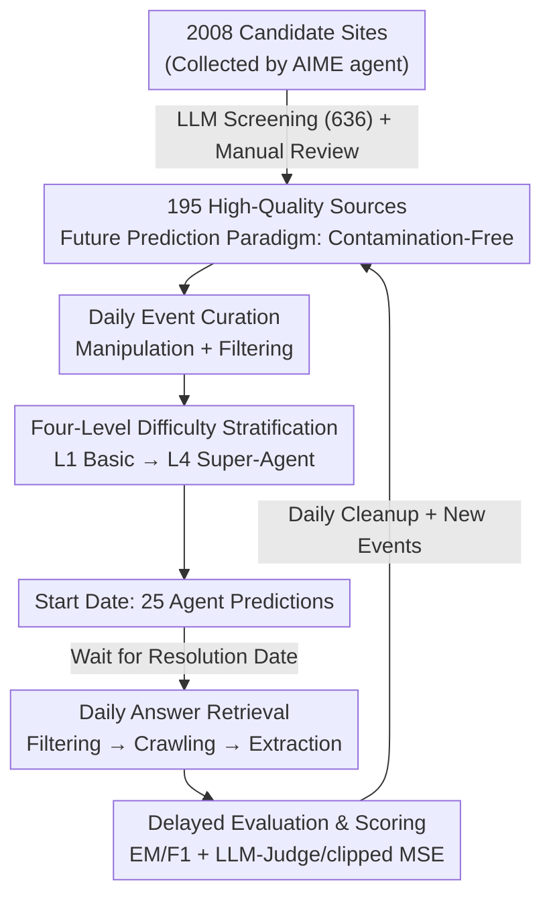

# FutureX: An Advanced Live Benchmark for LLM Agents in Future Prediction

**Conference**: ICLR 2026  
**OpenReview**: [https://openreview.net/forum?id=z28PLIEj6l](https://openreview.net/forum?id=z28PLIEj6l)  
**Code**: None  
**Area**: Agent / LLM Evaluation Benchmark  
**Keywords**: Future Prediction, LLM Agent, Dynamic Benchmark, Data Contamination, Difficulty Stratification

## TL;DR
FutureX constructs a **live dynamic benchmark** for "future prediction" tasks. Through a fully automated pipeline, it daily collects upcoming events from 195 high-quality websites, tasks 25 LLMs/agents to make predictions on the event start date, and automatically crawls real results for scoring once revealed. This fundamentally eliminates data contamination and reveals that even the strongest model, Grok-4, significantly lags behind human experts on high-volatility open-ended events.

## Background & Motivation
**Background**: LLMs are evolving from "coherent text generators" to "agents capable of planning, tool use, and autonomous goal completion in dynamic environments." Consequently, evaluation is shifting from static knowledge exams like MMLU and SuperGLUE to agent capability benchmarks such as search, tool-use, and coding.

**Limitations of Prior Work**: Existing agent benchmarks almost exclusively evaluate static, well-defined problems where the **answer is already known**—such as issues in SWE-bench or fixed tasks in tool-use. Essentially, the "world already knows the answer." They miss a core capability exercised by human experts in finance, politics, and business: **synthesizing real-time information to reason and predict a future where no one knows the answer yet.**

**Key Challenge**: Evaluating "future prediction" faces a natural contradiction: future events **lack ground truth during the prediction phase**, preventing pre-verification. Conversely, using historical events for backtesting introduces **temporal leakage and retrieval contamination**, as the model might search for and find the actual historical outcome. Existing attempts either evaluate only vanilla LLMs without search (unrealistic) or use a small set of binary choices from prediction markets like PolyMarket (FutureBench has ~30 questions; ForecastBench is mostly multiple-choice), which are few, simple, and fail to test open-ended information gathering.

**Goal**: Build a **large-scale, cross-domain, contamination-free, and automatically updated** future prediction benchmark that truly differentiates the high-order search and reasoning capabilities of agents.

**Key Insight**: The authors leverage a natural property of "future prediction"—as long as the event **has not occurred at the time of prediction**, the answer cannot exist in any model's training data. Contamination is resolved by definition. The remaining engineering challenge—reliably obtaining answers—is solved via curated high-quality sources and automated extraction.

**Core Idea**: Transform the benchmark into a **daily-operating closed-loop live system**: collect questions today, have agents predict today, and automatically fetch answers and score after the reveal. By categorizing questions into four difficulty levels based on event type and volatility, the system ensures a contamination-free and continuously challenging evaluation.

## Method

### Overall Architecture
FutureX is not a static dataset but a **fully automated cyclic pipeline** consisting of four stages: ① **Event Bank Construction**: Using an AIME agent to crawl 2008 candidate sites across politics, economy, finance, tech, and sports, filtered by LLMs to 636, then manually reviewed to 195 high-quality sources (prediction markets, news, entertainment, government, real-time data platforms); ② **Daily Event Curation**: Daily crawling of these "seed" sites to generate items, applying manipulation (randomization/perturbation) and filtering (removing simple, harmful, or subjective items), and downsampling binary questions; ③ **Daily Agent Prediction**: On the start date of each event, 25 models are automatically run to store their predictions; ④ **Daily Answer Retrieval**: After the reveal date, the system filters events, crawls corresponding sites, uses Seed1.5-Thinking to extract precise answers, and scores the previous predictions. The database is updated daily by removing unresolvable events and adding new ones.

### Key Designs

**1. Future Prediction Paradigm: Eliminating Contamination by Definition**

The chronic issue in agent benchmarks is data contamination. FutureX resolves this not through post-hoc deduplication but by **redefining the task**: asking only about events with a resolution date in the future (e.g., "Will Ethereum rise or fall on Aug 20?"). At the moment of prediction, these events **objectively have not happened**, and the ground truth does not exist in any training data. This converts contamination from an engineering struggle into a natural exclusion by definition. It also ensures long-term validity—the benchmark won't be "solved" like static ones because tomorrow's questions are always new. The trade-off is **evaluation delay**; predictions must wait for the event reveal to be scored.

**2. Semi-auto Data Pipeline: From 2008 Sites to 195 High-Quality Sources**

"Contamination-free" only ensures answers aren't leaked; it doesn't guarantee **answers can be reliably obtained**. The authors use an LLM-human collaborative funnel: the AIME agent crawls 2008 sites, Seed1.5-Thinking + DeepSeek-R1 perform deduplication and assess question-ability and update frequency, narrowing it to 636; human experts then focus on "reliable, leaderboard-based, high-frequency" sources to retain 195. Daily event curation involves randomization to prevent pattern memorization and downsampling binary questions to increase difficulty. This combination allows for an answer retrieval success rate exceeding **97%**.

**3. Difficulty Stratification: Disentangling Capabilities by Volatility**

To prevent strong models from being drowned out by simple tasks, FutureX splits the bank into four levels based on event types and expected volatility:
- **Level 1 (Basic)**: Multiple-choice with < 4 options; limited search space, lightweight reasoning.
- **Level 2 (Broad Search)**: Multiple-selection requiring all correct items; tests exhaustive yet precise discrimination.
- **Level 3 (Deep Search)**: Open-ended questions with relatively stable facts (low volatility); requires multi-step search and evidence synthesis.
- **Level 4 (Super-Agent)**: High-volatility open-ended questions (e.g., specific daily trading volumes); agents must search broadly and perform probabilistic reasoning under deep uncertainty. Notably, L3 and L4 are fully auto-generated, unlike the simpler market-based questions in prior work.

**4. Automated Delayed Evaluation Loop: Prediction, Retrieval, and Weighted Scoring**

Predictions are triggered on the event's start date. After the resolution date, real values are crawled and predictions scored. Metrics are customized by level: L1/L2 use Exact Match and F1; L3/L4 use LLM-as-Judge and clipped MSE. The total score is weighted **10% / 20% / 30% / 40%** across the four levels, prioritizing high-order capabilities over simple question performance.

## Key Experimental Results

### Main Results
The authors evaluated **25 models** (including base LLMs, SmolAgent-DR, AgentOrchestra, and Deep Research models) between 2025-07-20 and 08-03.

| Dimension | Key Result | Description |
|------|---------|------|
| Overall Rank 1 | **Grok-4** | Followed by Gemini-2.5-flash Deep Research and GPT-o4-mini (Think&Search). |
| Model Trend | Reasoning models with search lead | Highlights the importance of high-order search + reasoning in prediction. |
| Best L1/L2 | **DouBao-Seed1.6-Thinking** | Outperforms most search agents and Deep Research models even without tools. |
| Best L3/L4 | **Grok-4** | Surpasses Gemini Deep Research on harder events with fewer searches and faster reasoning. |
| Human Baseline | 40 Industry Experts | Humans lead significantly in L1, L3, and L4; models only occasionally beat humans in L2. |

### Ablation Study
| Configuration | Key Finding | Description |
|------|---------|------|
| Difficulty Levels | Performance drops monotonically from L1 to L4 | Validates stratification; the strongest models often score zero on L4. |
| Base LLM @ L1/L2 | High Accuracy | Suggests simple tasks are solvable via fact recall, providing little differentiation. |
| Search/Tools @ L3 | Significant Gain | Tool-augmented reasoning is crucial for multi-step complex questions. |
| SmolAgent-DR vs Others | Relatively weaker | Suspected limitations in search API capabilities. |

### Key Findings
- **Difficulty Stratification is Effective**: The monotonic decline in performance proves that difficulty labels align with real complexity. L4 serves as a benchmark for "superhuman" capabilities.
- **Search Intensity**: Grok-4's average search count exceeds even dedicated Deep Research models, confirming that search volume correlates with future prediction performance.
- **Domain Specialization**: DouBao excels at knowledge retrieval with options, Grok-4 at open-ended challenges, and GPT series in the Crypto domain.

## Highlights & Insights
- **Contamination Eradication via Definition**: Using "future events" as a defense is cleaner than any engineering deduplication or watermarking. It makes the benchmark naturally resistant to being "solved" over time.
- **Engineering Trade-off**: The cycle of "predict at start, score at reveal" solves the ground-truth problem through temporal progression, achieving a 97% success rate.
- **Volatility-based Complexity**: Using volatility rather than subjective difficulty for L3/L4 provides an objective metric for quantifying open-ended task hardness.
- **Expert Baseline**: Utilizing 40 industry experts provides a credible "human ceiling" to measure the gap between current agents and professional capabilities.

## Limitations & Future Work
- **Evaluation Delay**: The one-week window means results are always lagging; long-term (multi-month) events cannot be included currently.
- **Extraction Errors**: Despite the 97% success, failures in anti-crawling or extraction require manual review, which may limit further scaling.
- **Metric Inconsistency**: Different levels use different metrics, making cross-level direct comparisons difficult. Weighted scores are somewhat subjective.
- **Geographic/Language Bias**: Sources are currently skewed towards platforms from which the authors can stably retrieve data.

## Related Work & Insights
- **vs ForecastBench/FutureBench**: FutureX covers more domains (11 vs 1), offers more events (~500/week), and focuses on open-ended/numerical tasks rather than just binary market questions.
- **vs Backtesting**: FutureX avoids the "searching for the manifest past" problem which leads to temporal leakage.
- **vs Static Benchmarks**: FutureX moves beyond well-defined tasks with known answers to reflect the actual professional work of analysts.

## Rating
- Novelty: ⭐⭐⭐⭐⭐ First large-scale scheme to root out contamination and use a live automated loop.
- Experimental Thoroughness: ⭐⭐⭐⭐⭐ Evaluates 25 models, 4 levels, human baselines, and search trajectory analysis.
- Writing Quality: ⭐⭐⭐⭐ Clear design principles, though core metric formulas are in the appendix.
- Value: ⭐⭐⭐⭐⭐ Provides a sustainable, contamination-resistant, and challenging standard for the "second half" of AI agent development.

<!-- RELATED:START -->

## Related Papers

- [\[ICLR 2026\] FingerTip 20K: A Benchmark for Proactive and Personalized Mobile LLM Agents](fingertip_20k_a_benchmark_for_proactive_and_personalized_mobile_llm_agents.md)
- [\[ICLR 2026\] SimuHome: A Temporal- and Environment-Aware Benchmark for Smart Home LLM Agents](simuhome_a_temporal-_and_environment-aware_benchmark_for_smart_home_llm_agents.md)
- [\[ICLR 2026\] Orak: A Foundational Benchmark for Training and Evaluating LLM Agents on Diverse Video Games](orak_a_foundational_benchmark_for_training_and_evaluating_llm_agents_on_diverse_.md)
- [\[ICLR 2026\] ST-WebAgentBench: A Benchmark for Evaluating Safety and Trustworthiness in Web Agents](st-webagentbench_a_benchmark_for_evaluating_safety_and_trustworthiness_in_web_ag.md)
- [\[AAAI 2026\] SoMe: A Realistic Benchmark for LLM-based Social Media Agents](../../AAAI2026/llm_agent/some_a_realistic_benchmark_for_llm-based_social_media_agents.md)

<!-- RELATED:END -->
