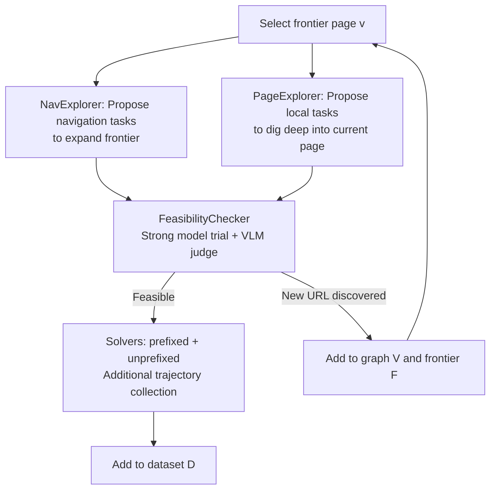

# Go-Browse: Training Web Agents with Structured Exploration

**Conference**: ICLR 2026  
**OpenReview**: [https://openreview.net/forum?id=IpzRWE52yw](https://openreview.net/forum?id=IpzRWE52yw)  
**Code**: [https://github.com/ApGa/Go-Browse](https://github.com/ApGa/Go-Browse)  
**Area**: LLM Agent / Web Agent / Automated Data Collection  
**Keywords**: Web Agent, Structured Exploration, Graph Search, Data Synthesis, WebArena, Supervised Fine-tuning  

## TL;DR
The data collection for training web agents is modeled as a **graph search** on websites: an expanding URL frontier maintains "discovered but under-explored" pages. For each page, the system proposes tasks, checks feasibility, and collects trajectories. By "resetting to discovered pages" to reuse historical leads, 10K successful trajectories were collected on WebArena. Fine-tuning a 7B model achieved a 21.7% success rate, surpassing GPT-4o mini.

## Background & Motivation
- **Background**: Pre-trained LLMs perform poorly on web GUI tasks—human success rate on WebArena is 78%, while GPT-4o is 38%, GPT-4o mini is 19%, and Qwen-2.5-7B is only 8%. Specially trained GUI models (Claude-3.7-Sonnet 45.4%, CUA 58%) are significantly stronger. This indicates that **training with agent-specific interaction data** is crucial for functional web agents.
- **Limitations of Prior Work**: High-quality web data is extremely difficult to obtain. Manual demonstrations are expensive. Existing unsupervised methods are split into two categories: **interaction-first** (e.g., NNetNav), where episodes are independent and exploration is redundant, and **instruction-first**, where task proposals are anchored to static observations, leading to hallucinations and poor coverage.
- **Key Challenge**: Agents lack a priori understanding of the **deployment environment**. Knowledge from general tutorials is hard to transfer to unfamiliar sites. Thus, direct exploration of the target environment (16% success) outperforms general knowledge methods (6%), but suffers from low efficiency.
- **Goal**: Design an exploration strategy that achieves **global coverage** of the entire website (reaching deep pages) and **local thoroughness** in task proposals, while reusing information across episodes.
- **Core Idea**: **Model data collection as a graph search**. Maintain a graph of URL nodes and trajectory edges. An outer loop expands the frontier like BFS for global coverage, while an inner loop digs deep into each page. The key innovation is **resetting exploration to a discovered page each round**, decoupling "navigation" from "local solving." This is inspired by the **Go-Explore** algorithm in reinforcement learning.

## Method

### Overall Architecture
Go-Browse constructs a graph $G=(V,E)$ for each website, where node $v$ is a unique URL and edge $e$ is a trajectory. The **outer loop** (global coverage) maintains an exploration frontier $F$. The **inner loop** (local exploration) performs three steps on $v$: ① Use NavExplorer + PageExplorer to propose navigation and local tasks; ② Use FeasibilityChecker to filter tasks and collect the initial trajectory; ③ Use Solvers to collect more trajectories. New discovery of URLs leads to additions to $V$ and $F$.

### Key Designs

**1. NavExplorer: Implementing the proposer as an exploration agent to expand the frontier.** Traditional proposers use static observations. Go-Browse implements NavExplorer as an **interacting web agent** tasked with finding neighbor pages and proposing navigation tasks. It anchors proposals to real, dynamic observations to efficiently expand the exploration frontier.

**2. PageExplorer: Local task collection to exhaustively mine page functions.** Complementing NavExplorer, PageExplorer focuses on tasks within a single page $v$. It prompts the LLM to generate user intentions (e.g., filtering, sorting, viewing details) to ensure thorough local coverage.

**3. FeasibilityChecker: Filtering hallucinated tasks with strong models and VLM-as-a-judge.** To handle infeasible tasks, a strong pre-trained agent (Claude-3.7-Sonnet) attempts to solve proposals. A **VLM-as-a-judge** reward model $R(g,\tau)\in\{0,1\}$ via GPT-4o validates completion. Only tasks with at least one successful trajectory are retained.

**4. Prefixed/unprefixed sampling by Solvers: Decoupling navigation and solving to bootstrap weak models.** For feasible tasks, cheaper models (GPT-4o-mini, Qwen-2.5-7B) sample trajectories using two modes: **prefixed** (starting directly from $v$) and **unprefixed** (starting from the root). Prefixed sampling removes the navigation bottleneck, allowing weak models to produce high-quality data (bootstrapping), while unprefixed maintains long-range solving capabilities.

## Key Experimental Results

### Dataset Statistics (GO-BROWSE-WA)

| Metric | Success | Failure | Total |
|------|------|------|------|
| Trajectories | 9,504 | 17,245 | 26,749 |
| Steps | 39,339 | 157,123 | 196,462 |
| Unique Tasks | — | — | 3,422 |

Collection cost was approximately **$975.57**. Training utilizes successful steps only, but all data (including multi-modal representations) is open-sourced.

### Main Results: WebArena Success Rate

| Model | Overall (%) | Admin | Shopping | Reddit | Gitlab | Map |
|------|------------|-------|----------|--------|--------|-----|
| GPT-4o-mini | 19.3 | 19.2 | 19.3 | 21.1 | 20.9 | 15.6 |
| GPT-4o | 37.6 | 35.7 | 32.3 | 50.9 | 36.7 | 37.5 |
| Claude-3.7-Sonnet | 45.4 | 37.4 | 37.0 | 58.8 | 52.0 | 47.7 |
| Qwen-2.5-7B-Instruct (Base) | 8.3 | 7.1 | 9.4 | 7.9 | 8.7 | 7.8 |
| NNetNav-7B | 18.8 | 14.3 | 20.3 | 23.7 | 19.9 | 17.2 |
| **GO-BROWSE-7B** | **21.7** | **25.3** | **22.4** | **30.7** | 15.3 | **17.9** |

- Improved by **+13.4%** over base and outperformed GPT-4o-mini by **+2.4%**.
- Leads in all domains except Gitlab; notably outperforms NNetNav by **+11%** on Shopping Admin.

### Key Findings
- **Task Diversity**: Unlike NNetNav's redundant distribution, Go-Browse covers deep URLs more effectively due to the reset-reuse mechanism.
- **Trajectory Depth**: Go-Browse excels at long-range tasks involving deep URLs (e.g., attribute editing, order tracking).
- **Bootstrapping**: Prefixed sampling allows weak 7B models to generate high-quality data by removing navigation obstacles.

## Highlights & Insights
- **Paradigm Fusion**: Successfully integrates the precision of instruction-first with the depth of interaction-first methods via graph search.
- **Go-Explore Adaptation**: Effectively translates the "reset-then-explore" logic from gaming RL to web navigation.
- **Decoupling Strategy**: Identifying that navigation is the primary bottleneck and decoupling it allows for effective model bootstrapping.

## Limitations & Future Work
- **Model Dependency**: Relies on strong closed models (Claude-3.7, GPT-4o) for exploration and judging.
- **Generalization**: Absolute success on out-of-domain real websites (Online-Mind2Web) remains low (5.33%).
- **Gitlab Performance**: Underperforms on Gitlab, suggesting blind spots in complex structural exploration.
- **Training Strategy**: Currently uses SFT only; does not exploit failure trajectories for RL or process rewards.

## Related Work & Insights
- **Go-Explore**: The source of the reset-then-explore inspiration.
- **NNetNav**: The interaction-first baseline addressed by this work.
- **Insight**: Deeply decoupling "localization" from "execution" is a high-yield strategy for synthetic data generation in hierarchical environments.

## Rating
- **Novelty**: ⭐⭐⭐⭐
- **Experimental Thoroughness**: ⭐⭐⭐⭐
- **Writing Quality**: ⭐⭐⭐⭐
- **Value**: ⭐⭐⭐⭐

<!-- RELATED:START -->

## Related Papers

- [\[ACL 2025\] Explorer: Scaling Exploration-Driven Web Trajectory Synthesis for Multimodal Web Agents](../../ACL2025/llm_agent/explorer_scaling_exploration-driven_web_trajectory_synthesis_for_multimodal_web_.md)
- [\[ICLR 2026\] Web-CogReasoner: Towards Multimodal Knowledge-Induced Cognitive Reasoning for Web Agents](web-cogreasoner_towards_multimodal_knowledge-induced_cognitive_reasoning_for_web.md)
- [\[ICLR 2026\] Scaling Synthetic Task Generation for Agents via Exploration](scaling_synthetic_task_generation_for_agents_via_exploration.md)
- [\[ICLR 2026\] Meta-RL Induces Exploration in Language Agents](meta-rl_induces_exploration_in_language_agents.md)
- [\[CVPR 2026\] Learning to Adapt: Self-Improving Web Agent via Cognitive-Aware Exploration](../../CVPR2026/llm_agent/learning_to_adapt_self-improving_web_agent_via_cognitive-aware_exploration.md)

<!-- RELATED:END -->
