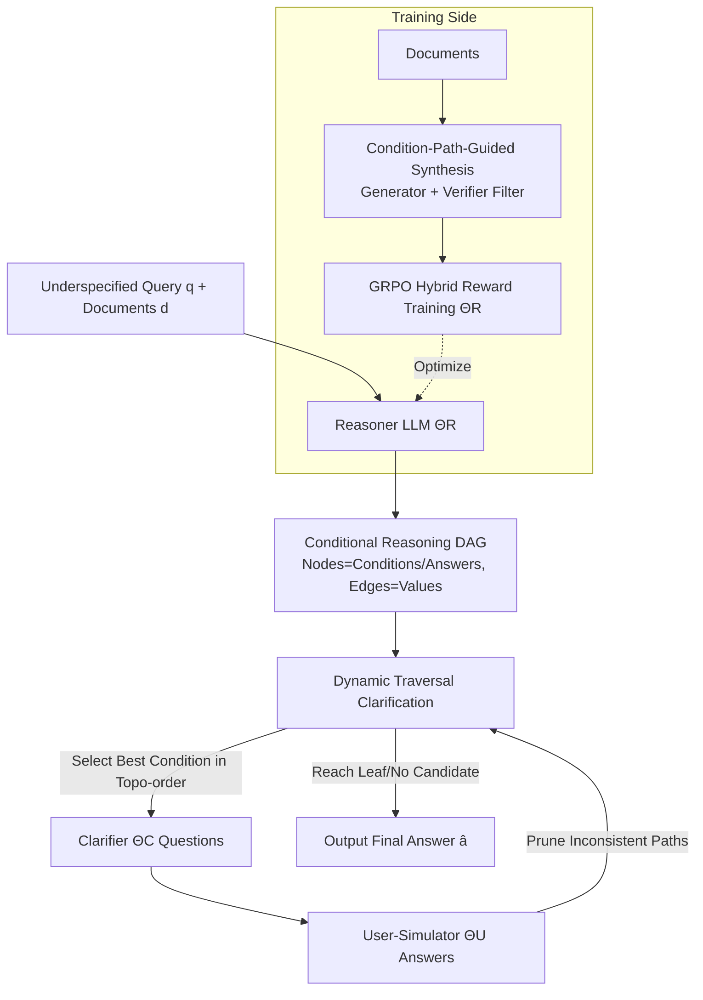

# GPS: Graph-guided Proactive Information Seeking in Large Language Models

**Conference**: ICLR 2026  
**OpenReview**: [https://openreview.net/forum?id=xpKe5qMaY4](https://openreview.net/forum?id=xpKe5qMaY4)  
**Code**: [https://github.com/lrq111/GPS](https://github.com/lrq111/GPS)  
**Area**: LLM Agent / Proactive Clarification / RAG  
**Keywords**: Proactive Information Seeking, Clarification Questions, Conditional Reasoning DAG, RAG, Reinforcement Learning, GRPO  

## TL;DR
GPS explicitly models the implicit "if-then rules" in retrieved documents as a logically complete Directed Acyclic Graph (DAG), utilizes dynamic traversal and pruning for on-demand questioning, and optimizes a Reasoner LLM via Group Relative Policy Optimization (GRPO) with hybrid rewards to generate high-quality DAGs, enabling LLMs to ask accurate questions efficiently when faced with underspecified user queries.

## Background & Motivation
**Background**: RAG systems typically assume that user queries already contain sufficient information and provide answers directly after retrieving relevant documents. However, in reality, users often provide **underspecified** queries due to a lack of domain knowledge or the omission of "obvious" details—for instance, "Can I receive disability benefits?" depends on factors like income, disability level, and age. Equipping LLMs with the ability to "proactively ask clarifying questions" is crucial to resolving such ambiguities.

**Limitations of Prior Work**: Current approaches are suboptimal. Prompting-based methods (ProCoT, UoT, BED-LLM) rely on the LLM's intrinsic reasoning to iteratively identify ambiguity and generate questions, but smaller models often fail to recognize ambiguity and suffer from "lost-in-the-middle" issues as dialogue history grows. Fine-tuning methods either depend on expensive human-annotated multi-turn dialogues or use self-sampling (Clarify-DPO) for data collection while **leaving the clarification search space unconstrained**, often leading to irrelevant or redundant questions.

**Key Challenge**: Retrieved documents contain a **conditional rule reasoning structure** (mapping condition combinations to conclusions), which is the root cause of ambiguity. Current methods treat clarification as an open-ended dialogue problem, ignoring this structure and failing to learn effective and efficient questioning strategies. This paper identifies three challenges: (C1) How to design a reasoning structure that represents arbitrary logical dependencies and supports real-time interaction? (C2) How to train models to extract such structures given the lack of conditional reasoning annotations in existing datasets? (C3) How to simultaneously optimize for correctness and interaction efficiency?

**Goal & Core Idea**: **[Explicitly Modeling Conditional Structure]** Extract conditional rules from documents into a DAG, where non-terminal nodes represent condition variables, terminal nodes represent answers, and edges represent condition values (implicit AND for single precursors, implicit OR for multiple precursors). **[Logical Completeness + Efficient Traversal]** It is theoretically proven that this DAG can express any finite-valued function using Disjunctive Normal Form (DNF), while supporting subgraph sharing and dynamic pruning based on user responses, reducing clarification complexity from the total number of conditions $k$ to the average reasoning depth $r \ll k$. **[Synthetic Data + RL]** Data scarcity is addressed via condition-path-guided data synthesis, and a Reasoner is optimized using clarification-oriented RL that incorporates "accuracy + efficiency" into the reward function.

## Method

### Overall Architecture
GPS is a two-stage framework: In the **reasoning phase**, the Reasoner LLM $\Theta_R$ processes the "query + retrieved documents" into a conditional reasoning DAG. In the **clarification phase**, the Clarifier LLM $\Theta_C$ interacts with a User-Simulator $\Theta_U$, dynamically pruning the DAG along its topological order and asking about missing conditions until a unique valid leaf node is reached to provide the answer. To ensure the Reasoner produces high-quality DAGs, the offline training side utilizes **condition-path-guided data synthesis** for training set expansion and **clarification-oriented reinforcement learning** (GRPO + hybrid rewards) to optimize $\Theta_R$.

### Key Designs

**1. Conditional Reasoning DAG: Supporting "Logical Completeness" via Graphs.** GPS constructs a DAG $G=(N,E)$ from documents: non-terminal nodes $n_{c_i}$ correspond to condition variables $c_i$, terminal nodes to possible answers $a_m$, and each edge $e_{i,j}=(n_{c_i}, n_{c_j}, \nu)$ is labeled with a value $\nu \in V_{c_i}$, where outgoing edges from the same node are mutually exclusive and exhaustive. The structural semantics are intuitive: single precursors form an AND relationship, while multi-precursors form an OR relationship. Thus, a root-to-leaf path represents a conjunction in DNF, and the union of all paths leading to the same answer encodes the full DNF of that answer's indicator function. Proposition 1 proves that any finite-valued function can be exactly represented by such a DAG, ensuring the Reasoner extracts all query-relevant conditions.

**2. Dynamic Traversal Clarification: Compressing "Asking All" into "Asking Few".** A complete DAG is insufficient without an efficient questioning strategy. GPS maintains a candidate condition set $U=U_1 \cup U_2$ based on topological order: $U_1$ consists of root conditions with in-degree 0, and $U_2$ consists of conditions whose only precursor is known. To decide the questioning order, the expected remaining cost for each candidate is estimated as $\ell(n_i)=\frac{1}{|P_{n_i}|}\sum_{p\in P_{n_i}}\mathrm{len}(p)$, representing the average number of missing conditions along paths to leaves. Conditions that converge faster are prioritized. Upon receiving a user response, inconsistent branches are pruned until a terminal node is reached. The expected number of turns is $O(r)$, depending only on the actual reasoning path.

**3. Condition-Path-Guided Data Synthesis: Creating Trainable Data from "24.5% Underspecification".** Only 24.5% (550/2247) of ConditionalQA samples are underspecified, which is insufficient for training. GPS expands the data in two steps: **Problem Generation** uses DeepSeek-R1 to generate underspecified queries $q$, missing condition sets $C$, and condition paths $P=\{(v,a)\}$ from documents; **Verification** introduces a filter based on the "necessity of missing conditions"—a Verifier LLM predicts answers with and without the missing conditions, retaining only samples where the **full input yields a correct prediction and the masked input yields an incorrect one**, ensuring the missing information is essential.

**4. Hybrid Rewards + GRPO: Jointly Optimizing "Accuracy, Parsimony, and Non-redundancy".** DAG construction is modeled as an RL task: the policy $\pi_\theta(o\mid q,d)$ generates a DAG $o$, which induces a clarification trajectory and a scalar reward. Optimization is performed via GRPO. The reward consists of three multiplicative components: **Accuracy** $r_{acc,i}$ (1 if the clarified answer is correct); **Efficiency** $r_{eff,i}=1-\alpha\frac{t_i}{t_{max}}$ (higher for fewer turns, $\alpha=0.5$); and **Structural Quality** $r_{\eta,i}=H_{leaf}/H_{graph}$. The structural quality uses forward probability propagation to calculate the "graph splitting entropy $H_{graph}$" and "leaf distribution entropy $H_{leaf}$," measuring how efficiently the graph converts intermediate uncertainty into terminal discriminative power. The final reward $r_i=r_{acc,i}\cdot(r_{eff,i}+r_{\eta,i})$ uses accuracy as a gate—incorrect answers result in zero reward.

## Key Experimental Results

### Main Results
Comparison across Synthetic, ConditionalQA, and ShARC datasets using two backbones. Metrics: SR (Success Rate↑), WCT (Weighted Clarification Turns↓), F1 (Clarification Need Prediction↑):

| Method (Qwen2.5-7B) | Syn SR↑ | Syn WCT↓ | CondQA SR↑ | CondQA WCT↓ | ShARC SR↑ | ShARC WCT↓ |
|---|---|---|---|---|---|---|
| Base Method | 21.2 | 7.88 | 70.3 | 2.98 | 49.3 | 5.08 |
| ProCoT | 42.5 | 6.07 | 71.6 | 2.95 | 62.6 | 4.06 |
| UoT | 32.8 | 7.05 | 60.3 | 4.25 | 70.5 | 3.25 |
| BED-LLM | 40.9 | 6.41 | 52.8 | 5.26 | 62.2 | 4.22 |
| Clarify-DPO | 59.2 | 4.67 | 72.0 | 3.52 | 78.5 | 2.93 |
| **GPS** | **60.2** | **4.59** | **73.4** | **2.91** | **79.3** | **2.41** |

On LLaMA3-8B, GPS achieved a 74.6 SR on ConditionalQA and 2.79 WCT on ShARC. Compared to the second-best methods, the average SR improvement was approximately 10.4% (LLaMA) and 4.5% (Qwen). GPS improved success rate by an average of 7.5% and efficiency by 4.2% over state-of-the-art baselines.

### Ablation Study
Ablation on Qwen2.5-7B:

| Method | Syn SR↑ | Syn WCT↓ | CondQA SR↑ | CondQA WCT↓ |
|---|---|---|---|---|
| **GPS** | **60.2** | **4.59** | **73.4** | **2.91** |
| w/o RL | 52.2 | 5.57 | 67.7 | 3.63 |
| w/o Efficient Reward | 59.0 | 5.06 | 70.7 | 3.58 |
| w/o Structural Quality Reward | 56.1 | 5.32 | 70.3 | 3.61 |
| w/o Dynamic Traversal | 59.6 | 5.19 | 71.2 | 3.63 |

### Key Findings
- **Training is Essential**: Base methods show very low SR on underspecified-heavy datasets (Synthetic/ShARC); prompt-only methods (ProCoT) sometimes underperform the Base, indicating limited intrinsic ambiguity recognition in smaller models.
- **RL is the Most Critical Component**: Removing RL dropped SR from 60.2 to 52.2 and increased WCT from 4.59 to 5.57 on the Synthetic dataset, highlighting the role of policy optimization in DAG quality.
- **Both Rewards are Necessary**: Removing either the efficiency or structural quality reward increased WCT and decreased SR, validating the joint modeling of accuracy and efficiency.
- **Dynamic Traversal Primarily Saves Turns**: Its removal led to significantly higher WCT across both datasets, proving its role in guiding efficient clarification paths.
- **Strong Generalization**: GPS performed comparably to or better than Clarify-DPO on ShARC, despite Clarify-DPO being trained directly on it.

## Highlights & Insights
- **Reframing Clarification Dialogue as "Structural Search on Graphs"**: The core insight is that conditional rules in documents are inherently if-then logic. By extracting them into a DAG, questioning decisions become graph traversal problems, which are provably complete and efficient, moving beyond the slow and error-prone open-ended dialogue paradigm.
- **Novel Structural Quality Reward**: Using the "entropy conversion efficiency" $H_{leaf}/H_{graph}$ rewards DAGs that efficiently convert branch uncertainty into terminal discriminative power, providing a differentiable and quantifiable definition of a "good structure" beyond just final accuracy.
- **Accuracy-Gated Multiplicative Reward**: The reward design $r_i=r_{acc,i}\cdot(r_{eff,i}+r_{\eta,i})$ ensures that incorrect answers yield zero reward, preventing the model from sacrificing accuracy to reduce the number of questions.

## Limitations & Future Work
- **Dependency on DAG Extraction Quality**: Framework performance is capped by the Reasoner's ability to accurately extract rules; in scenarios with implicit rules, cross-document dependencies, or required common-sense completion, DAG construction may fail.
- **Uniform Branching Assumption**: The entropy calculation assumes uniform probabilities for outgoing edges, which may deviate from real-world condition value distributions, biasing information gain estimates.
- **User-Simulator Evaluation**: The use of LLMs for user simulation may not capture the ambiguity, refusal, or inconsistency of real human users.
- **Restricted Answer Space**: Experiments centered on short documents or limited answer spaces (e.g., yes/no); scalability to open-ended generation or long-form multi-document RAG remains to be seen.

## Related Work & Insights
- **LLM Clarification Questioning**: Current approaches range from prompting (ProCoT, UoT, BED-LLM using Bayesian Experimental Design) to fine-tuning (StarGate, Clarify-DPO). GPS differentiates itself by imposing the structural constraint of a DAG on the search space.
- **Graph Reasoning in NLP**: Methods like Graph-of-Thoughts and Query2Box focus on high-fidelity multi-hop reasoning for well-specified queries; GPS specifically addresses underspecified queries by combining graph reasoning with proactive clarification.
- **Mechanism**: When tasks involve enumerable rules or constraint structures, "extracting structure then performing search/RL on it" offers better controllability, interpretability, and interaction efficiency than end-to-end dialogue, applicable to tool-calling, form-filling, or diagnostic agents.

## Rating
- **Novelty**: ⭐⭐⭐⭐ — First framework to introduce explicit conditional reasoning DAGs for RAG clarification, featuring DNF completeness proofs and entropy-based rewards.
- **Experimental Thoroughness**: ⭐⭐⭐⭐ — Comprehensive coverage across three datasets and two backbones with strong baselines and ablation; lacks real human interaction testing.
- **Writing Quality**: ⭐⭐⭐⭐ — Clear mapping between three challenges (C1-C3) and solutions, supported by solid theoretical propositions and figures.
- **Value**: ⭐⭐⭐⭐ — Addresses a major pain point in RAG/agent deployment with a solution that is controllable and provides clear efficiency gains.

<!-- RELATED:START -->

## Related Papers

- [\[ICLR 2026\] FlowSearcher: Synthesizing Memory-Guided Agentic Workflows for Web Information Seeking](flowsearcher_synthesizing_memory-guided_agentic_workflows_for_web_information_se.md)
- [\[ICLR 2026\] GTool: Graph Enhanced Tool Planning with Large Language Model](gtool_graph_enhanced_tool_planning_with_large_language_model.md)
- [\[ICLR 2026\] InfoMosaic-Bench: Evaluating Multi-Source Information Seeking in Tool-Augmented Agents](infomosaic-bench_evaluating_multi-source_information_seeking_in_tool-augmented_a.md)
- [\[ICLR 2026\] ToolWeaver: Weaving Collaborative Semantics for Scalable Tool Use in Large Language Models](toolweaver_weaving_collaborative_semantics_for_scalable_tool_use_in_large_langua.md)
- [\[ICLR 2026\] Do Large Language Models Know What They Are Capable Of?](do_large_language_models_know_what_they_are_capable_of.md)

<!-- RELATED:END -->
