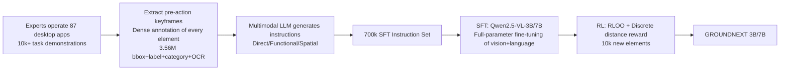

# Grounding Computer Use Agents on Human Demonstrations

**Conference**: ICLR 2026  
**OpenReview**: [https://openreview.net/forum?id=9WiPZy3Kro](https://openreview.net/forum?id=9WiPZy3Kro)  
**Code / Data**: [https://groundcua.github.io](https://groundcua.github.io) (Dataset and models committed to open source)  
**Area**: Computer-Use Agents / GUI Grounding  
**Keywords**: desktop grounding, computer-use agent, human demonstrations, vision-language model, SFT+RL, data efficiency  

## TL;DR
The authors construct GROUNDCUA, the largest desktop GUI grounding dataset to date (87 applications, 56k screenshots, 3.56M human-annotated elements), using expert human demonstrations. By utilizing only one-tenth of the training data compared to prior methods, the GROUNDNEXT series models achieve SOTA performance across five grounding benchmarks. This demonstrates that "high-quality dense supervision" is a more effective driver for reliable desktop grounding than merely increasing data volume.

## Background & Motivation
**Background**: Computer-Use Agents (CUAs) must first "plan the next step" and then "ground" that plan to precise elements on the screen for clicking, typing, or dragging. While large-scale grounding data exists for Web and Mobile, high-quality resources for desktop environments are critically scarce.

**Limitations of Prior Work**: The desktop environment represents the most challenging grounding scenario given its high resolution, dense layouts, and numerous visually similar elements (e.g., in FreeCAD, "opening the color picker" requires accurately clicking a specific small palette among many similar icons). It is also filled with user-specific content (documents, spreadsheets) unseen during training. Existing data collection methods have significant flaws: Web data relies on HTML/DOM scraping, favoring text elements while missing pure icon controls; desktop data relies on accessibility tree traversal, which is often incomplete or misaligned; and JEDI relies on synthetic interfaces, which fail to capture the complexity of real desktops.

**Key Challenge**: Once grounding fails, even a perfect plan will deviate, leading to error accumulation and task collapse. However, the desktop is the environment that lacks high-quality grounding data the most and is the hardest to collect automatically.

**Goal**: To fill the data gap in desktop grounding using expert human demonstrations and prove that high-quality data can achieve or exceed SOTA performance with significantly smaller data scales.

**Key Insight**: **[Data-Driven]** Instead of relying on automatic pipelines, the authors employed trained annotators to operate 87 open-source desktop applications, performing dense manual annotation for nearly every visible element in each frame. Multimodal LLMs were then used to convert these dense annotations into diverse instructions, followed by a two-stage SFT+RL training process to produce a small yet powerful grounding model.

## Method

### Overall Architecture
The pipeline consists of three stages: ① Collection—expert annotators operate desktop apps, recording interaction trajectories and densely annotating elements in keyframes; ② Instruction Generation—multimodal LLMs transform dense annotations (bboxes, labels, categories, OCR) into three types of natural language instructions, forming a 700k SFT instruction set; ③ Training—using Qwen2.5-VL (3B/7B) as the base, the model undergoes SFT for grounding and is then fine-tuned via Reinforcement Learning (RLOO), with rewards derived from a discrete scoring function based on normalized distance.

### Key Designs

**1. Expert Dense Annotation Collection: Replacing random search with real interaction trajectories.** Unlike OS-ATLAS, which triggers interface states via random depth/breadth-first search, this work involves annotators designing and executing real daily tasks (drafting documents, editing tables, running simulations). Consequently, the distribution of screenshots is closer to real usage. Keyframes are extracted immediately before a user action triggers an interface change. Every visible element is annotated with a bounding box and text label (prioritizing element names, using visible text for short snippets, and PaddleOCR/summaries for long paragraphs). Approximately 50% of elements are also labeled with eight high-level categories. The final dataset covers 87 apps across 12 categories, with an average of 64 annotations per screenshot (over 3x the desktop version of OS-Atlas). Bounding boxes occupy an average of only 0.13% of the image area, specifically capturing small controls like icons and toolbars that automatic tools often miss.

**2. Context-Aware Synthesis of Three Instruction Types: Feeding dense annotations into LLMs for challenging instructions.** To reflect diverse user prompts, three categories are generated: **Direct** (describing element attributes/position, e.g., "click the magnifying glass icon next to the search bar"), **Functional** (describing intent, e.g., "open a new tab" instead of "click the + button"), and **Spatial** (using relative positioning, e.g., "click the element to the left of Files"). Crucial to this design is the use of multimodal LLMs—fed with bboxes, app names, element labels, and spatial context—to ensure instructions are tied to both visual and textual content, creating challenging training samples for nearly every visible element.

**3. Two-Stage Training: SFT Foundation and RL Refinement.** Qwen2.5-VL-Instruct (3B/7B) is selected as the base. During SFT, the vision encoder and language model undergo full-parameter fine-tuning (ablations show this outperforms tuning only the language model) using a subset of 700k instructions. In the RL stage, 10k new elements not used in SFT are sampled. **RLOO (Relative Leave-One-Out)** is used for policy optimization, comparing the reward of each rollout to the average reward of other samples in the same group to avoid training a separate critic:

$$\nabla_\theta J(\pi_\theta) = \frac{1}{n}\sum_{i=1}^{n}\Big(R(y_i,x) - \frac{1}{n-1}\sum_{j\neq i}R(y_j,x)\Big)\nabla_\theta \log \pi_\theta(y_i\mid x)$$

where $y_i$ is the token sequence of the predicted coordinate $\hat{p}_i$, and $x$ is the input prompt and image.

**4. Discrete Reward Based on Normalized Distance: Simple yet effective.** Instead of relying on unreliable reward models, a discrete reward function $R_{score}(\hat{p},B,I)$ is designed. First, the signed distance $D(\hat{p},B)$ from the predicted point $\hat{p}$ to the ground truth box $B$ is calculated (positive inside the box). This is normalized as $D_{norm}=\frac{D(\hat{p},B)}{D_{ref}}$, where $D_{ref}=\frac{\text{diam}(B)}{2}$ inside the box and $D_{ref}=D_{max}(B,I)$ outside, ensuring $D_{norm}\in[-1,1]$. Points are scored by range:

$$R_{score}=\begin{cases}-1.0 & D_{norm}<-0.5\\ -0.5 & -0.5\le D_{norm}<-0.1\\ -0.1 & -0.1\le D_{norm}<0\\ 0.1 & 0\le D_{norm}<0.1\\ 0.5 & 0.1\le D_{norm}<0.5\\ 1.0 & D_{norm}\ge 0.5\end{cases}$$

The intuition is to penalize slightly out-of-box predictions lightly, penalize far-out predictions heavily, and encourage in-box predictions to move toward the center. Discrete rewards outperformed continuous and binary schemes in empirical tests (group size $n=8$, 1 epoch on single H100 nodes).

## Key Experimental Results

### Main Results (SFT-only, accuracy across five benchmarks, correct if point falls in bbox)

| Model | SSPro | OSW-G | MMB-GUI | SSv2 | UI-V | Avg |
|---|---|---|---|---|---|---|
| JEDI-3B (9M data) | 36.1 | 50.9 | 66.5 | 88.6 | 18.7 | 52.2 |
| GUI-Actor-3B | 42.2 | 48.9 | 69.8 | 91.0 | 19.7 | 54.3 |
| **GROUNDNEXT-3B (SFT)** | **48.6** | **62.2** | **75.5** | 87.3 | **58.2** | **66.4** |
| JEDI-7B | 39.5 | 54.1 | 70.4 | 91.7 | 24.8 | 56.1 |
| **GROUNDNEXT-7B (SFT)** | **50.2** | **67.2** | **80.4** | 89.3 | **58.7** | **69.2** |

GROUNDNEXT-3B, using only 700k instructions (vs. 9M for JEDI), outperforms JEDI-3B by 14.2 points and exceeds the sub-optimal GUI-Actor-3B by +12.1 points on average.

### RL Fine-Tuning and Agent Performance

| Model | Avg (5 benchmarks) |
|---|---|
| GROUNDNEXT-3B (SFT) → (RL) | 66.4 → **68.4** |
| GROUNDNEXT-7B (SFT) → (RL) | 69.2 → **70.5** |

In the OSWorld-Verified agent setting (o3 as planner): GROUNDNEXT-3B achieved a total score of **50.6**, crushing same-scale OpenCUA-A3B (17.7) and Kimi-VL-A3B (10.3). It also outperformed much larger models like OpenCUA-72B (46.1) and Claude-4-Sonnet (41.4), matches JEDI-7B (51.0) with less than half the parameters.

### Key Findings
- **Quality Beats Quantity**: Comparing 100k samples from different datasets on the same base model, GROUNDCUA SFT achieves the highest average score.
- **Negative Correlation between SFT Quality and RL Gain**: Models SFT-ed on GROUNDCUA see the smallest RL gains (indicating SFT already corrected most errors), whereas models SFT-ed on other data see larger boosts when using GROUNDCUA for RL.
- **Icon Recognition is the Biggest Gain**: Icon recognition on SSPro exceeds other models by an average of 10.7%; recognition for development and creative apps exceeds sub-optimal models by 15.9% and 8.4%, respectively, likely due to app-specific knowledge from open-source software.
- **Cross-Platform Generalization**: Despite training only on desktop data, the model shows competitive performance on Mobile/Web (MMBench-GUI, SSv2).

## Highlights & Insights
- Strong empirical evidence that **data quality > data volume**: 700k samples beating 9M samples challenges the "scaling data" trend for grounding.
- Using **expert real task trajectories** instead of random search/automatic scraping solves the pain points of dense icon annotation and unreliable accessibility trees at the source.
- Keeping the RL reward "simple and discrete" suggests that complex rewards are not essential when high-quality SFT is available—attributing the bulk of performance to the data itself.
- A 3B small model outperforming 72B and closed-source APIs in real multi-step agent tasks is highly attractive for resource-constrained deployments.

## Limitations & Future Work
- **Small RL Gain**: The authors admit the discrete reward is simple; more sophisticated rewards (like InfiGUI-G1) might yield bigger RL improvements.
- **Web Generalization**: Being desktop-centric, performance on the Web split of SSv2 lags behind, suggesting a need for mixed Web/Mobile data.
- **Scale and Compute Constraints**: Experiments only reached 3B/7B scales and 700k samples; the potential for larger-scale scaling of the dataset remains unexplored.
- **Domain Balancing**: Balancing desktop workflows with lighter Mobile/Web tasks during mixed-domain training remains an open research question.

## Related Work & Insights
- **CUA Grounding**: UGround, OS-ATLAS, and JEDI rely on scaling data to map language to UI. This work takes the opposite approach by using high-quality expert data for data efficiency.
- **RL for Grounding**: While GUI-R1, GUI-G2, and InfiGUI-G1 use complex distance rewards, the minimalist discrete reward here highlights that SFT data quality is the primary driver.
- **Insights**: ① In embodied or GUI tasks where data is scarce/expensive, "precise expert demonstrations + dense annotation" is more cost-effective than automatic scaling; ② Dense annotations naturally support LLM-synthesized diverse instructions, a generalizable strategy for high-quality supervision; ③ "Negative correlation between RL gain and SFT quality" suggests that SFT baselines must be controlled when evaluating RL methods to avoid overestimating RL's contribution.

## Rating
- **Novelty**: ⭐⭐⭐⭐ — The dataset construction (expert demo + dense manual labeling) is solid but not revolutionary. The core contribution is a resource-driven innovation regarding "high-quality data." The method (RLOO + discrete reward) is standard.
- **Experimental Thoroughness**: ⭐⭐⭐⭐⭐ — Covers five benchmarks, SFT/RL comparisons, data volume comparisons, real agent settings, and fine-grained analysis of platforms/icons.
- **Writing Quality**: ⭐⭐⭐⭐ — Clear motivation, well-organized tables and findings. The FreeCAD color picker example is illustrative.
- **Value**: ⭐⭐⭐⭐⭐ — Fills a gap in high-quality desktop grounding data. The commitment to open-source data/models and the "quality over quantity" conclusion are directional for the CUA community.

<!-- RELATED:START -->

## Related Papers

- [\[ICLR 2026\] Efficient Agent Training for Computer Use](efficient_agent_training_for_computer_use.md)
- [\[ICLR 2026\] R-WoM: Retrieval-augmented World Model for Computer-use Agents](r-wom_retrieval-augmented_world_model_for_computer-use_agents.md)
- [\[ICLR 2026\] SCUBA: Salesforce Computer Use Benchmark](scuba_salesforce_computer_use_benchmark.md)
- [\[ICLR 2026\] VideoAgentTrek: Computer Use Pretraining from Unlabeled Videos](videoagenttrek_computer-use_pretraining_from_unlabeled_videos.md)
- [\[ICLR 2026\] AgentSynth: Scalable Task Generation for Generalist Computer-Use Agents](agentsynth_scalable_task_generation_for_generalist_computer-use_agents.md)

<!-- RELATED:END -->
