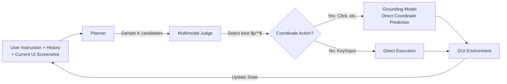

# GTA1: GUI Test-time Scaling Agent

**Conference**: ICLR 2026  
**OpenReview**: [https://openreview.net/forum?id=3VIPmz7iAi](https://openreview.net/forum?id=3VIPmz7iAi)  
**Code**: To be confirmed (Salesforce AI Research)  
**Area**: GUI Agent / Computer Use / Multimodal Reinforcement Learning  
**Keywords**: GUI Agent, Test-time Scaling, GUI Grounding, GRPO, Two-stage Agent, OSWorld  

## TL;DR
GTA1 addresses the issue of planning cascade failures through test-time scaling—sampling multiple action proposals per step and selecting the best via a multimodal judge. It further achieves precise localization using a pure RL grounding model (without CoT thinking) that directly predicts coordinates with binary "hit-or-miss" rewards. This two-stage agent reaches SOTA on both grounding and task execution benchmarks.

## Background & Motivation
- **Background**: GUI agents decompose user instructions into sequences of "click/keystroke" actions to interact with evolving interfaces. The dominant paradigm is **two-stage**: a strong planner (e.g., o3, Claude 3.7) proposes actions, and a grounding model maps proposals to precise screen coordinates.
- **Limitations of Prior Work ① (Planning)**: Multiple valid action sequences often exist for a single task. Once a planner makes a mistake in an early step, it leads to **cascade failures** that ruin the entire trajectory. Unlike mathematical problem-solving, GUIs do not easily allow "lookahead" due to irreversible state side effects of many actions, preventing the roll-out of full sequences to select the optimal path.
- **Limitations of Prior Work ② (Grounding)**: Mainstream grounding relies on SFT to fit the **center point** of target elements. However, the task essence is that "hitting any point within the target bounding box counts as success." SFT's penalty for deviating from the center creates a misalignment with task goals, leading to poor generalization on 4K high-resolution or complex professional interfaces. Recent attempts to apply the DeepSeek-R1-Zero RL paradigm force the model to "think" (CoT) before outputting coordinates, but thinking often hinders grounding performance.
- **Key Challenge**: Planning requires robustness without the possibility of lookahead; grounding requires flexible reward signals but is constrained by SFT center-point supervision and redundant CoT requirements.
- **Goal**: To tackle both planning and grounding with complementary strategies, building a two-stage GUI agent that outperforms native end-to-end agents in dynamic real-world environments.
- **Core Idea**: **Planning side**—instead of committing to a single sequence, parallelly sample $K$ candidate proposals per step and use a multimodal judge to select the best, trading computation for decision quality. **Grounding side**—discard thinking and bbox auxiliary rewards, directly predict coordinates, and provide **binary rewards for hitting the target box** to align the training objective with the task essence.

## Method

### Overall Architecture
GTA1 adopts a "planner + grounding model" two-stage architecture. At each step, the (historical trajectory, current UI screenshot, user instructions) are fed to the planner to sample $K$ candidate action proposals. A multimodal LLM judge selects the one that best fits the current interface state and user intent. If the selected action involves coordinates (e.g., clicking), it is passed to the grounding model for precise execution; non-coordinate actions (e.g., keystrokes, text input) are executed directly. This process repeats until task completion. The two components are optimized via independent paths: test-time scaling and pure RL grounding.

### Key Designs

**1. Test-time Scaling for Planning: Per-step parallel sampling + judge selection.** This is a core strategy to bypass the "lack of lookahead" in GUIs. At step $t$, the planner samples $K$ candidate proposals $\{p_k\}_{k=1}^{K}$ based on the current context, where each $p_k$ corresponds to a specific action. A multimodal judge (potentially the planner itself) evaluates the alignment of these $K$ candidates with user intent and UI state to select the optimal $p_{k^*}$. Crucially, the $K$ candidates are **sampled concurrently**, exploring "short-term alternatives" rather than full sequences. This avoids premature commitment to sub-optimal proposals while adding minimal wall-clock time due to concurrency. When $K=1$, it reverts to a standard two-stage agent. This strategy is decoupled from specific planners; the paper demonstrates its effectiveness in enhancing UI-TARS-1.5-7B.

**2. Data Cleaning: Bbox verification via OmniParser.** Binary rewards in RL grounding rely entirely on "whether predicted coordinates fall within the target box," making accurate bboxes essential. However, bboxes in open-source data (e.g., Aria-UI) often come from A11y/HTML parsers, which frequently suffer from misalignment due to UI animations or rendering delays. The cleaning strategy uses OmniParser $M(\cdot)$ to detect all UI element boxes $\{b_i\}=M(s)$ on screenshot $s$. For an annotated box $b_{ann}$, the maximum IoU with detected boxes is calculated; if it falls below threshold $\tau$, the sample is discarded:

$$\max_{b_i \in M(s)} \text{IoU}(b_{ann}, b_i) < \tau \;\Rightarrow\; \text{discard}$$

A threshold of $\tau=0.3$ is used to ensure consistency between training labels and visual targets.

**3. Pure Coordinate GRPO Grounding: Direct output with binary rewards, no thinking.** The grounding model $\pi(\cdot,\cdot)$ takes screenshot $s$ and action proposal $p$ as input and **directly outputs a pair of pixel coordinates** $o_n=(x_n, y_n)$ without any CoT preliminary reasoning. This is the fundamental difference from SFT center-point supervision or R1-style thinking. Following GRPO, $N$ responses are sampled for each prompt. The reward is purely binary:

$$r_n = \begin{cases} 1, & x_{min}\le x_n\le x_{max} \;\text{and}\; y_{min}\le y_n\le y_{max}\\ 0, & \text{otherwise}\end{cases}$$

Rewards are normalized to advantages $A_n$ using group-relative Z-scores and optimized with the PPO-style clipped objective:

$$A_n = \frac{r_n - \frac{1}{N}\sum_n r_n}{\sqrt{\frac{1}{N}\sum_n (r_n - \frac{1}{N}\sum_n r_n)^2}}$$

$$L = -\frac{1}{N}\sum_{n=1}^{N}\min\!\left(\frac{\pi(o_n|s,p)}{\pi_{old}(o_n|s,p)}A_n,\; \text{clip}\!\left(\frac{\pi(o_n|s,p)}{\pi_{old}(o_n|s,p)},1-\epsilon,1+\epsilon\right)A_n\right)$$

This reward aligns the training goal with the task's essence (any point inside the box is correct), serving as the primary reason for reaching SOTA in grounding.

## Key Experimental Results

### Main Results
Grounding accuracy on ScreenSpot-Pro (High-resolution, complex professional interfaces):

| Model | Params | Avg (%) |
|------|------|---------|
| UGround-72B | 72B | 34.5 |
| Qwen2.5-VL-72B | 72B | 53.3 |
| OpenCUA-32B | 32B | 55.3 |
| UI-TARS-1.5-7B | 7B | 42.0 |
| **GTA1-7B** | 7B | **50.1** |
| **GTA1-32B** | 32B | **63.6** |

GTA1-7B (50.1%) outperforms UGround-72B (34.5%) despite its smaller size. On ScreenSpot-V2, GTA1-32B reaches 95.2%, matching the closed-source Seed-1.5-VL. On OSWorld-G, GTA1-32B sets a new SOTA at 72.2%.

Task execution success rates (OSWorld-Verified / WindowsAgentArena):

| Agent | OSWorld-Verified (%) | WAA (%) |
|--------|----------------------|---------|
| Agent S2.5 w/ GPT-5 | 58.4 | - |
| CoAct-1 | 60.8 | - |
| Jedi-7B | - | 33.7 |
| **GTA1-7B w/ GPT-5** | **61.0** | 49.2 |
| **GTA1-32B w/ GPT-5** | **63.4** | 50.6 (51.2 w/ o3) |

GTA1-7B w/ o3 achieves 45.2% on the original OSWorld (at 100 steps), surpassing native CUA o3 (42.9%, 200 steps). This is the first time a two-stage agent has outperformed native end-to-end agents in dynamic real-world environments.

### Ablation Study
Ablation of reward design (Grounding accuracy %):

| Click | IoU | Format(thinking) | ScreenSpot-Pro | ScreenSpot-V2 | OSWorld-G |
|:---:|:---:|:---:|:---:|:---:|:---:|
| ✓ | ✓ | ✓ | 44.5 | 89.3 | 59.9 |
| ✓ | ✓ |  | 42.2 | 89.2 | 59.2 |
| ✓ |  | ✓ | 46.9 | 93.2 | 67.0 |
| ✓ |  |  | **50.1** | 92.4 | **67.7** |

**Pure click rewards** perform best on the most difficult benchmarks; adding IoU or format (thinking) constraints actually degrades performance.

### Key Findings
- **Thinking is only beneficial in dynamic environments**: On static grounding benchmarks, adding thinking shows little difference. However, in dynamic environments like AndroidWorld (with historical context and goals), thinking increases success rates from 39% to 44%, as complex textual contexts trigger reasoning value.
- **Benefits of increasing K**: Increasing $K$ from 1 to 32 allows UI-TARS-1.5-7B to outperform its 100-step baseline in only 15 steps. Concurrency ensures wall-clock time remains low. Gains are most significant at a 50-step horizon.
- **Transferability of Test-time Scaling**: This strategy consistently improves performance when applied to UI-TARS-1.5-7B, proving its decoupling from specific planners.

## Highlights & Insights
- **Elegant compute-for-robustness solution**: In GUIs where full lookahead is impossible, downgrading "path selection" to "per-step concurrent sampling + judge" avoids irreversible side effects while maintaining efficiency.
- **"Less is More" Grounding Philosophy**: Stripping away thinking and bbox auxiliary rewards in favor of a simple binary reward aligns the training objective perfectly with the task (anywhere in the box is correct), allowing a 7B model to outperform 72B models.
- **Challenging the "Native is Always Stronger" Bias**: Demonstrates that a two-stage agent can beat native CUA in the OSWorld dynamic environment with fewer steps.

## Limitations & Future Work
- **Judge Bottleneck**: The ceiling of test-time scaling depends on the judge's ability to identify the best proposal. Incorrect judgments limit potential gains.
- **Compute Cost**: While $K$-way sampling is concurrent, total token consumption and compute cost scale linearly with $K$.
- **Unpredictability of Thinking**: The empirical observation that thinking helps in dynamic but not static environments lacks a robust adaptive mechanism for when to trigger reasoning.
- **External Detector Dependency**: Data cleaning quality is limited by the detection accuracy of OmniParser; misses or false detections by the detector introduce new noise.

## Related Work & Insights
- **Continuation of the DeepSeek-R1-Zero / GRPO Lineage**: Migrates R1's RL ideas to GUI grounding but conversely shows that thinking is not required for the grounding task, aligning with findings from concurrent work like GUI-G1.
- **Two-stage vs. Native Comparison**: Contrasted with end-to-end native agents like UI-TARS, CUA, and Claude Computer Use, this work maintains a modular two-stage approach and proves its competitiveness.
- **Insights**: Test-time scaling is not limited to math/code reasoning. Any sequential decision task where steps have multiple solutions but are irreversible (e.g., robotics, web navigation) can benefit from the "concurrent sampling + judge" paradigm.

## Rating
- Novelty: ⭐⭐⭐⭐ Clear insights in combining test-time scaling for GUI planning with "no-thinking" pure click rewards.
- Experimental Thoroughness: ⭐⭐⭐⭐ Extensive benchmarks (3 grounding, 2 agent), various model scales, and solid ablations on rewards/thinking/K.
- Writing Quality: ⭐⭐⭐⭐ Thorough exploration of motivations (lack of lookahead, SFT misalignment) and clear presentation.
- Value: ⭐⭐⭐⭐ Sets new SOTA on several benchmarks and provides direct guidance for practical computer-use agent engineering.

<!-- RELATED:START -->

## Related Papers

- [\[ICLR 2026\] Pushing Test-Time Scaling Limits of Deep Search with Asymmetric Verification](pushing_test-time_scaling_limits_of_deep_search_with_asymmetric_verification.md)
- [\[ICLR 2026\] Test-Time Adaptation for LLM Agents via Environment Interaction](test-time_adaptation_for_llm_agents_via_environment_interaction.md)
- [\[ACL 2025\] METAL: A Multi-Agent Framework for Chart Generation with Test-Time Scaling](../../ACL2025/llm_agent/metal_a_multi-agent_framework_for_chart_generation_with_test-time_scaling.md)
- [\[ICLR 2026\] EvoTest: Evolutionary Test-Time Learning for Self-Improving Agentic Systems](evotest_evolutionary_test-time_learning_for_self-improving_agentic_systems.md)
- [\[ICLR 2026\] Scaling Agent Learning via Experience Synthesis](scaling_agent_learning_via_experience_synthesis.md)

<!-- RELATED:END -->
