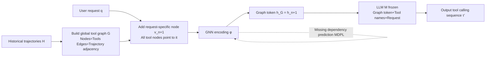

# GTool: Graph Enhanced Tool Planning with Large Language Model

**Conference**: ICLR 2026  
**OpenReview**: [https://openreview.net/forum?id=bn47cqGQ7l](https://openreview.net/forum?id=bn47cqGQ7l)  
**Code**: To be confirmed  
**Area**: LLM Agent / Tool Planning  
**Keywords**: Tool planning, tool dependency graph, Graph Neural Network, missing dependency prediction, LLM Agent  

## TL;DR
GTool constructs a request-specific tool graph representing "dependencies between tools," encodes it into a `<graph token>` using a GNN to feed into a frozen LLM, and designs a Missing Dependency Prediction task to counteract incomplete dependencies, allowing 7B small models to outperform SOTA tool planning performance by 29.6%.

## Background & Motivation
**Background**: Tool planning is a core capability for LLMs to solve complex problems by calling external APIs/algorithms—it serves as the bridge between "natural language understanding" and "task execution" by selecting tools and organizing their call sequence. Existing methods fall into two categories: tuning-free approaches that rely on prompt engineering to fit tool descriptions into context, and tuning-based approaches that introduce trainable modules or fine-tune LLMs on specialized corpora.

**Limitations of Prior Work**: Both approaches treat tools as isolated components, ignoring the natural dependencies between tools—the input of one tool often depends on the output of another. Consequently, planned sequences are frequently invalid (wrong order or missing prerequisites). Tuning-free methods suffer from long contexts and struggle to grasp user intent, while tuning-based methods rely on pre-defined dependency structures that are rarely available in real-world scenarios.

**Key Challenge**: Tool dependencies are naturally represented as graphs (nodes = tools, edges = dependencies). However, in real-world settings, these graphs are "accumulated" from finite historical calling trajectories and are **inevitably incomplete**—trajectories cannot cover all dependency pairs, leading to missing or incorrect edges. Feeding such fractured graphs directly into a model can mislead planning.

**Goal**: To systematically inject graph structural information into LLM tool planning under the constraint of incomplete dependencies, while keeping LLM backbone parameters frozen.

**Key Insight**: **"Request-specific tool graph + Graph token injection + Missing dependency prediction."** Each user request is treated as a special node connected to the tool graph. A GNN aggregates request-related dependency information into a graph token injected into the LLM. Furthermore, a dedicated Missing Dependency Prediction task trains the GNN to work robustly even with fragmented graphs. Since the LLM is frozen and only the GNN is trained, the solution is plug-and-play for various backbones.

## Method

### Overall Architecture
GTool consists of a three-module pipeline: **Request-specific tool graph construction → Tool dependency modeling → Graph-enhanced planning**. First, a global tool graph is built from historical trajectories. Then, for each request, a request-specific subgraph is pruned and compressed by a GNN into a graph token. Finally, this token is fed along with tool names and the user request into a frozen LLM to generate calling sequences. During training, the "tool planning loss" and "missing dependency prediction loss" are jointly optimized, updating only GNN parameters.

### Key Designs

**1. Request-specific Tool Graph: Aggregating "request-relevant dependencies" to a single node.** Global tool graph $G=\{V,E\}$ node attributes $a_i = f(d(t_i))$ are obtained by encoding tool documentation with BERT. Edges are iteratively accumulated from historical trajectory adjacencies: for each trajectory $\tau_i$, edges $E \leftarrow E \cup \{(v_{ij}, v_{ij+1})\}$ are added. Since a single request uses far fewer tools than the entire graph, modeling the whole graph introduces noise. GTool adds an extra request-specific node $v_{n+1}$ (with attribute $f(q)$) for each request $q$, and creates directed edges from **all tool nodes to this request node** $E(q)=E\cup\{(v_i,v_{n+1})\}$. During GNN message passing, request-related tool semantics and dependencies aggregate at $v_{n+1}$, naturally condensing request-relevant information.

**2. Graph Token Injection: Using a GNN node representation as an LLM-readable dependency summary.** The GNN encoder (implemented with a 3-layer TransformerConv) performs a forward pass on the request-specific graph $[h_1,\dots,h_{n+1}]=\phi(G(q);\theta)$. Since all nodes point to $v_{n+1}$, all request-relevant information propagates to it, and $h_G = h_{n+1}$ is used as the representation of the entire graph. During planning, a prompt template concatenates tool names, the user request, and this graph embedding $\langle \text{graph embed}\rangle = h_G$ (using `[/graph]` as a special identifier). This is fed into the frozen LLM $M$ to autoregressively generate the ground-truth trajectory $\tau_G$, with loss $L_{TL}=p_M(\tau_G|w)$. Crucially, tool descriptions are compressed into the graph token rather than the prompt, reducing per-request tokens by over 80% while allowing the LLM to perceive both request semantics and graph structure.

**3. Missing Dependency Prediction (MDPL): Forcing the model to learn to complete fragmented graphs by masking edges.** Given that graphs built from history are inevitably incomplete, GTool explicitly models this. Three steps: randomly mask existing edges with probability $\rho$, treating masked edges as positive candidates $(v_i,v_j,l=\text{'yes'})$ and non-existent edges as negative candidates $l=\text{'no'}$. Node embedding pairs are filled into a text template $x$ (using `[/node]` markers), and the LLM is tasked with predicting the existence of the edge. To handle the potentially massive number of edges, GTool performs balanced sampling $S=RS(\hat{E}^+,\alpha)\cup RS(\hat{E}^-,\alpha)$, computing loss only on the sampled set: $L_{MDPL}=\frac{1}{|S|}\sum_S p_M(l|x)$. The final joint loss $L=L_{TL}+\lambda L_{MDPL}$ ensures the GNN learns both planning and dependency completion.

**4. Plug-and-play design with frozen LLM.** The entire training process does not modify any parameters of the LLM backbone, optimizing only the GNN encoder $\theta$. This offers two benefits: it eliminates the need for large-scale fine-tuning for every new backbone—enabling GTool to be applied to LLaMA, Vicuna, Qwen3, etc.—and it significantly reduces computational costs and data labeling efforts. The performance ceiling remains influenced by the backbone's inherent strength.

## Key Experimental Results

### Main Results
Comparison across TaskBench (HuggingFace/Daily Life/Multimedia) and ToolE for three backbones (n-F1↑ / l-F1↑ / NED↓):

| Backbone | Method | HuggingFace n-F1 | Daily Life n-F1 | Multimedia n-F1 | ToolE n-F1 |
|------|------|------|------|------|------|
| LLaMA-2-7B | GNN4Plan (Strongest baseline) | 0.4853 | 0.3588 | 0.4593 | 0.5069 |
| LLaMA-2-7B | **GTool** | **0.7913** | **0.9458** | **0.8001** | 0.3800 |
| Vicuna-13B | GNN4Plan | 0.5776 | 0.7872 | 0.6364 | 0.7209 |
| Vicuna-13B | **GTool** | **0.8029** | **0.9612** | **0.7905** | 0.7833 |
| Qwen3-14B | GNN4Plan | 0.7602 | 0.9024 | 0.8269 | 0.7639 |
| Qwen3-14B | **GTool** | **0.8053** | **0.9668** | **0.8543** | 0.7749 |

GTool leads across almost all datasets/backbones, with an n-F1 increase of approximately 26.7% over the strongest baseline, GNN4Plan (with >29.6% gain for 7B models). Only on ToolE (short sequences < 3 steps) does HuggingGPT slightly win in l-F1/NED, as short-chain reasoning fits its concise style.

### Ablation Study
Ablation results on LLaMA-2-7B / Vicuna-13B (n-F1↑ / l-F1↑ / NED↓):

| Variant | LLaMA n-F1 | LLaMA l-F1 | LLaMA NED | Vicuna n-F1 |
|------|------|------|------|------|
| w/o All (No graph, names+instr only) | 0.1566 | 0.0243 | 0.8611 | 0.1626 |
| w/o Both (No request node + MDPL) | 0.6131 | 0.3469 | 0.4072 | 0.7370 |
| w/o RS (No request-specific node) | 0.7128 | 0.4433 | 0.3108 | 0.7589 |
| w/o MDPL (No missing dependency pred) | 0.7650 | 0.5196 | 0.2541 | 0.7707 |
| w/ LLMlp (Pred via LLM instead of MDPL) | 0.7602 | 0.4869 | 0.2676 | 0.7784 |
| **GTool (Full)** | **0.7913** | **0.5403** | 0.2537 | **0.8029** |

The request-specific node contributes the most (dropping it reduces n-F1 by 9.92% and l-F1 by 17.9%). MDPL is consistently effective, and using a dedicated MDPL module outperforms direct LLM prediction (w/LLMlp). The w/o All variant collapses, highlighting that graph information is the primary driver of performance.

### Key Findings
- **Robustness to Incomplete Dependencies**: GTool remains superior across missing edge ratios from 0.1 to 0.9. Even with 90% of edges missing, it remains functional, though extreme sparsity on Qwen3-14B can lead to backlines catching up due to GTool's concise prompts.
- **Large-scale Toolsets (ToolBench, 16000+ API)**: Achieves a peak n-F1 of 0.6126; tool graph edges scale approximately linearly with the number of tools, showing good scalability.
- **Efficiency**: Per-request tokens are reduced by 80%+ compared to HuggingGPT/TaskBench. Inference time is roughly 1/10th of SOTA (GTool 2.02s/R vs. GNN4Plan 47.58s/R).
- **Greater Benefit for Weaker Models**: Ablation shows larger performance drops on LLaMA-2-7B than Vicuna-13B, indicating that GTool provides more significant gains for less capable backbones.

## Highlights & Insights
- **Modeling "Incompleteness" as a First-Class Citizen**: Instead of assuming a complete dependency graph, GTool actively learns to complete it using masks and predictions. This pragmatic insight aligns with the reality that historical logs never cover every possible dependency.
- **Graph Tokens Replacing Long Prompts**: Compressing tool descriptions and dependencies into a GNN representation solves both context length and cost issues simultaneously, reducing tokens by 80%+ and speeding up inference by 10x.
- **Plug-and-play with Frozen LLM**: Optimizing only the GNN makes the method naturally cross-backbone and cost-efficient, which is highly practical for engineering.
- **Star-shaped Aggregation in Request Graphs**: Forcing all tool nodes to point to the request node utilizes GNN message passing to condense task-relevant information effectively and simply.

## Limitations & Future Work
- **Degradation under Extreme Sparsity**: With 90% missing dependencies, concise prompts become a liability, showing that GTool relies heavily on structural information rather than LLM fallback.
- **Single-turn Interaction Ceiling**: GTool intentionally interacts with the LLM only once, omitting comparisons with multi-turn methods like ToolLLaMA. The authors note that merging multi-turn interaction could further improve performance.
- **Dependency on Tool Descriptions**: Cold-start experiments show performance drops significantly when descriptions are sparse (e.g., ToolE), indicating sensitivity to documentation quality.
- **NED remains a challenge**: Correctness in call ordering (NED) is generally harder to achieve than tool selection (n-F1), leaving room for improvement.

## Related Work & Insights
- **Tuning-free Tool Planning**: HuggingGPT, TaskBench, and ToolLLM rely on prompt design, highlighting the "long context" pain point.
- **Tuning-based Alignment Modules**: GNN4Plan, ToolNet, and Tool-Planner utilize trainable modules. GTool distinguishes itself by removing the extra text-generation steps for reasoning.
- **Graph Learning on Incomplete Graphs**: Link prediction (Zhang & Chen 2018) and GCN (Kipf & Welling) provide the methodological foundation for MDPL.
- **Insight**: Injecting "graphs as a new modality into frozen LLMs" (graph token + alignment) can be generalized to any LLM task with structural dependencies, such as Knowledge Graph QA or workflow orchestration.

## Rating
- **Novelty**: ⭐⭐⭐⭐ First work to model "incomplete tool dependencies"; the combination of request-specific graphs, graph token injection, and MDPL is novel and grounded.
- **Experimental Thoroughness**: ⭐⭐⭐⭐ Covered 4 datasets × 10 backbones, including large-scale ToolBench, missing ratios, efficiency, ablation, and cold-start robustness. Only lacks comparison with multi-turn interaction methods.
- **Writing Quality**: ⭐⭐⭐⭐ Clear logic from motivation to challenge to method; well-illustrated.
- **Value**: ⭐⭐⭐⭐ 29.6% gain for 7B models, 10x faster, 80% token savings, and plug-and-play capability make it highly valuable for real-world Tool Agent deployment.

<!-- RELATED:START -->

## Related Papers

- [\[ICLR 2026\] DreamPhase: Offline Imagination and Uncertainty-Guided Planning for Large-Language-Model Agents](dreamphase_offline_imagination_and_uncertainty-guided_planning_for_large-languag.md)
- [\[ICLR 2026\] GPS: Graph-guided Proactive Information Seeking in Large Language Models](gps_graph-guided_proactive_information_seeking_in_large_language_models.md)
- [\[AAAI 2026\] AutoTool: Efficient Tool Selection for Large Language Model Agents](../../AAAI2026/llm_agent/autotool_efficient_tool_selection_for_large_language_model_agents.md)
- [\[ICLR 2026\] ToolTree: Efficient LLM Agent Tool Planning via Dual-Feedback Monte Carlo Tree Search and Bidirectional Pruning](tooltree_efficient_llm_tool_planning_via_dual-feedback_monte_carlo_tree_search_a.md)
- [\[ICLR 2026\] ToolWeaver: Weaving Collaborative Semantics for Scalable Tool Use in Large Language Models](toolweaver_weaving_collaborative_semantics_for_scalable_tool_use_in_large_langua.md)

<!-- RELATED:END -->
