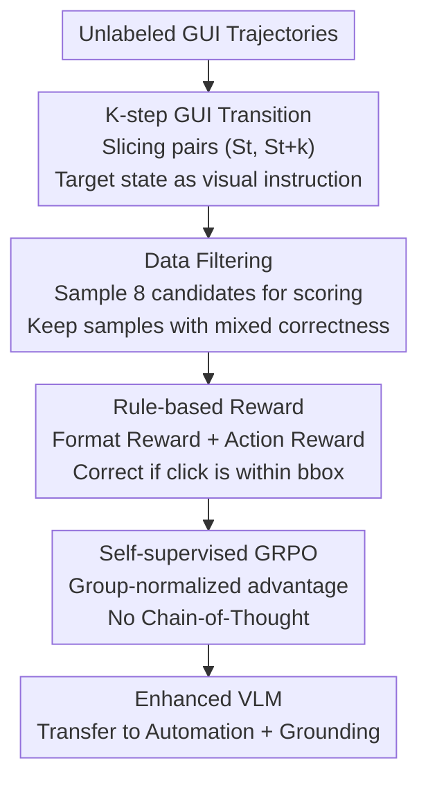

# GUI-Shift: Enhancing VLM-Based GUI Agents through Self-supervised Reinforcement Learning

**Conference**: ICLR 2026  
**OpenReview**: [https://openreview.net/forum?id=NakMHPljT7](https://openreview.net/forum?id=NakMHPljT7)  
**Code**: https://github.com/UbiquitousLearning/GUI-Shift (To be open-sourced)  
**Area**: Agent / Multimodal VLM  
**Keywords**: GUI Agent, Self-supervised Learning, Inverse Dynamics, GRPO, Reinforcement Learning

## TL;DR
This paper proposes **K-step GUI Transition**, a self-supervised inverse dynamics task that predicts the first action to trigger a state transition given only a pair of screenshots $(S_t, S_{t+k})$, thereby eliminating the need for natural language instruction labels. By combining the GUI-Shift reinforcement learning framework (based on GRPO) with data filtering, multiple VLMs achieved up to an 11.2% Gain on GUI automation tasks using only 2K samples, with zero-shot transferability to GUI grounding tasks.

## Background & Motivation

**Background**: The mainstream paradigm for mobile GUI Agents uses Vision-Language Models (VLMs) to map natural language instructions to screen actions (clicks, swipes, etc.). Training typically relies on Supervised Fine-Tuning (SFT) on paired data consisting of "GUI interaction trajectories + human-annotated task instructions."

**Limitations of Prior Work**: This paradigm is highly dependent on annotations, which are laborious and error-prone for GUI trajectories. A striking example cited is the AndroidControl dataset, which required **a full year of paid annotation** to produce 15,283 task demonstrations. Annotation costs cap the scalability of data, while massive, cheap, and easily collectable **unlabeled GUI trajectories** are largely wasted.

**Key Challenge**: On one hand, unlabeled trajectories inherently contain **ground-truth actions** (every click and swipe position is recorded). On the other hand, SFT has a structural deficiency: many action parameters in a GUI are **functionally equivalent** (any coordinate within a button's bbox is valid, and multiple formats for text input are acceptable). SFT uses cross-entropy to force alignment with a single reference action, punishing all other equally correct choices and providing misleading learning signals.

**Goal**: ① Establishing how to train GUI Agents using massive unlabeled trajectories without relying on human instructions; ② Bypassing the SFT penalty on "action diversity" through a different training paradigm.

**Key Insight**: The authors draw inspiration from **inverse dynamics modeling** in robotics and biomechanics—predicting control commands given two consecutive physical states. Applied to GUIs: screenshots are "states," and GUI actions are "commands." Thus, "predicting the action required to move from the current screen to a future screen" is naturally a self-supervised task where the supervision signal is embedded in the trajectory.

**Core Idea**: Replacing "human-written text instructions" with a "target screenshot $S_{t+k}$ as a visual goal." The model is tasked with predicting the first action that initiates this transition (self-supervised inverse dynamics) and is trained using GRPO reinforcement learning, which accommodates action diversity, rather than SFT.

## Method

### Overall Architecture

GUI-Shift is a self-supervised training framework that applies GRPO reinforcement learning to the K-step GUI Transition task. Its mechanism can be summarized as: **Slicing screenshot pairs from unlabeled GUI trajectories → Filtering samples into a "moderate difficulty" training set via model-based sampling scores → Updating the VLM using GRPO driven by rule-based rewards.** This results in a backbone with a stronger understanding of GUI dynamics that transfers to both automation and grounding tasks.

Specifically, a GUI trajectory of length $n$ can yield up to $n-k$ training pairs $(S_t, S_{t+k})$. The prompt provided to the VLM is "Given current state $S_t$ and future state $S_{t+k}$, infer the first action to initiate this transition." During training, the model samples $N=8$ candidate actions per sample, scores them using a **purely rule-based reward** (format + action correctness), calculates group-normalized advantages, and updates via GRPO without explicit Chain-of-Thought. The same sampling mechanism is used for data filtering to retain samples where the model currently shows mixed success.

### Key Designs

**1. K-step GUI Transition: Turning Unlabeled Trajectories into Self-supervised Inverse Dynamics**

This design directly addresses the high cost of instruction labeling. The task is defined as: given the current screenshot $S_t$ and a screenshot $k$ steps later $S_{t+k}$, predict the **initial** action $a_t$ of that sequence. The supervision signal $a_t$ is already present in the trajectory. $S_{t+k}$ serves as the "visual goal." Compared to tasks like UI-TARS (describing visual differences) or MobileVLM (single-step SFT), the $k$-step formulation forces the model to **compare states, infer intent, and localize the starting action**, effectively learning GUI temporal dynamics.

**2. GUI-oriented Rule Rewards: Replacing Cross-entropy with Diversity-tolerant Evaluation**

To solve the "SFT penalty" issue, the reward $R$ is the sum of a format reward $R_f$ and an action reward $R_a$: $R = R_f + R_a$. $R_f$ rewards adherence to the `<answer>...</answer>` tag format. $R_a$ is determined by action type (8 categories):

$$R_a = \begin{cases} 1, & x_1 \le \hat{x} \le x_2 \text{ and } y_1 \le \hat{y} \le y_2,\ t \in \{\text{click, long\_press}\} \\ 1, & \hat{t}=t \text{ and } \hat{p}=p,\ t \in \{\text{open\_app, input\_text, scroll}\} \\ 1, & \hat{t}=t,\ t \in \{\text{navigate\_back, navigate\_home, wait}\} \\ 0, & \text{otherwise} \end{cases}$$

Crucially, clicks are correct if the predicted coordinates **fall within the ground-truth bbox**, rather than requiring an exact token match for specific coordinates. This provides a more informative and tolerant optimization signal suitable for GUI grounding logic.

**3. Self-supervised GRPO: Efficient RL without Critic or Chain-of-Thought**

For each sample, the model uses high-temperature sampling to generate $G=8$ candidates $\{o_1,\dots,o_G\}$, scores them via rule rewards, and calculates group-normalized advantages $A_i = \frac{r_i - \text{mean}(\{r\})}{\text{std}(\{r\})}$. The policy is updated using a clipped surrogate objective with KL regularization. GRPO is advantageous here as it eliminates the need for a value network (saving memory) and allows flexible rewards. Notably, GUI-Shift **does not require explicit Chain-of-Thought** during training; removing the `<think>` process often led to performance gains while nearly halving training time (e.g., Qwen2.5-VL-7B training time dropped from 17 to 9 hours).

**4. Data Filtering Pipeline: Matching Samples to Model Capability**

To address noise and varying difficulty in unlabeled data, a filtering pipeline uses the same sampling mechanism as training. For each $K\in\{1,2,3,4\}$, the model generates 8 responses for candidate pairs; **only pairs that result in both correct and incorrect responses are kept**. This ensures the training set is challenging yet within the model's reach, maximizing data efficiency without manual intervention.

### Loss & Training

The training objective is the GRPO objective (Equation 1): for each question $q$, samples are drawn from the old policy $\pi_{\theta_{old}}$ to maximize the clipped surrogate objective $\min(\rho_i A_i, \text{clip}(\rho_i, 1-\epsilon, 1+\epsilon)A_i)$ minus the KL divergence against the reference policy $\beta D_{KL}(\pi_\theta \| \pi_{ref})$, where $\rho_i = \pi_\theta(o_i|q)/\pi_{\theta_{old}}(o_i|q)$. Only the language model is optimized; the vision encoder and projector are frozen. Training was conducted on 8×H100 GPUs using four backbones (Qwen2.5-VL-7B, InternVL3-8B, MimoVL-7B-SFT, MimoVL-7B-RL) with 2K samples per $K$, derived entirely from AndroidControl trajectories.

## Key Experimental Results

### Main Results

On GUI task automation (AndroidControl, GUI Odyssey), GUI-Shift yielded significant improvements with only 2K samples. TM = Action Type Match, EM = Exact Match (Type + Parameter).

| Model | Training Samples | AC-Low EM | AC-High EM | GUI Odyssey EM |
|------|---------|-----------|-----------|----------------|
| Qwen2.5-VL-7B (base) | - | 83.8 | 59.2 | 44.9 |
| **GUI-Shift-Qwen (k=1)** | 2K | 90.6 ↑6.8 | **70.4 ↑11.2** | 54.8 ↑9.9 |
| Mimo-VL-7B-SFT (base) | - | 85.7 | 63.1 | 62.0 |
| **GUI-Shift-Mimo-SFT (k=3)** | 2K | 93.2 ↑7.5 | 73.4 ↑10.3 | 60.7 ↓1.3 |
| UI-Venus-Navi-7B (Labeled) | 350K | 92.4 | 76.1 | 71.5 |

Ours approached or exceeded the performance of models trained on hundreds of thousands to millions of labeled samples. On GUI grounding (ScreenSpot-v2 / -Pro), performance improved consistently (up to +2.5% on ScreenSpot-v2), outperforming most labeled training models except those specifically specialized for grounding.

### Ablation Study

| Configuration | Key Metric | Description |
|------|---------|------|
| Full (GUI Transition + Filter + GRPO, no CoT) | AC-High EM 70.4 (Qwen) | Full Model |
| w/o Data Filtering | AC-Low Gain up to −4.8% (Mimo-SFT, K=3) | Performance drops in most scenarios without filtering |
| Target Screenshot vs. Text Instructions | InternVL3 AC-Low/High EM −4.0/−3.6 | Visual targets outperform text instructions |
| w/ Explicit CoT | InternVL3 AC-High EM up to −7.9 | CoT decreases performance and slows training |
| SFT instead of GRPO | Up to 65.1% lower than GRPO (K=3) | SFT consistently underperforms base and GRPO |

### Key Findings
- **Visual Goals > Text Instructions**: Using $S_{t+k}$ as an instruction outperforms human task/step instructions (e.g., +3.6~4.0% EM on InternVL3), suggesting screenshots provide more concrete signals.
- **Harmful Chain-of-Thought**: Removing explicit reasoning tokens often improved performance (up to +7.9% EM on InternVL3) and cut training time significantly.
- **SFT Failure**: SFT consistently performed worse than the base model (up to 65.1% lower than GRPO), validating the conflict between cross-entropy and action diversity.
- **Odyssey Performance**: Small drops were observed on GUI Odyssey, likely due to layout differences (tablet episodes) compared to the mobile training data.

## Highlights & Insights
- **Inverse Dynamics for GUI**: Adapting robotics concepts to screenshots makes unlabeled trajectories a "gold mine," allowing for infinite scaling ($n-k$ samples from $n$ screens).
- **Self-consistent Filtering**: The "mixed correctness" criterion is simple yet effective, aligning the training set with the model's current capability at zero extra cost.
- **Reasoning-free Training**: For structured output tasks like action prediction, removing CoT tokens speeds up training and improves accuracy.
- **Tolerant bbox Rewards**: Rewarding clicks within a box matches the physical reality of GUI interaction and is the primary reason RL outperforms SFT here.

## Limitations & Future Work
- **Reliance on Existing Trajectories**: While labels aren't used, experiments relied on trajectories from pre-collected datasets like AndroidControl rather than purely autonomous exploration.
- **Cross-Form Generalization**: Performance drops on tablet layouts indicate sensitivity to screen aspect ratios outside the training distribution.
- **K-selection**: The optimal $K$ varies by backbone; currently, it is selected via enumeration rather than an adaptive process.
- **Text Parameter Rewards**: Rewards for `input_text` still require exact matches, which is less tolerant of diversity compared to coordinate rewards.

## Related Work & Insights
- **vs. UI-TARS**: UI-TARS describes visual changes but doesn't predict underlying actions; Ours closes the gap between understanding and execution.
- **vs. MobileVLM**: MobileVLM uses single-step SFT for action prediction; Ours generalizes to $k$-step dynamics via self-supervised GRPO.
- **vs. UI-R1 / GUI-R1**: While these use GRPO, they rely on labeled instructions and CoT; Ours demonstrates that a single-stage, instruction-free, CoT-free RL approach is highly competitive.

## Rating
- Novelty: ⭐⭐⭐⭐⭐ 
- Experimental Thoroughness: ⭐⭐⭐⭐⭐ 
- Writing Quality: ⭐⭐⭐⭐ 
- Value: ⭐⭐⭐⭐⭐

## Related Papers

- [\[ICLR 2026\] MobileRL: Online Agentic Reinforcement Learning for Mobile GUI Agents](mobilerl_online_agentic_reinforcement_learning_for_mobile_gui_agents.md)
- [\[ICLR 2026\] WebSeer: Training Deeper Search Agents through Reinforcement Learning with Self-Reflection](webseer_training_deeper_search_agents_through_reinforcement_learning_with_self-r.md)
- [\[CVPR 2026\] CGL: Advancing Continual GUI Learning via Reinforcement Fine-Tuning](../../CVPR2026/llm_agent/cgl_advancing_continual_gui_learning_via_reinforcement_fine-tuning.md)
- [\[ICLR 2026\] AlphaAgentEvo: Evolution-Oriented Alpha Mining via Self-Evolving Agentic Reinforcement Learning](alphaagentevo_evolution-oriented_alpha_mining_via_self-evolving_agentic_reinforc.md)
- [\[ICLR 2026\] GTA1: GUI Test-time Scaling Agent](gta1_gui_test-time_scaling_agent.md)

<!-- RELATED:END -->

<!-- RELATED:START -->

## Related Papers

- [\[ICLR 2026\] MobileRL: Online Agentic Reinforcement Learning for Mobile GUI Agents](mobilerl_online_agentic_reinforcement_learning_for_mobile_gui_agents.md)
- [\[ICLR 2026\] WebSeer: Training Deeper Search Agents through Reinforcement Learning with Self-Reflection](webseer_training_deeper_search_agents_through_reinforcement_learning_with_self-r.md)
- [\[CVPR 2026\] CGL: Advancing Continual GUI Learning via Reinforcement Fine-Tuning](../../CVPR2026/llm_agent/cgl_advancing_continual_gui_learning_via_reinforcement_fine-tuning.md)
- [\[ICLR 2026\] AlphaAgentEvo: Evolution-Oriented Alpha Mining via Self-Evolving Agentic Reinforcement Learning](alphaagentevo_evolution-oriented_alpha_mining_via_self-evolving_agentic_reinforc.md)
- [\[ICLR 2026\] GTA1: GUI Test-time Scaling Agent](gta1_gui_test-time_scaling_agent.md)

<!-- RELATED:END -->
