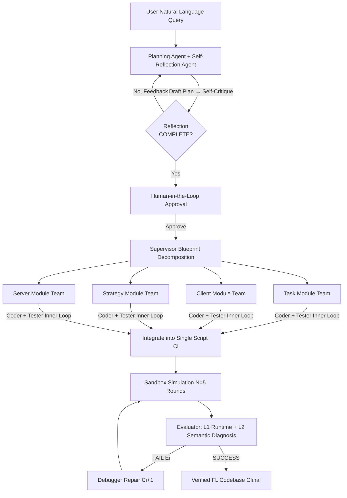

# Helmsman: Autonomous Synthesis of Federated Learning Systems via Collaborative LLM Agents

**Conference**: ICLR 2026  
**OpenReview**: [https://openreview.net/forum?id=Voiy13SK3r](https://openreview.net/forum?id=Voiy13SK3r)  
**Code**: [https://github.com/haoyuan-l/Helmsman](https://github.com/haoyuan-l/Helmsman)  
**Area**: LLM Agent / Multi-Agent Systems / Automated Federated Learning  
**Keywords**: Multi-agent collaboration, Federated Learning, Automated System Synthesis, Code Generation, human-in-the-loop, AgentFL-Bench  

## TL;DR
Helmsman utilizes a team of specialized LLM agents to automatically synthesize a runnable and simulation-verified Federated Learning (FL) codebase from high-level natural language requirements, such as "deploying a data-heterogeneous object detection system on 15 mobile devices."

## Background & Motivation
- **Background**: FL requires training models on decentralized data. However, designing a robust FL system involves addressing multiple challenges like data heterogeneity (non-IID), system heterogeneity (compute/bandwidth differences), and diverse objectives (personalization/continual learning). Each challenge has numerous specialized algorithms (e.g., FedProx for stragglers, SCAFFOLD for client drift, FedNova for system heterogeneity).
- **Limitations of Prior Work**: The "selection-combination-tuning" of these strategies is a combinatorial explosion problem. Currently, it relies on manual assembly by domain experts, resulting in **static, customized, and fragile** solutions that may fail if client counts or network conditions change. Existing general-purpose code generation agents (single agent + CoT/ReAct) excel at self-contained algorithmic problems but struggle with distributed system-level engineering involving coupled components like data loading, client training, server aggregation, and overall strategy.
- **Key Challenge**: The **combinatorial complexity** of the FL design space vs. the reasoning ceiling of a single agent; the gap between flexible research frameworks (Flower/PySyft) and reliable industrial platforms (FATE/FLARE) remains unbridged.
- **Goal**: Automate the entire "design-implementation-testing" workflow of FL systems, enabling both experts and non-experts to obtain deployment-ready solutions from single-sentence requirements.
- **Core Idea**: **Multi-agent division of labor + closed-loop simulation self-correction**—mimicking the human R&D process by decomposing it into three phases: "Interactive Planning → Modular Coding → Autonomous Evaluation & Refinement." Each phase is executed by specialized agent teams using real FL simulation (Flower) as ground-truth feedback for debugging.

## Method

### Overall Architecture
Helmsman is built on LangGraph and decomposes the "high-level requirement to runnable FL codebase" pipeline into three orchestrated phases: **(1) Interactive Verifiable Planning**—refining user queries into research plans; **(2) Supervised Modular Coding**—a Supervisor schedules four modular teams for parallel implementation; **(3) Autonomous Evaluation & Refinement**—running, diagnosing, and repairing within sandbox simulations until verification passes. Planning uses Gemini-2.5-flash, while coding and evaluation use Claude-Sonnet-4.0.

### Key Designs

**1. Interactive Verifiable Planning: Dual oversight via self-reflection and human-in-the-loop.** After the user provides requirements via a structured template (Problem Statement / Task Description / Framework Requirements), the Planning Agent drafts a research plan using Web search (Tavily) and an FL literature RAG library. To combat hallucinations, a Reflection Agent critiques the plan based on "logical consistency, experimental setup completeness, and feasibility," marking it as COMPLETE or INCOMPLETE with actionable feedback. Once internal cycles pass, it is submitted for final HITL approval. The authors emphasize that HITL is not a "formality" but serves three roles: ensuring alignment and safety, optimizing resources (pruning search space), and providing fine-grained experimental control.

**2. Supervised Modular Coding: Parallel implementation by "separation of concerns."** The Supervisor Agent decomposes the plan into a blueprint aligned with standard FL architecture, split into four replaceable modules: **Task** (Data loading/Model architecture/Training utilities), **Client** (Local training and evaluation), **Strategy** (Federated aggregation algorithms like FedAvg), and **Server** (Orchestrating global updates). Each module is handled by a team consisting of a Coder Agent (Implementation) and a Tester Agent (Real-time verification), creating an "inner loop" to ensure module correctness. The Supervisor enforces a dependency graph (e.g., the Server module starts only after Strategy and Task are stable) before integrating them into a single script.

**3. Autonomous Evaluation & Refinement: Closed-loop short simulation, layered diagnosis, and auto-correction.** The integrated codebase $C_i$ runs for a few federated rounds ($N=5$) in a sandbox to generate simulation logs $L_i = \mathrm{Simulate}(C_i, N)$. This short run is designed to expose critical runtime/integration errors cheaply. The Evaluator Agent $f_{eval}$ performs **layered diagnosis**: L1 runtime integrity verification (scanning Python exceptions/stack traces), followed by L2 semantic correctness verification (checking for stagnant training metrics, zero client participation, or model divergence). If $S_i=\text{FAIL}$, the Debugger Agent $f_{debug}$ uses the error context $E_i$ for targeted patching, producing $C_{i+1} = f_{debug}(C_i, E_i)$. This continues until both L1/L2 verifications pass or $T_{max}=10$ is reached.

**4. Agent Tooling: Dual-source knowledge and sandbox execution.** Agent capabilities are enhanced by specialized tools. The planning side uses a **dual-source knowledge system**: Web search for the latest documentation and a RAG pipeline for classic FL literature on arXiv (using BM25 + vector hybrid retrieval with Coherent rerank-v3.5). The refinement side uses the **Flower framework as a sandbox simulation tool**, providing ground-truth feedback for the diagnosis-repair cycle.

## Key Experimental Results

### Main Results
On the self-constructed **AgentFL-Bench** (16 tasks covering 5 domains: data heterogeneity, communication efficiency, personalization, active learning, and continual learning), Helmsman's synthesized strategies were compared against manual baselines (mean of 3 runs, cross-silo 5 clients / cross-device 10 clients, 100 rounds):

| ID | Task/Challenge | FedAvg | FedProx | Specialized Method | Ours |
|----|-----------|--------|---------|----------|------|
| Q3 | CIFAR-10N Label Noise | 73.95 | 78.78 | 80.55† | **81.62** |
| Q5 | HAR User Heterogeneity | 94.84 | 95.22 | 95.19∗ | **96.28** |
| Q6 | Speech Commands Speaker Diff | 84.44 | 84.19 | 83.48 | **86.58** |
| Q7 | Fed-ISIC2019 Site Heterogeneity | 57.09 | 61.11 | 62.88∗ | **63.75** |
| Q9 | CIFAR-100 Resource Constraints | 59.96 | 59.43 | 62.62‡ | **62.94** |
| Q10 | CIFAR-100 Bandwidth Limited | 41.77 | 45.21 | 45.77∗ | **48.78** |
| Q11 | FEMNIST Connectivity Limited | 87.46 | 87.95 | 89.11∗ | **89.73** |
| Q16 | Split-CIFAR100 Incremental Tasks | 15.38 | 15.86 | 29.45¶ | **50.95** |

Ours competes with or exceeds specialized methods in most tasks, though it trails in specific high-prior tasks like Q8 (Caltech101) and Q15 (Active Learning).

### Ablation Study
Ablation of six configurations (Claude-Sonnet-4.5) across 7 representative tasks, focusing on ① Planning group, ② Collaborative coding group, and ③ Dual-layer verification:

| Config | ① | ② | ③ | Success Rate | Avg. Cost ($) |
|------|---|---|---|--------|------------|
| Single ReAct Agent | ✗ | ✗ | ✗ | 0% | 1.75 |
| Single ReAct (+Dual Verif) | ✗ | ✗ | ✓ | 14.29% | 1.28 |
| No Collab Coding | ✓ | ✗ | ✓ | 28.57% | 2.11 |
| No Dual-layer Verif | ✓ | ✓ | ✗ | 0% | 0.88 |
| Full System (No HITL) | ✓ | ✓ | ✓ | 100% | 1.14 |
| **Full System** | ✓ | ✓ | ✓ | **100%** | **0.98** |

### Key Findings
- **All components are essential**: Removing any component causes the success rate to plummet from 100%. Removing dual-layer verification results in 0% success, proving simulation is critical for robustness.
- **HITL reduces costs**: The full system with HITL is cheaper than without it ($0.98 vs $1.14), as human feedback prunes the search space.
- **Discovery of new algorithm combinations**: In Q16 (Continual Learning), Helmsman synthesized a hybrid strategy of "Client Experience Replay + Global Model Distillation," achieving 51.04% accuracy—significantly higher than the specialized method TARGET (34.89%).
- **Robustness to input schema**: The planning group (planner + self-reflection) successfully handles paraphrased, incomplete, or out-of-schema queries by completing missing information.

## Highlights & Insights
- **Systems engineering as an agent benchmark**: Moving beyond self-contained HumanEval tasks, it emphasizes coordinating interdependent modules—a real weakness for single-agent paradigms.
- **Closed-loop simulation as a "Reality Checker"**: Short 5-round runs + layered diagnosis (crash vs. algorithmic bugs) provide low-cost feedback to drive high-quality self-correction.
- **AgentFL-Bench fills a gap**: Providing 16 realistic FL tasks with standardized natural language query templates allows for fair comparison of agentic systems.
- **HITL as "Cost-efficient and Safe"**: Positioning human intervention as a pruning and alignment tool provides a compelling model for human-AI collaboration in scientific research.

## Limitations & Future Work
- **Performance gaps**: Still trails specialized methods in specific tasks like unbalanced datasets (Caltech101) or active learning, where automated synthesis lacks strong domain priors.
- **Convergence lack of guarantee**: The Debugger may fail repeatedly on pathological tasks; there is a lack of high-level strategic re-planning automation.
- **Reliance on closed-source SOTA models**: Tied to paid APIs like Gemini, Claude, and specialized tools, limiting portability and increasing cost.
- **Simulation vs. Deployment**: All verifications are in a sandbox; real-world edge dynamics (network fluctuations, privacy attacks) are not validated end-to-end.
- **Scale**: Results are primarily on 5-10 clients; scalability for massive federated cohorts remains to be verified.

## Related Work & Insights
- **Multi-agent Code Generation**: Works like AgentCoder and CodeSim demonstrate that division of labor is superior for system engineering—Helmsman introduces this to FL.
- **Gap in FL Frameworks**: Bridges the gap between research flexibility (Flower) and industrial reliability through automated evaluation.
- **Insight**: Modeling manual "expert assembly" engineering problems as "multi-agent division + simulation feedback + HITL pruning" serves as a reusable automated R&D paradigm for other complex systems.

## Rating
- **Novelty**: ⭐⭐⭐⭐ — Systematically applies multi-agent collaboration to end-to-end FL synthesis; introduces AgentFL-Bench.
- **Experimental Thoroughness**: ⭐⭐⭐⭐ — Covers 16 tasks, 5 domains, 3 repetitions, and extensive ablations; however, client scales are small.
- **Writing Quality**: ⭐⭐⭐⭐ — Clear motivation regarding the intractable design space and well-defined three-stage framework.
- **Value**: ⭐⭐⭐⭐ — Lowers the barrier for FL development; likely to stimulate the "agentic system engineering" sub-field.

<!-- RELATED:START -->

## Related Papers

- [\[ICLR 2026\] CoDA: Agentic Systems for Collaborative Data Visualization](coda_agentic_systems_for_collaborative_data_visualization.md)
- [\[ICLR 2026\] Scaling Agent Learning via Experience Synthesis](scaling_agent_learning_via_experience_synthesis.md)
- [\[ACL 2026\] FedGUI: Benchmarking Federated GUI Agents across Heterogeneous Platforms, Devices, and Operating Systems](../../ACL2026/llm_agent/fedgui_benchmarking_federated_gui_agents_across_heterogeneous_platforms_devices_.md)
- [\[ICLR 2026\] Expanding the Capability Frontier of LLM Agents with ZPD-Guided Data Synthesis](expanding_the_capability_frontier_of_llm_agents_with_zpd-guided_data_synthesis.md)
- [\[ICLR 2026\] EvoTest: Evolutionary Test-Time Learning for Self-Improving Agentic Systems](evotest_evolutionary_test-time_learning_for_self-improving_agentic_systems.md)

<!-- RELATED:END -->
