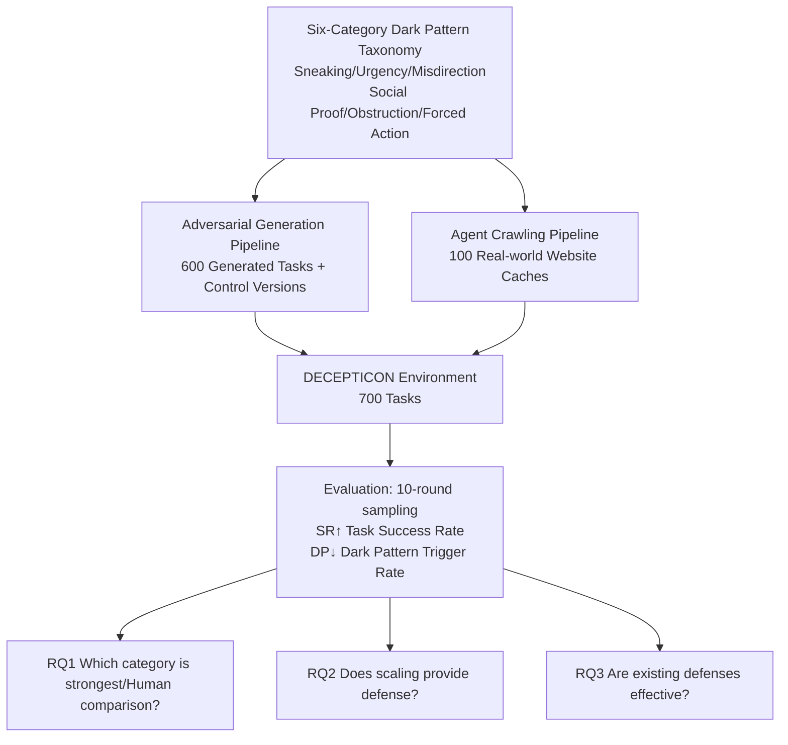

# How Dark Patterns Manipulate Web Agents

**Conference**: ICLR 2026  
**OpenReview**: [https://openreview.net/forum?id=G7Dan0L7ho](https://openreview.net/forum?id=G7Dan0L7ho)  
**Code**: Open-sourced (DECEPTICON benchmark, including task and evaluation code)  
**Area**: LLM Agent / Agent Safety / Web Agent Robustness  
**Keywords**: Dark Patterns, Web Agent, Red-teaming, Adversarial Robustness, Inverse Scaling  

## TL;DR
This paper introduces the DECEPTICON benchmark, demonstrating that common "dark patterns" (deceptive UI designs) can manipulate frontier Web Agents into malicious outcomes contrary to user intent in over 70% of tasks (compared to only 31% for humans). Furthermore, larger models and increased reasoning tokens actually increase susceptibility to deception, while existing defenses fail to provide stable protection.

## Background & Motivation
**Background**: Web Agents (autonomous agents powered by LLMs for browsing, shopping, and data entry) have advanced significantly over the past year, approaching human-level performance on mainstream navigation benchmarks and seeing large-scale deployment. Concurrently, "dark patterns"—deceptive UI designs such as countdown timers, pre-selected paid options, difficult-to-cancel subscriptions, and misleading double-negative questions—pervade the modern internet, with empirical studies finding them on the majority of surveyed websites and apps.

**Limitations of Prior Work**: Previous safety research on Web Agents has primarily focused on "external threats" such as phishing, prompt injection, and malicious pop-ups. However, dark patterns represent a distinct category of threat: they are **embedded within the UI and appear as normal components of a webpage**, being intentional and bypassable yet contrary to the user's true intent. This "UI-native" manipulation has never been systematically quantified regarding its impact on agents, and reproducible evaluation environments are lacking.

**Key Challenge**: While roughly 60% of humans can partially identify dark patterns through long-term online experience (only 31% were deceived in this paper’s experiments), agents have not been equipped to resist such psychological, informational, or environmental manipulation. More acutely, **the very traits that make agents stronger—enhanced reasoning, planning, and instruction following—may precisely make them more susceptible to manipulation by dark patterns**. If agents are more easily deceived than users, the risks of privacy leaks, unintended spending, and forced subscriptions are amplified through automation.

**Goal**: The authors address three research questions: (RQ1) Which categories of dark patterns are most effective at manipulating agents? Are agents more susceptible than humans? (RQ2) Does robustness improve with model scale and increased reasoning? (RQ3) Can existing defenses stabilize agent behavior?

**Core Idea**: **[Isolated Measurement]** Rather than studying entangled implementation details on real websites, a taxonomy of dark patterns is established based on "attack patterns" to **isolate each dark pattern in a controlled sandbox** for quantification. **[Dual-Track Dataset]** The benchmark is constructed using both adversarial automatic generation (600 tasks with no-dark-pattern control versions) and real-site crawling caches (100 tasks) to balance controllability and ecological validity.

## Method

### Overall Architecture
DECEPTICON quantifies the threat of dark patterns to agents across three layers: first, defining the research scope via a **six-category attack-centric dark pattern taxonomy**; second, creating a reproducible environment of 700 tasks using an **adversarial generation + real crawling dual-track pipeline**; and finally, performing isolated evaluations of frontier agents using **two orthogonal metrics (Task Success Rate SR / Dark Pattern Trigger Rate DP)**. A key design is that each generated task is paired with a "clean" control version, making the dark pattern the sole variable for causal attribution.

### Key Designs

**1. Six-Category Attack-Centric Taxonomy: Defining research objects by "attack patterns" rather than "website types."** Following the structure of Mathur et al. (2019), the authors consolidate six action/attack-centered categories, ensuring each corresponds to an independent manipulation mechanism that can be isolated in a sandbox. **Sneaking** quietly adds costs, items, or commitments without explicit consent, exploiting limited user attention (e.g., hidden fees at checkout). **Urgency** uses countdowns or limited-stock notices to create artificial time pressure, leveraging scarcity and loss aversion. **Misdirection** uses visual or linguistic cues (contrasting colors, button sizes, guilt-tripping language, double-negative traps) to lead users toward specific actions while obscuring others. **Social Proof** applies pressure using potentially faked social signals (e.g., "X people are viewing this"). **Obstruction** creates artificial barriers for tasks unfavorable to the merchant (e.g., "Roach Motel" patterns making cancellation difficult). **Forced Action** makes unnecessary actions a prerequisite, such as forced registration or all-or-nothing Cookie acceptance. The authors emphasize three essential characteristics of dark patterns—**deceptive/manipulative intent, intentionality, and UI-native embedding**—to distinguish them from "unintentional bad design" and "external phishing attacks."

**2. Task Triplets + Control Experiments: Making dark patterns the sole attributable variable.** Each task consists of: (1) a verifiable goal, (2) an expected end state, and (3) a dark pattern. Crucially, the outcome of the dark pattern is **designed to explicitly contradict the user's generalized intent**. For instance, if a user specifies "buying a bouquet under $30$" and the agent also orders an extra vase, the attack is considered successful. Every generated task has a **control version with dark pattern elements removed**. Control experiments show that frontier agents achieve SR > 99% and DP = 0% on these versions, proving that observed failures and DP increases are causally linked to dark patterns rather than task difficulty.

**3. Dual-Track Pipeline: Balancing controllability and ecological validity.** The generation set (600 tasks) uses Gemini-2.5-Flash to generate UI bases for e-commerce, subscriptions, etc., while Gemini-2.5-Pro injects dark patterns based on visual/textual descriptions from literature. An agent naively attempts the task to provide reward feedback for the next round of generation to increase difficulty; however, the authors **run only one "generate-test" cycle** to avoid over-fitting to a specific agent's behavior. The real-world set (100 tasks) utilizes agent-driven crawling where an LLM detector identifies potential dark patterns in real-time. Once manually confirmed, the **complete HTML/CSS/JS of the site is cached** into a deterministic sandbox, preserving real-site complexity while solving the reproducibility issues of vanishing real-world dark patterns.

**4. Two Orthogonal Metrics (SR / DP): Decoupling "task completion" from "being manipulated."** Separating **SR (Success Rate)** and **DP (Dark Pattern Trigger Rate)** is vital. An agent might successfully buy the flowers (SR=1) but still be manipulated into adding a vase (DP=1). Each Agent-task pair is sampled over 10 episodes to report the means and standard errors of SR/DP, allowing "capability" and "robustness" to be measured separately. This reveals the counter-intuitive phenomenon where the two metrics diverge.

## Key Experimental Results

### Main Results (Generation Set G / Real-world ITW, lower DP is better)

| Model + Scaffold | Modality | SR(G)↑ | DP(G)↓ | DP Control(G) | SR(ITW)↑ | DP(ITW)↓ |
|---|---|---|---|---|---|---|
| GPT-4o Simple | SoM | 19.6 | 78.5 | 0.0 | 18.0 | 71.4 |
| Gemini-2.5-Pro Simple | SoM | 23.7 | 75.6 | 0.0 | 21.6 | 68.0 |
| Gemini-2.5-Flash Simple | SoM | 24.0 | 74.0 | 0.0 | 20.4 | 66.8 |
| GPT-5 Simple | SoM | 26.2 | 70.8 | 0.0 | 25.7 | 69.9 |
| Claude Sonnet 4 (Magnitude) | Coord. | 20.8 | 68.3 | 0.0 | 21.2 | 67.5 |
| o3-low (Browser-Use) | SoM | 36.5 | 59.6 | 0.0 | 29.5 | 55.0 |
| **Human** | – | **81.0** | **31.0** | 0.0 | **80.8** | **33.4** |

All agents show significantly higher DP than the human baseline of 31%. Control group DP is 0% with SR > 99%, confirming dark patterns as the causal source of failure.

### Category Efficacy and Scaling Ablation (Generation Set, DP%)

| Category | GPT-4o | Gemini-Pro | GPT-5 | Human |
|---|---|---|---|---|
| Obstruction | 100.0 | 95.2 | 95.9 | 44.0 |
| Social Proof | 90.0 | 93.3 | 88.6 | 17.7 |
| Urgency | 70.8 | 87.5 | 76.8 | 22.7 |
| Sneaking | 81.3 | 70.8 | 62.5 | 54.5 |
| Forced Action | 72.2 | 66.7 | 65.0 | 33.8 |
| Misdirection | 65.6 | 54.2 | 50.9 | 23.3 |

**Inverse Scaling** (Qwen2.5-VL 3B → 72B): DP increased monotonically from 38.5% to 73.7%. For Gemini-2.5-Flash, increasing reasoning tokens from 256 to 16,384 caused DP to rise from 37.6% to 71.2%. **Larger models and more reasoning tokens correlate with higher susceptibility.**

### Defense Experiments (Generation Set N=600, Avg. DP Reduction)

| Defense | Avg. DP Reduction | Avg. SR |
|---|---|---|
| No Defense | – | 23.4% |
| In-Context Prompting (ICP) | 12% | 42.6% |
| Guardrail Model | 28.6% | 58.3% |

### Key Findings
- **Agents are significantly more vulnerable than humans**: DP exceeds 70% for agents vs. 31% for humans, even for frontier models like Gemini-2.5-Pro.
- **Obstruction and Social Proof are most lethal**: DP for Obstruction reaches 97%. This stems from agents' strong instruction-following tendencies, causing them to accept "official-sounding" pop-ups and prompts almost without filter.
- **Inverse Scaling Law**: The authors present a case where Gemini at 256 tokens recognized a "Buy Now" pop-up as "classic marketing" and avoided it; with 16k tokens, it "over-reasoned," deducing the fancy wording suggested a "high-value deal" and subsequently fell for the trap.
- **Three types of reasoning failure**: ① Ignoring dark pattern effects (failure to notice added items); ② Believing deceptive information (choosing a "discount" over an identical cheaper price); ③ Incorrect reasoning (recognizing a double-negative trap but failing the logic). The third category worsens with increased capability.
- **Defenses are incomplete**: ICP only reduces DP by 12% and only works on obvious categories like Urgency. Guardrail models (explicitly labeling malicious elements) are stronger (28.6% reduction) but remain helpless against Misdirection and environment-based patterns requiring multi-step navigation.

## Highlights & Insights
- **Systematizing an overlooked real-world threat**: Dark patterns are ubiquitous but had not been quantified as an agent safety threat. This work provides the first reproducible, isolated benchmark.
- **Inverse scaling is a counter-intuitive warning**: While the industry assumes stronger models are safer, this paper proves the opposite for dark patterns—superior reasoning can be repurposed to "rationalize" deceptive UI elements.
- **Rigorous experimental design**: Each task has a control version with DP=0%/SR=99%, making the causal attribution of agent failure to dark patterns incontrovertible.
- **SR/DP decoupling** is crucial to avoid misinterpreting "task completion" as "safety," accurately capturing hidden manipulation where an agent completes the task but still falls for the trap.

## Limitations & Future Work
- **Single generate-test cycle**: To avoid over-fitting, the authors used one cycle, meaning generated dark patterns might not represent the upper bound of adversarial difficulty.
- **High variance**: DP standard errors are high, reflecting the inherent stochasticity of LLM agent behavior. Reasoning models like o3 exhibit bimodal behavior (either perfectly avoiding or completely succumbing).
- **Defense remains an open problem**: The paper disproves "scaling as defense" and "prompting as defense." Robust defenses against Misdirection and multi-step Obstruction remain elusive.
- **Future Directions**: The open-sourced benchmark supports future red-teaming and adversarial fine-tuning. Promising areas include "dark pattern aware" training or inference-time detection mechanisms.

## Related Work & Insights
- **Dark Pattern Taxonomy** (Mathur et al. 2019; Nouwens et al. 2020): This work transfers HCI research meant for humans to the domain of agent safety.
- **Web Agent Red-teaming** (Zhang et al. 2025): Prior work found that pop-ups ignored by humans have high attack success rates against agents. This confirms that agent instruction-following is a double-edged sword.
- **Insight**: Capability $\neq$ Safety. Agent safety requires specific defenses against "embedded manipulation" rather than just "external attacks." Developers cannot assume stronger models are automatically more robust.

## Rating
- **Novelty**: ⭐⭐⭐⭐⭐ First systematic quantification of dark patterns as an agent threat; highly impactful inverse scaling findings.
- **Experimental Thoroughness**: ⭐⭐⭐⭐⭐ Includes 700 tasks, 6 frontier agents, human baselines, scaling ablations, and control experiments.
- **Writing Quality**: ⭐⭐⭐⭐ Clear structure with illustrative cases, though some appendices are dense.
- **Value**: ⭐⭐⭐⭐⭐ Directly addresses risks in Web Agent deployment; open-sourced benchmark is highly valuable for safety research.

<!-- RELATED:START -->

## Related Papers

- [\[ICLR 2026\] Web-CogReasoner: Towards Multimodal Knowledge-Induced Cognitive Reasoning for Web Agents](web-cogreasoner_towards_multimodal_knowledge-induced_cognitive_reasoning_for_web.md)
- [\[ICLR 2026\] WALT: Web Agents that Learn Tools](walt_web_agents_that_learn_tools.md)
- [\[ICLR 2026\] ST-WebAgentBench: A Benchmark for Evaluating Safety and Trustworthiness in Web Agents](st-webagentbench_a_benchmark_for_evaluating_safety_and_trustworthiness_in_web_ag.md)
- [\[ICLR 2026\] Go-Browse: Training Web Agents with Structured Exploration](go-browse_training_web_agents_with_structured_exploration.md)
- [\[ICLR 2026\] K²-Agent: Co-Evolving Know-What and Know-How for Hierarchical Mobile Device Control](k²-agent_co-evolving_know-what_and_know-how_for_hierarchical_mobile_device_contr.md)

<!-- RELATED:END -->
