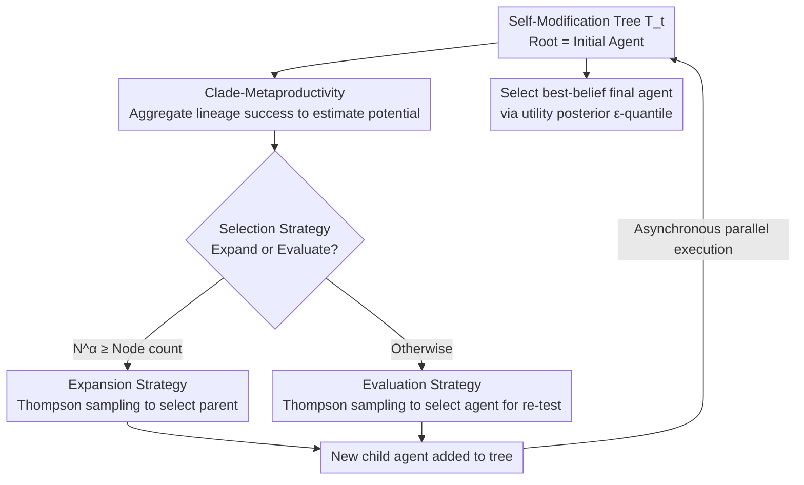

# Huxley-Gödel Machine: Human-Level Coding Agent Development by an Approximation of the Optimal Self-Improving Machine

**Conference**: ICLR 2026  
**OpenReview**: [https://openreview.net/forum?id=T0EiEuhOOL](https://openreview.net/forum?id=T0EiEuhOOL)  
**Code**: https://github.com/metauto-ai/HGM  
**Area**: Agent / Self-Improvement / Coding Agents  
**Keywords**: Self-Improving Agents, Coding Agents, Tree Search, Thompson Sampling, Gödel Machine

## TL;DR
Aiming at the problem of "allowing coding agents to rewrite their own code to become stronger," this paper points out that existing methods using single-step benchmark scores as expansion guidance are unreliable (high-scoring parents do not necessarily produce high-quality descendants). It proposes **Clade-Metaproductivity (CMP)**—the aggregated performance of an entire lineage—as the metric for self-improvement potential. It proves that a true CMP oracle is sufficient to simulate an optimal Gödel Machine. The implemented Huxley-Gödel Machine (HGM) uses Thompson sampling based on CMP estimates to select nodes for expansion, surpassing DGM/SICA on SWE-bench Verified and Polyglot with fewer CPU hours, and achieving the level of human-engineered agents on SWE-bench Lite.

## Background & Motivation
**Background**: A recent class of "self-improvement" research allows coding agents to directly edit their own codebases, generating a "self-modification tree" where the root is the initial agent and each node is a rewritten version. Representative methods like the Darwin Gödel Machine (DGM) and Self-Improving Coding Agent (SICA) follow a common heuristic: **prioritizing the expansion of agents with higher benchmark scores**, assuming "current high performance $\Rightarrow$ promising future rewrites."

**Limitations of Prior Work**: This default assumption does not hold. The authors observed a recurring phenomenon where a high-scoring agent might produce incompetent descendants, while an average-scoring agent might develop a lineage with greater long-term returns. This mismatch between "single-step benchmark performance" and "long-term self-improvement potential" is named **Metaproductivity-Performance Mismatch (MPM)**. Figure 1 shows that the correlation between DGM/SICA guidance metrics and true long-term improvement is only 0.27–0.44.

**Key Challenge**: The theoretically optimal solution is the Gödel Machine, which only accepts self-modifications that are "provably capable of improving expected long-term utility." However, it relies on formal proof search, making it nearly impossible to implement in practice. Existing works settle for benchmark scores as proxies, thereby introducing MPM. The fundamental issue is that **evaluating a modification only considers its immediate utility while ignoring its downstream impact on the ability to continue self-improving**.

**Goal**: To find a guidance metric that approximates the "long-term optimality" of the Gödel Machine while being estimable from finite, partial evaluations to guide the search of the self-modification tree.

**Key Insight**: The authors borrow the concept of a "clade" from Huxley—a common ancestor and all its descendants (e.g., mammals constitute a clade). Whether an agent is worth expanding should not depend on its individual score but on the **success rate of its entire lineage**.

**Core Idea**: Define **Clade-Metaproductivity (CMP)**, measure self-improvement potential by aggregating the success of all descendants within an agent's clade. Theoretically prove that "obtaining a true CMP oracle is sufficient to implement the acceptance mechanism of a Gödel Machine," and then approximate this optimal machine using empirical CMP estimation combined with Thompson sampling.

## Method

### Overall Architecture
HGM formalizes "self-improvement" as an **iterative tree search** problem: maintaining a growing tree of agents $T_t$ (root $a_0$ is a fixed initial agent), with the goal of finding a final agent $a_{\text{final}}$ with the highest utility on downstream tasks within a computational budget. At each step, the policy faces a **composite decision**: either "expand" (select a parent node and have it rewrite itself to generate a child node) or "evaluate" (select an existing agent and run it on a downstream task to obtain a success/failure signal).

Unlike DGM/SICA, which couple "expansion-evaluation" (immediately spending evaluation budget on every new agent), HGM decouples this into three sub-strategies: **Selection strategy** (expand vs. evaluate), **Expansion strategy** (which parent to rewrite), and **Evaluation strategy** (which agent to re-test). All three revolve around the same core quantity—the estimate of CMP, $\widehat{\mathrm{CMP}}$—allowing for fine-grained evaluation at the "single agent-single task" level and early stopping for unpromising agents.

### Key Designs

**1. Clade-Metaproductivity (CMP): Replacing Single-Step Scores with Lineage Success Rates**

This is the theoretical and methodological cornerstone of the paper, directly addressing MPM. The authors first define a theoretically ideal but hard-to-calculate global quantity, **Global Metaproductivity (GMP)**: the expected utility of the final agent selected after running policy $\pi$ to completion from a node. This corresponds to the Q-value in reinforcement learning but is too broad to estimate as it requires expanding the entire future tree. Noting that a Gödel Machine only cares about the "current agent and its descendants" when deciding to accept a modification, the authors localize GMP to the subtree rooted at a node (its clade), yielding CMP:

$$\mathrm{CMP}_\pi(T, a) = \mathbb{E}_{T_B \sim p_\pi(\cdot|T,a)}\Big[\max_{a' \in C(T_B, a)} U(a')\Big],$$

where $C(T_B, a)$ is the clade of $a$, and $U$ is the downstream task utility (average of binary success indicators). The key conclusion is **Theorem 1: Under Assumption 1 (the goal only depends on the final agent, evaluations are repeatable and independent, each modification costs one unit of budget, and proofs cost zero budget), a CMP oracle is sufficient to implement a Gödel Machine.** This transforms the abstract goal of an "approximate optimal self-improving machine" into an estimable statistic. In implementation, HGM uses the weighted success/failure counts of all descendants within the clade:

$$\widehat{\mathrm{CMP}}(a) = \frac{n^C_{\text{success}}(a)}{n^C_{\text{success}}(a) + n^C_{\text{failure}}(a)}, \quad n^C_{\bullet}(a) = \sum_{a' \in C(a)} n_{\bullet}(a').$$

Estimating productivity at the clade level rather than the node level offers two benefits: an average ancestor is still valued if its descendants continue to improve, and stagnant lineages are de-weighted. Furthermore, aggregating evidence across an entire lineage is statistically more robust than single-point results, which is crucial when evaluations are expensive and the benchmark is only partially observed.

**2. Thompson Sampling Expansion + Exploration-Exploitation Scheduler**

Given $\widehat{\mathrm{CMP}}$, the system must decide which specific parent to rewrite during expansion. Greedy selection of the highest $\widehat{\mathrm{CMP}}$ leads to premature convergence. HGM employs **Thompson Sampling** from bandit literature for "smoothed maximization": success/failure counts for each clade are used as Beta distribution parameters, and the expansion node $a^*$ is sampled:

$$a^* \sim \mathrm{TS}\big(\{\tau(1 + n^C_{\text{success}}(a)),\ \tau(1 + n^C_{\text{failure}}(a)) \mid a \in T_t\}\big).$$

Here, $\tau$ is an **exploration-exploitation scheduler** that increases monotonically over time $t$. Early on, $\tau$ is small, leading to a flat sampling distribution that encourages exploration. As the budget $b$ nears exhaustion, $\tau$ increases, "polarizing" the distribution and concentrating sampling on high-CMP nodes for exploitation. With a known budget $B$, the scheduler ($\tau = B/b$) allocates limited computation by starting broad and ending focused.

**3. Selection Strategy + Evaluation Strategy + Asynchronous Execution: Decoupling and Fine-Grained Control**

DGM/SICA grant exclusive evaluation rights to new agents immediately upon generation, often wasting budget on new agents failing multiple tasks while ignoring promising older agents. HGM treats expansion and evaluation as independent steps. The **Evaluation strategy** also uses Thompson sampling but focuses on individual agents $\mathrm{TS}(\tau(1+n_{\text{success}}(a)), \tau(1+n_{\text{failure}}(a)))$ to prioritize re-testing high-scoring agents—effectively inducing a "soft maximum" within the clade to make CMP estimates closer to the max rather than the average. The **Selection strategy** borrows the infinite-arm bandit logic from UCB-Air: a new "arm" (agent) is only expanded when evaluation counts satisfy $N_t^\alpha \ge |T_t|$ ($\alpha \in [0,1]$); otherwise, existing agents are re-evaluated. This automatically balances exploring known options vs. introducing new ones. The CMP naturally supports early stopping of unpromising agents. Finally, decoupling enables **Asynchronous Execution** (HGM-Async), where each idle CPU runs an iteration using the latest global data, maximizing utilization.

### Loss & Training
HGM does not train neural networks and has no gradient loss; it is a tree search algorithm. When the budget is exhausted, the **Final Agent Selection** does not pick the one with the highest empirical mean, but rather the **best-belief agent** with the highest utility posterior $\epsilon$-quantile:

$$\arg\max_{a \in T_B} I_\epsilon\big(1 + n_{\text{success}}(a),\ 1 + n_{\text{failure}}(a)\big),$$

where $I$ is the regularized incomplete Beta function. Experiments set scheduler $\tau = B/b$, $\epsilon = 1$, and $\alpha = 0.6$. All HGM experiments use the asynchronous version.

## Key Experimental Results

### Main Results

**Fidelity of CMP Estimation (Verifying MPM and HGM accuracy)**: On SWE-Verified-60 and Polyglot, the correlation between guidance metrics and empirical CMP (the max empirical mean of descendants, excluding the root) is compared.

| Estimator | SWE-Verified-60 (Weighted) | SWE-Verified-60 (Unweighted) | Polyglot (Weighted) | Polyglot (Unweighted) |
| :--- | :--- | :--- | :--- | :--- |
| SICA | 0.444 | 0.444 | 0.274 | 0.274 |
| DGM | 0.285 | 0.406 | 0.383 | 0.357 |
| **HGM (Ours)** | **0.778** | **0.512** | **0.626** | **0.873** |

**Self-Improvement Performance Comparison (Accuracy of best-belief agent + CPU hours to complete 800 evaluations)**: All methods share the same ancestor (SWE-Verified-60 start 40%, Polyglot start 20.3%). Expansion uses GPT-5 / Qwen3-Coder-480B; Evaluation uses GPT-5 mini / Qwen3-Coder-30B.

| Method | SWE-Verified-60 Acc (%) | Time (h) | Polyglot Acc (%) | Time (h) |
| :--- | :--- | :--- | :--- | :--- |
| SICA | 50.0 (+10) | Timeout/Infinite | 25.4 (+5.1) | 572 |
| DGM | 53.3 (+13.3) | 1231 | 27.1 (+6.8) | 2385 |
| **HGM (Ours)** | **56.7 (+16.7)** | **517** | **30.5 (+10.2)** | **347** |

HGM achieves the highest accuracy on both datasets while consuming the fewest CPU hours: 2.38× faster than DGM on SWE-Verified-60, and 6.86× faster than DGM on Polyglot. SICA frequently hung due to context window limits on SWE-Verified-60.

### HGM vs. Human Engineers (Generalization to SWE-Lite)
Optimizing on the full SWE-Verified (500 tasks, 8000 iterations): Initial GPT-5 mini agent 53.2% $\rightarrow$ HGM discovered agent **61.4%**, surpassing the best human-designed GPT-5 mini agents on the leaderboard and ranking in the top 10 overall (outperforming systems using more expensive models like Claude-3.7). Testing the agent found on SWE-Verified on SWE-Lite:

| Coding Agent | SWE-Lite Filtered (%) | SWE-Lite Standard (%) |
| :--- | :--- | :--- |
| SWE-agent + GPT-5 mini | 39.6 | 47.6 |
| **HGM best-belief + GPT-5 mini** | **40.1** | **49.0** |
| SWE-agent + Claude 4 Sonnet (Top) | 48.3 | 56.7 |
| **HGM best-belief + GPT-5** | **48.8** | **57.3** |

HGM's agent outperforms SWE-agent using the same GPT-5 mini backbone, indicating gains come from **agent design** rather than the model. With GPT-5, it exceeds all official verified submissions. On the newer SWE-Bench-Live Lite, the HGM agent (GPT-5.1 Codex mini) achieved 27.0%, surpassing the previous best of 24.7%.

### Key Findings
- **MPM is real and central**: The low correlation (0.27–0.44) of DGM/SICA scores with long-term improvement vs. HGM's high correlation (0.51–0.87) proves that "single-step scores as guidance" is the root cause of search diversion.
- **Clade aggregation is accurate and efficient**: Accumulating samples across lineages is statistically steady and, through decoupled asynchronous execution, significantly saves CPU hours (up to 6.86×) while improving accuracy.
- **Learned design principles, not overfitting**: Agents optimized on SWE-Verified transferred successfully to SWE-Lite and across backbones (GPT-5 mini $\rightarrow$ GPT-5), suggesting HGM improves general coding agent architectures rather than over-tuning for a specific benchmark.

## Highlights & Insights
- **Turning a theoretical machine into an estimable statistic**: Theorem 1 equates the Gödel Machine's acceptance mechanism to having a CMP oracle under specific assumptions. This pivots the problem from "proof search" to "estimating clade success rates," making it engineering-feasible.
- **Clever use of "Clades"**: Evaluating a node based on its entire lineage naturally aligns with the goal of "improving so that further improvement is possible" and solves the statistical noise issue of single-node evaluation.
- **Decoupled composite decisions**: The "infinite-arm bandit" perspective (Selection, Expansion, Evaluation) provides a reusable engineering pattern for any system that must balance generating new candidates vs. evaluating old ones.
- **Simple, effective scheduler**: Using remaining budget $\tau=B/b$ as a temperature for Thompson sampling ensures wide exploration initially and polarization toward high-performing branches at the end without extra hyperparameter tuning.

## Limitations & Future Work
- **Theoretical guarantees rely on Assumption 1**: Real-world scenarios involve evaluation noise, non-uniform modification costs, and intermediate rewards, which may loosen the equivalence between CMP and the Gödel Machine.
- **CMP estimation is a simple weighted proportion**: It does not model task difficulty. CMP values might not be comparable across different datasets or budget rounds.
- **Potential benchmark overfitting**: While cross-dataset and cross-backbone experiments were conducted, more diverse task families beyond SWE-bench are needed to confirm generalizability.
- **Future directions**: Incorporating task difficulty and noise into CMP estimation; studying gaps between HGM and GM when Assumption 1 is relaxed; and validating on non-coding agent capabilities.

## Related Work & Insights
- **vs. DGM (Darwin Gödel Machine)**: While both use tree-based self-improvement, DGM's reliance on immediate benchmark scores leads to MPM. HGM uses clade-level CMP to achieve higher accuracy with significantly less computation.
- **vs. SICA (Self-Improving Coding Agent)**: SICA couples expansion and evaluation, risking budget waste on poor branches. HGM's decoupled, fine-grained control supports early stopping and avoids deadlocks.
- **vs. Original Gödel Machine (Schmidhuber 2003)**: The original GM requires formal proofs within a single lifetime. HGM adapts the concept to the "repeatable evaluation" setting of coding agents, replacing intractable proof searches with CMP estimation.
- **Insight**: Any search or AutoML system involving "candidate generation + evaluation" can benefit from ranking candidates by their lineage performance rather than their own, and scheduling tasks using an infinite-arm bandit framework.

## Rating
- Novelty: ⭐⭐⭐⭐⭐ Discovery of MPM + Theorem 1 provides a novel perspective by grounding a theoretical concept into an engineering metric.
- Experimental Thoroughness: ⭐⭐⭐⭐ Coverage includes correlation validation, performance benchmarks, and human-agent comparisons, though task variety is mostly SWE/Polyglot.
- Writing Quality: ⭐⭐⭐⭐⭐ Logical progression from motivation to theory and algorithm; clear explanation of sub-strategies.
- Value: ⭐⭐⭐⭐⭐ Demonstrates the first automatically discovered coding agent to reach human-level performance on SWE-bench Lite with improved efficiency.

<!-- RELATED:START -->

## Related Papers

- [\[ICLR 2026\] Darwin Gödel Machine: Open-Ended Evolution of Self-Improving Agents](darwin_gödel_machine_open-ended_evolution_of_self-improving_agents.md)
- [\[ICLR 2026\] CoMind: Towards Community-Driven Agents for Machine Learning Engineering](comind_towards_community-driven_agents_for_machine_learning_engineering.md)
- [\[ICLR 2026\] FeatureBench: Benchmarking Agentic Coding for Complex Feature Development](membership_privacy_risks_of_sharpness_aware_minimization.md)
- [\[ICLR 2026\] SciNav: A General Agent Framework for Scientific Coding Tasks](scinav_a_general_agent_framework_for_scientific_coding_tasks.md)
- [\[ICLR 2026\] Agentic Context Engineering: Evolving Contexts for Self-Improving Language Models](agentic_context_engineering_evolving_contexts_for_self-improving_language_models.md)

<!-- RELATED:END -->
