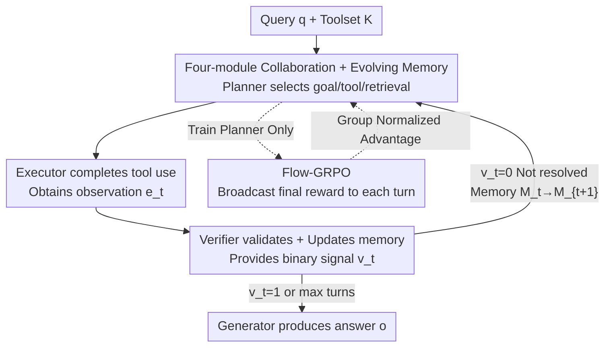

# In-the-Flow Agentic System Optimization for Effective Planning and Tool Use

**Conference**: ICLR 2026  
**OpenReview**: [https://openreview.net/forum?id=Mf5AleTUVK](https://openreview.net/forum?id=Mf5AleTUVK)  
**Code**: https://agentflow.stanford.edu (Project page, including Code/Model/Demo)  
**Area**: Agent  
**Keywords**: Agentic Systems, Tool Use, Multi-turn Reinforcement Learning, Online Optimization, Credit Assignment

## TL;DR
This paper proposes AGENTFLOW—a trainable agentic system where four modules (planner, executor, verifier, and generator) collaborate via a shared memory. Using the accompanying Flow-GRPO algorithm, the planner is optimized online within a "live flow" of multi-turn interactions. A 7B backbone achieves a 4–15 point gain across 10 benchmarks, outperforming GPT-4o (~200B).

## Background & Motivation

**Background**: To enable LLMs to reason with tools, the mainstream approach is tool-integrated reasoning (TIR), which uses verifiable rewards for RL to train a **single monolithic policy**. This policy alternates between `<think>` steps and `<tool_call>` actions (e.g., Search-R1, ReSearch, ToRL). Another direction is agentic systems (e.g., AutoGen), which decompose tasks into specialized modules like planners, coders, and critics.

**Limitations of Prior Work**: Monolithic TIR policies become unstable as tasks lengthen and toolsets grow, often failing to generalize to unseen tasks. Conversely, multi-module agentic systems are flexible but **almost entirely training-free**, relying on hard-coded orchestration or prompts with frozen modules. The few attempts to use SFT or preference optimization for specific modules are off-policy and decoupled from real runtime dynamics, failing to learn from downstream success/failure signals.

**Key Challenge**: Trainable policies are "monolithic but rigid," while flexible systems are "multi-modular but untrained." Improving modules within an agentic system requires solving the credit assignment problem under long-range, sparse rewards: feedback must propagate through an extended reasoning chain where state distributions shift based on tool outputs.

**Goal**: Develop an agentic system that maintains modular flexibility while allowing on-policy training of key modules within **multi-turn loops**, effectively solving the long-range sparse reward credit assignment problem.

**Key Insight**: Among the four modules, the planner is the one that determines "what to do next, which tool to call, and what to retrieve from memory." By putting it into a "live flow" for **online training**, it directly faces the real state distributions encountered during inference, aligning local decisions with global success.

**Core Idea**: Formalize a multi-turn, tool-integrated agentic system as an MDP and apply on-policy RL (Flow-GRPO) only to the planner. By "broadcasting" a single verifiable final reward to every turn, the multi-turn RL problem is simplified into a sequence of single-turn policy updates.

## Method

### Overall Architecture

AGENTFLOW addresses fine-grained planning in multi-turn tool interactions. Given a query $q$ and toolset $K$, the system enters a loop: in each turn, the **Action Planner** $P$ observes the current memory $M^t$ and outputs action $a^t$ (sub-goal, tool selection, or context retrieval). The **Tool Executor** $E$ executes the tool to get observation $e^t$. The **Execution Verifier $V$** judges if the execution was valid or if the goal was met, providing a binary signal $v^t$. If $v^t=0$, memory is updated deterministically $M^{t+1}=f_\text{mem}(M^t,a^t,e^t,v^t)$, and the loop continues. If $v^t=1$ or the turn limit is reached, the **Solution Generator** $G$ generates the answer $o$ based on $q$ and $M^T$.

Crucially, **only the planner is a trainable policy $\pi_\theta$**, while the other three modules remain frozen. The planner is optimized on-policy using Flow-GRPO within this live loop, adapting to trajectories shaped by tool calls and verifier signals. The evolving memory serves as an **explicit, deterministic record** of the reasoning process, ensuring traceability and controlled context growth.

### Key Designs

**1. AGENTFLOW: Online Trainable Agentic System**

To bridge the gap between rigid TIR and untrained agentic systems, this work formalizes problem-solving as a variable-length multi-turn MDP. The state is $(q,K,M^t)$, planner action is $a^t\sim\pi_\theta(a^t\mid q,K,M^t)$, and memory transitions deterministically. The trajectory $\tau=\{(a^t,e^t,v^t)\}_{t=1}^T$ explicitly records the history. The joint generation process:

$$p_\theta\big(\{a^t,e^t,v^t\}_{t=1}^T, o\mid q,K\big)=\Big[\prod_{t=1}^T \pi_\theta(a^t\mid q,K,M^t)\,E(e^t\mid a^t,K)\,V(v^t\mid q,e^t,M^t)\Big]G(o\mid q,M^T).$$

The explicit memory $M$ makes multi-turn decision-making transparent and controllable. Training only the planner focuses optimization on the module that governs the flow while maintaining system flexibility.

**2. Flow-GRPO: Reward Broadcasting for Multi-turn Credit Assignment**

Under long-range sparse rewards, assigning credit to intermediate actions is difficult. Instead of unreliable heuristics, this method uses a **pure final outcome reward** $\bar R(o,q,y^*)\in\{0,1\}$ based on the correctness of the final answer $o$. This reward is **broadcast to every action** in the trajectory: $r=R(a^t)=\bar R(o,q,y^*),\ \forall t$.

By conditioning the update on the full state $s^t_i=(q,K,M^t_i)$ of each turn, the multi-turn RL problem is **decomposed into a set of independent single-turn policy updates**. The objective follows a PPO-style token-level clipped ratio with KL regularization:

$$J_\text{Flow-GRPO}(\theta)=\mathbb{E}\Big[\tfrac{1}{G}\sum_{i=1}^{G}\tfrac{1}{T_i}\sum_{t=1}^{T_i}\tfrac{1}{|a^t_i|}\sum_{j}\min\big\{\rho^t_{i,j}A^t_i,\ \text{clip}(\rho^t_{i,j},1-\epsilon,1+\epsilon)A^t_i\big\}-\beta D_\text{KL}(\pi_\theta\Vert\pi_\text{ref})\Big],$$

where $\rho^t_{i,j}$ is the importance sampling ratio. Training on states the planner **actually encounters** during inference avoids distribution shift.

**3. Group Normalized Advantage**

Since the reward is a single trajectory-level signal, the advantage $A^t_i$ is constant across turns within a single trajectory. To reduce variance and sharpen credit assignment across samples, group normalization is applied over $G$ parallel rollouts per query:

$$A^t_i=\frac{\bar R(o_i,q,y^*)-\text{mean}\big(\{\bar R(o_k,q,y^*)\}_{k=1}^G\big)}{\text{std}\big(\{\bar R(o_k,q,y^*)\}_{k=1}^G\big)}.$$

This advantage represents how much better a trajectory is compared to others in the same group, stabilizing training even with extremely sparse 0/1 rewards.

## Key Experimental Results

The backbone is Qwen2.5-7B-Instruct, with only the planner being trained. Tools include Base Generator, Python Coder, Google Search, Wikipedia Search, and Web Search. Training data is a mix of Search-R1 and DeepMath. Performance is evaluated across 10 benchmarks.

### Main Results

| Task Category | Representative Benchmark | AGENTFLOW (w/ Flow-GRPO) | Strongest Tool Baseline | Gain |
|---------------|--------------------------|--------------------------|-------------------------|------|
| Search        | 4-Bench Avg              | 57.3                     | AutoGen (42.4)          | +14.9|
| Agentic       | GAIA                     | 33.1                     | Search-R1 (19.1)        | +14.0|
| Math          | 3-Bench Avg              | 51.5                     | ToRL (37.0)             | +14.5|
| Science       | GPQA/MedQA Avg           | 63.5                     | TIR (59.4)              | +4.1 |

Compared to ~200B models, AGENTFLOW (7B) outperforms GPT-4o across all categories (leading by 8.2 to 18.0 points). Direct gains from Flow-GRPO: 2Wiki 60.0 $\to$ 77.2, AIME24 16.7 $\to$ 40.0, GameOf24 31.0 $\to$ 53.0.

### Ablation Study (Planner Training Strategies)

| Planner Training Method | Avg (6 Benchmarks) | Relative to Frozen Baseline |
|-------------------------|--------------------|-----------------------------|
| Qwen2.5-7B Frozen       | 38.5               | —                           |
| GPT-4o Frozen           | 44.3               | +5.8                        |
| SFT (Distill GPT-4o)    | 19.5               | −19.0                       |
| Flow-GRPO (Ours)        | 55.7               | +17.2                       |

### Key Findings
- **Online RL is the Winning Move**: Swapping the 7B planner for GPT-4o only adds 5.8 points because static models cannot adapt to system dynamics. Offline SFT leads to a **catastrophic −19.0 drop** due to distribution shift. Flow-GRPO (+17.2) proves that "training in the flow" is essential.
- **Task-Adaptive Tool Selection**: On 2Wiki, Google Search usage increased by 42.0%. On MedQA, it dropped (66.2% $\to$ 10.9%) in favor of Wikipedia Search (0 $\to$ 59.8%) and document-based Web Search.
- **Positive Scaling**: Performance scales monotonically with backbone size (3B $\to$ 7B) and max turns $T_\text{max}$, peaking at 10 turns without descending into infinite loops.

## Highlights & Insights
- **Reward Broadcasting Synergy**: Simplifying multi-turn RL by treating every turn as the cause of the final success/failure—backed by group normalization—bypasses the need for fragile intermediate scoring.
- **Strategic Training Focus**: Focusing training solely on the planner is cost-effective and preserves agentic flexibility, providing a template for other agent frameworks.
- **Explicit Memory as State**: Using deterministic memory instead of hidden CoT chains for the MDP state makes multi-turn decisions transparent and context growth manageable.
- **Failure of SFT**: The massive drop in performance when using offline SFT clearly demonstrates why imitating trajectories from stronger models fails in dynamic, multi-turn agentic environments.

## Limitations & Future Work
- **Static Auxiliary Modules**: The executor, verifier, and generator are frozen; if the verifier fails to signal completion correctly, the planner is limited. Joint training is a logical next step.
- **LLM-as-judge Dependency**: The 0/1 rewards rely on LLM judges; any bias in the judge is broadcast to every turn during training.
- **Pure Sparse Rewards**: While stable, pure outcome rewards may not be optimal for ultra-long-horizon tasks where fine-grained intermediate feedback is necessary.

## Related Work & Insights
- **vs. Monolithic TIR**: TIR (Search-R1, ToRL) trains a single policy in a single context window, which is brittle for long-range tasks. AGENTFLOW leads by ~14 points in Search/Agentic/Math categories.
- **vs. Training-free Systems**: Systems like AutoGen use fixed modules. Training the planner within AGENTFLOW increases GAIA performance from 6.3 to 33.1.
- **vs. Offline Optimization**: Off-policy SFT/DPO decouples training from runtime dynamics. In-the-flow RL is required to align with real deployment distributions.

## Rating
- Novelty: ⭐⭐⭐⭐⭐ "In-the-flow" agentic training + reward broadcasting is a significant contribution.
- Experimental Thoroughness: ⭐⭐⭐⭐⭐ Extensive evaluation across four domains, five baselines, and multi-dimensional ablations.
- Writing Quality: ⭐⭐⭐⭐ Clear formalization and visualization.
- Value: ⭐⭐⭐⭐⭐ Achieving 7B vs. GPT-4o performance parity/superiority validates the paradigm for future agent research.

<!-- RELATED:START -->

## Related Papers

- [\[ICLR 2026\] OrchestrationBench: LLM-Driven Agentic Planning and Tool Use in Multi-Domain Scenarios](orchestrationbench_llm-driven_agentic_planning_and_tool_use_in_multi-domain_scen.md)
- [\[ICLR 2026\] Benchmarking LLM Tool-Use in the Wild](benchmarking_llm_tool-use_in_the_wild.md)
- [\[ICLR 2026\] TusoAI: Agentic Optimization for Scientific Methods](tusoai_agentic_optimization_for_scientific_methods.md)
- [\[ICLR 2026\] GTool: Graph Enhanced Tool Planning with Large Language Model](gtool_graph_enhanced_tool_planning_with_large_language_model.md)
- [\[ICLR 2026\] An Information Theoretic Perspective on Agentic System Design](an_information_theoretic_perspective_on_agentic_system_design.md)

<!-- RELATED:END -->
