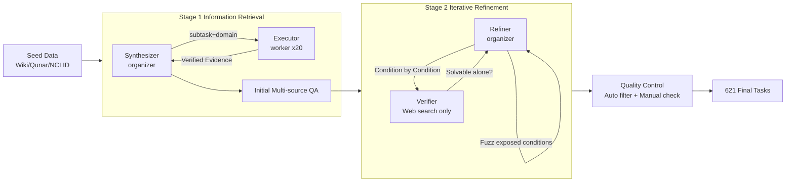

# InfoMosaic-Bench: Evaluating Multi-Source Information Seeking in Tool-Augmented Agents

**Conference**: ICLR 2026  
**Code**: [https://github.com/DorothyDUUU/Info-Mosaic](https://github.com/DorothyDUUU/Info-Mosaic)  
**Area**: LLM Agent / Tool Augmentation / Information Retrieval Benchmark  
**Keywords**: Multi-source information retrieval, MCP tools, Tool-augmented Agent, Benchmark, Agentic data synthesis  

## TL;DR
InfoMosaic-Bench is the first benchmark specifically designed to evaluate the capability of tool-augmented Agents in "cross-multi-source information retrieval." Using the InfoMosaic-Flow pipeline with an organizer–worker architecture, it synthesized 621 tasks that must be solved by simultaneously calling general web searches and domain-specific MCP tools. The results reveal that even the most powerful GPT-5 achieves only 38.2% accuracy, gains from domain tools are unstable, and 22.4% of failures stem from basic tool misuse.

## Background & Motivation
**Background**: From PageRank search engines to LLM internalized knowledge, and then to web-search-augmented Agents (various Deep Research products), information acquisition has been the core driver of intelligent system progress. Now, the emergence of the Model Context Protocol (MCP) allows Agents to access thousands of heterogeneous domain tools—biomedical databases, financial markets, map services, etc.—seemingly filling the gaps of general search.

**Limitations of Prior Work**: Current Agents rely heavily on open web search, but web content is noisy, inconsistent in format, and poorly reliable, making it difficult to support high-risk scenarios like healthcare or finance. Many tasks require precise, verifiable domain knowledge that the web simply cannot provide. However, after the deployment of MCP tools, two key questions remain unanswered: (1) Can Agents effectively use specialized tools within a single domain? (2) More importantly, can they seamlessly integrate general search with multiple specialized tools to solve complex multi-source tasks?

**Key Challenge**: Existing benchmarks either test only general web search (BrowseComp, WebWalkerQA, single-source single-tool) or test only the correctness of isolated tool calls (τ-Bench, MCP-Bench). **No benchmark systematically evaluates the full-link "retrieval–integration–reasoning" capability of Agents across heterogeneous evidence sources.** Furthermore, manual construction of such multi-source tasks faces natural bottlenecks: no single author possesses cross-domain expertise, and a coherent multi-source problem requires dozens of iterative tool calls, which is unsustainable for humans.

**Goal**: Construct a reliable benchmark where every task is "anchored on verified tool outputs and must be solved through multi-source reasoning."

**Key Insight**: ① Propose **InfoMosaic-Bench**—621 tasks, 77 tools, covering 6 domains: medical/bio, finance, maps, video, web, and multi-domain; ② Propose **InfoMosaic-Flow**—an organizer–worker dual-Agent automatic synthesis pipeline that allows tasks to "grow" out of tool evidence, using iterative refinement with "discard if solvable by web" to ensure non-triviality.

## Method

### Overall Architecture
InfoMosaic-Flow is a two-stage data synthesis pipeline with an organizer–worker (commander-executor) dual-Agent structure. **The organizer is responsible for high-level reasoning (decomposing constraints, constructing verification) and remains tool-agnostic, selecting only target domains; the worker represents a tool-calling event, freely combining and sequentially calling tools within that domain and returning integrated evidence.** This functional separation isolates execution noise to maintain reasoning depth and transforms each subtask into a combinatorial search over the domain toolset, increasing tool diversity. The pipeline passes through Stage 1 (Information Retrieval) to anchor constraints to multi-tool verified outputs forming initial QA, then through Stage 2 (Iterative Refinement) to repeatedly challenge and prune single-source shortcuts, leaving only tasks that truly require multi-source reasoning.

### Key Designs

**1. Information Retrieval Phase: Let problems "grow" from tool evidence rather than templates.** In Stage 1, the organizer acts as a synthesizer, and the worker is an executor equipped with domain tools. The process involves three steps: First, **Scenario Proposing**, which generates candidate scenarios from diverse seeds like Wikipedia, Baidu Baike, Qunar.com, and NCI clinical trial IDs to naturally induce heterogeneous tool calls and avoid narrow or contrived tool flows; Second, **Domain Information Gathering**, where the synthesizer reasons step-by-step and issues high-level commands `executor(subtask, domain)`. The executor selects and combines domain tools to retrieve verifiable facts and returns organized evidence. The synthesizer digests the evidence, updates the plan, and issues the next command; Finally, **Integrating**, which organizes verified tool results into a coherent multi-source task requiring multiple tool calls and cross-condition reasoning. The key is "hiding tool internal details"—the synthesizer only cares about the coherence and naturalness of the problem and does not overfit to accommodate tool quirks, while the information collection loop expands the exploration space to include more diverse tools.

**2. Iterative Refinement Phase: Ensure non-triviality with an adversarial mechanism of "discard if solvable by web."** Stage 1 only ensures the task is "executable," but many tasks might still be solved by a single clue or a single general web query, failing to reflect real multi-source challenges. Thus, the Refiner (organizer) and a Verifier (worker) equipped only with web search tools perform a three-step adversarial process: **Condition Decomposing** breaks the synthesized task into independent conditions for the Verifier to try one by one; **Condition Fuzzing** kicks in once a condition is too "exposed" (reachable by a single search), whereupon the Refiner rewrites, augments, or merges it with other conditions to reduce shortcuts; **Concluding** continues until no single condition can independently provide the answer, and the Verifier cannot solve it using search alone. The refined conditions are then recombined into the final task. The refinement loop persists until two criteria are simultaneously met—"web search cannot solve it alone" and "no single condition is sufficient to determine the answer"—thereby strictly guaranteeing difficulty and multi-source dependency.

**3. Multi-level Quality Control: Dual insurance of automatic filtering and manual verification.** Automatic checks consist of three stages: **Tool-Call Filtering** (Stage 1 sets a minimum tool call threshold to eliminate trivial tasks with insufficient constraints or low retrieval volume), **Answer–Evidence Consistency** (only keeps samples where the final answer can be strictly derived from the collected tool outputs, ensuring traceability), and **Coherence Filtering** (removes tasks with contradictory conditions or awkward phrasing). After automatic filtering, manual annotators review each item for consistency, coherence, and difficulty, correcting or discarding problematic samples, and verifying the reliability of the benchmark's "multi-source retrieval" evaluation through a specialized user study.

**4. Dual-metric Evaluation: Accuracy for overall success, Pass Rate for fine-grained process.** Accuracy measures strict end-to-end task success—whether the Agent can complete retrieval and reasoning as a whole; Pass Rate, based on test cases for sub-problems/sub-goals, provides a more granular perspective on how many conditions the Agent satisfied. Evaluation uses an LLM to judge if the predicted answer aligns with the reference rather than just exact matching, mitigating misjudgments for semantically correct but string-mismatched answers. The Agent framework adopts the mainstream ReAct, paired with the OpenAI tool-calling interface and a Python Sandbox to receive tool execution results.

## Key Experimental Results

### Main Results Table (Equipped with web search tools only, 14 LLM Agents, unit: %)

| Model | Overall Acc | Pass Rate | Map | Medical/Bio | Video | Web | Finance |
|------|---------|-----------|-----|-------------|-------|-----|---------|
| GPT-5 | **38.18** | **67.48** | 32.59 | 53.10 | 36.00 | 29.00 | 41.00 |
| o3 | 36.35 | 64.96 | 40.74 | 44.79 | 23.00 | 28.71 | 45.00 |
| Grok-4 | 25.42 | 39.44 | 9.63 | 39.02 | 33.00 | 10.00 | 43.88 |
| o4-mini | 24.15 | 61.67 | 24.44 | 25.30 | 24.00 | 8.00 | 39.00 |
| GLM-4.5 (Best Open Source) | 20.61 | 26.98 | 24.44 | 27.71 | 24.00 | 11.00 | 22.00 |
| Claude-4.0-Sonnet | 15.94 | 36.47 | 17.04 | 20.48 | 18.00 | 3.00 | 27.00 |
| Llama-4-Scout | 4.83 | 21.03 | 0.74 | 4.82 | 0.00 | 0.00 | 22.00 |

### Ablation Study Table (Domain Tools vs. Web-only, Overall Acc, unit: %)

| Model | Map | Medical/Bio | Video | Web | Finance | Multi-domain | Overall |
|------|-----|-------------|-------|-----|---------|--------------|---------|
| GLM-4.5 (web) | 24.44 | 27.71 | 24.00 | 11.00 | 22.00 | 14.56 | 20.61 |
| GLM-4.5 (domain) | +5.93 | +7.23 | +1.00 | **-4.00** | **-2.00** | **-1.94** | +0.90 |
| GPT-5 (web) | 32.59 | 53.10 | 36.00 | 29.00 | 41.00 | 41.75 | 38.18 |
| GPT-5 (domain) | +7.41 | **-9.73** | +10.00 | +3.00 | **-9.00** | -1.94 | +0.43 |

### Key Findings
- **Web search is far from sufficient for multi-source reasoning**: The strongest GPT-5 achieves only 38.2% Acc and 67.5% Pass Rate; proprietary models lead open-source versions by 15–20% in accuracy, but both are bottlenecked by web information. Pass Rate is generally higher than Acc, indicating that Agents often satisfy partial conditions but fail to integrate them into a correct final answer.
- **Gains from domain tools are highly unstable**: On average, they bring only slight gains (GLM-4.5 +0.90, GPT-5 +0.43). The bottleneck is not the availability of tools, but "how to use" them—Map/Video see significant score increases due to reliance on structured exclusive signals, whereas Medical, Finance, and Multi-domain scores drop; multi-domain tasks expose cross-source orchestration issues as more tools increase planning complexity and amplify error propagation.
- **22.4% of failures stem from basic tool misuse**: Tool calling results are categorized into usage error (wrong function call), selection error (wrong tool selected), invalid result (successful but useless), and valid result. Misuse rates increase with tool complexity, and selection error rates increase with toolset size; moreover, most tool results do not actually help solve the problem.
- **An inflection point exists for tool calling volume**: Acc/PR generally increase with the number of calls, but plateau after 8 calls; more calls can even lead to drops due to redundant information. The "effective tool use upper limit" of models is moderately positively correlated with overall accuracy ($R^2=0.57$).
- **Web-only failure attribution**: In GPT-5's failures, Retrieval Miss accounts for 39.6%, ranking first, followed by over-generalization, highlighting that retrieval itself is the primary bottleneck.

## Highlights & Insights
- **"Evidence-first" synthesis paradigm**: First call real tools to get verifiable evidence, then construct the problem around the evidence, rather than writing the problem first and then finding answers. This fundamentally ensures that every task is traceable and the answer is strictly consistent with the evidence—this approach is valuable for any Agent benchmark requiring "reliable labeling."
- **Adversarial refinement makes "difficulty" engineereable**: Using a web-only Verifier as a "red team" to discard/fuzz any task it can solve or any single condition that exposes the answer turns "must be multi-source" from a slogan into an enforceable criterion.
- **Organizer–worker decoupling maintains reasoning depth and tool diversity**: By making the planner tool-agnostic and letting the executor combine freely within a domain, the synthesis avoids forcing constraints to accommodate tool quirks and transforms subtasks into a combinatorial search of toolsets.
- **Rich diagnostic dimensions**: Condition-level gold labels + tool calling traces support fine-grained failure attribution (four types of tool errors + six types of failure causes) beyond end-to-end evaluation, making "why it failed" visible.

## Limitations & Future Work
- **Benchmark reveals rather than solves problems**: The paper clearly diagnoses the gap of "searching the web but misusing domain tools, let alone combining them," but provides no training/methodological solutions, leaving this for future work.
- **Synthesis depends on strong models**: The quality of the organizer–worker pipeline is limited by the underlying LLM's capabilities; weak model synthesis may introduce bias. Although manual verification provides a safety net, human scale is limited.
- **Domain coverage is still limited**: 6 domains and 77 tools are still a small sample relative to the real MCP ecosystem. Tool versions/interfaces drift over time, requiring maintenance for long-term reproducibility.
- **Evaluation uses LLM-as-judge**: This mitigates the rigidity of string matching but introduces the judging model's own biases, requiring attention to consistency.
- **Future Work**: Narrowing this gap (reliably using and effectively combining domain tools) is a prerequisite for deploying trustworthy Agents in high-risk areas like healthcare, finance, and scientific discovery. The methodology side (tool planning, selection, parameterization, timing) is highly promising.

## Related Work & Insights
- **Tool-using LLMs**: ReAct pioneered interleaved reasoning and action, Toolformer learned self-supervised API calling, and ToolLLM/EasyTool/MCP-Flow expanded API coverage and robustness. Search-o1/WebThinker/R1-Searcher focus on long-term web retrieval and orchestration—but all are limited to single channels. MCP expands tool use from pure web search to a heterogeneous domain tool ecosystem, bringing new challenges in cross-source coordination, which is the entry point of this paper.
- **Three lines of tool benchmarks**: API-centric (ToolBench, τ-Bench test single tool call correctness), Web/search-oriented (BrowseComp, WebWalkerQA, MM-BrowseComp test open web reasoning), and MCP-style (MCP-Universe, MCP-Radar, MCP-Zero, MCP-Bench test call correctness/robustness/zero-shot discovery under large-scale heterogeneous tools). All stop short of "cross-tool information retrieval and long-term reasoning." InfoMosaic-Bench fills this gap.
- **Insights**: For Agent evaluators, the combination of "adversarial Verifier to force non-triviality + real tool evidence to ensure traceability" is worth reusing. For Agent trainers, findings such as "bottleneck is tool use rather than tool availability," "diminishing returns after 8 calls," and "selection/parameterization errors as primary causes" directly guide improvement directions.

## Rating
- **Novelty**: ⭐⭐⭐⭐ First benchmark for tool-augmented Agents facing "multi-source information retrieval"; the combination of organizer–worker synthesis + adversarial refinement is truly innovative.
- **Experimental Thoroughness**: ⭐⭐⭐⭐ Covers 14 SOTA models, 6 domains, web-only vs. domain-tool settings, plus four types of tool errors and six types of failure causes, with scaling analysis.
- **Writing Quality**: ⭐⭐⭐⭐ Clear logic from motivation to problem to method to discovery; the three major findings are synthesized powerfully, and the diagnostic dimensions are rich.
- **Value**: ⭐⭐⭐⭐⭐ Precisely targets the critical gap of "how Agents actually use tools in the MCP era," with direct guiding significance for the deployment of trustworthy Agents in high-risk domains.

<!-- RELATED:START -->

## Related Papers

- [\[ICLR 2026\] FlowSearcher: Synthesizing Memory-Guided Agentic Workflows for Web Information Seeking](flowsearcher_synthesizing_memory-guided_agentic_workflows_for_web_information_se.md)
- [\[ICLR 2026\] GPS: Graph-guided Proactive Information Seeking in Large Language Models](gps_graph-guided_proactive_information_seeking_in_large_language_models.md)
- [\[ICLR 2026\] Evaluating Memory in LLM Agents via Incremental Multi-Turn Interactions](evaluating_memory_in_llm_agents_via_incremental_multi-turn_interactions.md)
- [\[CVPR 2026\] VULCAN: Tool-Augmented Multi Agents for Iterative 3D Object Arrangement](../../CVPR2026/llm_agent/vulcan_tool-augmented_multi_agents_for_iterative_3d_object_arrangement.md)
- [\[ICLR 2026\] A Benchmark for Deep Information Synthesis (DeepSynth)](a_benchmark_for_deep_information_synthesis.md)

<!-- RELATED:END -->
