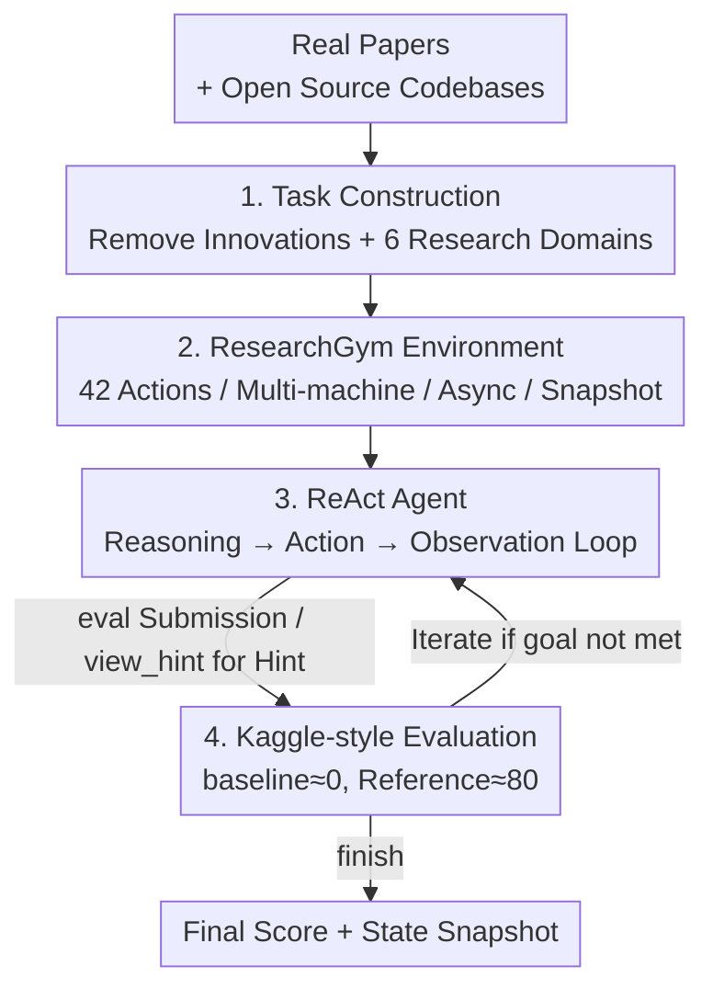

# InnovatorBench: Evaluating Agents' Ability to Conduct Innovative AI Research

**Conference**: ICLR 2026  
**OpenReview**: [https://openreview.net/forum?id=w8rZ2Jd6Jo](https://openreview.net/forum?id=w8rZ2Jd6Jo)  
**Code**: https://github.com/GAIR-NLP/InnovatorBench  
**Area**: Agent / Automated LLM Research / Benchmark  
**Keywords**: AI Research Agents, End-to-end Benchmark, Long-horizon Execution, ResearchGym, ReAct

## TL;DR
This paper introduces InnovatorBench—the first end-to-end benchmark (20 tasks) constructed from real papers and codebases, covering 6 categories of LLM research sub-problems such as data, loss, reward, and scaffolding. Accompanied by the ResearchGym environment, which supports distributed, asynchronous, and snapshot capabilities, the study evaluates frontier models like Claude-4, GPT-5, and GLM-4.5 using ReAct agents. The findings reveal that while these models can handle code-centric research tasks, they frequently fail in fragile algorithm design and long-horizon decision-making (due to impatience, poor resource management, and template-based reasoning).

## Background & Motivation

**Background**: Agents using LLMs as a "brain" are expected to automate the entire scientific research pipeline—proposing hypotheses, designing experiments, writing code, executing experiments, and analyzing results—often referred to as "AI Researchers." Recently, several benchmarks have emerged to evaluate such agents (e.g., SWE-bench, ScienceAgentBench, PaperBench, RE-Bench, EXP-Bench).

**Limitations of Prior Work**: These benchmarks typically probe only narrow, single-dimensional capabilities. Many tasks focus solely on code implementation accuracy or hyperparameter tuning rather than evaluating the entire research chain. Success is often defined as "reproducing existing results," which measures fidelity rather than innovation—failing to examine whether agents can design new objective functions or architectures. Furthermore, evaluation environments are often overly simplified and resource-constrained, lacking support for large-scale/long-horizon training, asynchronous monitoring of multi-hour processes, and broad action spaces (e.g., file management, command execution, literature search).

**Key Challenge**: Genuine scientific research requires both "high-level creativity" (originating new methods) and "low-level engineering" (implementing and running methods in large-scale experiments). Existing benchmarks truncate both aspects by neither allowing open-ended innovation nor providing platforms for long-running distributed experiments, thus failing to measure the true potential of agents as "research collaborators."

**Goal**: To construct a benchmark and platform pair capable of evaluating AI research agents end-to-end in real-world research practices. Agents must propose methods, implement them, iterate based on results, produce executable artifacts, and submit multiple times for scoring.

**Key Insight**: Each task originates from an influential real-world paper and its open-source codebase. The key innovations of the paper are removed from the code, and the reference solution is hidden, forcing the agent to reinvent methods that surpass the ground truth through its own reasoning. This anchors tasks in real research problems while leaving room for open-ended innovation.

**Core Idea**: A tripartite system consisting of "Real Paper Tasks (InnovatorBench) + Long-horizon Distributed Environment (ResearchGym) + Kaggle-style Multiple Submission Scoring" is used to evaluate AI research agents in as realistic a research scenario as possible.

## Method

### Overall Architecture

The core of InnovatorBench consists of two coupled components: the **InnovatorBench benchmark** (defining "what to test") and the **ResearchGym environment** (defining "where and how to operate"). A complete evaluation cycle works as follows: A task is constructed from a real paper and its codebase (by removing key innovations across 6 research domains while retaining an executable skeleton, task description, initial workspace, optional hints, evaluation scripts, and hidden reference solutions). ResearchGym loads the task and provides the description as the initial observation to the ReAct agent. The agent reasons and issues tool calls within an action space of 42 primitives; actions are dispatched via HTTP to target machines (supporting multi-machine distribution and asynchronous long-duration tasks), and results are returned as structured observations. The agent can use `eval` to submit products for Kaggle-style feedback or `view_hint` (with a score penalty) until calling `finish`, at which point the environment performs a final evaluation and saves a snapshot.

### Key Designs

**1. Task Construction: End-to-end Research Tasks via "Hollowing Out" Real Papers**

To address the issue that reproduction-based benchmarks only measure fidelity, InnovatorBench derives each task from an influential AI paper and its open-source codebase (20 tasks from 14 papers, covering NeurIPS, ICLR, COLM, EMNLP, ACL, etc.). Key innovative implementations and git history are removed, while the project remains executable (most tasks are based on LlamaFactory or Verl). Accompanied by task descriptions, full datasets, fine-tunable model checkpoints, and auxiliary scripts, the benchmark includes a **reference solution hidden throughout the evaluation**. Tasks span 6 research domains: Data Construction (DC), Data Filtering (DF), Data Augmentation (DA), Loss Design (LD), Reward Design (RD), and Scaffolding Construction (SC). Descriptions provide high-level goals rather than step-by-step instructions, explicitly requiring the agent to "surpass the reference solution," thereby encouraging exploration and preventing overfitting to a fixed process.

**2. ResearchGym: Supporting Long-horizon, Distributed, and Asynchronous Research**

To overcome the limitations of single-docker, synchronous, and narrow action-space platforms, ResearchGym provides **42 primitive actions** categorized into Command, File, Parse, Web Search, and Web Browse families (Parse can extract text from images/audio/video for text-only models). Its three key capabilities are: **Multi-machine Control**, where each machine runs an HTTP server to execute commands, allowing a single agent to orchestrate experiments across a cluster; **Asynchronous Command Execution**, which decouples action execution from action selection, allowing agents to background tasks in specific sessions and perform other planning before retrieving results via `get_session_output`; and **Snapshotting**, which records task specifications, agent context, workspace state, and time budget, allowing for periodic saves, restoration, and branching. This infrastructure enables task durations of 2–36 hours.

**3. Kaggle-style Multiple Submission Evaluation + Penalized Hints**

For objective scoring in open-ended innovation tasks, the paper employs Kaggle-style evaluation: agents can use `eval` multiple times (up to 4 in main experiments) to submit artifacts and receive immediate test-set feedback. Submissions are checked for formatting; if valid, they are scored using a **function calibrated between a baseline (anchored at ~0) and the reference solution (anchored at ~80)**. Scoring dimensions vary by task (e.g., Accuracy, F1, BLEU, or entropy metrics for RL). Evaluations are executed outside the workspace using hidden scripts and data. Each task also features an **optional hint**: disabled by default in main experiments, but available via the `view_hint` tool at the cost of a **final score penalty**.

**4. ReAct Agents and Four Failure Modes**

To ensure comparability between frontier models, a lightweight **ReAct-style agent** wrappers models like Claude-4, GPT-5, GLM-4.5, Kimi-K2, and Qwen3-32b—coupling explicit reasoning (Think) with executable planning (Action) and automatic context summarization. This unified scaffold highlights systematic failures in long-horizon research: **Impatience** (killing a process 10 hours in despite having 21 hours left), **Poor Resource Management** (conflicting GPU allocations), **Suboptimal Library Selection** (using Transformers instead of vLLM for high throughput), and **Template-based Reasoning** (mechanically following "Let me analyze step by step" without high-level intent).

### A Complete Example

Consider a GRPO Loss/Reward Design task derived from DAPO: The agent receives a description stating that "RL training often suffers from **entropy collapse**; please implement a new strategy for GRPO to improve accuracy and prevent entropy collapse," along with datasets and model checkpoints. The agent uses ResearchGym to modify `compute_policy_loss` in `core_algos.py`, launches asynchronous GPU training in a `gpu_train` session, and waits using `sleep`. After training, `eval` provides feedback on `{score, accuracy, entropy}`. If stuck, calling `view_hint` might suggest "adjusting the clip upper bound to $1 + \epsilon + \delta$" (incurring a penalty). ResearchGym finally calculates $entropy\_score \times acc\_score \times 100$.

## Key Experimental Results

### Main Results

Weighted averages of scores for five frontier models using the ReAct agent across 6 domains (Final = last submission score, Best = highest historical score; environment: Ubuntu 22.04, 800GB RAM, 8×80GB GPU server):

| Model | Weighted Final | Weighted Best | Highlights / Weaknesses |
|------|------|------|------|
| Claude Sonnet 4 | **24.01** | **24.54** | First in 4/6 domains; most reliable tool use |
| GPT-5 | 12.04 | 12.52 | Strong at SC (60.07); frequent loops during training |
| GLM-4.5 | 11.85 | 13.35 | Mediocre; frequent tool parameter misconfigurations |
| Kimi-K2 | 5.35 | 5.45 | Often failed to generate valid code |
| Qwen3-32b | 0.00 | 0.00 | Small context window; summary lost key info |

Performance in **data-centric tasks (DC/DF/DA) was generally higher than in algorithm-centric tasks (LD/RD)**. Data tasks are more tolerant of minor noise, whereas algorithm tasks are fragile—slight flaws in reward or loss functions lead to gradient explosion or policy failure.

### Ablation Study: Impact of Ground-Truth Hints (Claude Sonnet 4)

| Research Domain | No Hint Final/Best | With Hint Final/Best | Trend |
|------|------|------|------|
| Loss Design | 12.98 / 12.98 | 22.65 / 25.32 | Significant improvement |
| Reward Design | 11.56 / 11.56 | 15.06 / 15.06 | Moderate improvement |
| Data Construction | 25.47 / 26.87 | 15.21 / 19.80 | Score decreased |
| Data Augmentation | 22.73 / 22.73 | 1.00 / 1.00 | Significant decrease |
| **Weighted Avg** | **24.01 / 24.54** | 13.88 / 16.67 | Overall decrease |

### Key Findings

- **Creativity and Engineering are both essential**: Hints transform "exploration" into "implementation." In algorithm tasks (LD/RD) requiring new inventions, hints boosted scores. However, in data tasks, models copy-pasted hints mechanically, where coding ability became a bottleneck; minor scripting mismatches severely broke functionality, making hint-based performance worse than autonomous symbolic methods.
- **Reliable tool use is critical for algorithm tasks**: GPT-5 entered infinite loops causing early termination, and GLM-4.5 misconfigured parameters. Only Claude consistently produced executable code and correctly managed training states.
- **GPT-5's scaffolding is most robust**: By explicitly restating prompt options, retrying up to 3 times on timeout, and enforcing strict output formats, it achieved a high SC score of 60.07.
- **Difficulty is reflected in "Test Duration"**: While performance on PaperBench saturates in ~1.75 hours, InnovatorBench requires **11+ hours** (approx. **6.5×** longer) to reach saturation, as complex tasks like DA and RD are dominated by long training phases and interaction overhead.

## Highlights & Insights
- **"Hollowing out" real papers is a clever task construction**: By removing innovations while keeping the skeleton, the benchmark ensures tasks are grounded and realistic yet open-ended, with reference solutions providing an upper bound.
- **Long-horizon as a first-class citizen**: Multi-machine control, asynchronous sessions, and snapshotting allow the benchmark to support tasks lasting 2–36 hours, moving closer to genuine scientific research environments.
- **Failure modes as a diagnostic checklist**: Impatience, poor resource management, suboptimal library selection, and template-based reasoning are critical failure modes for any long-horizon autonomous agent development.
- **Quantifying difficulty via "Test Duration x 6.5"**: Using the time needed to reach performance saturation as a metric for comparing benchmark difficulty provides an objective perspective.

## Limitations & Future Work
- **Task scale and domain focus**: With 20 tasks focused primarily on LLMs (data/loss/reward/scaffolding), representation of CV, multi-modal architectures, or theoretical research needs expansion.
- **Horizontal score comparison**: Differences in domain difficulty, training budgets, and evaluation cycles make direct score comparisons between domains difficult. 
- **Subjectivity in scoring functions**: The mapping of baseline to 0 and reference to 80 is heuristic, and the sensitivity of scoring curves across tasks requires further discussion.
- **High cost**: Individual tasks can cost dozens of USD (Claude weighted average is ~30+ USD per run), posing a barrier to large-scale reproduction.

## Related Work & Insights
- **vs. PaperBench / RExBench / EXP-Bench (Reproduction-based)**: These define success as reproducing results (measuring fidelity). InnovatorBench asks for reinvention and operates over 2–36 hours (vs. 1–3 hours), testing end-to-end innovation and engineering at 6.5× the difficulty.
- **vs. SWE-bench (Repository-level Coding)**: SWE-bench focuses on resolving GitHub issues and running unit tests (30m–2h runs). InnovatorBench covers the entire research lifecycle and supports distributed training and snapshots.
- **vs. OpenHands / MLGym (Environment/Scaffolding)**: These provide sandboxes but often constrain experiment scale and lack distributed training or multi-hour asynchronous monitoring. ResearchGym fills these gaps with 42 actions and snapshot branching.

## Rating
- Novelty: ⭐⭐⭐⭐⭐ First end-to-end AI research benchmark using hollowing-out and long-horizon distributed environments.
- Experimental Thoroughness: ⭐⭐⭐⭐ 5 frontier models across 6 domains + ablation + failure analysis, though task counts per domain are limited.
- Writing Quality: ⭐⭐⭐⭐ Clear motivation and platform design; failures are well-categorized.
- Value: ⭐⭐⭐⭐⭐ Provides a realistic, extensible base for evaluating research agents with the reusable ResearchGym.

<!-- RELATED:START -->

## Related Papers

- [\[ICLR 2026\] EXP-Bench: Can AI Conduct AI Research Experiments?](exp-bench_can_ai_conduct_ai_research_experiments.md)
- [\[ICLR 2026\] OpenAgentSafety: A Comprehensive Framework for Evaluating Real-World AI Agent Safety](openagentsafety_a_comprehensive_framework_for_evaluating_real-world_ai_agent_saf.md)
- [\[ICLR 2026\] Open Data Synthesis for Deep Research](open_data_synthesis_for_deep_research.md)
- [\[ICLR 2026\] ST-WebAgentBench: A Benchmark for Evaluating Safety and Trustworthiness in Web Agents](st-webagentbench_a_benchmark_for_evaluating_safety_and_trustworthiness_in_web_ag.md)
- [\[ICLR 2026\] Evaluating Memory in LLM Agents via Incremental Multi-Turn Interactions](evaluating_memory_in_llm_agents_via_incremental_multi-turn_interactions.md)

<!-- RELATED:END -->
