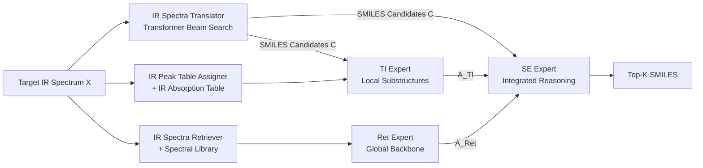

# IR-Agent: Expert-Inspired LLM Agents for Structure Elucidation from Infrared Spectra

**Conference**: ICLR 2026  
**OpenReview**: [https://openreview.net/forum?id=6bthH14pD8](https://openreview.net/forum?id=6bthH14pD8)  
**Code**: [https://github.com/HeewoongNoh/IR-Agent](https://github.com/HeewoongNoh/IR-Agent)  
**Area**: LLM Agent / AI for Science (Spectroscopic Analysis)  
**Keywords**: Multi-agent framework, Infrared spectra, Molecular structure elucidation, SMILES, Retrieval-augmented generation, Expert workflow simulation  

## TL;DR
The expert workflow for interpreting infrared (IR) spectra is decomposed into three specialized LLM agents: one identifies local functional groups via absorption tables, another retrieves similar spectra for global backbones, and the third integrates reasoning to rank candidate structures. It outperforms single-model and single-agent approaches on real experimental IR spectra and incorporates additional chemical information without retraining.

## Background & Motivation
**Background**: Infrared spectroscopy is a primary screening method for identifying unknown substances in laboratories due to its efficiency and accessibility. However, unlike Mass Spectrometry (MS) or Nuclear Magnetic Resonance (NMR), IR does not directly provide molecular weight or stoichiometry, making interpretation highly dependent on expert experience. Existing machine learning methods are mostly limited to coarse-grained tasks like "functional group classification." The few attempts at complete structure elucidation (SMILES generation) either rely on Transformers with known chemical formulas or use reinforcement learning. These works feature **fixed input formats and poor scalability**, requiring model redesign and retraining to incorporate new chemical information (e.g., atom types, carbon counts).

**Limitations of Prior Work**: (1) Practical IR interpretation involves various scattered chemical clues that existing models cannot flexibly absorb; (2) **Precise chemical formulas are often unavailable** in real scenarios, yet many SOTA methods assume them as known, which is unrealistic; (3) Requiring a single LLM to perform "table interpretation + similarity retrieval + integrated reasoning" leads to suboptimal information extraction and incomplete reasoning due to excessive cognitive load.

**Key Challenge**: IR interpretation requires both **fine-grained local knowledge** (peak-to-functional group mapping via absorption tables) and **global structural context** (skeletons from similar compounds). A single model struggles to balance both while remaining extensible.

**Goal**: Build a structure elucidation framework that simulates expert analysis and is inherently scalable, predicting complete SMILES using **only IR spectra** (without assuming chemical formula availability).

**Core Idea** (**Expert Workflow Decomposition + Multi-agent Collaboration**): The two information pathways used by experts—"consulting IR tables for local substructures" and "searching spectral libraries for global backbones"—are assigned to specialized agents. A third agent then integrates their outputs for comprehensive reasoning and ranking. Additional chemical information is appended as natural language in prompts, **requiring no new agents or retraining**. This is the first work to apply a multi-agent LLM framework to IR-based molecular structure elucidation.

## Method

### Overall Architecture
IR-Agent first uses a Transformer translator to decode $K$ initial SMILES candidates $C$ from the target IR spectrum (via beam search) as "seeds." Subsequently, three expert agents collaborate: the **TI Expert** (Table Interpretation) extracts local substructures, the **Ret Expert** (Retriever) identifies global backbones, and the **SE Expert** (Structure Elucidation) integrates findings to produce a Top-K ranking. Each agent combines an "off-the-shelf LLM + specialized tools," where tools handle precise numerical/retrieval tasks and the LLM handles chemical reasoning.

### Key Designs

**1. Table Interpretation (TI) Expert: Supplementing LLM weaknesses with deterministic tools and cross-validation.** IR absorption tables are reliable mappings from decades of experiments, capturing features like substitution patterns and conjugation. However, LLMs cannot accurately locate peaks or interpret high-dimensional absorbance data directly. The authors outsource "peak finding" to a deterministic tool, the **IR Peak Table Assigner**, which extracts peaks and queries an absorption table $T$ for candidate substructures (e.g., "1200–1000 cm⁻¹ typically corresponds to C–F in fluorides"). The agent is formulated as $A_{\text{TI}} = \text{TI Expert}(P_{\text{TI}}, \text{Assigner}(X, T), C)$. To mitigate ambiguities caused by noise, the prompt $P_{\text{TI}}$ requires the agent to **cross-reference** tool outputs with candidates $C$, retaining only common substructures with confidence scores and justifications.

**2. Retriever (Ret) Expert: Bridging global backbones via similarity-weighted retrieval.** Local functional groups cannot uniquely determine a molecule. Simulating experts who "search libraries for similar references," the Ret Expert uses an **IR Spectra Retriever** tool to calculate cosine similarity between the target and the library. It retrieves the Top-N SMILES: $\{cand_1:sim_1,\dots,cand_N:sim_N\} = \text{Retriever}(X)$. The agent $A_{\text{Ret}} = \text{Ret Expert}(P_{\text{Ret}}, \text{Retriever}(X))$ extracts common substructures from these candidates, **weighting more similar spectra more heavily** to provide global structural clues (e.g., "most candidates contain a benzene ring + CF₃, thus the target likely contains an aromatic CF₃ system").

**3. Structure Elucidation (SE) Expert: Synthesizing complementary evidence.** The SE Expert processes $A_{\text{TI}}$, $A_{\text{Ret}}$, and the original candidates $C$ as $A_{\text{SE}} = \text{SE Expert}(P_{\text{SE}}, A_{\text{TI}}, A_{\text{Ret}}, C)$ to output ranked results. Features confirmed by both experts (e.g., high-confidence C–F and a retrieved skeleton containing CF₃) become the most reliable cues. This "decomposition + integration" strategy reduces the cognitive burden on the LLM compared to a single-agent approach.

**4. Lightweight Chemical Information Injection: Scalability via natural language.** Since the framework is based on LLM agents rather than fixed-input models, any additional information (atom types, carbon count, scaffold) can be integrated as natural language. The authors simply **append the chemical clues to the end of the reasoning prompts** for each expert, enabling the agents to reason better without architectural changes or retraining.

## Key Experimental Results

**Dataset**: 9,052 **experimental** IR spectra from the NIST database (not simulated; includes noise, peak broadening, and real variations across solid/liquid/gas phases). Split 80/10/10; indicators are Top-K exact match accuracy (InChI comparison).

### Main Results (Overall Structure Elucidation, K=3)

| Method | Mode | Top-1 | Top-3 | Top-5 | Top-10 |
|------|------|-------|-------|-------|--------|
| Transformer (Translator only) | - | 0.098 | 0.169 | 0.176 | 0.176 |
| IR-Agent (GPT-4o-mini) | single | 0.072 | 0.118 | 0.133 | 0.157 |
| IR-Agent (GPT-4o-mini) | **multi** | 0.093 | 0.152 | 0.167 | 0.176 |
| IR-Agent (GPT-4o) | single | 0.083 | 0.135 | 0.165 | 0.194 |
| IR-Agent (GPT-4o) | **multi** | 0.093 | 0.153 | 0.177 | 0.204 |
| IR-Agent (o3-mini) | single | 0.087 | 0.153 | 0.179 | 0.197 |
| IR-Agent (o3-mini) | **multi** | **0.103** | **0.178** | **0.199** | **0.216** |

- Multi-agent systems consistently outperform single-agent counterparts. The o3-mini multi-agent configuration achieved the best results, with Top-10 reaching 0.216 (a ~23% improvement over the pure Transformer).
- Weak models in multi-agent configurations can rival strong models in single-agent modes (GPT-4o multi ≈ o3-mini single).

### Ablation Study (IR-Agent / o3-mini)

| Configuration | Top-1 | Top-3 | Top-5 | Top-10 |
|------|-------|-------|-------|--------|
| No Expert (Translator only) | 0.073 | 0.131 | 0.157 | 0.185 |
| TI Expert only | 0.089 | 0.154 | 0.171 | 0.190 |
| Ret Expert only | 0.098 | 0.169 | 0.188 | 0.211 |
| **IR-Agent (TI + Ret)** | **0.103** | **0.178** | **0.199** | **0.216** |

- Performance drops significantly without experts. Both experts are complementary, with Ret being slightly more effective individually.

### Key Findings
- **Plug-and-play chemical knowledge** (o3-mini multi, Top-10): No Knowledge (0.216) → Scaffold (0.258) → Carbon Count (0.252) → **Atom Types (0.278)**. All clues improve performance without retraining.
- **Candidate count $C$ sweet spot**: Performance peaks at $C=3 \sim 5$; higher numbers introduce noise that interferes with expert cross-validation.
- **Translator robustness**: The framework provides gains even when replacing the base translator with other SOTA models.

## Highlights & Insights
- **Deterministic Tools + LLM Reasoning**: Offloading peak-picking and retrieval to tools allows the LLM to focus on semantic cross-validation, a paradigm applicable to other "AI for Science" agents.
- **Explainable Multi-agent Gains**: Improvements stem from reducing the cognitive load within a single context window, preventing local features from being overwhelmed by global context.
- **Zero-cost Scalability**: Incorporating extra info via prompt appending rather than architectural changes makes the framework highly practical.

## Limitations & Future Work
- **Absolute Accuracy**: Top-10 accuracy (~0.22) is still far from practical lab utility, indicating the intrinsic information ceiling of using IR alone.
- **Library Dependence**: Ret Expert relies on library coverage and may fail for novel or rare scaffolds.
- **Ambiguity in Tables**: Cross-validation mitigates but does not eliminate misidentification caused by overlapping absorption ranges.
- **Cost and Latency**: Sequential multi-agent calls increase overhead compared to single-model inference.
- **Future Work**: Integration of multimodal spectra (MS/NMR) and autonomous tool usage planning.

## Related Work & Insights
- **IR Machine Learning**: Early CNNs/GNNs focused on classification. Transformers (Alberts 2024a) and RL (Ellis 2023) for structural elucidation often require known formulas. IR-Agent differs by simulating expert workflows with multi-agent flexibility.
- **Science LLM Agents**: Like ChemCrow (tools for chemistry tasks) and Coscientist (autonomous experiments), IR-Agent introduces the "agent + external tools" paradigm to spectroscopy. The insight is that **any domain task with established lookup/calculation tools can be decomposed into specialized agents to bridge LLM precision gaps**.

## Rating
- **Novelty**: ⭐⭐⭐⭐ First application of LLM multi-agents to IR structure elucidation.
- **Experimental Thoroughness**: ⭐⭐⭐⭐ Evaluated on real experimental spectra with comprehensive ablations.
- **Writing Quality**: ⭐⭐⭐⭐ Clear motivation-to-experiment chain; figures illustrate abstract reasoning effectively.
- **Value**: ⭐⭐⭐⭐ Highly practical setting (no formula required); provides a scalable template for scientific agents.

<!-- RELATED:START -->

## Related Papers

- [\[CVPR 2026\] Symphony: A Cognitively-Inspired Multi-Agent System for Long-Video Understanding](../../CVPR2026/llm_agent/symphony_a_cognitively-inspired_multi-agent_system_for_long-video_understanding.md)
- [\[NeurIPS 2025\] LLM Agent Communication Protocol (LACP) Requires Urgent Standardization: A Telecom-Inspired Protocol is Necessary](../../NeurIPS2025/llm_agent/llm_agent_communication_protocol_lacp_requires_urgent_standardization_a_telecom-.md)
- [\[ICLR 2026\] Your Agent May Misevolve: Emergent Risks in Self-evolving LLM Agents](your_agent_may_misevolve_emergent_risks_in_self-evolving_llm_agents.md)
- [\[ICLR 2026\] Tree Search for LLM Agent Reinforcement Learning](tree_search_for_llm_agent_reinforcement_learning.md)
- [\[ICLR 2026\] Agent Data Protocol: Unifying Datasets for Diverse, Effective Fine-tuning of LLM Agents](agent_data_protocol_unifying_datasets_for_diverse_effective_fine-tuning_of_llm_a.md)

<!-- RELATED:END -->
## Related Papers

- [\[CVPR 2026\] Symphony: A Cognitively-Inspired Multi-Agent System for Long-Video Understanding](../../CVPR2026/llm_agent/symphony_a_cognitively-inspired_multi-agent_system_for_long-video_understanding.md)
- [\[NeurIPS 2025\] LLM Agent Communication Protocol (LACP) Requires Urgent Standardization: A Telecom-Inspired Protocol is Necessary](../../NeurIPS2025/llm_agent/llm_agent_communication_protocol_lacp_requires_urgent_standardization_a_telecom-.md)
- [\[ICLR 2026\] Your Agent May Misevolve: Emergent Risks in Self-evolving LLM Agents](your_agent_may_misevolve_emergent_risks_in_self-evolving_llm_agents.md)
- [\[ICLR 2026\] Agent Data Protocol: Unifying Datasets for Diverse, Effective Fine-tuning of LLM Agents](agent_data_protocol_unifying_datasets_for_diverse_effective_fine-tuning_of_llm_a.md)
- [\[ICLR 2026\] Opponent Shaping in LLM Agents](opponent_shaping_in_llm_agents.md)

<!-- RELATED:END -->
