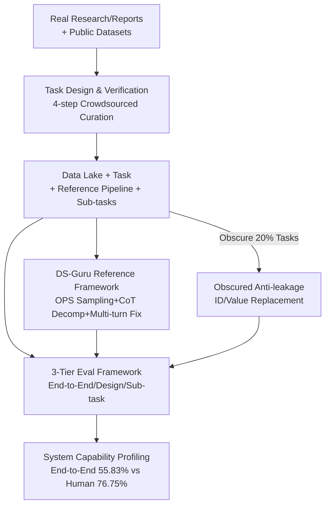

# KRAMABENCH: A Benchmark for AI Systems on Data-to-Insight Pipelines over Data Lakes

**Conference**: ICLR 2026  
**OpenReview**: [https://openreview.net/forum?id=fZfUdeCC5X](https://openreview.net/forum?id=fZfUdeCC5X)  
**Code**: https://github.com/mitdbg/Kramabench (Available)  
**Area**: Agent / Data Science Benchmark  
**Keywords**: Data Lakes, End-to-End Data Science, Agentic Systems, Pipeline Design, Benchmarking

## TL;DR
KRAMABENCH constructs an end-to-end data science benchmark that bridges the gap from "dirty data lakes" to "insights" using 6 real-world domains, 24 data sources, 1700+ files, and 104 human-curated tasks. Accompanied by a three-tier evaluation system (End-to-End / Pipeline Design / Sub-task Implementation), the results show that the strongest system achieves only 55.83% accuracy under full data lake conditions, significantly trailing the 76.75% human baseline.

## Background & Motivation
**Background**: Extracting insights from raw data is the core objective of data science. A real-world data science workflow involves chaining heterogeneous tasks—data discovery, extraction, cleaning, multi-source integration, analysis, and modeling—into a single pipeline. This requires processing data lakes that often contain thousands of files, are semi-structured or unstructured, noisy, and require domain knowledge. Recently, LLMs have shown significant progress in isolated capabilities like code generation, tool calling, and QA.

**Limitations of Prior Work**: Existing data science benchmarks (e.g., DS-1000, ARCADE, DA-Code, DSBench, BLADE, ScienceAgentBench) almost exclusively examine isolated steps, such as generating code from fine-grained prompts, text-to-SQL, or modeling given clean inputs. They lack the "data discovery" phase; inputs are typically pre-selected and cleaned single or few files. Consequently, they fail to measure a system's ability to retrieve and integrate information across large-scale dirty data lakes or its ability to design and execute an entire pipeline independently.

**Key Challenge**: The difficulty of real-world data science lies in **end-to-end orchestration**. A system must decide which files to examine, how to clean them, and how to connect multi-step data-dependent reasoning without step-by-step human guidance. Existing benchmarks omit this "orchestration" phase, making it impossible to determine if agentic systems can produce functional, complete pipelines.

**Goal**: To create an end-to-end benchmark reflecting the complexity of real-world data lakes that provides final answers while decomposing tasks into reference sub-tasks. This allows for evaluating both whether the "entire pipeline runs correctly" and pinpointing "which stage (retrieval / design / implementation) failed."

**Key Insight**: The authors start from actual published research or reports, reproduce the quantitative conclusions derived from data analysis, reverse-engineer these conclusions into natural language tasks, and provide expert reference pipelines with step-by-step sub-task annotations. This ensures tasks are verifiable, have correct answers, and inherently require multi-step heterogeneous operations.

**Core Idea**: Package the entire "data lake → insight" chain into a single task where the input is the **entire domain data lake** and the output is a numerical, string, or list answer. Failures in end-to-end performance are then analyzed through three tiers of evaluation with decreasing automation difficulty.

## Method

### Overall Architecture
KRAMABENCH is not a model but a suite comprising a benchmark, an evaluation framework, and a reference system. It addresses the problem: given a real-world domain data lake (hundreds of dirty files) and a natural language task, can a system design and execute an end-to-end pipeline to gain the correct insight? The framework operates in four parts: **a 4-step crowdsourcing process reverse-engineers real research into tasks with reference solutions**, each decomposed into **sub-tasks with ground truth answers**; evaluation is conducted across **three automation tiers** (End-to-End / Pipeline Design / Sub-task Implementation) using fuzzy matching metrics to tolerate numerical and string approximations; a lightweight reference framework **DS-Guru** is provided as a baseline for "out-of-the-box LLMs"; and finally, **Obscured (confused) inputs** are applied to 20% of tasks to verify if systems are truly "computing" or merely "memorizing."

### Key Designs

**1. 4-step Crowdsourced Curation: Reverse-engineering real research into verifiable end-to-end tasks**

To avoid artificial tasks or mismatched answers, KRAMABENCH derives tasks from **published research reports with quantitative findings and charts based on public datasets**, covering 6 domains: Archaeology, Astronomy, Biomedicine, Environmental Science, Legal Forensics, and Wildfire Prevention. The curation follows four rigorous steps: (1) **Task Authoring**: Reproduce key findings from reports, rephrase them as problem statements, and implement a reference pipeline; (2) **Cross-contributor Verification**: A second person independently reproduces the solution, and a third compares both, disambiguates the statement, checks in the reference pipeline, and records execution time; (3) **Key Feature Identification**: Identify steps essential to any correct pipeline (e.g., "identifying column X as temperature"), drafted by GPT-o3 and refined by humans to be implementation-agnostic; (4) **Sub-task Authoring**: Convert each key feature into a prompt (assisted by fine-tuned Gemma3-27B and human audit) and manually verify sub-task ground truths. This resulted in 104 tasks, 633 sub-tasks, and 1,764 files (1.7GB), with 60.58% being "hard tasks" (requiring multi-file or >3 step pipelines).

**2. 3-Tier Evaluation Framework: Deconstructing end-to-end failures**

End-to-end accuracy alone cannot distinguish whether a system failed at retrieval, pipeline design, or code implementation. KRAMABENCH uses multi-level annotations and three evaluation tiers of decreasing automation to locate failures: (1) **End-to-End Automation** (Core): The entire data lake is provided to the system, and output is compared with reference answers, scoring $[0,1]$ based on type; the total score for system $F$ on workload $W$ is $\text{Mean}_{T\in W}\,\text{score}(F(T))$. (2) **Pipeline Design**: Pipelines are scored based on the coverage of "key features" identified by LLM-as-a-judge. (3) **Sub-task Implementation**: Direct evaluation of sub-task prompts against ground truth. Scoring utilizes fuzzy matching (Table 3): Exact Match for strings, ParaPluie score for approximate strings, Exact Match for numbers, and **$1/(1+\text{RAE})$ for approximate numbers** (where RAE is Relative Absolute Error). F1 is used for lists. LLM-as-a-judge string approximation showed 84% agreement with human labels.

**3. DS-Guru Reference Framework: A minimal scaffold for raw LLMs**

To evaluate vanilla LLMs fairly, the authors developed DS-Guru, a lightweight framework addressing three LLM weaknesses in data lakes: (1) **Context Window Overload**: Uses **One-Pass Sampling (OPS)** to sample each file once with specific budgets and type annotations (schema summary + row samples), scaling linearly with data lake size; (2) **Complex Operations**: Uses **CoT Prompting** to force the model to decompose the task before coding; (3) **Code Errors on Dirty Data**: Uses **Multi-shot (Few-shot) Repair**, feeding back execution results and errors for self-correction. Variations include no-context, one-shot (sampling only), and few-shot (sampling + iterative feedback). DS-Guru represents "structured control flow," contrasting with agentic control flows like smolagents.

**4. Obscured Anti-leakage Input: Distinguishing "computing" from "memorizing"**

Since public datasets may be in training corpora, systems might "guess" answers based on memory. The authors manually constructed **Obscured inputs** for all tasks: without changing the task structure, real identifiers and values are replaced with synthetic ones (e.g., "Los Angeles" to "La-La Land"). 20% of tasks are held out. A correct pipeline should still produce the correct answer on obscured data, whereas memory-based systems will fail. In experiments, smolagents-single DR and DS-Guru few-shot scores dropped 15–18% on obscured inputs compared to regular ones. Claude was the most sensitive; the Reflexion baseline plummeted from 62.81% to 12.77%, indicating heavy reliance on parametric knowledge.

## Key Experimental Results

### Main Results
Evaluation spanned 8 LLMs, three DS-Guru variants, smolagents (single/multi-agent), and the closed-source Deep Research system. Results under Full data lake input:

| System | Backend Model | Total Score (%) | Notes |
|------|---------|---------|------|
| Human Baseline* | — | 76.75 | 9 Data Science practitioners |
| smolagents DR (Single agent) | Claude-3.7 | **55.83** | Strongest under Full |
| smolagents Reflexion (Multi-agent) | Claude-3.7 | 55.37 | Only 0.45% lower than single agent |
| DS-Guru few-shot | GPT-o3 | 24.98 | Strongest structured control variant |
| smolagents PDT | Claude-3.7 | 12.01 | Planner + Decomp + Execution |
| DS-Guru no-context | GPT-o3 | 5.87 | File names only |

Even with Oracle inputs (only gold files provided), the best system reached 62.81% (Reflexion+Claude-3.7). OpenAI's online Deep Research achieved 58.12% in the Trimmed setting using web search. Retrieval is not the primary bottleneck; providing gold files only improved results by 0–7% (+6.38% for DS-Guru on average).

### Ablation Study

| Configuration | Key Metric | Description |
|------|---------|------|
| OPS Sampling Rows 10→150 | Score 22.58~24.68% | Increasing samples yields negligible gains; sample size is not the bottleneck |
| Full → Obscured (Claude Reflexion) | 62.81% → 12.77% | Sharp drop on obscured data; heavy reliance on parametric knowledge |
| Full → Obscured (DS-Guru few-shot GPT-o3) | 24.98% → 23.02% | GPT-o3 is relatively more robust |
| End-to-End vs Pipeline Design vs Sub-task (GPT-o3 few-shot) | 24.98 / 37.99 / 22.05 | Design capability > End-to-End > Implementation |

### Key Findings
- **Agentic control flow drives performance**: smolagents DR consistently outperformed DS-Guru (55.83% vs 24.98%). The advantage lies not in single-step implementation but in the "retrieve-revise-retry" loop for understanding large data lakes and correcting pipeline designs.
- **Simple multi-agent coordination yields little gain**: Reflexion (actor→evaluator→reflection) was only 0.45% different from single-agent systems, suggesting evaluator-style coordination is less effective for data-intensive workflows than specialized agent designs.
- **Heterogeneous capability profiles**: LLMs reason well about pipelines at a coarse-grained level (Design scores up to 41.71%) but struggle with fine-grained data-dependent reasoning. Sub-task implementation peaked at only 22.05%. GPT-o3 excelled at design but failed at implementation, while DeepSeek-R1 showed the opposite.
- **Significant cross-domain variance**: The strongest system scored 41.67% in Archaeology but 65.38% in Wildfire, reflecting the different data task types emphasized in each domain.
- **Two root causes of failure**: ① Fine-grained data-dependent reasoning (e.g., missing that "M" represents a missing value); ② Lack of holistic understanding of the data lake (over-reliance on priors or assuming user clarification).

## Highlights & Insights
- The **"reverse-engineering tasks from real research"** methodology ensures tasks are verifiable, have unique correct answers, and require multi-step heterogeneous operations.
- The **three-tier evaluation + sub-task annotation** design provides a "layered diagnosis," opening the "black box" of end-to-end performance to show that implementation is a much larger bottleneck than design.
- **Obscured inputs** are a lightweight tool for detecting data leakage. The sharp drop in performance for Claude (62.81% → 12.77%) clearly separates "true pipeline execution" from "memorized training data."
- A counter-intuitive conclusion: Retrieval is not the primary obstacle in data lake tasks (Oracle only adds +0~7%). The real bottlenecks are fine-grained data reasoning and holistic lake understanding.

## Limitations & Future Work
- **Absolute scale is relatively small**: 104 tasks across 6 domains. While highly curated, the coverage is limited. Some closed-source results could not be averaged over 3 runs due to API costs or model deactivation.
- **Internet access for closed-source systems**: Even when instructed not to, systems like OpenAI Deep Research may use web searches, making them not strictly comparable to offline systems.
- **Dependency on LLM-as-a-judge**: String approximation and pipeline coverage rely on LLM judgments (84% agreement), introducing some noise.
- **Future Directions**: The limited gains from evaluator-style multi-agent setups suggest a need for specialized multi-agent roles for data-intensive workflows and more systematic feedback mechanisms.

## Related Work & Insights
- **vs DS-1000 / ARCADE / DA-Code / DataSciBench**: These generate code from fine-grained prompts with pre-selected files. KRAMABENCH uses the entire dirty data lake as input, forcing end-to-end orchestration.
- **vs DSBench / BLADE / ScienceAgentBench**: These only "partially meet" or lack dimensions like data discovery, domain knowledge, and pipeline design; KRAMABENCH is the first to cover all facets comprehensively.
- **vs smolagents / Reflexion / PDT**: Ours uses these as test subjects to compare structured vs. agentic control flows, providing empirical proof that agentic control is the main performance driver for end-to-end data science.

## Rating
- Novelty: ⭐⭐⭐⭐⭐ First end-to-end data science benchmark covering the "dirty data lake to insight" chain with layered diagnosis.
- Experimental Thoroughness: ⭐⭐⭐⭐⭐ 8 LLMs, multi-system setups, three input modes, and three evaluation tiers, plus human baselines and anti-leakage tests.
- Writing Quality: ⭐⭐⭐⭐☆ Clear structure with high information density, though naming conventions for settings require close attention.
- Value: ⭐⭐⭐⭐⭐ Clearly exposes the gap between current agentic systems and real-world data science requirements (55.83% vs 76.75%).

<!-- RELATED:START -->

## Related Papers

- [\[ICLR 2026\] CoDA: Agentic Systems for Collaborative Data Visualization](coda_agentic_systems_for_collaborative_data_visualization.md)
- [\[ICLR 2026\] Open Data Synthesis for Deep Research](open_data_synthesis_for_deep_research.md)
- [\[ICLR 2026\] Repurposing Synthetic Data for Fine-grained Search Agent Supervision](repurposing_synthetic_data_for_fine-grained_search_agent_supervision.md)
- [\[ICLR 2026\] Towards Multimodal Data-Driven Scientific Discovery Powered by LLM Agents](towards_multimodal_data-driven_scientific_discovery_powered_by_llm_agents.md)
- [\[ICLR 2026\] Expanding the Capability Frontier of LLM Agents with ZPD-Guided Data Synthesis](expanding_the_capability_frontier_of_llm_agents_with_zpd-guided_data_synthesis.md)

<!-- RELATED:END -->
