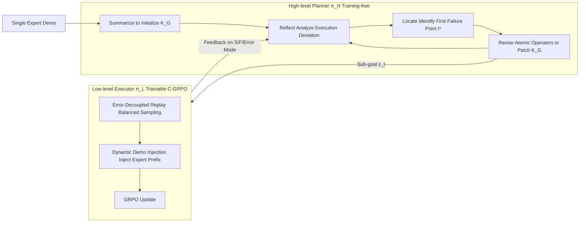

# K²-Agent: Co-Evolving Know-What and Know-How for Hierarchical Mobile Device Control

**Conference**: ICLR 2026  
**OpenReview**: [https://openreview.net/forum?id=9BKg0BAWrb](https://openreview.net/forum?id=9BKg0BAWrb)  
**Code**: To be confirmed  
**Area**: LLM Agent / Mobile Device Control / GUI Agent  
**Keywords**: Mobile Device Control, Hierarchical Agent, Declarative & Procedural Knowledge, GRPO, Self-Evolution  

## TL;DR
Inspired by the human cognitive systems of "knowing what" (declarative) and "knowing how" (procedural), K²-Agent utilizes a high-level planner running an SRLR self-evolution loop to refine task knowledge and a low-level executor using curriculum C-GRPO to learn operational skills. These two components co-evolve in a closed loop. Using only raw screenshots and open-source 7B/72B backbones, it achieves a new SOTA of 76.1% success rate on AndroidWorld.

## Background & Motivation
- **Background**: Mobile device control agents are generally divided into two categories: training-free (carefully designed prompts/workflows to fit task knowledge into context; cheap to develop but limited by the performance of closed-source bases) and learning-based (SFT/RL on large amounts of labeled data; stable in-distribution actions but difficult long-term credit assignment and poor task generalization). A recent trend is to separate "reasoning" from "execution" in a hierarchical (planner–executor) manner, which has proven more effective in practice than flat policies.
- **Limitations of Prior Work**: Most hierarchical designs are merely **structural splits**—either both layers are training-free, or both are unified under SFT/RL training. This results in systems that either rely heavily on manual design or require 10k+ samples and hundreds of GPUs. Mixing high-level policy learning (knowing what to do) and low-level action execution (knowing how to do it) in a single strategy is inefficient, as their optimal update rules differ.
- **Key Challenge**: Know-what is symbolic, articulable, and can be summarized and refined from a few demos; know-how is implicit "muscle memory" that is hard to articulate and can only be acquired through repeated practice. Forcing both to learn via the same update rules is neither efficient nor generalizable.
- **Goal**: Develop a framework that learns both declarative and procedural knowledge effectively, with cross-model/cross-task generalization, using low costs (1 demo per task + a single 8×A100 server) and pure screenshot input.
- **Core Idea**: **"Know-what and know-how naturally fit a hierarchical design and should use different update rules while co-evolving through continuous interaction."** The high-level planner is training-free and evolves a linguistic task knowledge base via the SRLR loop; the low-level executor is trainable and evolves parameterized skills via C-GRPO. They form a closed loop of "thinking" and "practicing" through forward sub-goal communication and backward knowledge revision based on execution feedback.

## Method

### Overall Architecture
K²-Agent adopts a two-layer Planner–Executor architecture, each initialized by a VLM. The high-level planner $\pi_H$ (Qwen2.5-VL-72B, training-free) maintains a declarative knowledge base $K_G$. Instead of directly operating the environment, it queries $K_G$ to decompose the global task $g$ into a sequence of immediate single-step sub-goals $z_t$. The low-level executor $\pi_L$ (Qwen2.5-VL-7B, trainable) produces atomic actions under the augmented state $s'_t=(o_t,g,z_t)$. The two modules co-evolve: the sub-goal $z_t$ serves as forward communication, while the executor's success/failure/error patterns serve as feedback for the planner to revise $K_G$. A more accurate $K_G$ allows the planner to generate more executable sub-goals, providing the executor with more structured exploration problems and effective learning signals. The system uses alternating updates $(\text{SRLR}_H)^n \to \text{C-GRPO}_L$, with $n=3$ in experiments.

### Key Designs
**1. SRLR Self-Evolution Loop: Snowballing declarative knowledge from a single demo.** The high-level planner evolves $K_G$ through a four-stage loop: Summarize–Reflect–Locate–Revise. This loop is performed by the VLM itself and only requires a single expert trajectory $T^d$ for initialization. The Summarize stage distills a structured initial knowledge base $K_G^0=\text{Summarize}(T^d,g;\theta_H)$, documenting core logic, key UI elements, and functions into rules or step-by-step checklists. After executing a new trajectory $T^e$, reflection works at two granularities: step-level (checking if action results match $K_G$ expectations to detect deviations) and task-level (generating root-cause explanations $M_{case}$ for episode failures, e.g., "failed to recognize Rename button"). Locate aligns the execution trajectory with $K_G$ to find the first decision point with an unexpected result: $t^*=\min\{t\mid \text{Verify}(s^e_{t+1},a^e_t,K_G,t;\theta_H)=\text{False}\}$. Finally, Revise performs local "surgery" on $K_G$ using four atomic operators (Add, Delete, Update, Highlight) to produce $K'_G$. Iterative loops make task knowledge increasingly accurate.

**2. Error-Decoupled Replay Balancing: Mitigating sample imbalance via error-type sampling.** C-GRPO observes that action-level errors can be decoupled into **type errors** (predicting swipe when it should be click) and **parameter errors** (correct type but inaccurate coordinates). For an input $i$, $\pi_L$ generates $G$ candidates, and two error rates are estimated using a binary reward $r(a,\hat a)=\mathbb{1}[\text{type}(a)=\text{type}(\hat a)\wedge\|\text{coord}(a)-\text{coord}(\hat a)\|_2<\epsilon]$: the type error rate $\eta_{type}(i)$ and the parameter error rate $\eta_{param}(i)$. Based on these, inputs are dynamically assigned to three replay pools: conventional $D_{con}$, type exploration $D_{type}$, and precision optimization $D_{param}$. Mini-batches are formed according to preset ratios $\{\beta_{con},\beta_{type},\beta_{param}\}$, ensuring the model progresses evenly across weaknesses and mitigating the bias where common operations like click far outnumber long-press or swipe.

**3. Dynamic Demonstration Injection: Guiding exploration under sparse rewards with annealed expert prefixes.** In the vast text × screen action space of (V)LLMs, replay balancing alone struggles to discover correct action sequences, leaving rewards sparse. This mechanism prepends a variable-length expert atomic action prefix to the input. The injection length $l=L_h(k,d_i)=L\cdot\sigma(k)\cdot f_{gate}(d_i)$, where $\sigma(k)=\max(0,1-k/K_{max})$ is a linear annealing scheduler over training steps $k$, and $f_{gate}(d_i)=\tanh(d_i/T)$ is a difficulty gate controlled by temperature $T$. The difficulty score is $d_i=\eta_{type}(i)+\eta_{param}(i)$. The intuition is to provide more guidance for difficult samples and gradually "wean" the model as training progresses. This significantly increases the probability of generating successful trajectories, providing denser and better signals for policy optimization. The C-GRPO objective incorporates these curriculum policies into a standard GRPO clip objective $J_{C\text{-}GRPO}$, with advantages $\hat A_{i,t}$ derived from group-relative relative estimates based on dense binary expert matching rewards.

## Key Experimental Results

### Main Results (AndroidWorld, 116 tasks / 20 apps, Human Expert ~80%)

| Type | Agent | Backbone | Input | SR (%) |
|------|-------|------|------|--------|
| Training-free | Agent S2 | Claude-3.5-Sonnet | Screenshot | 54.3 |
| Training-free | MobileUse | Qwen2.5-VL-72B | Screenshot | 62.9 |
| Training-free | FinalRun | GPT-5 | Screenshot+A11y | 76.7 |
| Learning-based | UI-Venus | Qwen2.5-VL-72B | Screenshot | 65.9 |
| Learning-based | Mobile-Agent-v3 | Qwen-VL based | Screenshot | 73.3 |
| Learning-based | UI-TARS-2 | Seed-thinking-1.6 | Screenshot | 73.3 |
| Learning-based | AutoGLM-Mobile | AutoGLM-Mobile | Screenshot+A11y | 75.8 |
| **Ours** | **K²-Agent** | **Qwen2.5-VL (72B+7B)** | **Screenshot** | **76.1 ± 1.0** |

Using only raw screenshots, it outperforms all open-source learning-based models and closed-source models limited to screenshot input, reaching parity with FinalRun (GPT-5) which uses additional A11y tree information.

### Ablation Study (AndroidWorld)

| Configuration | SR (%) |
|------|--------|
| No Hierarchy (Flat End-to-End) | 35.3 |
| No Hierarchy + SRLR | 58.6 |
| SRLR + SFT-Low | 62.0 |
| SRLR + GRPO-Low | 68.9 |
| K²-Agent (Full, SRLR + C-GRPO) | 76.1 |

Stepwise improvements clearly isolate the contributions of each component: adding SRLR declarative knowledge (+23.3), introducing hierarchy (+3.4), GRPO interactive learning (+6.9), and C-GRPO curriculum strategy (+7.2).

### Key Findings
- **Double Generalization**: Declarative knowledge $K_G$ is linguistic and model-agnostic—applying it to four different backbones (Qwen-2.5-72B/32B, GPT-4o, Gemini-2.5-Pro) consistently yields gains (e.g., Qwen-2.5-72B 35.0→76.7, +41.7). Procedural skills are cross-benchmark—the executor trained on AndroidWorld achieves 91.3% accuracy on ScreenSpot-v2 and 86.5% on AitW-General via zero-shot transfer, outperforming RL/SFT methods like DigiRL.
- **C-GRPO Components**: Dynamic Demonstration Injection has the greatest impact; removing it leads to a sharp drop in rewards and unstable training, indicating the expert prefix is vital for early discovery of successful behaviors. Removing Error-Decoupled Replay Balancing results in slower convergence and lower final performance.
- **Efficiency**: The planner requires only 1 demo per task, and the executor is trained on a 7B open-source backbone with a single 8×A100 server, significantly lower than similar methods requiring 10k+ samples and hundreds of GPUs.

## Highlights & Insights
- The distinction between declarative/procedural systems in cognitive science is mapped cleanly onto "different update rules + co-evolution" for the planner/executor, providing rare consistency between theoretical motivation and engineering implementation.
- The Locate mechanism in SRLR uses the "first Verify failure point" for precise localization, and the four atomic operators (Add/Delete/Update/Highlight) allow for controllable and interpretable evolution of non-parametric knowledge.
- Decoupling action errors into types vs. parameters and using balanced pool sampling is a highly suitable engineering insight for GUI grounding scenarios.

## Limitations & Future Work
- The high-level planner utilizes a 72B closed-source or heavy VLM for inference, which remains costly to deploy. Declarative knowledge relies on one manually recorded demo per task category, requiring human intervention for entirely new task types.
- The co-evolution follows a fixed $(\text{SRLR}_H)^3\to\text{C-GRPO}_L$ alternating pattern. The value of $n$ and the rhythm are set empirically, lacking adaptive scheduling.
- Evaluation is primarily focused on AndroidWorld and its transfers. Robustness against real-world environment dynamic interference, pop-ups, and network fluctuations has not been fully tested. Icon performance on ScreenSpot-v2 (especially Mobile-Icon 80.6) still lags behind grounding-specialized models like UI-Venus-Ground-72B.

## Related Work & Insights
- **Training-free agents** (AppAgent, Agent S2, etc.) are good at utilizing a base model's inherent knowledge, but their self-improvement is mostly limited to non-parametric memory editing, with performance capped by the base model. K²-Agent is a hybrid route using non-parametric SRLR to evolve knowledge while using C-GRPO for parametric execution skill improvement.
- **Learning-based agents** (UI-TARS, UI-Venus, CogAgent, etc.) mostly train monolithic policies, mixing know-what and know-how. The core difference here is the explicit decoupling of the two learning processes with specialized update rules, resulting in higher data efficiency and better generalization.
- **Inspiration for GUI/Embodied Agents**: When a task requires both "thinking clearly about what to do" and "executing precisely," rather than training a large model end-to-end, it is better to layer based on knowledge types—letting articulable parts evolve lightly and muscle memory parts learn via RL—creating a closed loop where both feed each other.

## Rating
- Novelty: ⭐⭐⭐⭐ Mapping cognitive dual-systems to a hierarchical agent's "different update rules + co-evolution" is a clear and novel framework; SRLR and C-GRPO offer specific innovations.
- Experimental Thoroughness: ⭐⭐⭐⭐ SOTA on AndroidWorld + double generalization (cross-backbone/cross-benchmark) + stepwise ablation + parameter sensitivity; a complete chain of evidence. Real-world robustness and broader benchmark coverage could be strengthened.
- Writing Quality: ⭐⭐⭐⭐ Smooth logic from motivation to method and experiment. Formulas and diagrams are clear, though moving knowledge evolution cases to the appendix slightly affects self-contained reading.
- Value: ⭐⭐⭐⭐ Achieving SOTA with pure screenshots, open-source backbones, and a single server has high practical and methodological value for low-cost, generalizable mobile GUI agents.

<!-- RELATED:START -->

## Related Papers

- [\[ICLR 2026\] Do Large Language Models Know What They Are Capable Of?](do_large_language_models_know_what_they_are_capable_of.md)
- [\[ICLR 2026\] How Dark Patterns Manipulate Web Agents](how_dark_patterns_manipulate_web_agents.md)
- [\[ICLR 2026\] MobileRL: Online Agentic Reinforcement Learning for Mobile GUI Agents](mobilerl_online_agentic_reinforcement_learning_for_mobile_gui_agents.md)
- [\[ICLR 2026\] M²-Miner: Multi-Agent Enhanced MCTS for Mobile GUI Agent Data Mining](m2-miner_multi-agent_enhanced_mcts_for_mobile_gui_agent_data_mining.md)
- [\[ICLR 2026\] AlphaAgentEvo: Evolution-Oriented Alpha Mining via Self-Evolving Agentic Reinforcement Learning](alphaagentevo_evolution-oriented_alpha_mining_via_self-evolving_agentic_reinforc.md)

<!-- RELATED:END -->
