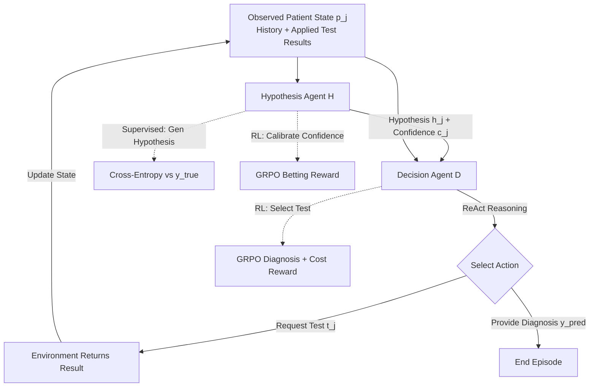

# Language Agents for Hypothesis-driven Clinical Decision Making with Reinforcement Learning

**Conference**: ICLR 2026  
**OpenReview**: [https://openreview.net/forum?id=7vHUQCMAzG](https://openreview.net/forum?id=7vHUQCMAzG)  
**Code**: [https://github.com/dharouni/LA-CDM](https://github.com/dharouni/LA-CDM)  
**Area**: LLM Agent / Clinical Decision Making  
**Keywords**: Clinical decision making, differential diagnosis, hypothesis-driven, uncertainty calibration, GRPO, multi-agent  

## TL;DR
Clinical differential diagnosis is modeled as a two-agent cyclic system consisting of a "Hypothesis Agent + Decision Agent." A hybrid paradigm of supervised and reinforcement learning is employed to simultaneously train accurate hypothesis generation, confidence calibration, and efficient test selection. This enables the LLM to perform iterative reasoning and information gathering like a physician, approaching the correct diagnosis at the minimum testing cost.

## Background & Motivation
**Background**: LLMs have demonstrated strong performance in medical licensing exams and case challenges. Since most medical information (history, imaging reports, lab results) can be represented textually, utilizing LLMs for clinical decision support has become a prominent research direction.

**Limitations of Prior Work**: Existing research typically falls into one of two extremes. One category (e.g., work by McDuff, Chen) assumes **all patient information is fully available at the beginning of the diagnosis**, failing to model the interactive process of "step-by-step information disclosure" in real clinical settings. The other category (e.g., work by Hager, Nori) **relies solely on the zero-shot capabilities of LLMs out-of-the-box** without task-specific training, resulting in diagnostic performance significantly lower than that of clinical doctors.

**Key Challenge**: Real-world clinical decision-making is a **dynamic, iterative, and cyclic** differential diagnosis process. A doctor first forms several hypotheses about the patient, then requests and interprets tests to gradually reduce uncertainty and narrow down the space of possible diseases, only providing a diagnosis when confidence is sufficiently high. This mismatch between existing research settings and real-world workflows limits the actual clinical deployment of LLMs.

**Goal**: To explicitly model and train LLMs to perform clinical decision-making, teaching the model to "request the most informative tests at the right timing and provide a diagnosis when sufficiently confident," while incorporating testing costs into the consideration.

**Key Insight**: **[Hypothesis-driven + Uncertainty-aware]** Inspired by cognitive studies of physicians, a dual-agent system is designed to replicate two major clinical cognitive tasks—the Hypothesis Agent forms the most likely diagnosis and estimates confidence, while the Decision Agent decides whether to continue testing or conclude with a diagnosis based on that estimate. **[Hybrid Training Paradigm]** Supervised fine-tuning (SFT) is used to teach hypothesis accuracy, while reinforcement learning (RL) is used for confidence calibration and efficient test selection. This is necessary because optimal testing paths cannot be pre-labeled and must be learned through experiential trial and error. This is the first known method to explicitly train LLMs for clinical decision-making.

## Method

### Overall Architecture
LA-CDM consists of two language agents sharing LLM weights, operating cyclically within a clinical decision reinforcement learning environment. At each time step, the **Hypothesis Agent** $H$ reads the currently observed patient state $p_j$ and outputs the most likely diagnosis $h_j$ along with a confidence score $c_j$ (0–10). The **Decision Agent** $D$ receives $\{p_j, h_j, c_j\}$, utilizes ReAct to generate a reasoning chain, and then decides to either request a new test $t_j$ (updating the patient state for the next step) or provide the diagnosis $y_{pred}$ to conclude the episode. Training revolves around three principles of clinical decision-making: hypothesis generation (supervised), confidence calibration (RL), and efficient test selection (RL). These components are **trained separately in a cycle** rather than optimized simultaneously to ensure stable convergence.

### Key Designs

**1. Clinical Decision Environment and Dual-agent Division: Modeling "Diagnosis-and-Testing" as an interactive RL environment.** Each patient is described by $n$ textual test records $[t_i]_{i=1}^n$ (clinical notes, imaging reports, lab panels). The initial state $p_0$ only contains symptoms, history, and family history. Each time the model requests a test, the environment appends the corresponding result to the observed state. The Hypothesis Agent is responsible for "thinking"—mapping $H: p_j \to \{h_j, c_j\}$ in the format "Hypothesis: $h_j$, Confidence: $c_j$". The Decision Agent is responsible for "acting"—mapping $D: \{p_j, h_j, c_j\} \to t_j \text{ or } y_{pred}$, serving as the executor that advances the state. If a model requests a non-existent test (due to retrospective data limitations), the environment informs the model that it is unavailable and requires a new action.

**2. Supervised Fine-tuning for Hypothesis Generation: Using real diagnoses as anchors to teach the model to "guess the most likely disease first."** Accurate hypotheses are the baseline for good decision-making. During training, all conversation contexts presented to the model across all steps within a patient batch are collected. These contexts are paired with the correct diagnosis $y_{true}$ to form target sequences for SFT using cross-entropy loss. Notably, the **tokens at the confidence position are ignored** during SFT, as calibration is handled by RL. This ensures the model can provide the most accurate possible hypothesis from limited information across various test subsets.

**3. Betting-style RL for Confidence Calibration: Ensuring "60% confidence" truly corresponds to a 60% accuracy rate.** LLMs often suffer from being "confidently wrong," which is dangerous in clinical settings. This work adopts a "betting game" modeling approach trained via GRPO. The model bets on the correctness of its own answer; high confidence in a correct answer yields a large reward, while high confidence in an incorrect answer results in a heavy penalty. The reward function is:
$$R(y_{pred}, c, j) = \begin{cases} \log(c), & \text{if } J(y_{pred}) \text{ is true} \\ \log(1-c), & \text{if } J(y_{pred}) \text{ is false} \end{cases}$$
where $c$ is the scaled and clipped confidence, and $J(\cdot)$ represents correctness (defined as whether the predicted $h_j$ matches the true diagnosis $y_{true}$). This design does not require a manually labeled "standard confidence" dataset and theoretically leads to perfectly calibrated confidence expressions.

**4. Cost-aware RL for Efficient Test Selection: Learning the trade-off between "diagnostic accuracy" and "test economy."** Since optimal test sequences cannot be pre-labeled, the Decision Agent identifies them via trial-and-error using GRPO. The diagnostic reward provides a fixed positive reward $r_{pos}$ for correct final diagnoses, $r_{neg}$ for incorrect ones, and $r_{invalid}$ for formatting errors:
$$R_{diag}(y_{pred}) = \begin{cases} r_{pos} & y_{pred} = y_{true} \\ r_{neg} & y_{pred} \neq y_{true} \\ r_{invalid} & \text{Invalid Format} \end{cases}$$
To prevent the overuse of expensive tests (e.g., CT is far more expensive than a blood test), an additional penalty based on test costs is applied:
$$R_{cost}(T) = -\sum_{t_j \in T} c(t_j),$$
where $T$ is the set of all tests performed in the episode and $c(t_j)$ is the cost of each. The interaction of these objectives teaches the model to request the most informative tests that maximize hypothesis confidence while minimizing cost.

## Key Experimental Results

The dataset used is **MIMIC-CDM** (a subset of MIMIC-IV), containing 2,400 patients with abdominal diseases (appendicitis, cholecystitis, diverticulitis, pancreatitis), 5,959 imaging reports, and 143,191 lab results, with standardized test mapping across patients.

### Main Results

| Method | Mean Accuracy | Micro F1 | Macro F1 | Avg. Test Cost |
| :--- | :---: | :---: | :---: | :---: |
| OASST* (Zero-shot) | 54.9 | - | - | - |
| SFT-all (Used all info, approx. upper bound) | 92.8 | 93.6 | 92.9 | $3792.79 |
| SM-DDPO† (Tabular data only) | 37.0 | 45.4 | 31.8 | - |
| ReAct (Zero-shot decision) | 74.9 | 79.1 | 74.8 | $1480.32 |
| LA-CDM (ZS) (Untrained) | 64.5 | 65.3 | 64.5 | $1521.73 |
| **LA-CDM** | **81.3** | **84.1** | **81.3** | **$1295.61** |

LA-CDM improves accuracy by approximately 6 percentage points over zero-shot ReAct and **reduces test costs by about $185**. Compared to the upper bound SFT-all, it maintains competitive accuracy using only about 1/3 of the testing cost.

### Ablation Study

| Ablation Setting | Mean Accuracy | Macro F1 | Avg. Test Cost |
| :--- | :---: | :---: | :---: |
| w/o Cost Reward $R_{cost}$ | 82.3 | 82.4 | $1427.85 |
| **Full LA-CDM (with $R_{cost}$)** | 81.3 | 81.3 | **$1295.61** |
| Decision Agent Only (no Hypo Agent) | 78.5 | 78.6 | $1410.01 |
| **Hypothesis + Decision Dual-Agent** | **82.3** | **82.4** | $1427.85 |

The cost reward significantly reduces test expenditures with almost no loss in precision. Removing the Hypothesis Agent lead to a decline across all metrics, proving the value of the hypothesis-driven design.

### Key Findings
- **Patient-adaptive Testing Strategy**: When cholecystitis is suspected, the model chooses ultrasound (the gold standard) 64.9% of the time; for appendicitis, it chooses CT 85.1% of the time. These behaviors align with clinical guidelines.
- **Explicit Training > Out-of-the-box**: The jump from LA-CDM(ZS) to LA-CDM proves that training for clinical decision-making is more critical than relying on the inherent capabilities of pre-trained models.
- **Efficiency represents value**: Lower test costs correspond directly to reduced healthcare spending and less patient burden.

## Highlights & Insights
- **Cognitive Science Driven Architecture**: The dual-agent design precisely maps to the two cognitive tasks of "forming hypotheses" and "deciding actions," explicitly encoding the cyclic nature of differential diagnosis.
- **Alternating Training of Three Objectives**: The authors found that optimizing three objectives simultaneously is unstable; switching between them for several episodes proved to be a practical stabilization technique.
- **Uncertainty Calibration in the Loop**: "Knowing what you don't know" is treated as a basis for decision-making (when to stop testing) rather than just an auxiliary metric.
- **Real-world Trade-off**: Treating test costs as a first-class citizen in retrospective clinical data makes the results both practical under economic constraints and interpretable through ReAct reasoning chains.

## Limitations & Future Work
- **Restricted Exploration in Retrospective Data**: The model can only learn from tests that were actually performed by doctors in the original records, limiting the discovery of entirely new clinical strategies.
- **Inability to Fulfill Missing Tests**: If a model requests a test not present in the dataset, it is simply told it is unavailable. Future work could use generative models to simulate missing test data.
- **Narrow Disease Space**: The experiments are limited to four types of abdominal diseases.
- **Deployment Constraints**: As a support system, it requires alignment with medical guidelines and monitoring for bias; it should assist rather than replace clinicians.

## Related Work & Insights
- **RL for Cost-efficient Decisions**: Compared to SM-DDPO which only handles tabular data, LA-CDM allows LLMs to request and interpret multi-modal tests in text form.
- **Zero-shot Clinical Decisions**: Works like Hager's MIMIC-CDM evaluation showed that out-of-the-box LLMs are inferior to doctors; LA-CDM fills the gap by providing an explicit training mechanism.
- **Calibration via RL**: The betting-style reward with GRPO provides a transferable paradigm for any high-stakes decision task requiring trustworthy confidence estimates.

## Rating
- **Novelty**: ⭐⭐⭐⭐ — The first method to explicitly train LLMs for clinical decision-making with a clear hypothesis-driven dual-agent paradigm.
- **Experimental Thoroughness**: ⭐⭐⭐⭐ — Comprehensive comparisons against zero-shot and tabular baselines with detailed cost and calibration analyses.
- **Writing Quality**: ⭐⭐⭐⭐ — Clear mapping between clinical cognition and algorithm design; rigorous definitions of rewards.
- **Value**: ⭐⭐⭐⭐ — Demonstrated potential to significantly reduce diagnostic costs while maintaining high accuracy in a guided, interpretable manner.

<!-- RELATED:START -->

## Related Papers

- [\[ICLR 2026\] LLMs are Greedy Agents: Effects of RL Fine-tuning on Decision-Making Abilities](llms_are_greedy_agents_effects_of_rl_fine-tuning_on_decision-making_abilities.md)
- [\[AAAI 2026\] MoralReason: Generalizable Moral Decision Alignment For LLM Agents Using Reasoning-Level Reinforcement Learning](../../AAAI2026/llm_agent/moralreason_generalizable_moral_decision_alignment_for_llm_agents_using_reasonin.md)
- [\[ICLR 2026\] Tree Search for LLM Agent Reinforcement Learning](tree_search_for_llm_agent_reinforcement_learning.md)
- [\[ICLR 2026\] MobileRL: Online Agentic Reinforcement Learning for Mobile GUI Agents](mobilerl_online_agentic_reinforcement_learning_for_mobile_gui_agents.md)
- [\[ICLR 2026\] CoMind: Towards Community-Driven Agents for Machine Learning Engineering](comind_towards_community-driven_agents_for_machine_learning_engineering.md)

<!-- RELATED:END -->
