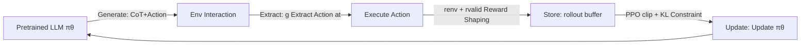

# LLMs are Greedy Agents: Effects of RL Fine-tuning on Decision-Making Abilities

**Conference**: ICLR 2026  
**OpenReview**: [https://openreview.net/forum?id=weUP6H5Ko9](https://openreview.net/forum?id=weUP6H5Ko9)  
**Code**: BanditBench environment based on Nie et al. (2024) open-source implementation  
**Area**: llm_agent  
**Keywords**: LLM agent, decision making, exploration-exploitation, RL fine-tuning, Chain-of-Thought, greediness bias, knowing-doing gap  

## TL;DR
This paper systematically analyzes three core failure modes—greediness, frequency bias, and the knowing-doing gap—that lead to suboptimal LLM performance in simple decision-making scenarios (Multi-armed Bandits, Contextual Bandits, Tic-Tac-Toe). It demonstrates that RL fine-tuning (RLFT) on self-generated CoT reasoning significantly increases exploration and bridges the knowing-doing gap.

## Background & Motivation

**Background**: The success of LLMs has sparked a trend of using them as agents (agentic AI), based on the assumption that LLMs can leverage "world knowledge" and Chain-of-Thought (CoT) reasoning to efficiently explore and solve complex decision-making problems without extensive environmental interaction.

**Limitations of Prior Work**: However, reality differs. Works such as Krishnamurthy et al. (2024) and Nie et al. (2024) have found that LLM agents do not explore robustly, often performing only slightly better than random policies in interactive environments like grid-world or Atari. Previous studies vaguely attribute these defects to the **knowing-doing gap**—where the model "knows" what to do (can describe the consequences of actions) but fails to apply this knowledge when "doing."

**Key Challenge**: The problem is that prior research only observed the phenomenon of "poor performance" without a fine-grained, quantifiable diagnosis of **why** it fails. Is the deficiency in decision-making a general failure, or is it composed of several separable and locatable specific biases? Without decomposition, it is impossible to apply targeted remedies.

**Goal**: Systematically explain why LLMs perform poorly in simple decision-making scenarios, decompose the vague "insufficient exploration" into quantifiable failure modes, and verify whether RL fine-tuning can alleviate these patterns.

**Core Idea**: The authors use the cleanest setup, Multi-armed Bandits (MAB), as a magnifying glass to precisely quantify three **independent** failure modes: **greediness**, **frequency bias**, and the **knowing-doing gap**. They propose applying RL fine-tuning (RLFT) on **model self-generated CoT reasoning** to reinforce high-reward reasoning-action patterns back into the model, thereby broadening exploration and bridging the knowing-doing gap. **[Positioning: This is an analytical work focused on "diagnosis + verification" rather than "pushing SOTA."]**

## Method

### Overall Architecture
The method in this paper follows two tracks: the **diagnostic track** uses controlled MAB contexts to precisely measure the three failure modes; the **intervention track** uses RLFT on self-generated CoT to alleviate these modes. The core loop of RLFT is: let the pretrained LLM $\pi_\theta$ generate "reasoning + action" in CoT format within the environment, store interaction trajectories in a rollout buffer, and use a PPO objective with KL constraints to reinforce reasoning-action patterns leading to high rewards.

### Key Designs

**1. Quantifiable Diagnosis of Three Failure Modes: Turning "Exploration Deficiency" into Scalable Metrics.** The authors define three calculable metrics to measure specific biases within the MAB setting, which isolates the exploration-exploitation tradeoff. **Greediness** is measured by action coverage $C_t = \frac{|\{a\in A: N_t(a)>0\}|}{|A|}$—the proportion of actions selected at least once by step $t$. Experiments show Gemma2 2B covers only 40% of actions, while 9B/27B cover 65%, with coverage stagnating after 10 steps, indicating premature locking into the current known optimal action. **Frequency bias** is quantified by constructing repeated histories (repeating an action 0–100 times) and observing changes in action entropy: 2B model entropy declines monotonically with repetitions (correlation −0.67), meaning it tends to copy the most frequent action in context regardless of reward. **The knowing-doing gap** is characterized by a confusion matrix: the model is asked to calculate UCB values ("knowing") and then select an action ("doing"). Results show 87% of reasoning is correct, but even when reasoning is correct, the model still has a 58% probability of choosing a "greedy action" over the true optimal action (only 21%).

**2. RLFT on Self-Generated CoT: Reinforcing "Reasoning → Action" instead of memorizing actions.** The key to intervention is that the object of reinforcement is the model's **own generated** CoT reasoning chain rather than external expert actions. During each interaction, the model generates $z_t = [z^{CoT}_t; a_t]$, containing both reasoning tokens and the action to be executed, extracted via $a_t = g(z_t)$. The fine-tuning objective uses a PPO clip target with an additional KL constraint:

$$\max_\theta \mathbb{E}_{(c,z)\sim D}\Big[\min\big(\tfrac{\pi_\theta(z|c)}{\pi_{\theta_{old}}(z|c)}A_{adv},\ \text{clip}_\epsilon(\tfrac{\pi_\theta(z|c)}{\pi_{\theta_{old}}(z|c)})A_{adv}\big) - \beta D_{KL}(\pi_\theta(\cdot|c)\|\pi_{ref}(\cdot|c))\Big]$$

Where $\pi_{ref}$ is the frozen pretrained model. For fixed-horizon bandits, Monte-Carlo rewards-to-go are used to estimate the advantage $A_{adv}$ to save memory; for variable-length Tic-Tac-Toe, a state-value head is added to the last layer using GAE. Ablation studies (Figure 9b) show that without CoT, RLFT barely matches "ICL with CoT," proving CoT is the core mechanism for exploration and rationalization.

**3. Reward Shaping for Valid Actions: Using -5 penalties to anchor the model on legal actions.** Since LLM-generated actions might not conform to the output template, the authors add a shaping term to the environment reward: $r_t = r^{env}_t + r^{valid}_t$, where $r^{valid}_t = -5 \cdot \mathbb{1}(g(a_t)\notin A)$. To prevent this penalty from dominating optimization, environmental rewards are normalized. Additionally, providing a $+1$ exploration bonus for "untried actions" increased action coverage from 50% to 70% and significantly reduced regret, highlighting the **critical role of reward shaping in guiding LLM decision-making behavior.**

## Key Experimental Results

Experiments were conducted on Gemma2 (2B/9B/27B) across Gaussian/Bernoulli MAB (5/10/20 arms, low/mid/high noise), Contextual Bandits, and text-based Tic-Tac-Toe. Reproductions on Llama3 and Qwen2.5 confirmed consistent conclusions.

### Main Results: RLFT Reducings Cumulative Regret (Mid Noise σ=1)

| Setting | Phenomenon |
|------|------|
| MAB 5/10/20 arms | LLMs significantly outperform random baselines; RLFT further reduces cumulative regret for 2B and 9B |
| 2B + RLFT | Closes the gap with larger models and the UCB upper bound |
| Contextual Bandit | 2B achieves similar performance gains after RLFT |
| Tic-Tac-Toe (vs Random) | Average return increased from 0.15 (15% win rate) to 0.75 |
| Tic-Tac-Toe (vs Optimal MCTS) | Improved from −0.95 to 0.0 (capable of drawing against an optimal opponent) |

### Key Findings: Quantitative Diagnosis of Failure Modes

| Failure Mode | Key Data |
|----------|----------|
| Greediness | Under 10-arm, 2B covers only 40% of actions, 9B/27B cover 65%; under 20-arm, the largest model covers only 45%; without CoT, all explore only 25% |
| Frequency Bias | 96% of 2B actions are "most frequent actions" (correlation -0.67); 27B stands at 14%, largely escaping this but shifting to greediness |
| Knowing-Doing Gap | 87% reasoning is correct, but even with correct reasoning, 58% select greedy actions, only 21% select optimal actions |

### Ablation Study Key Findings
- **RLFT Alleviates Greediness**: 2B action coverage increased by +12% after 30K steps of fine-tuning.
- **RLFT Offsets Frequency Bias**: In the 0–10 repetition range, "frequent action" percentage dropped from 70% → 35%; however, it remains high in extreme repetition zones.
- **Exploration Mechanism Comparison**: "Try-all" (trying all actions first) brings massive gains; "exploration bonus" (+1 for untried) drags coverage from 50% → 70%.
- **CoT is Indispensable**: RLFT without CoT barely matches ICL with CoT.
- **Expert Data is Effective**: Ours (SFT) using UCB expert data (32K rollouts) approaches UCB regret levels regardless of CoT presence.
- **Thinking Time**: Increasing generation budget $G$ from 256 to 512 allows 2B to reach "9B + RLFT" performance levels, though rollout generation dominates training time.

## Highlights & Insights
- **Standardizing "LLM cannot explore" into three measurable metrics**. Greediness, frequency bias, and the knowing-doing gap are independent with specific quantitative indicators. This "diagnostic" framework is arguably more valuable than the RLFT gains themselves, providing targeted benchmarks for agent design.
- **Precise Quantification of the Knowing-Doing Gap**: 87% know vs. 58% fail is a powerful comparison, turning the intuition that "the model knows but won't act" into hard data.
- **Reinforcing Self-Generated CoT instead of Cloning Experts**: RLFT reinforces the model's own reasoning chains. This, combined with CoT ablations, suggests CoT plays a dual role of "exploration + rationalization" in decision-making.
- **Leverage Effect of Reward Shaping**: A simple +1 exploration bonus can pull coverage up by 20 percentage points, suggesting that LLM exploration shortcomings can be significantly mitigated by environment-side reward design.
- **Direct Engineering Insight**: The authors explicitly note that when building tool-use or coding agents, one should **initially limit the breadth of available tools** to circumvent the model's inherent greediness bias.

## Limitations & Future Work
- **Model Scale Limitations**: Verified only on small-to-medium models (2B–27B); behaviors of frontier large models remain to be studied.
- **Short Horizons**: MAB interactions were limited to 50 steps; while sufficient for 5/10 arms, this is inadequate for 20 arms, leading to potential "illusions" in regret comparisons.
- **RLFT is Not a Panacea**: The authors emphasize the goal was diagnosis; even after RLFT, exploration remains suboptimal compared to classical bandit algorithms.
- **Computational Cost**: While more thinking tokens improve performance, rollout generation takes up the bulk of training time due to the multi-step nature of decision tasks; efficient architectures like Mamba/RWKV are suggested.
- **Future Work**: Extending diagnosis to stateful environments requiring "directed exploration," computer-use benchmarks, and incorporating intrinsic reward (curiosity) mechanisms.

## Related Work & Insights
- **Exploration Taxonomy**: Aligned with both classical RL exploration (ε-greedy, counts, curiosity) and LLM-specific exploration (self-correction, consistency).
- **Contrast with Krishnamurthy et al. (2024) / Nie et al. (2024)**: While those focused on in-context exploration or SFT on expert trajectories, this work focuses on the impact of **RLFT** on exploration and why it fails.
- **Echoes of Copycat Bias**: The frequency bias in small models relates to "copycat bias" in behavioral cloning, suggesting this is a byproduct of supervised pretraining that RL can counter.

## Rating
- **Novelty**: ⭐⭐⭐⭐ Systematically decomposing "poor LLM decision-making" into three quantifiable failure modes is a fresh diagnostic perspective.
- **Experimental Thoroughness**: ⭐⭐⭐⭐ Covers three environments, three model scales, and multiple noise levels, plus Llama3/Qwen2.5 reproductions. Horizon length is the main drawback.
- **Writing Quality**: ⭐⭐⭐⭐ Clear logic (diagnosis followed by intervention). Definitions and visualizations of the three failure modes are clean and intuitive.
- **Value**: ⭐⭐⭐⭐ Provides a "pathological" framework for LLM agent research and direct engineering advice (limiting tool breadth, emphasizing reward shaping).

<!-- RELATED:START -->

## Related Papers

- [\[ICLR 2026\] AgentGym-RL: An Open-Source Framework to Train LLM Agents for Long-Horizon Decision Making via Multi-Turn RL](agentgym-rl_an_open-source_framework_to_train_llm_agents_for_long-horizon_decisi.md)
- [\[ICLR 2026\] Language Agents for Hypothesis-driven Clinical Decision Making with Reinforcement Learning](language_agents_for_hypothesis-driven_clinical_decision_making_with_reinforcemen.md)
- [\[ICLR 2026\] Agent Data Protocol: Unifying Datasets for Diverse, Effective Fine-tuning of LLM Agents](agent_data_protocol_unifying_datasets_for_diverse_effective_fine-tuning_of_llm_a.md)
- [\[ICML 2026\] Post-Training LLMs as Better Decision-Making Agents: A Regret-Minimization Approach](../../ICML2026/llm_agent/post-training_llms_as_better_decision-making_agents_a_regret-minimization_approa.md)
- [\[CVPR 2026\] CGL: Advancing Continual GUI Learning via Reinforcement Fine-Tuning](../../CVPR2026/llm_agent/cgl_advancing_continual_gui_learning_via_reinforcement_fine-tuning.md)

<!-- RELATED:END -->
