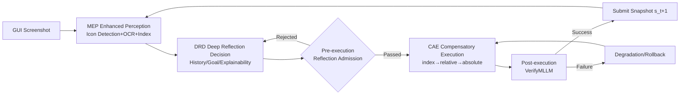

# LongHorizonUI: A Unified Framework for Robust Long-Horizon Task Automation of GUI Agent

**Conference**: ICLR 2026  
**OpenReview**: [https://openreview.net/forum?id=BK7Mk5d4WE](https://openreview.net/forum?id=BK7Mk5d4WE)  
**Code**: [https://kane2kang.github.io/LongHorizonUI/](https://kane2kang.github.io/LongHorizonUI/)  
**Area**: GUI Agent / LLM Agent / Long-Horizon Automation  
**Keywords**: GUI Agent, Long-Horizon, MLLM, Enhanced Perception, Reflective Decision-making, Compensatory Execution  

## TL;DR
LongHorizonUI employs a "Enhanced Perception + Three-layer Closed-loop Reflective Decision-making + Multi-level Compensatory Execution" toolkit to enhance the success rate of training-free MLLM GUI agents in long-horizon tasks exceeding 15 steps, supplemented by the release of the LongGUIBench benchmark (averaging 22 steps).

## Background & Motivation
**Background**: GUI agents driven by Multimodal Large Language Models (MLLMs) have matured in short-horizon tasks like clicking search boxes or jumping pages, with average success rates exceeding 90% for tasks within 5 steps on AndroidControl.

**Limitations of Prior Work**: Evaluation of multiple SOTAs (InfiGUI-R1, UI-TARS-1.5, AgentCPM-GUI, etc.) across sequence length buckets on AndroidControl reveals a **nonlinear performance collapse**—dropping below 75% beyond 10 steps and to approximately 60% beyond 15 steps. Furthermore, mainstream benchmarks (AndroidControl avg. 6.8 steps, AITW 8.2 steps) consist almost entirely of short-horizon tasks, failing to expose this issue. Recent approaches using online RL for adaptability often amplify the action space, exacerbating cumulative errors in long-horizon sequences.

**Key Challenge**: The fundamental difficulty of long-horizon tasks lies in **cross-step context consistency**. Once an agent loses grasp of historical state dependencies, single-step minor errors amplify exponentially along the trajectory, leading to system failure. Existing methods lack both reliable state representations and self-correction mechanisms for execution failures.

**Goal**: To design a GUI agent capable of maintaining context coherence and decision accuracy across long-horizon action sequences, and to provide an evaluation benchmark that rigorously tests long-horizon capabilities.

**Core Idea**: **Training-free, pure inference-time enhancement**. Instead of fine-tuning the backbone, explicit structural constraints and fault-tolerant loops are integrated into "Perception-Decision-Execution" modules: stable indexing for UI elements in perception, mandatory three-layer validation in decision-making, and multi-level coordinate degradation with rollback in execution.

## Method

### Overall Architecture
LongHorizonUI is a training-free closed-loop pipeline: first, the **Multimodal Enhanced Perceiver (MEP)** fuses icon detection and OCR to abstract screenshots into element sets with unique indices; next, the **Deep Reflection Decider (DRD)** utilizes a strict JSON Schema to drive the MLLM through "Historical Validation—Goal Check—Action Explainability" for three-layer closed-loop reasoning to output candidate actions; finally, the **Compensating Action Executor (CAE)** maps actions to specific pixels via index→relative→absolute degradation, utilizing real-time progress monitoring to compensate or rollback upon failure.

### Key Designs

**1. Multimodal Enhanced Perceiver: Transforming screenshots into indexed element tables with stable anchors**. In long-horizon tasks, interfaces change repeatedly. Pure visual grounding often loses anchors due to minor layout jitters. MEP runs an icon detector and OCR in parallel; the detector outputs $E_{ui}=\{(id_i, b_i, c_i)\}_{i=1}^{N}$ (unique spatial label, bbox, confidence), while OCR outputs $E_{text}=\{(t_j, b_j)\}_{j=1}^{M}$. For composite widgets like "icon+text," a semantic binding function stitches them: $\hat{e}_i=\Phi(e_i, E_{text})$, binding text when the maximum overlapping text box satisfies $\text{IoU}(b_i, b_{j^*})\geq\tau$; otherwise, the pure icon item is retained. The index $id_i$ serves as a stable anchor across steps, allowing subsequent decisions to refer to elements via "click index 13" rather than fragile coordinates. To prevent missing critical elements like popup close buttons, a **template fallback matcher** is implemented: it triggers a repair function $R$ only in high-priority regions $A_{priority}$ (e.g., corners, bottom bars) using a standard icon template library $T$ (Close/Confirm/Back) to recover missed elements.

**2. Deep Reflection Decider: Decomposing decisions into three-layer closed-loop reflection via JSON Schema**. MLLMs are prone to cascading errors when generating actions directly. DRD enforces output via fixed fields (`historical_status / import_contents / think / Execute_goal / action`), where the first three fields handle reflection and the latter two handle decision-making. The three layers are: ① **Historical Validation**—`historical_status` checks UI state transitions (e.g., button activation, text input) via OCR/icon detection, triggering root cause analysis upon error popups or non-responsive elements; ② **Goal Check**—`import_contents` extracts key screen information and filters noise to verify environment understanding; ③ **Action Explainability**—`think` requires the MLLM to analyze the current UI, failure causes, and localization basis (e.g., "Button #12 has the highest interaction confidence"). An **Admission Gate** is implemented before execution: $\phi(s_t, a\mid G_t, T)=\mathbb{1}[g_{tg}(a)\in G_t]\wedge\mathbb{1}[K(d_{action})\subseteq K(T)]=1$, allowing passage only if the target element exists on screen and the action semantics are implied by the task description.

**3. Compensating Action Executor: Three-level coordinate degradation and progress-triggered rollback**. A "semantic-physical" gap exists between free-text MLLM output and executable pixel coordinates. CAE uses a priority degradation strategy to bridge this. Normalized coordinates are mapped to physical pixels via a device-aware scaling matrix $S=\text{diag}(W_{screen}, H_{screen})$ as $p=S\cdot(x_{norm}, y_{norm})^\top$. Execution follows the $\Pi=[\text{index}\to\text{relative}\to\text{absolute}]$ sequence: first, click the element centroid $p_0$ (index); if it fails, sample a point within the bbox via $\lambda_w,\lambda_h\sim U[0,1]$ (relative); if failure persists, use absolute screen coordinates with bounded perturbation $\|\epsilon\|_\infty\leq 5\text{px}$ to escape edges or occlusions (absolute). Post-execution validation $v_t=\text{VerifyMLLM}(s_t, a, p_t, I_{t+1})\in\{0,1\}$ is performed by DRD; if successful, the snapshot $(s_{t+1}, p_t)$ is submitted. If all candidates fail, $\text{Rollback}(s_{t-1}, p_{t-1})$ reverts to the last submitted state to maintain long-horizon robustness.

### LongGUIBench
The authors constructed LongGUIBench: 371 scenarios (207 from 13 games + 147 task chains from 15 apps), all requiring $\geq 15$ steps (average 22.1, max 37). Data was collected via synchronized action-screen recording, cross-modal alignment, and standardized parsing by 6 professional testers. Each task includes High-Level (HL, macro goals) and Low-Level (LL, atomic operations) instructions, annotated with fine-grained UI metadata like widget types, bboxes, and state attributes.

## Key Experimental Results

### Main Results (LongGUIBench Long-Horizon Tasks, SR=Success Rate, TM=Trajectory Match)

| Model | General-Low SR | General-High SR | Game-Low SR | Game-High SR | Avg |
|------|------|------|------|------|------|
| GPT-4o | 20.8 | 4.2 | 23.9 | 3.7 | 49.1 |
| Gemini2.5 | 73.3 | 25.7 | 57.7 | 25.7 | 67.3 |
| Qwen2.5-VL-7b | 82.7 | 29.3 | 72.8 | 27.4 | 67.4 |
| AgentCPM-GUI | 81.2 | 37.1 | 66.5 | 25.8 | 68.6 |
| UI-TARS-1.5 | 79.2 | 21.8 | 69.5 | 18.9 | 65.8 |
| **LongHorizonUI** | **85.3** | **52.3** | **83.9** | **52.1** | **77.3** |

Compared to SOTA (UI-TARS-1.5), Long-Horizon success improved by +6.1% for low-level instructions and +30.5% for high-level instructions in General scenes. The significant gain in high-level instructions indicates that structured reflection is particularly critical for macro goal decomposition.

### Other Benchmarks
- **ScreenSpot grounding**: Avg. 90.4%, exceeding prior SOTA UI-TARS by 2.9%, leading in most Text/Icon sub-items across mobile/desktop/web.
- **Navigation (AndroidControl + GUI-Odyssey)**: Avg. SR 65.5%, AndroidControl-High SR 54.2% (+6.4% over Qwen2.5-VL-7B), GUI-Odyssey +6.1%, and +2.3% over the strong baseline GUI-R1-7B, proving long-horizon enhancement does not sacrifice short-horizon performance.

### Ablation Study

| Configuration | Impact on Completion Rate |
|------|------|
| Full (Icon + OCR + Adaptive Grid) | Highest baseline |
| Remove Icon Detector | Step completion rate −6.1% |
| Remove OCR | −2.3% (Frequent errors in composite widgets) |
| Remove Adaptive Grid | Small elements in high-res prone to missed detection |
| Index-only execution | 81.4% (Already superior to other single action modes) |
| + relative | +1.2% |
| + absolute | +2.5% |
| + historical coordinates | +3.9% |

### Key Findings
- Existing methods collapse to ~60% at $>15$ steps, while LongHorizonUI delays this critical decay point, maintaining competitiveness within 18 steps.
- Compensatory actions provide additive gains: index is the strongest single mode, while adding relative/absolute/historical coordinates continuously improves performance, validating the complementarity of "fault-tolerant coordinate transformation + historical spatial cues."
- The framework achieves superiority over GUI-specifically trained baselines through pure inference-time enhancement without any fine-tuning.

## Highlights & Insights
- **Effective Problem Definition**: Quantified the long-horizon collapse phenomenon through "sequence length buckets + nonlinear collapse curves" and created a truly long-horizon benchmark (avg. 22 steps) to expose issues masked by short-horizon benchmarks.
- **Indexed State Representation**: Replacing fragile coordinates with stable `index` as cross-step anchors is a key engineering abstraction for maintaining long-horizon reference consistency.
- **Engineering Robustness via Tri-level Degradation + Rollback**: Explicitly models "inaccurate pointing" as a degradable, rollback-capable closed loop rather than hoping for one-shot model accuracy.
- **Deployment-friendly (Zero Training)**: All components are plug-and-play and do not rely on fine-tuning, resulting in low migration costs.

## Limitations & Future Work
- **Latency Issues**: The pipeline relies heavily on multiple MLLM calls (decisions + multiple posterior validations), inheriting MLLM pipeline latency; the authors plan to use distillation, quantization, and context-aware prompt compression for efficiency.
- **Benchmark Scale & Diversity**: LongGUIBench (371 scenarios) was collected by a small group of professional testers, leaving room for expansion in coverage and annotation consistency.
- **Dependency on External Perception**: The quality of icon detectors/OCR directly determines index reliability; template fallbacks may fail in weak perception scenarios.
- **High-level Instructions still a Weakness**: Absolute success rates for Game-High/General-High remain at only ~52%, indicating that long-horizon consistency in macro goal decomposition is far from resolved.

## Related Work & Insights
- **Comparison with Online RL**: Unlike RL methods that generate training data via environment interaction (which may amplify action spaces and cumulative errors), this work pursues a training-free route with inference-time structural constraints and fault-tolerant execution, which is more robust for long horizons.
- **Extension of GUI Grounding**: The perception layer borrows element parsing ideas from OmniParser but adds ID-centric abstraction and priority-region template repair.
- **Inspiration**: ① Explicitly modeling "execution failure" as a first-class citizen (degradation + rollback) is a universal paradigm for long-horizon agents, transferable to web/desktop agents; ② Enforcing MLLMs to separate "reflection" and "decision" fields via JSON Schema is an effective means of improving decision controllability at low cost; ③ The step-length distribution of evaluation benchmarks determines whether long-horizon issues are exposed; agent research should guard against the survivor bias of short-horizon benchmarks.

## Rating
- **Novelty**: ⭐⭐⭐⭐ — Individual components (indexed perception, structured reflection, coordinate degradation) are largely engineering combinations of existing ideas, but the overall framework specifically targeting long-horizon collapse with a supporting benchmark is well-positioned and addresses a sharp problem.
- **Experimental Thoroughness**: ⭐⭐⭐⭐ — Covers LongGUIBench + ScreenSpot + AndroidControl + GUI-Odyssey; includes comprehensive main experiments, ablations, and cases; however, quantitative analysis of latency overhead is missing, and the backbone is limited to a single MLLM.
- **Writing Quality**: ⭐⭐⭐⭐ — Motivation and methodology are clearly narrated with complete diagrams, formulas, and pseudo-code; minor spelling and formatting issues exist.
- **Value**: ⭐⭐⭐⭐ — Long-horizon GUI automation is a core requirement for real-world deployment; the training-free, plug-and-play nature offers high engineering value, and LongGUIBench fills a gap in long-horizon evaluation for the community.

<!-- RELATED:START -->

## Related Papers

- [\[ICLR 2026\] The Tool Decathlon: Benchmarking Language Agents for Diverse, Realistic, and Long-Horizon Task Execution](the_tool_decathlon_benchmarking_language_agents_for_diverse_realistic_and_long-h.md)
- [\[CVPR 2026\] MMBench-GUI: A Unified Hierarchical Evaluation Framework for Multi-Platform GUI Agents](../../CVPR2026/llm_agent/mmbench-gui_a_unified_hierarchical_evaluation_framework_for_multi-platform_gui_a.md)
- [\[ACL 2026\] Don't Act Blindly: Robust GUI Automation via Action-Effect Verification and Self-Correction](../../ACL2026/llm_agent/don39t_act_blindly_robust_gui_automation_via_action-effect_verification_and_self.md)
- [\[ICLR 2026\] MEM1: Learning to Synergize Memory and Reasoning for Efficient Long-Horizon Agents](mem1_learning_to_synergize_memory_and_reasoning_for_efficient_long-horizon_agent.md)
- [\[ICLR 2026\] Unlocking Long-Horizon Agentic Search with Large-Scale End-to-End RL](unlocking_long-horizon_agentic_search_with_large-scale_end-to-end_rl.md)

<!-- RELATED:END -->
