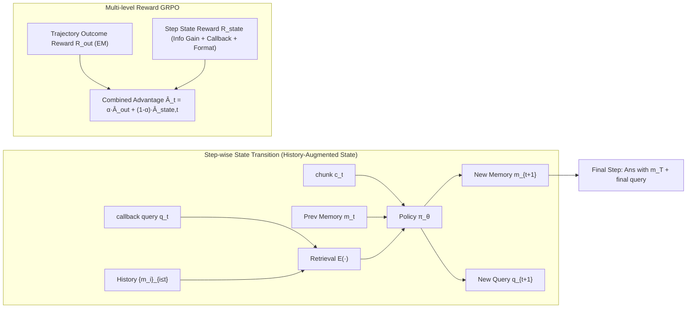

# Look Back to Reason Forward: Revisitable Memory for Long-Context LLM Agents

**Conference**: ICLR 2026  
**OpenReview**: [https://openreview.net/forum?id=1cymflI2Lh](https://openreview.net/forum?id=1cymflI2Lh)  
**Code**: [https://github.com/syr-cn/ReMemR1](https://github.com/syr-cn/ReMemR1)  
**Area**: llm_agent  
**Keywords**: long-context QA, memory agent, memory callback, GRPO, multi-level reward, non-linear reasoning  

## TL;DR
ReMemR1 embeds a revisitable memory retrieval mechanism into "memorize while reading" agents. Each step, the agent updates its current memory while generating a callback query to search its own history. Combined with a multi-level (trajectory-level + step-level) reward system to densify RL signals, it reduces error rates for long-context multi-hop reasoning by over 20% with negligible computational overhead (<0.2% time cost).

## Background & Motivation

**Background**: In long-context QA, key evidence may be scattered across millions of tokens. The quadratic complexity of attention makes it difficult for LLMs to track long-range dependencies. Two mainstream approaches exist: first, **Full-Text Retrieval**, which pulls relevant chunks into the prompt but provides fragmented local information and imposes a heavy vector index storage burden; second, **"memorize while reading"**, where a memory agent consumes the document sequentially, compressing the previous memory $m_t$ and the current chunk $c_t$ into a new memory $m_{t+1}$ at each step. After a single linear scan, the final memory $m_T$ is used to answer, maintaining linear complexity.

**Limitations of Prior Work**: The authors identify three inherent flaws in the "read-and-memorize" paradigm:
- **Premature Pruning of Potential Evidence**: Standard memory agents judge the importance of the current chunk solely based on the current memory state $m_t$. However, in multi-hop reasoning, the value of early evidence (step $t$) is often only realized after reading later context (step $t+k$), by which time it may have been overwritten and lost. This cannot be solved by improving update strategies alone, as evidence relevance depends on future context that has not yet appeared.
- **Progressive Information Loss via Overwriting**: Fixed-length memory buffers force continuous compression. As the process continues, earlier evidence is compressed or discarded more aggressively, making it difficult to synthesize evidence across distant segments.
- **Sparse and Delayed Supervision Signals**: Training such agents usually relies on a single reward based on "whether the final answer is correct," providing no guidance for the long sequence of intermediate memory updates and leading to inefficient optimization.

**Key Challenge**: The MDP structure assumes that $m_t$ is a sufficient statistic of the history, forcing a unidirectional progression without the ability to "look back"—whereas long-range multi-hop reasoning essentially requires revisiting.

**Goal**: To enable the agent to revisit historical memory on demand and construct non-linear reasoning paths while maintaining linear scanning efficiency, and to solve the sparse RL supervision problem.

**Core Idea**: **[Embed retrieval into the memory update process]** Expand the state from $s_t=m_t$ to $s_t=(m_t, q_t)$, where $q_t$ is a callback query used to retrieve all historical memories $\{m_i\}_{i \le t}$. Simultaneously, **[Design multi-level rewards]** use trajectory-level outcome rewards and step-level state rewards to densify training signals.

## Method

### Overall Architecture
ReMemR1 upgrades the traditional unidirectional MDP memory agent into a "revisitable memory agent + multi-level reward GRPO training" system. At each step, the agent updates the memory and generates a callback query to retrieve historical memories, the results of which are merged into the next state. During training, trajectory rewards for final answer accuracy and step-level state rewards for information gain are combined into the GRPO advantage after separate normalization.

### Key Designs

**1. History-Augmented State: Embedding "look-back retrieval" into the MDP transition.** In traditional agents, the transition is $m_{t+1}=\pi_\theta(Q,c_t,m_t)$; once memory is overwritten, it is unrecoverable. ReMemR1 adds a query component to the state $s_t=(m_t,q_t)$ and pairs it with a retrieval function $\mathcal{E}$, changing the transition to $s_{t+1}=(m_{t+1},q_{t+1})=\pi_\theta\big(Q,c_t,m_t,\mathcal{E}(\{m_i\}_{i\le t},q_t)\big)$. The retrieval uses a lightweight word-overlap-based recall: $\mathcal{E}(X,b)=\arg\max_{x\in X}\mathrm{recall}(b,x)$, where $\mathrm{recall}(a,b)$ is the proportion of words in $a$ that also appear in $b$. Thus, the agent not only updates memory based on the new chunk but also generates $q_{t+1}$ to reach back into $\{m_i\}_{i \le t}$. This allows the agent to break irreversible forward constraints and reconstruct non-linear reasoning paths, recovering previously ignored facts.

**2. Step-level State Reward: Dense behavior shaping via "Information Gain" and "Callback Benefit."** To address sparse supervision, the authors leverage two observations: GRPO explores multiple rollout paths for the same query; at step $t$, different trajectories see the same external context $(Q, c_t)$ but different internal states $s_t$. Three step-level rewards are designed: **Information Gain Reward** measures the change in recall of ground-truth answer $Y$ when updating from $m_{t-1}$ to $m_t$: $r_{\text{memory},t}=\max_{y\in Y}\mathrm{recall}(m_t,y)-\max_{y\in Y}\mathrm{recall}(m_{t-1},y)$. **Callback Reward** measures the additional recall brought by retrieved content relative to the current memory and context: $r_{\text{callback},t}=\max_{y\in Y}\mathrm{recall}\big(y,\mathcal{E}(\{m_i\}_{i\le t},q_t)\cup m_t\cup c_t\big)-\max_{y\in Y}\mathrm{recall}(y,m_t\cup c_t)$, encouraging meaningful retrieval. A **Format Reward** $r_{\text{format},t}$ checks for intermediate `<callback>`/`<memory>` tags and the final `\box{}` tag. The sum is $R_{\text{state},t}=r_{\text{memory},t}+r_{\text{callback},t}+r_{\text{format},t}$.

**3. Trajectory Outcome Reward + Dual-Scale Normalized GRPO Advantage.** The outcome reward measures exact match of the final answer: $R_{\text{out}}^{(g)}=\max_{y\in Y}\mathbb{I}(\hat y^{(g)}=y)$. Crucially, rewards are normalized at their respective scales: outcome rewards are normalized across trajectories within a group ($\hat A_{\text{out}}^{(g)}$), while state rewards are normalized **between all trajectories at the same time step $t$** ($\hat A_{\text{state},t}^{(g)}$). This isolates the contribution of memory updates and callback actions from environmental noise. The final advantage is $\hat A_t^{(g)}=\alpha\hat A_{\text{out}}^{(g)}+(1-\alpha)\hat A_{\text{state},t}^{(g)}$ (default $\alpha=0.8$).

## Key Experimental Results

### Main Results Table (HotpotQA ID + 2WikiMultiHopQA OOD, Accuracy %)

| Dataset | Model | Method | 50 docs | 400 docs | 1600 docs | 6400 docs |
|---|---|---|---|---|---|---|
| HotpotQA (ID) | 3B | MemAgent | 70.3 | 68.8 | 60.2 | 58.8 |
| HotpotQA (ID) | 3B | **Ours** | **70.9** | **74.0** | **65.0** | **66.1** |
| HotpotQA (ID) | 7B | MemAgent | 81.8 | 77.0 | 72.1 | 75.8 |
| HotpotQA (ID) | 7B | **Ours** | **82.3** | **78.9** | **79.7** | **80.8** |
| 2Wiki (OOD) | 3B | MemAgent | 41.4 | 39.4 | 28.9 | 25.9 |
| 2Wiki (OOD) | 3B | **Ours** | **53.5** | **41.7** | **36.2** | **37.8** |
| 2Wiki (OOD) | 7B | MemAgent | 61.7 | 47.6 | 44.5 | 44.7 |
| 2Wiki (OOD) | 7B | **Ours** | **63.9** | **54.5** | **45.4** | **50.3** |

Ours leads across all scales and context lengths, with gains up to 7.3%/7.6% over MemAgent. The advantage increases with context length and is even more pronounced on OOD data, suggesting the model learns genuine retrieval reasoning rather than pattern memorization.

### Ablation Study Table (Effect of α on HotpotQA Accuracy, 3B)

| α | 50 | 200 | 400 | 800 | 6400 |
|---|---|---|---|---|---|
| 1.0 (Outcome only) | 70.3 | 61.5 | 59.6 | 60.9 | 63.3 |
| **0.8 (Default)** | 70.9 | **63.8** | **74.0** | **65.4** | **66.1** |
| 0.5 | 71.7 | 62.2 | 66.1 | 63.0 | 65.4 |
| 0.2 | 68.8 | 55.9 | 62.5 | 53.5 | 52.0 |

$\alpha=0.8$ is optimal; $\alpha=1.0$ lacks dense guidance, while $\alpha=0.2$ distracts from optimizing final correctness.

**RL-driven vs. Rule-based Callback**: Rule-based callback using the original question $Q$ as a fixed query often hurts performance (e.g., HotpotQA 6400 docs: rule-based 60.9 vs. ReMemR1 66.1), proving that learned adaptive queries are superior.

### Key Findings
- **Negligible Overhead**: At 6400 docs, lookup latency is <2s and extra memory <1MB (<0.2% time cost), as it stores compact generated summaries. Training latency and peak VRAM increase marginally.
- **Distant Evidence Challenge**: When evidence is ordered inversely and separated by >50% of the document, ReMemR1 remains robust while MemAgent fails, proving the value of looking back for long-range cross-referencing.
- **Trading Marginal Compute for Robust Reasoning**: An absolute accuracy gain of ~5% corresponds to a reduction in error rate of ~20%.

## Highlights & Insights
- **Precise Diagnosis**: The breakdown of "read-and-memorize" failures into premature pruning, information loss, and sparse supervision is insightful, especially the observation that the first two are architectural rather than just policy issues.
- **Lightweight yet Targeted**: The use of simple word-overlap recall and compressed summaries ensures zero overhead while solving the biggest shortcoming of fixed-length memory.
- **Clever Reward Normalization**: Exploiting the deterministic nature of the document sequence across rollouts to normalize state rewards at each time step is an excellent application of domain structure to RL design.

## Limitations & Future Work
- **Naive Retrieval Function**: Word-overlap recall might fail in semantic paraphrasing or cross-lingual scenarios; semantic retrieval could be explored.
- **Reliance on Ground-truth Entities**: Rewards depend on $\mathrm{recall}(\cdot, y)$, requiring enumerable answer sets $Y$, which may be hard to generalize to open-ended generation tasks.
- **Dataset Diversity**: Evaluation is limited to two multi-hop QA datasets with synthetic padding; validation on real-world long documents (legal/scientific) is needed.

## Related Work & Insights
- **vs. MemAgent**: ReMemR1 is a direct upgrade, maintaining linear scanning while adding a callback query to turn unidirectional memory into revisitable memory.
- **vs. Full-Text RAG**: Retrieves from the agent's own compressed history rather than raw corpus, eliminating large vector index burdens.
- **Inspiration for RL Training**: For agents with deterministic observation sequences, normalizing rewards across trajectories at the same time step can effectively isolate action contributions and densify sparse signals.

## Rating
- **Novelty**: ⭐⭐⭐⭐ — Breaking MDP unidirectionality via callback queries is an effective evolution of MemAgent.
- **Experimental Thoroughness**: ⭐⭐⭐⭐ — Comprehensive across scales and lengths, includes distant evidence tests and RL design ablations.
- **Writing Quality**: ⭐⭐⭐⭐ — Clear problem framing and well-explained methodology.
- **Value**: ⭐⭐⭐⭐ — High practical value for long-context agent design with near-zero cost for significant gains.

<!-- RELATED:START -->

## Related Papers

- [\[ACL 2026\] OCR-Memory: Optical Context Retrieval for Long-Horizon Agent Memory](../../ACL2026/llm_agent/ocr-memory_optical_context_retrieval_for_long-horizon_agent_memory.md)
- [\[ICLR 2026\] MEM1: Learning to Synergize Memory and Reasoning for Efficient Long-Horizon Agents](mem1_learning_to_synergize_memory_and_reasoning_for_efficient_long-horizon_agent.md)
- [\[ICML 2026\] ACON: Optimizing Context Compression for Long-horizon LLM Agents](../../ICML2026/llm_agent/acon_optimizing_context_compression_for_long-horizon_llm_agents.md)
- [\[ACL 2026\] MemSearcher: Training LLMs to Reason, Search and Manage Memory via End-to-End RL](../../ACL2026/llm_agent/memsearcher_training_llms_to_reason_search_and_manage_memory_via_end-to-end_rein.md)
- [\[ICLR 2026\] AgentFold: Long-Horizon Web Agents with Proactive Context Folding](agentfold_long-horizon_web_agents_with_proactive_context_folding.md)

<!-- RELATED:END -->
