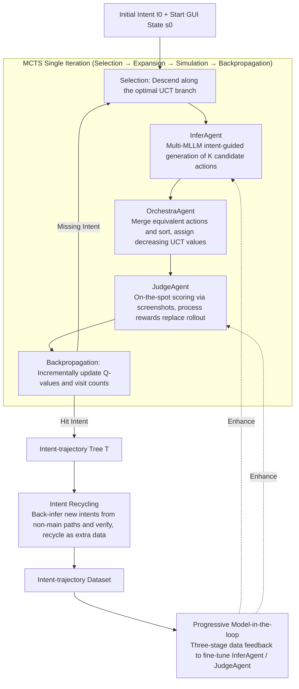

# M²-Miner: Multi-Agent Enhanced MCTS for Mobile GUI Agent Data Mining

**Conference**: ICLR 2026  
**arXiv**: [2602.05429](https://arxiv.org/abs/2602.05429)  
**Code**: Coming soon  
**Area**: LLM Agent  
**Keywords**: GUI Agent, MCTS, Data Mining, Multi-agent Collaboration, Mobile Interaction

## TL;DR
Ours proposes M²-Miner, the first MCTS-based automatic data mining framework for mobile GUI agents. By employing a three-agent collaboration (InferAgent/OrchestraAgent/JudgeAgent), it improves mining efficiency by 64x. Combined with an intent recycling strategy to enrich intent diversity, the trained GUI agent achieves SOTA performance on multiple benchmarks.

## Background & Motivation
**Background**: GUI agents automate software application operations by understanding user intents and executing action sequences on graphical interfaces, identifying a hot direction in both academia and industry. The core dependency of current GUI agents is high-quality intent-trajectory training data.

**Limitations of Prior Work**:
   - **High Cost**: Manual labeling (e.g., AITW, AndroidControl) requires hours per data point, with costs as high as $0.36/image.
   - **Low Quality**: Manually labeled and automatically mined data often contain redundant steps, ambiguous intent descriptions, and biased operation paths.
   - **Low Diversity**: Existing datasets adopt an intent-to-flat-trajectory structure, where each intent records only a single successful path, resulting in monotonous intent types.

**Key Challenge**: Manual labeling provides controllable quality but lacks scalability. Existing automatic mining methods (e.g., AgentQ based on vanilla MCTS, OS-Genesis based on rule exploration) are inefficient, limited to web environments, or produce only single trajectories.

**Goal**: How to automatically mine high-quality and highly diverse mobile GUI interaction trajectory data at a low cost?

**Key Insight**: Introduce MCTS into mobile GUI data mining, noting that vanilla MCTS random expansion is extremely inefficient. The authors observe that: (a) the expansion phase needs intelligent guidance rather than random exploration; (b) the simulation phase can use process rewards instead of rollouts; (c) non-main paths in the search tree contain additional valuable intent-trajectory pairs.

**Core Idea**: MCTS + Three-agent collaboration (guided expansion + accelerated sorting + process evaluation) + intent recycling = efficient, high-quality, and highly diverse GUI data mining.

## Method

### Overall Architecture
M²-Miner uses MCTS as a backbone, taking an initial intent $I_0$ and an initial GUI state $s_0$ as inputs, and outputting an intent-trajectory tree $\mathcal{T}=(\mathcal{V},\mathcal{A},\mathcal{P},\mathcal{I})$ containing effective interaction trajectories $\tau=(s_0,a_0,s_1,\ldots)$. Each node in the tree contains a screenshot, action description, Q-value, visit count, and task completion status. The entire mining process executes the four MCTS phases (Selection → Expansion → Simulation → Backpropagation) in a loop: expansion is guided by InferAgent, ranking by OrchestraAgent, and simulation by JudgeAgent via process scoring. After searching a tree, non-main paths are recovered as extra data via intent recycling. The mined data is then fed back via progressive model-in-the-loop to fine-tune InferAgent and JudgeAgent, making subsequent mining increasingly powerful.

### Key Designs

Vanilla MCTS applied directly to mobile GUIs faces three fatal bottlenecks: random action sampling in the expansion phase has a extremely low probability of hitting correct operations; semantic duplication of clicks on the same interface causes the search tree to explode; and the simulation phase requires full rollouts to obtain rewards, which is prohibitively expensive. M²-Miner uses three specialized agents to address these issues and utilizes intent recycling to extract data from search tree remnants.

**1. InferAgent: Replacing Random Expansion with Intent-Guided Action Generation**

To address the low hit rate of random expansion, InferAgent reasons the $K$ most likely correct candidate actions at each node, considering the current GUI screenshot and target intent. To prevent candidate convergence, it calls multiple different MLLMs to broaden action space diversity and includes previously generated actions in the prompt to explicitly avoid repetition. Consequently, expanded branches are more likely to progress the task rather than wasting resources on invalid clicks.

**2. OrchestraAgent: Merging Equivalent Actions and Prioritizing Branches**

Even if actions are reasonable, semantically equivalent operations (e.g., clicking different coordinates on the same button) cause horizontal expansion. OrchestraAgent merges these equivalent actions and ranks candidates based on their likelihood of achieving the target intent. Ranking is implemented by framing candidates as a multi-choice question, allowing the MLLM to select the most promising one in each iteration, resulting in an ordered queue after $K-1$ queries. Sorted actions are assigned decreasing initial UCT values, ensuring the search prioritizes promising branches.

**3. JudgeAgent: Replacing Expensive Rollouts with Process Rewards**

The most expensive part of simulation is the rollout—one must complete the path to determine its value. JudgeAgent scores the GUI screenshot of a newly expanded node immediately: terminal nodes are given 1/0 for success/failure, while intermediate nodes have MLLM heads output "valid"/"invalid" logits, normalized via softmax to a reward probability $[0,1]$:

$$r_{\text{intermediate}} = \frac{\exp(logits_{\text{valid}})}{\exp(logits_{\text{valid}}) + \exp(logits_{\text{invalid}})}$$

After obtaining reward $R_i$, the node Q-value is updated incrementally:

$$Q_i = \frac{Q_{i-1} \times N_{i-1} + R_i}{N_{i-1}+1}$$

This allows immediate evaluation upon expansion, eliminating rollout overhead while retaining the MCTS backpropagation mechanism.

**4. Intent Recycling: Recovering Non-main Paths as Extra Data**

A single mining session identifies a path for one intent, but branches that do not reach the goal are often valid operations themselves. Intent recycling traverses all paths from the root to each node, using an MLLM-based intent recycling filter to evaluate path quality. For paths that pass, an MLLM back-infers a new intent, which is then verified by JudgeAgent to ensure the intent matches the trajectory. Thus, a single search tree evolves from "one intent, one path" to "one tree, multiple intents," adding diverse data without re-mining. For example, while mining for "checking routes," an accidental click on a "ride-hailing" button forms a valid "ride-hailing" trajectory that can be recycled.

**5. Progressive Model-in-the-loop: Growing Agent Capability with Data Complexity**

Since InferAgent and JudgeAgent capabilities determine mining quality, training adopts a three-stage progressive loop: Stage 1 mines basic intents (common services + conditional rewriting), Stage 2 upgrades to complex intents (functional combinations + retries on failed intents), and Stage 3 shifts to recycled intents (executing intent recycling on historical search trees). Data mined at each stage is immediately fed back to train these agents, creating a positive feedback loop where stronger agents mine more complex data.

## Key Experimental Results

### Main Results

| Model | AC-Low TP/SR | AC-High TP/SR | AITZ TP/SR | GUI-Odyssey TP/SR | CAGUI TP/SR |
|------|-------------|--------------|-----------|-------------------|-------------|
| GPT-4o | 74.3/19.4 | 66.3/20.8 | 70.0/35.3 | - | 3.67/3.67 |
| UI-TARS-7B* | 98.0/90.8 | 83.7/72.5 | 80.4/65.8 | 90.1/87.0 | 88.6/70.0 |
| OS-Genesis-7B | 90.7/74.2 | 66.2/44.5 | 20.0/8.5 | 11.7/3.6 | 38.1/14.5 |
| GUI-Owl-7B | 93.8/90.0 | 81.5/72.8 | 78.9/65.1 | 83.4/60.7 | 80.0/59.2 |
| **M²-Miner-7B (Ours)** | **97.5/93.5** | 81.8/**72.9** | **81.3/69.4** | **90.5/79.3** | **88.8/70.2** |

*UI-TARS-7B uses large-scale private manual annotations.

### Ablation Study

| Configuration | TP | SR | Description |
|------|----|----|------|
| Warm-up | 85.0 | 64.2 | Pre-trained on public data only |
| + Stage 1 (Basic Intent) | 86.5 | 67.3 | +3.1% SR |
| + Stage 2 (Complex Intent) | 87.6 | 69.1 | +1.8% SR |
| + Stage 3 (Recycled Intent) | 88.2 | 69.9 | +0.8% SR, Cumulative +5.7% |
| Act only | 85.2 | 66.8 | Action labels only |
| Act + Description | 88.2 | 69.9 | +3.1% SR |
| Act + Des + Preference | **88.8** | **70.2** | +3.4% SR |

### Key Findings
- **Exponential Efficiency Gain**: Compared to vanilla MCTS, M²-Miner achieves a 64x efficiency improvement for tasks of length 9. OrchestraAgent reduces redundant nodes during expansion, and JudgeAgent saves rollout costs during simulation.
- **18x Cost Reduction**: The M²-Miner-Agent dataset costs only $0.02 per image, compared to $0.36 for manually labeled datasets.
- **Higher Data Quality**: Human inspection of 100 random samples shows that M²-Miner's Data Quality Accuracy (DQA) is higher than that of manually labeled datasets (AC and AITZ).
- **Utility of Descriptions and Preferences**: Compared to using action labels alone, adding description information improves SR by 3.1%, and adding preference data increases it by another 0.3%.
- **Good Generalization to Unseen Scenarios**: On CAGUI (no training data), Qwen2.5-VL-7B trained on M²-Miner data improved SR from 55.2% to 70.2%.

## Highlights & Insights
- **Ingenious MCTS + Multi-Agent Paradigm**: The three agents—generation, sorting, and evaluation—precisely solve the three bottlenecks of vanilla MCTS in the GUI domain (random expansion, redundant nodes, expensive rollouts).
- **Creative Intent Recycling Design**: Transforming "failed" exploration paths into extra data sources solves both intent diversity and efficiency issues. This idea is transferable to other agent data collection scenarios.
- **Process Rewards Replacing Rollouts**: Using MLLM logit probabilities as intermediate rewards retains the theoretical advantages of MCTS while avoiding the high costs of complete simulations. This design serves as a reference for all MCTS+LLM systems.

## Limitations & Future Work
- Currently only verified on mobile; applicability to desktop and web environments is unexplored.
- OrchestraAgent uses a 72B model (Qwen2.5-VL-72B), which has high deployment costs.
- The quality of filtering and intent generation in intent recycling depends on MLLM performance, which may degrade for complex applications.
- Data scale (20k images, 2565 trajectories) still lags behind UI-TARS's private data.
- Model-in-the-loop training requires multiple mining-training cycles; actual engineering costs are not detailed.

## Related Work & Insights
- **vs AgentQ**: AgentQ pioneered MCTS for web data mining but is limited to parsable HTML and is inefficient. M²-Miner extends this to vision-driven mobile environments with multi-agent accelerated efficiency.
- **vs OS-Genesis**: OS-Genesis uses unsupervised rule interaction and reverse task synthesis. It requires no predefined tasks but suffers from low data quality (8.5% SR on AITZ). M²-Miner's structured MCTS search produces higher-quality trajectories.
- **vs UI-TARS**: UI-TARS uses large-scale private manual data. M²-Miner surpasses it in almost all SR metrics, demonstrating that automatic mining frameworks can exceed manual annotation.

## Rating
- Novelty: ⭐⭐⭐⭐⭐ The combination of MCTS, multi-agents, and intent recycling is a first in GUI data mining, with each component providing clear technical contributions.
- Experimental Thoroughness: ⭐⭐⭐⭐⭐ 5 benchmarks, multiple ablation groups (multi-agent/training strategies/data structure/training data), efficiency analysis, and cost comparison provide a complete picture.
- Writing Quality: ⭐⭐⭐⭐ Clear structure and rich illustrations, though some content is repetitive and the paper is long.
- Value: ⭐⭐⭐⭐⭐ Provides a highly valuable data production paradigm for the GUI agent community and proves that automatic mining can surpass manual annotation.

<!-- RELATED:START -->

## Related Papers

- [\[ICLR 2026\] FaSTA*: Fast-Slow Toolpath Agent with Subroutine Mining for Efficient Multi-turn Image Editing](fasta_fast-slow_toolpath_agent_with_subroutine_mining_for_efficient_multi-turn_i.md)
- [\[AAAI 2026\] Agent-SAMA: State-Aware Mobile Assistant](../../AAAI2026/llm_agent/agent-sama_state-aware_mobile_assistant.md)
- [\[ICLR 2026\] MobileRL: Online Agentic Reinforcement Learning for Mobile GUI Agents](mobilerl_online_agentic_reinforcement_learning_for_mobile_gui_agents.md)
- [\[CVPR 2026\] GUI-CEval: A Hierarchical and Comprehensive Chinese Benchmark for Mobile GUI Agents](../../CVPR2026/llm_agent/gui-ceval_a_hierarchical_and_comprehensive_chinese_benchmark_for_mobile_gui_agen.md)
- [\[ACL 2025\] GUI-explorer: Autonomous Exploration and Mining of Transition-aware Knowledge for GUI Agent](../../ACL2025/llm_agent/gui_explorer_autonomous.md)

<!-- RELATED:END -->
