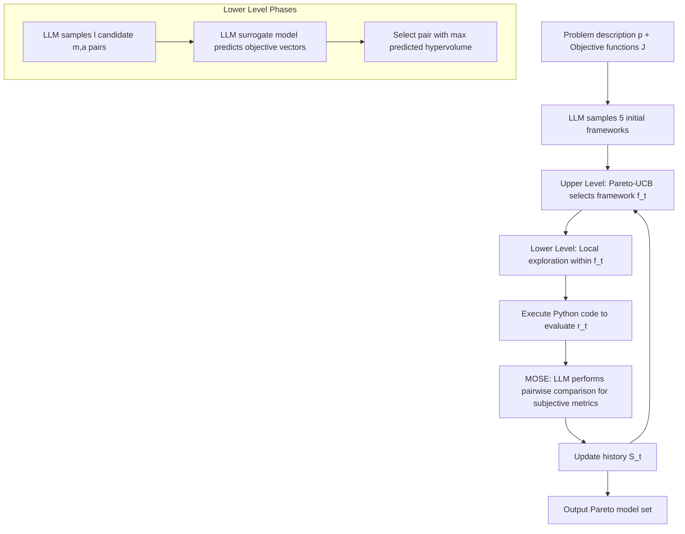

# MATHMO: Automated Mathematical Modeling Through Adaptive Search

**Conference**: ICLR 2026  
**OpenReview**: [https://openreview.net/forum?id=t2fZ2GOwAT](https://openreview.net/forum?id=t2fZ2GOwAT)  
**Code**: TBD  
**Area**: LLM Agent / Automated Mathematical Modeling / Multi-objective Search  
**Keywords**: Mathematical Modeling Automation, Bi-level Adaptive Search, LLM Search Operator, Pareto Frontier, Surrogate Model Evaluation, Subjective Preference Modeling  

## TL;DR
Mathematical modeling is formalized as a sequential decision-making problem under uncertainty. Using an LLM as a generation operator and surrogate evaluator, combined with a bi-level adaptive search that selects frameworks at the upper level and tunes models at the lower level, the system automatically produces a set of mathematical models forming a Pareto frontier across multiple (including subjective) objectives.

## Background & Motivation
Mathematical modeling—translating real-world phenomena into computable mathematical language—has long relied on manual expert iteration: selecting a class of methods (deep learning? integer programming? dynamical systems?), writing specific models, configuring algorithms for solving, and then revising based on results. This process is slow and has a high barrier to entry; automating it could significantly accelerate scientific discovery and lower the threshold for analytical modeling.

However, this task is difficult due to three inherent characteristics that conventional AutoML cannot handle. **First, fundamental uncertainty**: the optimal framework and model settings are unknown a priori and must be explored through a "modeling-testing-revision" feedback loop. **Second, naturally conflicting goals**: solution quality vs. runtime and accuracy vs. interpretability often involve trade-offs, requiring a Pareto frontier rather than a single "optimal model." **Third, subjective qualities are hard to quantify**: principles like Occam's razor, interpretability, and fit with domain knowledge affect a model's true value, but these "aesthetic" metrics are often framework-specific (e.g., sparsity in linear models $\neq$ complexity in symbolic regression) and cannot be directly compared across frameworks.

Existing works are either AutoML—searching within **pre-defined** narrow spaces (hyperparameters, neural architectures)—or "LLM-based math derivation," which **assumes the framework is known** (e.g., assuming a convex optimization or game theory model and only generating formulas).

> **Key Challenge**: Automated modeling requires searching in an open, nested, heterogeneous space that cannot be clearly defined by a DSL in advance, while balancing conflicting objectives and accommodating subjective preferences. Traditional search methods neither provide such a search space nor handle subjective evaluations.

> **Goal**: Given a modeling problem description and a set of objective functions, automatically discover a set of mathematical models that form an efficient trade-off (Pareto frontier) across these objectives.

> **Core Idea**: Decompose modeling into a sequential decision process of "framework $f \to$ model $m \to$ algorithm $a$." Use an LLM as a "generation operator" capable of sampling from natural language/code spaces and as a "surrogate evaluator." Leverage the structural prior that "inter-framework differences > intra-framework differences" to design a **bi-level** search: the upper level uses Pareto-UCB to allocate exploration resources across frameworks, while the lower level performs local refinement via Bayesian-like optimization within a selected framework.

## Method

### Overall Architecture
MATHMO treats every modeling step as a decision within a structured search space $\Omega = \{(f, m, a)\}$, aiming to minimize a $k$-dimensional objective vector $J(m,a) = [J_1, \dots, J_k]^T$ to find Pareto non-dominated solutions. The key observation is that the number of high-level **frameworks** is much smaller than the combinations of specific models/algorithms, and performance differences **between frameworks** (e.g., exact solution vs. approximate heuristic) are typically much larger than differences **within** the same framework. Thus, the search is decomposed into two nested loops: the upper level decides "which framework to explore this round," and the lower level decides "which specific (model, algorithm) pair to test within that framework," with evaluation results updated in history $S$ to guide the next round.

### Key Designs

**1. Bi-level Adaptive Search: Separating "Paradigm Selection" from "Detail Tuning" to make feedback signals more useful.** Instead of searching blindly in the nested heterogeneous space $(f,m,a)$ with a flat strategy, MATHMO explicitly decouples upper-level framework decisions from lower-level model decisions. The upper level selects a framework $f_t = \arg\max_{f} \alpha(f; S_{t-1})$ in each round $t$, where $\alpha$ is a utility function measuring the value of exploring framework $f$ at that moment. The lower level seeks $(m_t, a_t) = \arg\max_{(m,a)} \beta_{f_t}(m,a; S^{f_t}_{t-1})$ within the selected framework. This split mirrors the cognitive process of human modelers. The benefits are twofold: frameworks often occupy different regions of the Pareto frontier, and explicit exploration can systematically uncover these trade-offs; meanwhile, modeling choices within the same framework are structurally similar, making feedback signals purer and more reusable.

**2. LLM as Search Operator: Replacing indefinable DSLs with pre-trained priors.** Since the object space for mathematical modeling is too diverse to write a complete DSL, MATHMO uses an LLM as the core operator in two roles. **Generation Sampler**: Frameworks are represented by text descriptions, and specific models/algorithms by executable Python code. The LLM samples frameworks $f \sim p_\theta(\cdot \mid p)$ conditioned on problem $p$, and specific implementations $(m,a) \sim p_\phi(\cdot,\cdot \mid p, f, S^f)$ conditioned on the framework and its history. **Surrogate Model**: To avoid executing every candidate, the LLM predicts objective values $\hat r \sim p_{SM}((m,a) \mid p, f, S^f)$ to filter candidates at low cost, similar to surrogate functions in Bayesian optimization. The implicit domain priors from pre-training on massive text and code allow the LLM to explore "reasonable and likely effective" modeling choices.

**3. Upper-level Pareto-UCB: Balancing multi-objective exploration-exploitation across frameworks.** Upper-level utility $\alpha$ is implemented using Pareto-UCB. For each framework $f$, empirical mean $\hat\mu_f$ and variance $\hat\sigma_f^2$ are estimated from history, and a UCB vector is calculated. The $j$-th objective component is:

$$\text{UCB}_{f,j} = \hat\mu_{f,j} + c\sqrt{\frac{\hat\sigma_{f,j}^2 \ln(N_{t-1})}{N_{f,t-1}}} + d\sqrt{\frac{\ln(N_{t-1})}{N_{f,t-1}}}$$

where $N_{f,t-1}$ is the number of times framework $f$ has been evaluated, $N_{t-1}$ is the total exploration steps, and $c,d$ control exploration rewards. Initially, each framework is assigned an infinite UCB to ensure it is explored at least once. The system takes the **non-dominated** subset of UCB vectors (the optimistic Pareto frontier frameworks) and randomly selects one for exploration. This balances frameworks that are currently high-performing with those that are under-explored and might contain new frontier regions.

**4. Lower-level Hypervolume Guidance + MOSE Subjective Evaluation: Directing local refinement and making "aesthetics" comparable.** The lower level is a three-phase Bayesian-like optimization: sample $l$ diverse candidate pairs using $p_\phi$, predict $k$-dimensional objective vectors using the surrogate model, and select the one with the maximum **predicted hypervolume**—$\text{HV}(\tilde m, \tilde a; r_\text{ref})$, which intuitively measures how much area the candidate dominates in the normalized objective space (referencing $1_k$). For **subjective objectives** like interpretability, MATHMO designs MOSE (Surrogate Model Of Subjective Evaluations). It maintains a fixed reference model set $M_\text{ref}$. When evaluating a new model, the LLM performs a **pairwise comparison** with each reference model (assigning 1 if better, 0 otherwise). The consensus score is $\hat r = \frac{1}{|M_\text{ref}|}\sum_i p_\text{MOSE}(m_t \succ m_i \mid p)$. Using pairwise preferences rather than absolute scores, inspired by RLHF, makes subjective qualities comparable across frameworks and reduces sensitivity to the choice of reference benchmarks.

## Key Experimental Results

**Task Setup**: 4 real-world modeling tasks (two prescriptive, two predictive): Traveling Salesman Problem TSP (Path cost ↓ vs. Run time ↓), Job Shop Scheduling JSS (Makespan ↓ vs. Run time ↓), Ecology (RMSE ↓ vs. Interpretability ↑), and Epidemiology (COVID-19 Italy data, RMSE ↓ vs. Interpretability ↑). 20 rounds per run, initial 5 frameworks, 300s limit per evaluation, MOSE reference set of 3 models, using gpt-4o-2024-05-13.

### Main Results: Framework-driven Trade-offs
MATHMO successfully discovers Pareto frontiers spanning multiple frameworks across all four tasks (Figure 2). A key phenomenon is that **different frameworks occupy different regions of the frontier**: in JSS/TSP, exact methods like mathematical optimization and constraint programming approach optimality but with high runtimes, while meta-heuristics or custom heuristics are faster but with lower solution quality. In Ecology/Epidemiology, time-series methods like Vector Autoregression offer strong prediction but low interpretability, whereas symbolic regression or rule-based models offer high interpretability. This validates the core hypothesis that cross-framework exploration is necessary for a complete trade-off frontier.

### Ablation Study (Hypervolume, higher is better)

| Variant | TSP | JSS | Ecology | Epidemiology | Relative Degradation |
|------|-----|-----|---------|--------------|----------|
| **MATHMO (Full)** | **0.998** | **0.994** | 0.992 | **0.967** | — |
| MATHMO-RAN (Random framework selection) | 0.972 | 0.948 | 0.992 | 0.939 | 2.55% |
| MATHMO-FLAT (No bi-level, flat search) | 0.987 | 0.945 | 1.000 | 0.792 | 5.85% |
| MATHMO-NAIVE (No surrogate/hypervolume guidance) | 0.977 | 0.973 | 0.894 | 0.713 | 10.10% |

### Key Findings
- **Surrogate guidance contributes most**: The NAIVE variant (w/o surrogate model + hypervolume selection) degrades by an average of 10.10%, showing that lower-level "predict then filter" is crucial for sample efficiency.
- **Bi-level structure is effective**: The FLAT variant degrades by 5.85% on average, dropping significantly on Epidemiology (from 0.967 to 0.792), proving the value of hierarchical exploration for difficult tasks.
- **Pareto-UCB outperforms random**: The RAN variant degrades by 2.55%, showing adaptive resource allocation is superior to uniform/random distribution.
- **MOSE correlates negatively with structural complexity**: MOSE interpretability scores negatively correlate with parameter count and permutation entropy (Spearman up to -0.68), indicating it captures the human intuition that "simpler = more interpretable."

## Highlights & Insights
- **Problem formalization is a contribution**: It is the first to explicitly define "automated mathematical modeling" as sequential decision-making under uncertainty (revisiting Box's Loop), turning the vague "art of modeling" into an optimizable multi-objective search problem.
- **Effective use of the structural prior**: The "inter-framework > intra-framework" prior provides theoretical motivation for the bi-level decomposition and explains why lower-level feedback signals can be reused effectively.
- **Engineering "subjective aesthetics"**: MOSE uses fixed reference sets and pairwise comparisons to map incomparable cross-framework subjective qualities into a consistent $[0,1]$ score, a key piece for handling mixed objectives like "accuracy vs. interpretability."
- **LLM triple role**: Acting as generator, surrogate evaluator, and subjective judge, the LLM bypasses both the "indefinable search space" and "expensive evaluation" bottlenecks.

## Limitations & Future Work
- **Reliability of surrogate evaluation**: Using LLMs to predict numerical values (like makespan/RMSE) is inherently biased. While hypervolume selection mitigates this, the impact of surrogate error on the final frontier needs deeper quantification.
- **Subjective evaluation is still LLM self-assessment**: MOSE uses gpt-4o to simulate human preference. While there is some expert alignment research, whether "LLM-perceived interpretability" equals "human-perceived interpretability" remains unvalidated at scale.
- **Scale and Cost**: 20 rounds with multiple LLM samplings, surrogates, and real executions (300s limit) involve significant LLM calls and computational overhead; cost/scalability was not systematically reported.
- **Limited task count**: The core experiments cover only 4 tasks (with some medical risk prediction added in the appendix). Framework libraries and problem diversity require larger-scale verification.
- **Single LLM dependency**: The system relies entirely on gpt-4o; robustness with weaker or different models is unknown.

## Related Work & Insights
- **vs. AutoML**: Traditional AutoML searches within pre-defined DSLs; MATHMO searches an open, cross-paradigm mathematical model space, replacing DSLs with LLM priors.
- **vs. LLM for Math Formulas**: Previous work assumed a known framework; MATHMO includes framework selection in the search.
- **vs. LLM as Optimizer/Search Operator**: Follows the line of LLMs as zero-order optimizers, reward function search (Eureka), and symbolic/algorithm discovery (FunSearch), but embeds it into a multi-objective, bi-level framework with subjective preferences.
- **Inspiration**: This "LLM Generation + LLM Surrogate + Explicit Exploration-Exploitation" paradigm can be migrated to any scenario where search spaces are hard to define, evaluations are expensive, and multi-objective/subjective trade-offs exist (e.g., experimental design, material formulation, algorithm engineering).

## Rating
- **Novelty**: ⭐⭐⭐⭐⭐ First to formalize automated modeling as sequential decision-making with a bi-level adaptive search.
- **Experimental Thoroughness**: ⭐⭐⭐⭐ Core tasks cover prescriptive/predictive types with clear ablation; however, total task count and cost analysis are somewhat light.
- **Writing Quality**: ⭐⭐⭐⭐⭐ Highly logical sequence from motivation to formalization, priors, method, and experiments.
- **Value**: ⭐⭐⭐⭐⭐ Opens a new direction for automated modeling and scientific discovery with broad transplantable utility.

<!-- RELATED:START -->

## Related Papers

- [\[ICLR 2026\] WebSeer: Training Deeper Search Agents through Reinforcement Learning with Self-Reflection](webseer_training_deeper_search_agents_through_reinforcement_learning_with_self-r.md)
- [\[ICLR 2026\] Modeling Others' Minds as Code](modeling_others_minds_as_code.md)
- [\[ICLR 2026\] TaskCraft: Automated Generation of Agentic Tasks](taskcraft_automated_generation_of_agentic_tasks.md)
- [\[ICLR 2026\] MC-Search: Evaluating and Enhancing Multimodal Agentic Search with Structured Long Reasoning Chains](mc-search_evaluating_and_enhancing_multimodal_agentic_search_with_structured_lon.md)
- [\[ICLR 2026\] WebFactory: Automated Compression of Foundational Language Intelligence into Grounded Web Agents](webfactory_automated_compression_of_foundational_language_intelligence_into_grou.md)

<!-- RELATED:END -->
