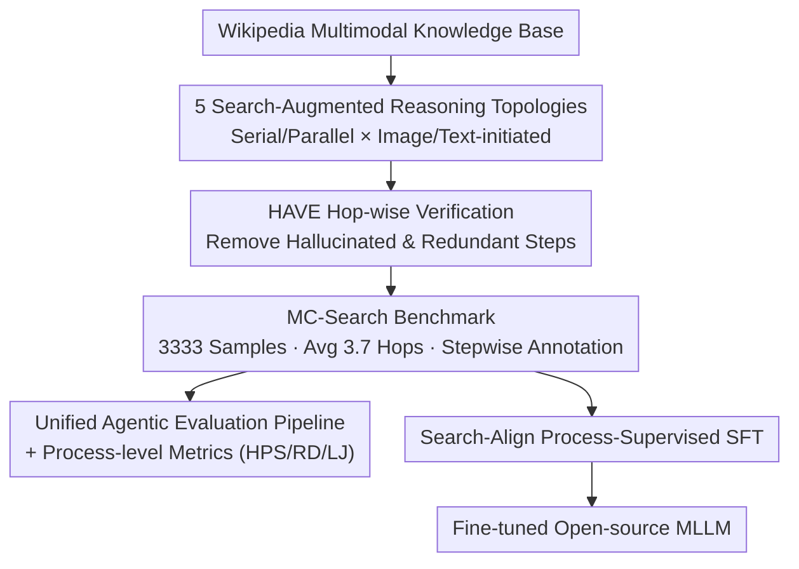

# MC-Search: Evaluating and Enhancing Multimodal Agentic Search with Structured Long Reasoning Chains

**Conference**: ICLR 2026  
**arXiv**: [2603.00873](https://arxiv.org/abs/2603.00873)  
**Code**: [https://mc-search-project.github.io](https://mc-search-project.github.io)  
**Area**: LLM Agent  
**Keywords**: Multimodal RAG, Agentic Search, Multi-hop Reasoning, Process-level Evaluation, Retrieval Augmented Reasoning

## TL;DR
This paper proposes MC-Search, the first benchmark for agentic multimodal RAG, featuring 3,333 high-quality samples (averaging 3.7 hops) across 5 reasoning topologies. It ensures the necessity of each step through HAVE verification and introduces the Search-Align process-level supervised fine-tuning framework, significantly enhancing the retrieval planning capabilities of open-source models (Qwen2.5-VL-7B F1 increases by +13.7).

## Background & Motivation
**Background**: Multimodal Large Language Models (MLLMs) are evolving from fixed "retrieve-then-generate" paradigms toward more complex agentic Multimodal Retrieval-Augmented Generation (MM-RAG). Models must iteratively decompose queries, adaptively retrieve across modalities, and integrate multimodal evidence.

**Limitations of Prior Work**: Existing MM-RAG benchmarks have three key limitations: (a) most use simple QA formats that compress multimodal evidence into pure text channels (e.g., MRAG); (b) they only evaluate shallow 1-2 hop retrieval, lacking long reasoning chains (e.g., Dyn-VQA); (c) they lack step-by-step annotations and explicit reasoning topologies, preventing analysis of the roles different modalities play in reasoning.

**Key Challenge**: Real-world queries are often ambiguous and complex, requiring multi-step, cross-modal, and knowledge-intensive reasoning. However, no suitable benchmark exists to evaluate whether MLLMs can truly perform long-chain, structured multimodal search reasoning.

**Goal**: (a) Construct the first multimodal agentic RAG benchmark supporting long reasoning chains (≥4 hops); (b) Provide step-by-step annotations and multiple reasoning topologies; (c) Design process-level evaluation metrics; (d) Utilize verified reasoning chains to improve open-source models.

**Key Insight**: Building multimodal knowledge clusters from Wikipedia and designing 5 representative reasoning topologies (serial/parallel, image-initiated/text-initiated, multi-image fork, etc.). HAVE filtering is used to ensure each reasoning step is both necessary and non-redundant.

**Core Idea**: Long-chain multi-hop + 5 reasoning topologies + HAVE verification + process-level metrics + Search-Align fine-tuning = Comprehensive evaluation and enhancement of agentic MM-RAG.

## Method

### Overall Architecture
MC-Search aims to answer whether MLLMs can perform long-chain, cross-modal, and structured retrieval reasoning. The work is divided into two parts. The first is benchmark construction: building a hybrid text-image multimodal knowledge base from Wikipedia, generating multi-hop QA based on 5 preset topologies, and using HAVE to filter out "plausible but useless" steps. This results in 3,333 high-quality samples with an average of 3.7 hops, including annotations for modalities, evidence, and intermediate answers. The second part is evaluation and training: all models are tested on a unified agentic MM-RAG pipeline using process-level metrics, and verified reasoning chains are fed into Search-Align to fine-tune open-source models.

### Key Designs

**1. 5 Search-Augmented Reasoning Topologies: Decomposing "Multi-hop" into Analyzable Structures**

Existing benchmarks either have only 1-2 hops or do not distinguish between reasoning forms. MC-Search formalizes a reasoning chain as $\mathcal{G}(Q,A) = \{(q_t, m_t, r_t, a_t)\}_{t=1}^{T}$, where $q_t$ is the sub-question at step $t$, $m_t$ is the retrieval modality, $r_t$ is the retrieved evidence, and $a_t$ is the intermediate answer. Five topologies are defined: (i) Image-Initiated Chain; (ii) Text-Initiated Chain; (iii) Parallel Image-Text Fork; (iv) Multi-Images Fork; and (v) Text-Only Chain. These structures cover the main combinations of "serial/parallel" and "image/text-initiated," enabling per-topology diagnosis of model weaknesses.

**2. HAVE Hop-wise Attribution and Verification of Evidence: Ensuring Every Hop counts**

Long chains automatically generated by LLMs often suffer from hallucinated steps (no evidence support) and redundant steps (removal does not affect the answer). HAVE performs a double check. First, it calculates direct utility by measuring the drop in F1 score when evidence $r_t$ is removed from the context:

$$\text{Util}(t) = \text{F1}(\mathcal{C}) - \text{F1}(\mathcal{C} \setminus r_t)$$

Second, it checks the navigation role: $\text{Nav}(t)=1$ if the intermediate answer entity appears in a downstream sub-question. A step is only removed if $\text{Util}(t)$ is below a threshold **and** $\text{Nav}(t)=0$.

**3. Unified Agentic Evaluation Pipeline and Process-level Metrics: Pinpointing Errors**

To ensure fair comparison, MC-Search uses a unified iterative pipeline: each round, the model generates a sub-query, selects a retrieval action (text search / image search / reverse image search), retrieves top-1 evidence, generates a sub-answer, and decides whether to continue. Three process-level metrics are introduced: Hit per Step (HPS) measures the ratio of gold reasoning steps covered by the predicted graph; Rollout Deviation (RD) measures the step count difference:

$$\text{RD} = \big|\,|\hat{\mathcal{G}}| - |\mathcal{G}|\,\big|$$

LLM-as-a-Judge (LJ) provides a score based on answer accuracy, reasoning coherence, entity coverage, and step alignment.

**4. Search-Align Process-Supervised Fine-Tuning: Feeding Verified Chains Back to Models**

Search-Align uses step-level supervision. Reasoning graphs verified by HAVE are rewritten into dialogue formats where the assistant handles sub-questions and reasoning, while the user returns retrieval results. Gemini-2.5-Flash is used to supplement each hop with reasoning thoughts to bridge steps. Open-source MLLMs are fine-tuned on these traces to learn what to search, which modality to use, and how to integrate evidence.

### Loss & Training
Search-Align employs standard next-token prediction loss for supervised fine-tuning on conversational reasoning traces using the 3,333 reasoning chains verified by HAVE.

## Key Experimental Results

### Main Results (Example: Image-Initiated Chain Topology)

| Model | F1(↑) | ΔF1(↑) | LJ(↑) | HPS(↑) | RD(↓) | Golden F1 |
|-------|-------|--------|--------|---------|-------|-----------|
| GPT-4o-Mini | 36.49 | 34.18 | 2.63 | 27.51 | 1.46 | 68.29 |
| Gemini-2.5-Flash | 44.10 | 37.38 | 3.01 | 31.46 | 2.91 | 72.39 |
| Gemini-2.5-Pro | **47.61** | **42.76** | **3.18** | 25.90 | 1.05 | 69.83 |
| Claude-3.7-Sonnet | 37.80 | 33.09 | 2.60 | 27.31 | 1.18 | 72.62 |
| InternVL3.5-8B | 39.11 | 29.49 | 2.27 | 22.59 | 1.58 | - |
| + Search-Align | 42.27 | 32.65 | 2.53 | **32.49** | **0.94** | 63.86 |
| Qwen2.5-VL-7B | 26.30 | 8.65 | 1.34 | 16.51 | 4.04 | - |
| + Search-Align | 45.70 | 28.05 | 2.23 | **33.59** | **0.70** | 60.95 |

### Ablation Study (Modality Coverage Analysis)

| Query Type | Modality | Gemini-2.5-Pro Coverage | InternVL-3.5-8B Coverage |
|------------|----------|-------------------------|--------------------------|
| Multi-modal Query | Image | 87.35% | 63.84% |
| Multi-modal Query | Text | 78.61% | 82.67% |
| Text-only Query | Image | **29.50%** | **0.66%** |
| Text-only Query | Text | 83.55% | 89.78% |

### Key Findings
- **Search-Align is highly effective**: Qwen2.5-VL-7B F1 increased by +13.7, HPS by +16.0, and RD decreased by 3.1, nearly matching Gemini-2.5-Pro.
- **Parallel Image-Text Fork is the hardest**: Models achieved the lowest F1 and HPS on this topology.
- **Severe Modality Bias**: InternVL's image retrieval coverage dropped from 63.84% to 0.66% when queries lacked explicit image cues, indicating a strong text bias.
- **Performance Drops with Chain Length**: Performance degrades sharply on 4-5 hop chains due to compounding retrieval errors and unstable planning.
- **Moderate Over-retrieval is Beneficial**: Retrieving 1-2 extra steps usually improves accuracy, but over-retrieval by ≥4 steps introduces noise.
- **Bottleneck in Retrieval Planning**: Primary errors include Retrieval-Failure (84.7%), Hallucinated Entity (75.8%), and Step-Omission (74.3%).

## Highlights & Insights
- **Systematic Reasoning Topologies**: Defining a full combination space of serial/parallel × image/text provides a clear analytical framework.
- **Clever HAVE Mechanism**: Balancing necessity and navigation ensures high-quality reasoning chains.
- **Diagnostic Process-level Metrics**: HPS and RD help determine if a model is "under-retrieving" or "over-retrieving."
- **Insight into Modality Bias**: The discovery that models rarely choose image retrieval without explicit cues reveals a lack of active modality selection capability.

## Limitations & Future Work
- The knowledge base is limited to Wikipedia and does not cover specialized domains like science or math.
- Data generation depends on Gemini-2.5-Flash, potentially introducing model-specific biases.
- Evaluation is limited to 6 MLLMs.
- Search-Align currently uses SFT only, without exploring RL or DPO.
- Top-1 retrieval constraints may be too strict compared to real-world applications.

## Related Work & Insights
- **vs MMSearch**: MMSearch focuses on 1-hop search engine results; MC-Search focuses on long-chain multi-hop reasoning.
- **vs WebQA**: WebQA has ≤2 hops and lacks step-wise annotations.
- **vs Agentic RAG (e.g., ReAct-style)**: Most systems target pure text; MC-Search extends agentic RAG to multimodal scenarios.

## Rating
- Novelty: ⭐⭐⭐⭐⭐ First long-chain multimodal agentic RAG benchmark with systematic topologies.
- Experimental Thoroughness: ⭐⭐⭐⭐ Extensive analysis across multiple dimensions, though model coverage could be broader.
- Writing Quality: ⭐⭐⭐⭐ Clear structure and formalization, though highly dense.
- Value: ⭐⭐⭐⭐⭐ Provides essential infrastructure for the multimodal agentic search field.

<!-- RELATED:START -->

## Related Papers

- [\[ACL 2026\] Rethinking Reasoning-Intensive Retrieval: Evaluating and Advancing Retrievers in Agentic Search Systems](../../ACL2026/llm_agent/rethinking_reasoning-intensive_retrieval_evaluating_and_advancing_retrievers_in_.md)
- [\[ICLR 2026\] Unlocking Long-Horizon Agentic Search with Large-Scale End-to-End RL](unlocking_long-horizon_agentic_search_with_large-scale_end-to-end_rl.md)
- [\[ICLR 2026\] MMSearch-Plus: Benchmarking Provenance-Aware Search for Multimodal Browsing Agents](mmsearch-plus_benchmarking_provenance-aware_search_for_multimodal_browsing_agent.md)
- [\[ACL 2026\] BAPO: Boundary-Aware Policy Optimization for Reliable Agentic Search](../../ACL2026/llm_agent/bapo_boundary-aware_policy_optimization_for_reliable_agentic_search.md)
- [\[CVPR 2026\] HAVEN: Hierarchical Long Video Understanding with Audiovisual Entity Cohesion and Agentic Search](../../CVPR2026/llm_agent/haven_hierarchical_long_video_understanding_with_audiovisual_entity_cohesion.md)

<!-- RELATED:END -->
