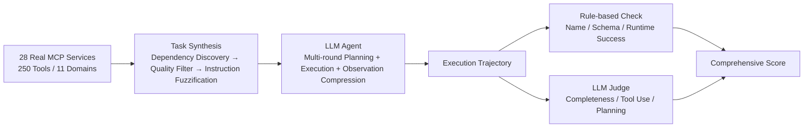

# MCP-Bench: Benchmarking Tool-Using LLM Agents with Complex Real-World Tasks via MCP Servers

**Conference**: ICLR 2026  
**OpenReview**: [https://openreview.net/forum?id=fe8mzHwMxN](https://openreview.net/forum?id=fe8mzHwMxN)  
**Code**: [https://github.com/Accenture/mcp-bench](https://github.com/Accenture/mcp-bench)  
**Area**: LLM Agent / Tool Use / Benchmark  
**Keywords**: MCP, Tool-using Agents, Multi-hop Planning, Cross-service Orchestration, LLM-as-a-Judge, Task Synthesis  

## TL;DR
MCP-Bench connects agents to 28 real-world production-grade MCP services (totaling 250 tools across 11 domains such as finance, research, and travel). By utilizing automatically synthesized complex tasks characterized by "fuzzy instructions, multi-objectives, and cross-domain dependencies," combined with a dual-layer evaluation of "rule-based checking + LLM-as-a-Judge," it systematically exposes the genuine deficiencies of 20 mainstream LLMs in long-term planning and dependency reasoning.

## Background & Motivation
- **Background**: LLM tool agents have become capable of interpreting natural language, planning multi-step processes, and invoking external tools, leading to deployment in real-world scenarios like travel, healthcare, and finance. Measuring these capabilities requires robust tool-use benchmarks.
- **Limitations of Prior Work**: Early benchmarks like ToolBench and BFCL v3 aggregate a large number of APIs, but these APIs often have isolated functions with inputs and outputs that are difficult to connect naturally, causing tasks to degrade into "isolated steps" or "manually spliced fake pipelines." While $\tau$-Bench selects a small set of relatively compatible APIs, it only covers two domains, limiting task diversity. Recent MCP-based benchmarks like MCP-RADAR and MCPEval use standardized protocols but only connect to a few services with dozens of tools at most. Their workflows are often short (e.g., retrieve once and summarize), and **tasks explicitly state the execution steps**, failing to challenge agents to infer which tools to use when instructions are vague.
- **Key Challenge**: Real-world tool use is filled with complexities like "fuzzy instructions, multiple goals, cross-domain dependencies, and the need for evidence collection based on intermediate results." Existing benchmarks fail to measure these due to their reliance on "explicit tool names + shallow few-step processes + isolated single-domain operations," leading to high leaderboard scores that mask true planning flaws.
- **Goal**: To construct a large-scale, ecosystem-level, and realistic tool-use benchmark that covers sufficient real-world tools and dependency chains while removing "hand-holding" execution instructions, supported by an evaluation framework that distinguishes "execution correctness" from "reasoning quality."
- **Core Idea**: **Real Ecosystem + Fuzzified Tasks + Dual-layer Evaluation**. Directly integrate 28 real MCP services exposing 250 complementary tools. Synthesize multi-hop tasks by automatically discovering dependency chains from tool I/O signatures, rewrite tasks into "fuzzy variants" containing only high-level goals, and finally score them using rule-based checks combined with rubric-driven LLM judges.

## Method

### Overall Architecture
MCP-Bench follows a pipeline of "Service Collection → Task Synthesis → Agent Execution → Dual-layer Evaluation." It integrates 28 real MCP services to form a tool ecosystem. Then, o4-mini automatically synthesizes and fuzzifies tasks based on tool dependency chains. Tested agents produce execution trajectories through multi-round interactions, which are finally scored by a combination of rule-based metrics and LLM judges. The evaluation focuses on the entire "Planning—Execution—Evidence" trajectory rather than single calls.

### Key Designs

**1. Real MCP Ecosystem and Distractor Services: Using "Natural Tool Sets" as Stressors**. Unlike stitching isolated APIs together, MCP-Bench integrates 28 production-grade MCP services. Tools within each service are designed to work together (e.g., a scientific computing service includes data loading, matrix operations, and visualization), naturally forming intra-service dependency chains. The MCP protocol standardizes cross-service schemas, enabling multi-hop workflows. Crucially, each task is **assigned 10 additional distractor services**, forcing the agent to face over 100 redundant tools to test its ability to retrieve correct tools. The benchmark is formalized as a POMDP tuple $(S, A, O, T, R, U, \Sigma)$, where $\Sigma=\{\sigma_1,\dots,\sigma_n\}$ is the set of available services, each $\sigma_i$ exposes a toolset $T_i$, and a structured call is denoted as $a_{\text{tool}}=\langle\sigma_i, \text{tool\_name}, \text{parameters}\rangle$.

**2. Multi-round Plan-Execute-Compress Execution Paradigm**. The agent employs multi-round decision-making: at round $t$, a planning strategy $\pi_{\text{plan}}(s_t)$ produces a tool plan $a_t$ (which may contain parallel calls) based on prior observations. An execution strategy $\pi_{\text{exec}}(a_t)$ invokes the tools to get observation $o_t$, and a compression strategy $\pi_{\text{compress}}(o_t)$ summarizes lengthy tool outputs. This compression is vital as real tools often return verbose data that could exceed context windows. The compressed pair $(a_t, o_t)$ is recorded in the trajectory, updating the state $s_{t+1}$ until a termination signal is given or $T_{\max}=20$ rounds are reached. Finally, $\pi_{\text{final}}(u, \text{trajectory})$ generates an answer. This supports both "one-shot global planning" and "step-by-step" paradigms.

**3. Three-stage Task Synthesis: Growing Real Tasks from Tool Signatures**. The core challenge is turning real tools into solvable, structured, yet difficult tasks. This is achieved in three steps: First, **dependency chain discovery** analyzes sequences where upstream outputs naturally flow into downstream inputs, uncovering both inherent internal dependencies and meaningful scenario-based dependencies (with an emphasis on cross-service links). Second, **automated quality filtering** scores tasks on "solvability" and "utility," applying hard thresholds (9.0/10 and 5.0/10, respectively) to ensure quality over quantity. Third, **task fuzzification** rewrites instructions with explicit steps into high-level natural business requests, forcing the agent to infer the tool sequence. For domains requiring precision (e.g., scientific computing), fuzzy variants **retain all numerical values and specific parameters** to ensure mathematical solvability. This resulted in 56 single-service, 30 dual-service, and 18 triple-service tasks, all manually reviewed.

**4. Dual-layer Evaluation: Rule-based + LLM Judge**. The rule layer extracts three objective metrics: Tool Name Validity $R_{\text{valid}}$ (penalizing hallucinated tools), Schema Compliance $C_{\text{schema}}$ (checking parameter types), and Execution Success Rate $R_{\text{success}}$ (checking for runtime errors). The LLM Judge (defaulting to o4-mini) scores along three axes: Task Completion Quality (goal attainment, evidence, relevance), Tool Use Quality (appropriateness, parameter accuracy), and Planning Effectiveness (dependency awareness, parallelism, efficiency). Each sub-dimension is scored 1–10 and normalized to $[0,1]$. To combat rubric order sensitivity, the authors use **Prompt Shuffling** to randomly permute the order of evaluation axes and sub-dimensions (maintaining semantics). Each task is run with 5 independent shuffles and averaged to significantly reduce variance.

## Key Experimental Results

### Main Results (Leaderboard, Average across Single/Multi-service)

| Model | Tool Name Validity | Schema Compliance | Execution Success | Total Score |
|---|---|---|---|---|
| gpt-5 | 100.0% | 99.3% | 99.1% | **0.749** |
| o3 | 99.3% | 99.9% | 97.1% | 0.715 |
| gpt-oss-120b | 97.7% | 98.8% | 94.0% | 0.692 |
| gemini-2.5-pro | 99.4% | 99.6% | 96.9% | 0.690 |
| claude-sonnet-4 | 100.0% | 99.8% | 98.8% | 0.681 |
| qwen3-235b-a22b-2507 | 99.1% | 99.3% | 94.8% | 0.678 |
| glm-4.5 | 99.7% | 99.7% | 97.4% | 0.668 |
| gpt-4o | 98.9% | 98.3% | 92.8% | 0.595 |
| llama-3-1-8b-instruct | 96.1% | 89.4% | 90.9% | 0.428 |

### Key Findings
- **Basic Execution has Converged**: Strong models (o3, gpt-5, gpt-oss-120b, etc.) generally exceed 98% in Schema Compliance and Tool Name Validity; this layer is no longer a primary differentiator.
- **High-level Reasoning is the Watershed**: The gap in total scores stems mainly from planning and dependency reasoning. gpt-5 (0.749) leads, while llama-3-1-8b (0.428) lags significantly in dependency awareness and parallelism, despite a reasonable execution success rate.
- **Parallelism and Efficiency are the Weakest Links**: Even the strongest model, gpt-5, scores only 0.339 in Parallelism & Efficiency (o3 is 0.359), indicating all models struggle to identify parallel opportunities and reduce redundant calls.
- **Multi-service Tasks are Harder**: Weaker models degrade more noticeably in cross-service settings, confirming that cross-domain orchestration is a primary source of real-world complexity.

## Highlights & Insights
- **The "Real Ecosystem" approach** is the soul of this benchmark. Using production MCP services ensures tools are naturally grouped and dependent, avoiding the artificial nature of manually spliced pipelines.
- **Fuzzified Tasks address the blind spots of older benchmarks**. Removing explicit tool names and steps transforms the task from "filling in the blanks" to "inferring tool sequences from vague needs," which is closer to real user queries.
- **Distractor Services + POMDP Formalization** turn tool retrieval into a quantifiable stress test rather than assuming the agent already knows which tools to use.
- **Prompt Shuffling + Averaging** is a pragmatic fix for order bias in LLM-as-a-Judge, improving evaluation reproducibility.

## Limitations & Future Work
- **Small Task Scale**: Only 104 tasks were included due to strict quality filtering (solvability 9.0, utility 5.0), which limits statistical robustness.
- **Reliance on LLM Judge**: Using o4-mini as the judge introduces the model's own capability limits and preferences; shuffling only mitigates positional bias, not fundamental bias.
- **Service Drift**: While connecting to "live" services is realistic, API changes or availability over time may affect long-term reproducibility.
- **Synthesis + Human Audit Cost**: The process for task synthesis and manual review is heavy, making it difficult to scale to more domains or longer tasks.
- **Future Work**: Plans to expand to more domains, longer horizons, tasks with real failures/retries, and exploring evaluation methods that reduce dependence on a single judge.

## Related Work & Insights
- **API Tool Benchmarks**: ToolBench and BFCL v3 aggregate isolated APIs; $\tau$-Bench introduces simulated users but has narrow domains; C3-Bench tests tool dependency reasoning. Their common limitation is a reliance on custom toolsets and a lack of a real ecosystem.
- **MCP Benchmarks**: MCP-RADAR, MCPWorld, and MCPEval pioneered MCP-standardized interaction but feature fewer services, require manual setup, and have shorter tasks. MCP-Bench extends these in scale (28 services/250 tools) and complexity (cross-service multi-hop, fuzzy instructions).
- **Agent Evaluation**: AgentBench and WebArena test decision-making and planning, often relying on manual toolsets. This work's approach of treating "naturally grouped tools" as a source of complexity is a noteworthy design direction.

## Rating
- **Novelty**: ⭐⭐⭐⭐ — The combination of real MCP ecosystem, automatic dependency chain synthesis, task fuzzification, and distractor services pushes tool benchmarking toward ecosystem-level realism.
- **Experimental Thoroughness**: ⭐⭐⭐⭐ — Evaluated 20 mainstream LLMs across single/multi-service settings with dual-layer metrics and robustness checks, though the task count (104) is relatively small.
- **Writing Quality**: ⭐⭐⭐⭐ — Clear POMDP formalization, well-structured synthesis stages, and detailed sub-dimension comparisons make it highly readable.
- **Value**: ⭐⭐⭐⭐⭐ — Directly addresses the problem of leaderboard scores masking planning flaws, providing a standardized and scalable platform for realistic agent evaluation.

<!-- RELATED:START -->

## Related Papers

- [\[ICLR 2026\] OSWorld-MCP: Benchmarking MCP Tool Invocation in Computer-Use Agents](osworld-mcp_benchmarking_mcp_tool_invocation_in_computer-use_agents.md)
- [\[ICLR 2026\] Terminal-Bench: Benchmarking Agents on Difficult, Real-World Tasks in the Command Line Interface](terminal-bench_benchmarking_agents_on_hard_realistic_tasks_in_command_line_inter.md)
- [\[ICLR 2026\] MCP Security Bench (MSB): Benchmarking Attacks Against Model Context Protocol in LLM Agents](mcp_security_bench_msb_benchmarking_attacks_against_model_context_protocol_in_ll.md)
- [\[ICLR 2026\] VitaBench: Benchmarking LLM Agents with Versatile Interactive Tasks in Real-world Applications](vitabench_benchmarking_llm_agents_with_versatile_interactive_tasks_in_real-world.md)
- [\[ACL 2026\] MCP-Flow: Facilitating LLM Agents to Master Real-World, Diverse and Scaling MCP Tools](../../ACL2026/llm_agent/mcp-flow_facilitating_llm_agents_to_master_real-world_diverse_and_scaling_mcp_to.md)

<!-- RELATED:END -->
