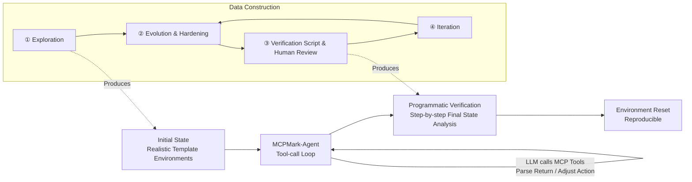

# MCPMark: A Benchmark for Stress-Testing Realistic and Comprehensive MCP Use

**Conference**: ICLR 2026  
**OpenReview**: [https://openreview.net/forum?id=uobROwBsJm](https://openreview.net/forum?id=uobROwBsJm)  
**Code**: [eval-sys/mcpmark](https://github.com/eval-sys/mcpmark) · [mcpmark.ai](https://mcpmark.ai)  
**Area**: LLM Agent / MCP / Benchmark  
**Keywords**: Model Context Protocol, Agent Benchmark, Tool Use, CRUD, Programmatic Verification, pass^4  

## TL;DR
MCPMark constructs 127 high-difficulty tasks across 5 types of realistic MCP environments (Notion / GitHub / Filesystem / PostgreSQL / Playwright), polished through expert-agent collaboration and accompanied by programmatic verification scripts. Emphasizing multi-step CRUD workflows, results show that even the strongest gpt-5-medium achieves only 52.56% pass@1 and 33.86% pass^4, significantly pushing the performance limits of current agents in realistic MCP usage.

## Background & Motivation
**Background**: The Model Context Protocol (MCP) standardizes how LLMs interact with external tools, APIs, databases, and resources, and is widely regarded as the infrastructure layer of the "agent era"—providing models with "eyes and hands" to act in real environments. Several evaluation benchmarks have emerged around MCP (MCPEval, LiveMCPBench, MCP-Universe, LiveMCP-101, etc.).

**Limitations of Prior Work**: These benchmarks are generally "narrow." Tasks are either read-heavy or have limited interaction depth, with an average of only 3–7 interaction turns. They cover simple task patterns and fail to replicate the complexity of "multi-step, stateful, planning-required" workflows in real-world scenarios.

**Key Challenge**: To determine whether current models are truly capable of handling real-world agent tasks, high-fidelity tasks that stress-test reasoning, planning, long-context processing, and tool use simultaneously are required. However, existing benchmarks either have restricted task patterns or rely on unreliable verification (LLM-as-judge), failing to probe the true performance boundaries of models. Furthermore, human-only task creation is too expensive, while pure agent-generated tasks are unreliable.

**Goal**: Develop a more realistic and comprehensive MCP evaluation benchmark—tasks must cover full CRUD (Create, Read, Update, Delete), run in real/mirrored container environments, be reliably and automatically verified via programmatic scripts, and be sufficiently challenging.

**Core Idea**:
- **Realistic Environments + Programmatic Verification**: Directly interface with official MCP servers and real APIs (not custom wrappers). Each task includes an "initial state + task instruction + verification script" triplet. After sandbox execution, scripts determine if all checks are met.
- **Human-AI Collaborative Data Creation**: Utilize a four-step pipeline (Exploration → Evolution → Verification → Iteration) involving "experts + creation agents + execution agents" to gradually increase task difficulty, realism, and verifiability.
- **pass^4 Primary Metric**: Use "four consecutive successful independent runs" as a strict metric to measure stability, which is closer to the reliability requirements of real-world deployment than pass@1 or pass@4.

## Method

### Overall Architecture
MCPMark consists of two parts: the **benchmark itself** (127 tasks, 38 carefully designed initial states across 5 MCP environments) and the **evaluation framework MCPMark-Agent** (a minimal, generalized tool-call loop agent). Each task starts from a realistic initial state. The MCPMark-Agent executes tool-call loops until the model stops calling tools, after which a programmatic verification script checks the final environment state and resets the environment for reproducibility.

### Key Designs

**1. Five types of realistic MCP environments + realistic initial states: Pushing "realism" to the limit.** Unlike previous work starting from "blank/minimal" environments, MCPMark meticulously constructs initial states based on real-use scenarios. Notion uses widely adopted templates for documents and databases; GitHub is sourced from repositories with real development history, CI/CD, issues, branches, PRs, and commit configurations; Filesystem simulates daily user directory structures; PostgreSQL features representative template databases with real schemas; Playwright includes both self-built pages (e.g., Cloudflare Turnstile login) and adapted localhost pages from WebArena. This design captures workflow complexity that SWE-Bench (realistic but single-domain) or AppWorld/WebArena (diverse but reliant on custom wrappers) cannot—where CI/CD runs on live repositories and database transactions take real effect.

**2. Human-AI collaborative four-step task construction pipeline: Solving the "human-expensive, agent-unreliable" dilemma.** Neither humans nor agents alone can batch-produce tasks that are "realistic + verifiable + difficult." Thus, a collaborative process involving experts, creation agents, and execution agents was designed: **① Exploration**—Experts guide creation agents through initial states to identify global and granular details; **② Evolution**—Creation agents propose new tasks or harden existing ones (lengthening input, increasing retrieval difficulty, increasing steps), while experts ensure tasks remain practical and verifiable; **③ Verification**—Creation agents draft programmatic scripts, and experts (assisted by execution agents) personally complete tasks and repeatedly run scripts for calibration; **④ Iteration**—Repeating ② and ③ to further increase difficulty. Despite agent assistance, 10 experts (CS PhDs, full-stack/AI infra engineers, etc.) spent 3–5 hours per task. All tasks underwent cross-review and a month of community auditing.

**3. CRUD-diverse + Programmatic verification: Creating a generational gap with existing benchmarks.** As shown in comparison tables, previous MCP benchmarks are either read-heavy/synthetic or rely on insufficiently rigorous LLM-as-judge verification, with 3–7 turn averages. MCPMark achieves full CRUD coverage, programmatic verification, and longer workflows (average 16.2 turns). The 127 tasks average 288.6 words in instructions and 209.8 lines of code in verification scripts, covering Notion nested attribute updates, GitHub commit/PR management, Playwright interactive form automation, and more.

**4. MCPMark-Agent: Deliberate "minimalism" to measure intrinsic capability.** The evaluation framework is built on LiteLLM and the MCP Python SDK. MCP servers are connected via the SDK, and tools are exposed to the agent. LiteLLM converts tools to OpenAI function-calling format and routes them to official APIs (preserving native capabilities like Anthropic's extended thinking). The agent executes a classic tool-call loop—iteratively calling tools and adjusting actions until completion. The framework intentionally avoids task-specific heuristics or model-specific optimizations (100-turn limit, 3600s timeout) to measure **intrinsic agentic capability** without bias. Interestingly, this simple iteration outperforms ReAct or Codex in this setting.

## Key Experimental Results

### Main Results: Model performance on 127 tasks
Pass@1 is the mean of 4 independent runs; FS=Filesystem, GH=GitHub, NT=Notion, PW=Playwright, PG=PostgreSQL.

| Model | FS | GH | NT | PW | PG | pass@1 | pass@4 | pass^4 |
|------|----|----|----|----|----|--------|--------|--------|
| **gpt-5-medium** | 57.50 | 47.83 | 41.96 | 43.00 | 76.19 | **52.56** | **68.50** | **33.86** |
| grok-4 | 50.83 | 14.13 | 2.68 | 35.00 | 58.33 | 31.69 | 44.88 | 18.11 |
| claude-opus-4.1 | 33.33 | 21.74 | 35.71 | 24.00 | 33.33 | 29.92 | – | – |
| claude-sonnet-4 | 27.50 | 16.30 | 21.43 | 26.00 | 53.57 | 28.15 | 44.88 | 12.60 |
| o3 | 35.83 | 14.13 | 24.11 | 15.00 | 36.90 | 25.39 | 43.31 | 12.60 |
| gemini-2.5-pro | 24.17 | 9.78 | 4.46 | 15.00 | 26.19 | 15.75 | 29.92 | 4.72 |
| gpt-4.1-nano | 0.00 | 0.00 | 0.00 | 0.00 | 0.00 | 0.00 | 0.00 | 0.00 |
| qwen3-coder-plus (SOTA Open) | 13.33 | 19.57 | 19.64 | 30.00 | 47.62 | 24.80 | 40.94 | 12.60 |
| kimi-k2-instruct | 14.17 | 16.30 | 8.04 | 30.00 | 47.62 | 21.85 | 31.50 | 12.60 |
| deepseek-v3.1 | 15.83 | 9.78 | 12.50 | 7.00 | 42.86 | 16.73 | 28.35 | 7.87 |
| glm-4.5 | 7.50 | 22.83 | 21.43 | 13.00 | 14.29 | 15.55 | 24.41 | 6.30 |

### Ablation Study: Reasoning effort

| Model | Reasoning | Overall pass@1 | GH | NT |
|------|-----------|---------------|----|----|
| gpt-5 | Low | 46.85 | 27.17 | 36.61 |
| gpt-5 | Medium | **52.56** | 47.83 | 41.96 |
| gpt-5 | High | 51.57 | 50.00 | **44.64** |
| gpt-5-mini | Low → High | 8.27 → 30.32 | 8.70 → 19.57 | 5.36 → 20.54 |
| gpt-5-nano | Low → High | 4.33 → 5.12 | 0 → 8.70 | 0 → 0.89 |
| claude-sonnet-4 | Low → High | 27.36 → 28.35 | 25.00 → 28.26 | 22.32 → 19.64 |

### MCP server / Framework comparison
- **Server Implementation**: When running GitHub via claude-sonnet-4, the KlavisAI server achieved 31.5% vs. 16.3% for the official one. On PostgreSQL, InsForge (54.8%) and Supabase (52.4%) both outperformed the official server (48.8%).
- **Agent Framework**: Simple iterative tool-calling (MCPMark-Agent, gpt-5-medium 52.6%) outperformed ReAct (37.8%) and Codex (36.2%).

### Key Findings
- **Frontier models are still suppressed**: The strongest gpt-5-medium achieves only 52.56% pass@1 and 33.86% pass^4. Most proprietary models fall within 15–30% pass@1, and many open-source models are < 10%. Average turns per task are 16.2.
- **"Environmental Gap" between Local and Remote**: Success rates for local services (PG/FS/PW) are significantly higher (e.g., gpt-5-medium at 76.19% on PG), while remote services (NT/GH) are mostly < 25%, likely due to scarce interaction trajectories and training coverage for remote APIs.
- **Stability lags behind capability**: pass@4 is often > 30%, but pass^4 frequently drops to 5–15%, indicating that doing it right "occasionally" is easy, but doing it right "consistently" is difficult—a major risk for deployment.
- **Explicit vs. Implicit Failures**: Implicit failures (task completed but failed verification) often exceed 50%; for gpt-5-high and kimi-k2, they exceed 80%.

## Highlights & Insights
- **The pass^4 metric is rigorous and appropriate**: It eliminates "luck" from sampling and directly evaluates consistency and stability, offering a better measure of whether a model can be trusted in production.
- **Benchmarks evaluate more than just models**: A single model's success rate can double depending on the MCP server implementation. Schema exposure, error messaging, and engineering details significantly impact agent success.
- **Scaffold structure can hinder performance**: The fact that ReAct/Codex underperform simple loops suggests that redundant constraints in realistic MCP setups may be counterproductive.
- **High-fidelity combination**: Combining real environments with programmatic verification avoids the unreliability of LLM-as-judge and the distortion of wrapper-simulated environments.

## Limitations & Future Work
- **MCPMark-Agent is intentionally minimal**: It lacks production-grade optimizations like memory, sub-task planning, or tool retrieval. Strengthening the scaffold is left for future work.
- **Scalability bottleneck**: While precise, 127 tasks across 5 environments are limited by high construction costs (3–5 expert hours per task).
- **Environmental gap reveals data issues**: Poor performance on remote services likely reflects a lack of training data rather than a lack of raw capability.
- **Small models overlooked**: Models ≤ 100B were mostly excluded as they failed to complete tasks, leaving a gap in characterizing small model capabilities.

## Related Work & Insights
- **Comparison with existing MCP benchmarks**: MCPMark leads in task diversity (CRUD), verification rigor (programmatic), and workflow length.
- **Relationship with general agent benchmarks (SWE-Bench / WebArena)**: MCPMark complements these by using official MCP servers and real APIs, capturing stateful workflow complexities that simulated wrappers cannot reproduce.
- **Insights**: ① Evaluation must shift from "occasional success" to "stable success" (the pass^k approach should be generalized); ② Agent bottlenecks reside not just in models but also in server engineering and scaffold design; ③ Scarcity of remote service data is a primary constraint for real-world agents.

## Rating
- **Novelty**: ⭐⭐⭐⭐ The combination of realistic MCP environments, programmatic verification, and human-AI collaborative construction is unique.
- **Experimental Thoroughness**: ⭐⭐⭐⭐⭐ Comprehensive analysis across 20+ models, reasoning effort ablation, and server/scaffold comparisons.
- **Writing Quality**: ⭐⭐⭐⭐ Clear structure with high information density in charts and well-summarized findings.
- **Value**: ⭐⭐⭐⭐⭐ Provides a high-fidelity, reproducible benchmark for realistic MCP workflows, offering direct guidance for model evaluation, server selection, and agent design.

<!-- RELATED:START -->

## Related Papers

- [\[ICLR 2026\] OSWorld-MCP: Benchmarking MCP Tool Invocation in Computer-Use Agents](osworld-mcp_benchmarking_mcp_tool_invocation_in_computer-use_agents.md)
- [\[ICLR 2026\] SCUBA: Salesforce Computer Use Benchmark](scuba_salesforce_computer_use_benchmark.md)
- [\[AAAI 2026\] SoMe: A Realistic Benchmark for LLM-based Social Media Agents](../../AAAI2026/llm_agent/some_a_realistic_benchmark_for_llm-based_social_media_agents.md)
- [\[ICLR 2026\] MCP Security Bench (MSB): Benchmarking Attacks Against Model Context Protocol in LLM Agents](mcp_security_bench_msb_benchmarking_attacks_against_model_context_protocol_in_ll.md)
- [\[ICLR 2026\] MCP-Bench: Benchmarking Tool-Using LLM Agents with Complex Real-World Tasks via MCP Servers](mcp-bench_benchmarking_tool-using_llm_agents_with_complex_real-world_tasks_via_m.md)

<!-- RELATED:END -->
