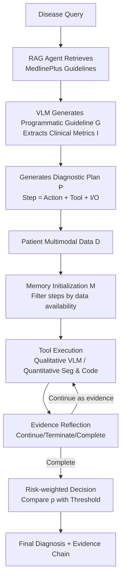

# MedAgent-Pro: Towards Evidence-based Multi-modal Medical Diagnosis via Reasoning Agentic Workflow

**Conference**: ICLR 2026  
**OpenReview**: [https://openreview.net/forum?id=ZOuU0udyA4](https://openreview.net/forum?id=ZOuU0udyA4)  
**Code**: TBD (Anonymous link provided in the reproducibility statement)  
**Area**: LLM/VLM Agent · Multimodal Medical Diagnosis  
**Keywords**: Medical Diagnosis, Agentic Workflow, RAG, Tool Use, Evidence-based Reasoning, VLM  

## TL;DR
MedAgent-Pro decomposes the modern clinical "evidence-based diagnosis" process into a two-layer agentic workflow: **disease-level standardized planning** and **patient-level step-by-step evidence reasoning**. It utilizes RAG to align with medical guidelines, employs vision/coding tools for quantitative analysis, and utilizes an evidence reflection mechanism to prune unreliable intermediate conclusions. This transforms VLMs from "empirical one-jump responders" into a diagnostic system that is "metric-driven, evidence-based, and traceable."

## Background & Motivation
- **Background**: Medical diagnosis is essentially a process of synthesizing multimodal patient data and performing step-by-step reasoning according to medical guidelines. VLMs and medical agents have recently integrated multimodal information into diagnosis, with medical VQA becoming the mainstream benchmark.
- **Limitations of Prior Work**: ① Conventional VQA is "one-jump QA," where VLMs directly output empirical conclusions without quantitative metrics or clinical evidence support. ② Reasoning models like GPT-o1/DeepSeek-R1 lack fine-grained visual perception and cannot perform quantitative analysis. ③ Existing medical agents **statically assemble** tools into fixed pipelines, failing to dynamically arrange tools according to specific diseases, which hinders reliable decision-making.
- **Key Challenge**: Clinical regulation requires **patient safety + evidence traceability**, but existing methods treat diagnosis as empirical one-jump QA, relying only on the internal knowledge of VLMs for qualitative judgment—fundamentally contradicting the "evidence-based diagnosis + structured reasoning + clinical metrics" emphasized in medical practice.
- **Goal**: To design a workflow aligned with modern medical principles that uses medical guidelines and quantitative analysis to provide traceable support for decision-making, covering universal diagnosis across multiple anatomical regions, modalities, and diseases.
- **Core Idea**: **[Hierarchical Simulation of Clinical Workflow]** Generate standardized diagnostic plans at the disease level and analyze personalized data step-by-step at the patient level. **[Evidence-Driven]** Every step relies on tool quantification and reflection verification to ensure that every conclusion is evidence-based.

## Method

### Overall Architecture
MedAgent-Pro uses a VLM $V$ as an orchestrator to construct a hierarchical reasoning workflow: **Disease-level Knowledge Planning** first uses a RAG agent to read medical guidelines and generate a disease-specific standardized diagnostic plan $P$. **Patient-level Evidence Reasoning** then, for each case, follows the plan to step-by-step invoke vision/coding tools for qualitative and quantitative analysis, dynamically adjusts memory through evidence reflection, and finally derives a diagnosis using risk weighting.

### Key Designs

**1. Disease-level RAG Planning: Standardizing "Diagnostic Steps" into Executable Plans using Guidelines.** Doctors formulate standardized processes based on guidelines. MedAgent-Pro brings this process into the planning stage using a RAG agent $R$. It builds a large knowledge base $K$ based on MedlinePlus (1,000+ diseases, 4,000+ expert guidelines certified by NIH/NLM) and improves efficiency through **two-step retrieval**: first filtering candidate subsets using metadata summaries (organs, diseases) of each article, then slicing the full text into 300-token chunks, storing them in a vector index with PubMedBERT embeddings, and retrieving the top-5 most relevant chunks. The VLM summarizes a programmatic guideline $G=V(R(K))$ based on this and further refines disease-specific clinical metrics $I=\{I_1,\dots,I_m\}$. Subsequently, it combines the action set $A$ (where each action $a$ is bound to a tool through a mapping $\psi(a)=t$, such as a segmentation model) to generate a diagnostic plan $P=P_1,\dots,P_n$. Each step follows the form $P_i: r_i = a_i(o_i),\ a_i\in A$, where $o_i/r_i$ can be the original image, intermediate segmentation masks, or final metrics. $P$ is stored in JSON, with each step containing an action $a_i$ (a fixed-behavior Python function in the toolset) and expected input/output data attributes—thus providing each disease with a standardized diagnostic process aligned with guidelines.

**2. Patient-level Tool Execution + Memory Initialization: Tailoring Plans by Data Availability and Delegating Quantitative Analysis to Specialized Tools.** Given personalized multimodal patient data $D$, the VLM first performs orchestration to select executable steps from $P$ and filters out steps lacking inputs to form long-term memory $M=\{P_i\in P\mid o_i\in D\}$ (Equation 2)—for instance, in glaucoma diagnosis, steps requiring OCT are skipped if only fundus images are available. During reasoning, the VLM checks current input data attributes; if they match some $o_i$, it executes the corresponding step: **Qualitative analysis** is completed directly by the VLM, while **quantitative analysis** is delegated to specialized tools in the toolset, such as using MedSAM/Cellpose for optic cup/disc segmentation and then using coding tools (Copilot) to calculate key metrics like the cup-to-disc ratio based on the segmentation results. This outsources precise measurements that VLMs struggle with to expert tools, compensating for the lack of fine-grained perception in VLMs.

**3. Evidence Reflection Mechanism: Tagging Each Step for Quality and Pruning Unreliable Intermediate Results.** To ensure the rigor of multi-step reasoning, the system evaluates each output $r_i$ with a state $s_i\in\{\text{Continue, Terminate, Complete}\}$ as short-term memory (Equation 3): $r_i\in I$ (target metric obtained) is marked as Complete; $r_i\notin I$ and the state evaluation function $\phi(r_i,o_i,G)=\text{false}$ (unreliable result) is marked as Terminate, immediately halting that path to avoid contaminating subsequent steps; $r_i\notin I$ but judged reliable by $\phi$ is marked as Continue, passing $r_i$ as evidence $e$ to the next step $o_{i+1}$. $\phi$ is implemented by the VLM, judging based on input data quality and result rationality. If "optic disc hemorrhage" is hard to determine in a case, it is marked Terminate and excluded from the diagnosis to avoid misleading conclusions based on guesswork.

**4. Risk-weighted Decision: Aggregating Trusted Metrics into a Risk Score based on Clinical Importance.** After reflection, a set of trusted metrics $R_{final}=\{r_i\mid s_i=\text{Complete}\}$ is obtained. The VLM assigns weights $W=V(R_{final}\mid G)$ to each metric based on clinical importance according to medical guidelines. The final risk score is the weighted sum $\rho=\sum_{i=0}^{l} w_i r_i$ (Equation 4, where $w_i\in W,\ r_i\in R_{final}$), which is then compared with a risk threshold $\theta$ to derive the diagnosis. For example, in a glaucoma case where the weights for vCDR/RT/PPA are [0.5, 0.3, 0.2], a risk score of 0.75 exceeding the threshold of 0.4 results in a positive diagnosis—with the entire decision accompanied by evidence descriptions of "why each metric is normal/abnormal."

## Key Experimental Results

### Main Results
Comparison of general VLMs and medical agents (all using GPT-4o as the backbone for fair comparison) on Glaucoma (REFUGE2), Heart Disease (MITEA), and real NEJM cases:

| Method | Glaucoma bAcc | Glaucoma F1 | Heart Disease bAcc | Heart Disease F1 | NEJM Acc(All) |
|---|---|---|---|---|---|
| GPT-4o | 56.4 | 21.1 | 56.8 | 28.1 | 70.9 |
| LLaVA-Med | 50.0 | 0.0 | 50.0 | 0.0 | 26.2 |
| Qwen2.5-7B-VL | 54.3 | 16.3 | 50.0 | 0.0 | 41.8 |
| MedAgents (ACL'24) | 52.1 | 8.9 | 51.1 | 15.9 | 66.1 |
| MMedAgent (EMNLP'24) | 52.4 | 16.3 | 55.0 | 26.7 | 71.7 |
| MDAgent (NeurIPS'24) | 56.8 | 22.2 | 57.2 | 30.3 | 73.8 |
| **MedAgent-Pro** | **90.4** | **76.4** | **77.8** | **72.3** | **81.7** |

Compared to GPT-4o, Glaucoma bAcc/F1 increased by 34.0%/55.3%, and Heart Disease increased by 21.0%/44.2%; NEJM overall increased by 7.9% (remaining robust even in cases without visual tool support). Compared to task-specific models (Table 3), the Glaucoma AUC reached 95.1, exceeding the top-ranked REFUGE2 model VUNO (88.3) by 6.8%, while the VLM part remains zero-shot.

### Ablation Study
Stepwise accumulation of the three major components (Glaucoma/Heart Disease bAcc/F1):

| Planning | Action | Reflection | Glaucoma bAcc/F1 | Heart Disease bAcc/F1 |
|---|---|---|---|---|
| - | - | - | 56.4 / 21.1 | 56.8 / 28.1 |
| ✓ | - | - | 75.9 / 36.5 | 63.3 / 45.9 |
| ✓ | ✓ | - | 88.5 / 71.0 | 73.4 / 66.6 |
| ✓ | ✓ | ✓ | **90.4 / 76.4** | **77.8 / 72.3** |

Tool accessibility ablation (Table 6): Providing the same toolset directly to the baseline (GPT-4o) only yielded 74.4/52.3 (Glaucoma), still far below MedAgent-Pro's 90.4/76.4—proving the gains stem from the carefully designed workflow rather than just "adding tools." The baseline could not write code to calculate CDR even with segmentation models and coding modules available.

### Key Findings
- **Tool-based Quantitative Analysis is the main driver**: Adding Action increased Glaucoma/Heart Disease F1 by 34.5%/20.7%, respectively, with metrics requiring precise measurement like cup-to-disc ratio and LVEF benefiting most.
- **General VLM is sufficient for Qualitative Analysis**: Replacing GPT-4o with the specialized ophthalmic model VisionUnite for qualitative analysis yielded only marginal improvements (90.4→92.9 bAcc), indicating that general VLM qualitative judgment is sufficient under guideline guidance.
- **Higher Segmentation Accuracy leads to better Diagnosis**: Mock noisy mask experiments show that quantification precision directly affects final diagnosis, highlighting the robustness value of tool-based quantification + evidence reflection.
- **Step Count correlates with Clinical Difficulty**: In 12 chest X-ray tasks, the number of steps executed by MedAgent-Pro showed a clear positive correlation with diagnostic difficulty rankings by doctors, suggesting the workflow closely mirrors real clinical processes.

## Highlights & Insights
- **Translating "Evidence-based Medicine" into Agent Architecture**: The hierarchical structure of disease-level standardized planning + patient-level personalized execution accurately maps the real diagnostic paradigm of "setting the process by guidelines, then following evidence step-by-step." Interpretability and traceability are the core selling points.
- **Pragmatic Division of Labor: VLM for Qualitative, Tools for Quantitative**: Explicitly acknowledging that VLMs are inaccurate for quantitative metrics and outsourcing calculations like CDR/LVEF to segmentation + coding tools compensates for weaknesses without needing to train specialized large models.
- **Evidence Reflection = "Brakes" for Multi-step Reasoning**: Using state-machine-like Continue/Terminate/Complete to actively prune unreliable intermediate conclusions prevents error accumulation and amplification in multi-hop reasoning, a key differentiator from static pipelines.
- **Broad Coverage**: Evaluation across 10+ modalities, 20+ anatomical regions, and 50+ diseases, maintaining generalization even in scenarios without tool support, suggests a paradigm rather than a single-point trick.

## Limitations & Future Work
- **Strong Dependency on Tool Quality**: Quantitative analysis accuracy is directly constrained by the precision of segmentation models; mask noise propagates to the diagnosis, and the advantage shrinks significantly for modalities without visual tool support (e.g., daily photos).
- **Guideline Coverage and Recency**: The knowledge base is based on MedlinePlus (1,000+ diseases); for rare diseases or situations where guidelines are uncovered or outdated, planning quality is hard to guarantee.
- **Risk Weights given by VLM**: Clinical metric weights $W$ rely on the VLM's understanding of guidelines, lacking systematic calibration with real clinical weighting, which may introduce bias.
- **Backbone Cost and Closedness**: Defaulting to GPT-4o as the orchestrator presents challenges in data privacy, inference cost, and reproducibility for actual deployment; the overall latency of multi-step tool calls is not fully discussed.

## Related Work & Insights
- **Multimodal Medical Diagnosis**: Progressing from classification/detection/segmentation to medical VQA and then medical VLM, but VQA is too simplified compared to real diagnosis—this work aims to fill the "structured, evidence-based" gap.
- **VLM-based Agent**: While general agents have made significant progress in industry, scientific research, embodiment, and gaming, they are limited in healthcare due to insufficient fine-grained perception; this paper uses professional tools to compensate.
- **Medical Agentic Systems**: Existing approaches either rely on multi-agent debate/voting to refine answers or use orchestrator agents to stitch specialized models—both suffer from tools being statically aggregated rather than clinical-flow-driven. MedAgent-Pro's "guideline-driven dynamic orchestration + evidence reflection" is a direct response to this, inspiring future work to explicitly encode domain SOPs into agent workflows.

## Rating
- **Novelty**: ⭐⭐⭐⭐ Systematically mapping modern evidence-based medicine processes into a hierarchical agentic workflow. The combination of "disease-level RAG planning + patient-level tool-based evidence reasoning + reflection-based pruning" is the first of its kind in medical agents. Tool accessibility ablation effectively proves gains come from architecture, not just tool stacking.
- **Experimental Thoroughness**: ⭐⭐⭐⭐ Covers 4 datasets, 10+ modalities, and 50+ diseases, comparing against three classes of baselines (general VLM, medical agent, task-specific models). Includes component ablation, tool accessibility, qualitative/quantitative precision, and clinical expert evaluation. Some quantitative analysis relies on the appendix.
- **Writing Quality**: ⭐⭐⭐⭐ Clear logic from motivation to contradiction to method. Intuitive combination of formulas and cases (glaucoma/heart disease). Complete illustrations.
- **Value**: ⭐⭐⭐⭐ Interpretable, traceable, and aligned with clinical regulatory requirements. Highly relevant for clinically viable AI-assisted diagnosis. The paradigm is transferable to other high-stakes decision-making domains requiring SOPs.

<!-- RELATED:START -->

## Related Papers

- [\[ACL 2025\] MAM: Modular Multi-Agent Framework for Multi-Modal Medical Diagnosis via Role-Specialized Collaboration](../../ACL2025/llm_agent/mam_modular_multi-agent_framework_for_multi-modal_medical_diagnosis_via_role-spe.md)
- [\[ICLR 2026\] OrchestrationBench: LLM-Driven Agentic Planning and Tool Use in Multi-Domain Scenarios](orchestrationbench_llm-driven_agentic_planning_and_tool_use_in_multi-domain_scen.md)
- [\[ICLR 2026\] Evaluating Memory in LLM Agents via Incremental Multi-Turn Interactions](evaluating_memory_in_llm_agents_via_incremental_multi-turn_interactions.md)
- [\[ICLR 2026\] A$^2$FM: An Adaptive Agent Foundation Model for Tool-Aware Hybrid Reasoning](a2fm_an_adaptive_agent_foundation_model_for_tool-aware_hybrid_reasoning.md)
- [\[ICLR 2026\] TaskCraft: Automated Generation of Agentic Tasks](taskcraft_automated_generation_of_agentic_tasks.md)

<!-- RELATED:END -->
