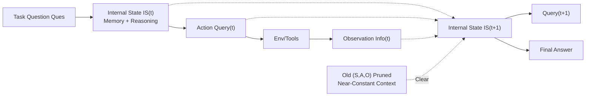

# MEM1: Learning to Synergize Memory and Reasoning for Efficient Long-Horizon Agents

**Conference**: ICLR 2026  
**OpenReview**: [https://openreview.net/forum?id=XY8AaxDSLb](https://openreview.net/forum?id=XY8AaxDSLb)  
**Code**: [https://github.com/MIT-MI/MEM1](https://github.com/MIT-MI/MEM1)  
**Area**: LLM Agent / Long-Horizon Reasoning / Reinforcement Learning  
**Keywords**: Long-horizon agents, memory integration, reinforcement learning, context compression, multi-objective tasks  

## TL;DR
MEM1 uses end-to-end reinforcement learning to train LLM agents to embed "memory consolidation" into "reasoning" itself. By maintaining a single, continuously rewritten compact internal state per round and discarding old observations, it maintains near-constant context across arbitrarily long multi-turn tasks, achieving higher performance, lower memory usage, and faster inference.

## Background & Motivation
**Background**: Modern language agents increasingly handle long-horizon tasks requiring multi-turn interactions, such as document searching, tool calling, and answering interdependent questions based on evolving environmental feedback (deep search, web navigation, shopping assistants, etc.). The mainstream approach (ReAct paradigm) involves concatenating all past observations, thoughts, and actions into the prompt at each step.

**Limitations of Prior Work**: This "full-context concatenation" leads to three structural issues. First, inference cost and memory usage grow linearly or quadratically with context length $N$ ($O(N^2)$ computation and $O(N)$ memory for Transformers), forcing massive GPU reservation. Second, once context exceeds the length seen during training, the model operates out-of-distribution, causing reliability to plummet. Third, redundant and irrelevant content dilutes attention; models may forget critical details even if the information is "technically still in context."

**Key Challenge**: Existing external memory solutions (summarizers, retrievers, vector stores like A-MEM) compress context but function as **independent modules trained separately from the agent's policy**. Memory and reasoning remain decoupled, requiring extra model maintenance and engineering overhead. Meanwhile, existing RL-trained agents (Search-R1, DeepResearcher) simply allow the prompt to grow unbounded, leaving memory management unaddressed.

**Goal**: To enable a language model to **learn memory consolidation as a part of reasoning**, retaining only information truly necessary for solving the problem, thereby maintaining near-constant memory without additional modules or architectural changes.

**Core Idea**: The key insight is that **reasoning is dual-purpose**: while reasoning for the current query, a model can simultaneously extract and write critical information needed for the future into its internal state. MEM1 (Memory-Efficient Mechanism via 1-step integrated reasoning and consolidation) ensures the internal state $S_i$ at each round serves as both "memory" and "reasoning." Old $(S_i, A_i, O_i)$ triplets are pruned from the context after use, and this behavior is trained end-to-end using **Reinforcement Learning with masked trajectories**.

## Method

### Overall Architecture
MEM1 models multi-turn interaction as an MDP: at each round $i$, the agent integrates the previous internal state $S_{i-1}$, the previous action $A_{i-1}$, and the environment observation $O_{i-1}$ into a new internal state $S_i$, then produces an action $A_i$ (either a new query or a final answer). If a query is issued, the environment returns observation $O_i$, which is appended to the end. Crucially, after each round, the old triplet $(S_i, A_i, O_i)$ is immediately pruned, leaving **at most two $S$, two $A$, and one $O$** in the context, resulting in constant memory usage. This behavior is not prompt engineering but is trained end-to-end using PPO. To handle policy gradients correctly for pruned trajectories, a two-dimensional attention mask is introduced.

### Key Designs

**1. Memory as Reasoning: Collapsing History into a Single Internal State.** MEM1 does not provide the agent with full history. Instead, it forces the agent to compress the "previous state + previous action + previous observation" into a new internal state $S_i$ at each round. $S_i$ acts as both the complete memory of the past and the workspace for reasoning the next step. Since old observations are discarded and the context is manually pruned to the most recent states, the agent **must** actively write critical future-use information into $S_i$ to receive rewards. Memory consolidation is not an auxiliary task but a byproduct naturally enforced by reward signals. This mimics human cognitive strategies in Sudoku or crosswords: selectively remembering key info while advancing the solution.

**2. Masked Concatenated Trajectories: Enabling Policy Gradients on Pruned Contexts.** This is the core technical challenge in harmonizing "dynamic context pruning" with "standard RL training." Conventional RL frameworks rely on a single prefill of the entire trajectory $\tau$ to calculate all $\nabla_\theta \pi_{\theta}(a_t, s_t)$. However, in MEM1, various $S_i$ and $A_i$ do not belong to the same rollout sequence. Splitting each round into sub-trajectories $\tau_i=(S_i, A_i, O_i)$ breaks temporal difference calculations like $\delta_t = r(s_t) + V(s_{t+1}) - V(s_t)$ because $V(s_{t+1})$ resides in a different sub-trajectory. The authors solve this by compressing $n$ rounds into a **concatenated full trajectory** $\tau_{\text{full}} = (S_1,A_1,O_1,\dots,S_n,A_n)$ and applying a two-dimensional attention mask. Every token can only see "tokens that remained in memory when it was generated": $\text{Attn}_t = \mathbb{1}_{a\in\{S_{i-1},A_{i-1},O_{i-1},S_i,A_i,O_i\}} \times \mathbb{1}_{a\in\{a_k|k\le t\}}$. This preserves the full trajectory for value function and advantage calculation while strictly replicating the memory-limited state during inference, ensuring $\pi_{\theta,\tau_i}(a_t,s_t)=\pi_{\theta,\tau_{\text{full}}}(a_t, s_t\times\text{Attn}_t)$. An additional information mask is layered during policy updates to shield $O$ tokens not generated by the model, preventing environmental feedback from polluting gradients.

**3. Multi-objective QA Task Design: Synthetic Long-Horizon Pressure Tests.** Existing "multi-hop" datasets (HotpotQA, Bamboogle, 2wiki) often only require two retrieval steps, insufficient for testing memory management. The authors interweave multiple multi-hop questions from existing QA corpora into a single **composite task**, requiring the agent to sequentially answer all sub-questions (separating answers with semicolons) in one interaction. This forces multiple queries for different sub-questions and organized synthesis into a coherent final response. Models are trained on **2-objective** tasks but tested on 4, 8, and 16 objectives to evaluate "out-of-horizon generalization."

## Key Experimental Results

Three environments: internal retrieval QA (Wiki RAG), open-domain Web QA, and multi-turn web shopping (WebShop). All MEM1 variants were fine-tuned from Qwen2.5-7B **Base** using PPO (the authors found RL from base generalizes better than instruct/SFT).

### Main Results: Multi-Objective Multi-Turn QA (Excerpts, Peak units ×10²)

| Model | 16-Obj EM ↑ | 16-Obj F1 ↑ | 16-Obj Peak ↓ | 16-Obj Time(s) ↓ |
|------|------|------|------|------|
| Qwen2.5-14B-Inst | 0.567 | 0.703 | 38.4 | 29.7 |
| Qwen2.5-7B-Inst | 0.165 | 0.213 | 43.3 | 15.5 |
| Search-R1 (2-obj training) | 0.520 | 0.647 | 24.8 | 23.4 |
| DeepResearcher | 0.071 | 0.106 | 48.9 | 15.8 |
| **MEM1-QA** | **1.97** | **2.39** | **10.4** | **8.70** |

(EM can be >1 due to cumulative matching of sub-questions.) On 16-objective tasks, MEM1 EM is over 10× that of its 7B-sized peers, with peak context reduced by 70%+ and latency halved. Compared to the 14B model with double parameters, MEM1 achieves 3× EM with only 27.1% of peak tokens and 29.3% of inference time. As objectives increase, other models' peak tokens grow near-linearly or collapse, while MEM1 remains nearly constant.

### WebShop Navigation

| Model | Avg Reward ↑ | Peak(×10³) ↓ | Dependency(×10⁶) ↓ | Time/Traj(s) ↓ |
|------|------|------|------|------|
| AgentLM-7B | 63.60 | 2.24 | 0.28 | 3.91 |
| AgentLM-13B | 70.80 | 2.36 | 0.30 | 5.23 |
| **MEM1-WebShop** | **70.87** | **0.81** | **0.15** | **2.61** |

MEM1-7B's reward exceeds the strongest baseline AgentLM and even the double-parameter AgentLM-13B version, while improving Peak Token usage by 2.8×, Dependency by 1.9×, and inference time by 1.5×.

### Key Findings
- **Generalization Beyond Training Horizon**: Trained only on 2-objective tasks, the model generalizes robustly to 16 objectives, indicating it learned genuine memory-reasoning capabilities rather than overfitting the horizon.
- **Transfer to Unseen Environments**: MEM1 trained on RAG-QA transferred directly to online Web-QA (Google Search API), demonstrating superior efficiency and comparable efficacy without overfitting the local Wiki database.
- **Ablation Study**: (a) Simple prompt truncation (without RL) yields only partial efficiency gains and significantly lower performance; (b) SFT on GPT-4o trajectories shows improvement but lacks the generalization of RL; (c) Explicitly separating memory and reasoning is inferior to integrating them, validating that the "memory as reasoning" design benefits both performance and efficiency.
- **Emerging Behaviors**: MEM1 learned to maintain structured memories for multiple questions, switch to easier-to-solve targets when stuck, and explicitly weave retrieved key information into subsequent queries.

## Highlights & Insights
- **Conceptual Shift**: Re-framing "memory management" as a "natural byproduct of reasoning" simplifies the architecture elegantly—no extra parameters, no structural changes, and no secondary model maintenance, yet memory usage is transformed from unbounded to constant.
- **Technical Contribution**: The two-dimensional attention mask + concatenated trajectory design effectively solves the contradiction between "dynamic context pruning" and "end-to-end RL training," providing a reusable training trick.
- **Small Model Outperforming Large Model**: A 7B model outperforming a 14B model on long-horizon tasks suggests that "knowing what to forget" is more critical than "raw parameter count" in long horizons, providing a case for efficient deployment.

## Limitations & Future Work
- Multi-objective tasks are synthesized from existing QA corpora, which may differ from the distribution of natural real-world long-horizon tasks.
- The internal state acts as a single compact representation, creating an information bottleneck—if useful info is discarded early, there is no mechanism to backtrack (failure cases analyzed in Appendix G).
- Rewards are rule-based and verifiable (EM / Env reward); designing rewards for open-ended long-horizon tasks without clear ground truths (e.g., creative writing, complex decision-making) remains unexplored.
- Experiments focused on 7B Qwen series; scalability to larger models or other architectures requires further verification.

## Related Work & Insights
- **Multi-turn Agents**: ReAct introduced interleaved "reasoning + acting," followed by Reflexion and Self-Refine using natural language feedback. Training involves Behavior Cloning (SFT on expert trajectories) or RL (reward-driven). MEM1 follows the RL path but integrates memory compression into the policy itself.
- **Context Management**: Evolves from full-history concatenation to external memory frameworks (RAG, summarization modules, hierarchical working memory) and vector stores (A-MEM). MEM1 differs by sharing a single representation space for memory and reasoning, optimized jointly.
- **Insights**: For any agent system requiring long-term interaction, "learning to forget actively" may be more sustainable than "infinitely expanding context windows." The two-dimensional mask training paradigm can be transferred to other RL scenarios requiring dynamic context modification.

## Rating
- **Novelty**: ⭐⭐⭐⭐⭐ The "memory as reasoning" integration + two-dimensional masked trajectory training transforms an engineering pain point into an elegant learning problem.
- **Experimental Thoroughness**: ⭐⭐⭐⭐ Covers three environments, strong baselines, multi-objective scaling curves, transferability, and ablations; lacks verification on larger/diverse architectures.
- **Writing Quality**: ⭐⭐⭐⭐ Logical flow from motivation to insight to method; Figure 1 intuitively explains context evolution and masking.
- **Value**: ⭐⭐⭐⭐⭐ Directly addresses memory and forgetting bottlenecks in long-horizon agents. A 7B model outperforming a 14B model has significant practical implications for deployment.

<!-- RELATED:START -->

## Related Papers

- [\[ICLR 2026\] Solving the Granularity Mismatch: Hierarchical Preference Learning for Long-Horizon LLM Agents](solving_the_granularity_mismatch_hierarchical_preference_learning_for_long-horiz.md)
- [\[CVPR 2026\] SAGE: Training Smart Any-Horizon Agents for Long Video Reasoning with Reinforcement Learning](../../CVPR2026/llm_agent/sage_training_smart_any-horizon_agents_for_long_video_reasoning_with_reinforceme.md)
- [\[ACL 2026\] OCR-Memory: Optical Context Retrieval for Long-Horizon Agent Memory](../../ACL2026/llm_agent/ocr-memory_optical_context_retrieval_for_long-horizon_agent_memory.md)
- [\[ACL 2026\] StructMem: Structured Memory for Long-Horizon Behavior in LLMs](../../ACL2026/llm_agent/structmem_structured_memory_for_long-horizon_behavior_in_llms.md)
- [\[ICLR 2026\] REMem: Reasoning with Episodic Memory in Language Agents](remem_reasoning_with_episodic_memory_in_language_agent.md)

<!-- RELATED:END -->
