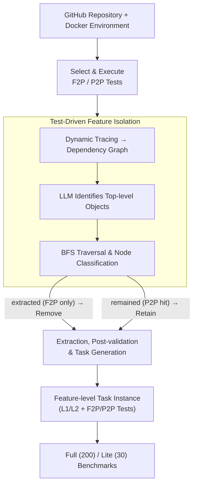

# FeatureBench: Benchmarking Agentic Coding for Complex Feature Development

**Conference**: ICLR 2026  
**arXiv**: [2602.10975](https://arxiv.org/abs/2602.10975)  
**Code**: [github.com/LiberCoders/FeatureBench](https://github.com/LiberCoders/FeatureBench)  
**Area**: LLM Agent  
**Keywords**: agentic coding, benchmark, feature development, test-driven, SWE-bench, code agent

## TL;DR
The authors propose FeatureBench—a benchmark for evaluating code agents in feature-level software development. Using a test-driven automated pipeline to extract verifiable feature implementation tasks from open-source repositories, the results show that the strongest model, Claude Opus 4.5, solves only 11.0%, revealing a substantial performance gap in complex feature development.

## Background & Motivation
Existing code agent benchmarks, such as SWE-bench, primarily focus on bug-fixing scenarios, with feature requests accounting for only 18–22% of tasks. With the emergence of end-to-end coding systems like Claude Code and Qwen Code, evaluating agent performance in **functional development** (rather than just bug fixing) is essential.

Structural flaws exist in the PR-based methodology of SWE-bench: a complete feature often spans multiple PRs scattered across a timeline; thus, a single PR granularity fails to capture cohesive functional patches. Furthermore, many PRs lack labels, making it difficult to distinguish feature contributions from bug fixes reliably.

Another limitation of current benchmarks is the evaluation method. PaperBench and Paper2Coder rely on manual review or LLM judgment, lacking automated execution-level verification. Meanwhile, manually curated benchmarks (e.g., GitTaskBench with 54 cases, DevEval with 22 cases) are too small to measure agent capabilities comprehensively.

Data leakage is also an escalating issue—as training data coverage expands, static benchmarks risk being "memorized," necessitating a sustainably updatable evaluation framework.

The authors argue that an ideal benchmark should satisfy four conditions: (1) target real-world feature-level development; (2) provide executable verification; (3) allow automated and scalable collection; and (4) support sustainable updates to prevent data leakage. No prior work satisfies all four.

## Method

### Overall Architecture
FeatureBench decomposes the evaluation of feature development into two components: first, replacing the single-PR granularity of SWE-bench with a **feature-level task definition**, requiring agents to implement functional modules based on high-level descriptions and interface signatures; second, utilizing a **test-driven automated collection toolkit** to "hollow out" features from open-source repositories. The latter is the core pipeline: F2P (fail-to-pass) and P2P (pass-to-pass) tests are selected and executed for a repository, and a dynamic trace is used to generate an object dependency graph. LLMs then identify the top-level objects directly called by tests as starting points for a Breadth-First Search (BFS), classifying functions into "remained" or "extracted." This results in a feature-missing codebase and a gold patch, which are then used to generate verifiable instances after bi-directional validation and automated problem statement generation.

### Key Designs

**1. Feature-level Task Definition and Dual Difficulty: Shifting from Bug Fixing to Feature Creation**

SWE-bench uses distinct PR diffs as tasks, which fail to cover comprehensive features spanning multiple PRs. FeatureBench treats each instance as a functional module requirement: agent inputs include a high-level task description, function signatures (including I/O types), import paths, a list of restricted URLs, and a Dockerfile environment, requiring a **directly callable** solution. Tasks are split into two difficulty levels: $L_1$ (incremental development, adding features to an existing codebase) and $L_2$ (building from scratch, implementing equivalent functionality from zero). $L_2$ removes the repository structure as a "crutch," specifically testing long-horizon planning. Evaluation uses two complementary metrics: a strict $\text{Resolved Rate} = \frac{\#\text{tasks fully solved}}{\#\text{total tasks}}$ and a more granular $\text{Passed Rate} = \frac{1}{N}\sum_{i=1}^{N}\frac{\#\text{F2P tests passed}_i}{\#\text{F2P tests total}_i}$ to capture partial progress.

**2. Test-Driven Feature Isolation: Identifying Functional Components without Breaking Neighbors**

To "extract" a feature, the system must identify its constituent functions without breaking other functionalities. The toolkit uses Python's built-in tracing to capture function call events during F2P and P2P test execution, forming an object dependency graph (where each node is a function labeled by its appearance in P2P tests). Since covered functions include both the "tested feature" and auxiliary utilities, an LLM distinguishes **top-level tested objects** in F2P test files as reliable starting points (achieving 84.94% F1 and 91.74% accuracy). Using these as roots, a BFS traverses the graph while applying a P2P protection rule: nodes appearing in P2P tests are marked as **remained** (belonging to existing features and must be kept), while those only in F2P paths are marked as **extracted** (belonging to the target feature). The process continues until the queue is empty or the code volume reaches a limit of 3000–5000 lines. This P2P protection ensures the extraction does not damage unrelated repository capabilities.

**3. Code Extraction, Post-validation, and Automated Task Generation: Creating and Self-Checking "Feature-Missing" Versions**

Removing all "extracted" nodes creates a "feature-missing" codebase and a gold patch. To ensure task quality, the toolkit performs bi-directional validation: (a) the missing codebase must pass all P2P tests but fail all F2P tests (ensuring clean removal); (b) applying the gold patch must result in passing all tests (ensuring a valid solution). Finally, functional descriptions are extracted from docstrings (or generated by an LLM if missing), combined with interface signatures, and automatically formatted into a problem statement. This pipeline reduces manual intervention to approximately 3 minutes per repository.

**4. Full / Lite Benchmark Configurations: Balancing Coverage and Evaluation Cost**

The data originates from 24 open-source PyPI repositories (2022.5–2025.9). The **Full Set** includes 200 high-quality instances, each with >100 implementation lines, $\geq 10$ F2P test cases, and 5 P2P files, ensuring complexity and scoring rigor. The **Lite Set** is a random subset of 30 instances used for cost-effective evaluation; experiments confirm that rankings on the Lite Set are highly consistent with the Full Set.

## Key Experimental Results

### Main Results: Model Performance on the Full Set

| Scaffold | Model | Passed Rate | Resolved Rate | Token I/O |
|----------|-------|-------------|---------------|-----------|
| Codex | GPT-5.1-Codex (medium) | 41.66% | **12.5%** | 6.3M / 39k |
| Claude Code | Claude Opus 4.5 | 43.29% | 11.0% | 7.5M / 34k |
| OpenHands | Claude Opus 4.5 | 45.53% | 10.5% | 8.1M / 29k |
| Gemini-CLI | Gemini-3-Pro (low) | 32.43% | 5.0% | 2.5M / 12k |
| OpenHands | DeepSeek-V3.2 | 26.30% | 5.5% | 3.1M / 23k |
| OpenHands | Qwen3-Coder-480B | 24.55% | 3.5% | 2.0M / 14k |
| OpenHands | Gemini-3-Pro (low) | 30.08% | 4.5% | 6.2M / 40k |

### Related Work & Insights: Comparison with SWE-bench (Shared Repo Subset)

| Model | SWE-bench Verified Resolved | FeatureBench Resolved | FeatureBench Passed |
|------|---------------------------|----------------------|---------------------|
| Claude Opus 4.5 | **74.40%** | 5.2% | 41.08% |
| Gemini-3-Pro | 74.20% | 0.0% | 30.05% |
| Qwen3-Coder-480B | 55.40% (OpenHands: 69.60%) | 0.0% | 23.46% |
| DeepSeek-V3.2 | 60.00% | 0.0% | 22.98% |

### Task Complexity Comparison

| Attribute | SWE-bench | FeatureBench ($L_1$) |
|------|-----------|---------------------|
| Problem Description Length (words) | 195.1 | **4818.0** |
| Gold Solution Lines | 32.8 | **790.2** |
| Files Involved | 1.7 | **15.7** |
| Functions Involved | 3 | **29.2** |
| F2P Test Points | 9.1 | **62.7** |
| Total Test Points | 120.8 | **302.0** |

## Key Findings
- **Strongest agents solve only ~11–12.5%**: Claude Opus 4.5 and GPT-5.1-Codex achieved only 11.0% and 12.5% respectively on the Full Set, compared to over 74% on SWE-bench—a performance drop of nearly two orders of magnitude.
- **Passed Rate is significantly higher than Resolved Rate** (~45% vs ~12%): Agents often write code that "looks plausible" but fails full testing, reflecting the reality that AI code requires significant debugging.
- **Extreme Token Consumption**: All models consumed over 1 million input tokens. Efficiency is remarkably low given the success rates, making agent efficiency a critical research direction.
- **Failure Mode Analysis**: `NameError` is most frequent, indicating fundamental difficulties in cross-file dependency resolution. `TypeError`/`AttributeError` stem from "lazy habits"—guessing instead of reading actual interface definitions.
- **$L_2$ is significantly harder**: The Resolved Rate for from-scratch versions is consistently lower, and performance gaps between models narrow, suggesting that the lack of repository structure is a common bottleneck for multi-step reasoning.
- **Interface Specifications are Critical**: Performance drops significantly without function signatures (GPT-5.1-Codex: 20.0% → 16.7%), while providing real unit tests can boost success rates to 60%+.
- **Diminishing Returns on Step Count**: Increasing from 50 to 100 steps provides significant gains, but 100→500 steps offers marginal improvement.

## Highlights & Insights
- **Filling the Evaluation Gap**: The first benchmark to simultaneously satisfy feature-oriented, execution-based, scalable, and continually updatable criteria, balancing the bug-fixing bias of SWE-bench.
- **Sophisticated Automated Collection**: The BFS dependency traversal with P2P protection enables feature isolation without manual boundary labeling, requiring only ~3 minutes of manual effort per repository.
- **Revealing "Structural Incompetence"**: The results suggest that the bottleneck is not just model size, but architectural capabilities like cross-file reasoning, long-horizon planning, and efficient context utilization—providing direct guidance for next-generation agent design.
- **High correlation between Lite and Full sets** validates the representativeness of small-scale rapid evaluation.

## Limitations & Future Work
- Restricted to **Python**, leaving a gap in evaluating agents for Java, C++, or Rust.
- Repository focus is concentrated on AI/ML toolchains (e.g., Transformers, FlashAttention), with less coverage of Web or systems software.
- The use of LLMs for top-level object classification (F1=84.94%) allows for error propagation into task construction.
- The relationship between $L_2$ difficulty and "from-scratch" benchmarks like Commit0 remains to be fully explored.
- Evaluation of agent performance when using browser tools or search engines was not conducted.

## Related Work & Insights

### vs SWE-bench
SWE-bench is PR-based and bug-fix centric; feature tasks comprise only 18–22%. FeatureBench focuses on feature-level development, where implementation volume (790 lines vs 33 lines) is an order of magnitude higher. On shared repositories, Claude Opus 4.5's Resolved Rate plummeted from 74.4% to 5.2%.

### vs SWE-Smith / SWE-Flow
SWE-Smith uses heuristic task synthesis, which struggles with quality; SWE-Flow relies on F2P tests but ignores P2P validation, failing to ensure that feature extraction does not break other functions. FeatureBench's P2P protection and post-validation are key differentiators.

### vs PaperBench / DevEval
PaperBench (20 cases) and DevEval (22 cases) are limited in scale and rely on expert curation; FeatureBench provides 200 cases with 3825 executable environments and supports automated expansion.

## Rating
- Novelty: ⭐⭐⭐⭐ First systematic feature-level coding benchmark; innovative test-driven extraction.
- Experimental Thoroughness: ⭐⭐⭐⭐⭐ Evaluated 7 model-scaffold combinations with extensive ablation and direct comparison to SWE-bench.
- Writing Quality: ⭐⭐⭐⭐ Clear structure, deep analysis, and intuitive quantitative comparisons.
- Value: ⭐⭐⭐⭐⭐ Highlights major agent gaps in feature development, guiding future architectural improvements.

<!-- RELATED:START -->

## Related Papers

- [\[ICLR 2026\] Huxley-Gödel Machine: Human-Level Coding Agent Development by an Approximation of the Optimal Self-Improving Machine](huxley-godel_machine_human-level_coding_agent_development_by_an_approximation_of.md)
- [\[ICLR 2026\] MCP-Bench: Benchmarking Tool-Using LLM Agents with Complex Real-World Tasks via MCP Servers](mcp-bench_benchmarking_tool-using_llm_agents_with_complex_real-world_tasks_via_m.md)
- [\[ICLR 2026\] SciNav: A General Agent Framework for Scientific Coding Tasks](scinav_a_general_agent_framework_for_scientific_coding_tasks.md)
- [\[ICLR 2026\] NewtonBench: Benchmarking Generalizable Scientific Law Discovery in LLM Agents](newtonbench_benchmarking_generalizable_scientific_law_discovery_in_llm_agents.md)
- [\[ACL 2026\] OctoTools: An Agentic Framework with Extensible Tools for Complex Reasoning](../../ACL2026/llm_agent/octotools_an_agentic_framework_with_extensible_tools_for_complex_reasoning.md)

<!-- RELATED:END -->
